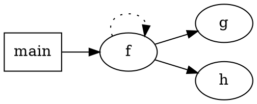
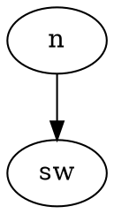
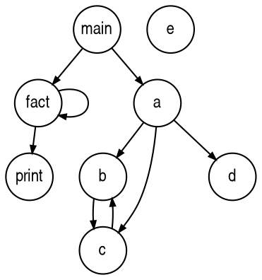

# ANTLR 解析器生成器

ANTLR（ANother Tool for Language Recognition 另一种语言识别工具）是功能强大的解析器生成器，用于读取，处理，执行或翻译结构化文本或二进制文件。 它被广泛用于构建语言，工具和框架。 ANTLR通过语法生成可以构建和遍历语法树的语法分析器。

一门语言的正式描述称为**语法(grammer)**，ANTLR能够为该语言生成一个语法分析器，并自动建立语法分析树----一种描述语法与输入文本匹配关系的数据结构。ANTLR也能够自动生成树的遍历器，这样就可以访问树中的节点，执行自定义的业务逻辑代码。

## ANTLR4的新特点

ANTLR4极大地简化了匹配某些句法结构(如编程语言的算术表达式)所需的语法规则。长久以来，处理表达式都是ANTLR语法以及手工编写的递归下降语法分析器的难题。识别表达式最自然的语法对于传统的自顶向下的语法分析器生成器(如ANTLR3)是无效的，但是ANTLR4可以使用如下的左递归表达式:

```antlr
expr : expr '*' expr  // 匹配乘法
     | expr '+' expr  // 匹配加法
     | INT            // 匹配简单的整数因子
     ;
```

类似`expr`的自引用规则是递归的，更准确地说，是**左递归(left recursive)**的，因为它的至少一个备选分支直接引用了它自己。

ANTLR4自动将类似expr的左递归规则重写成了等价的非左递归形式。唯一的约束是左递归必须是直接的，也就是说直接引用自身。一条规则不能匹配另外一条规则。

ANTLR生成的语法分析器能够自动建立语法分析树的视图，其他程序可以遍历此树，并在所需处理的结构处触发回调函数。在先前的ANTLR3中，用户需要补充语法来创建树。ANTLR4还提供了自动生成语法树遍历器的实现：监听器(listener)或者访问器(visitor)。监听器与在XML文档的解析过程中响应SAX事件的处理器相似。

ANTLR的`LL(*)`语法分析策略不如ANTLR4的`ALL(*)`强大，所以ANTLR3为了能够正确识别输入的文本，有时候不得不进行回溯。

## Quick Start

* OS X

```zsh
$ cd /usr/local/lib
$ sudo curl -O https://www.antlr.org/download/antlr-4.8-complete.jar
$ export CLASSPATH=".:/usr/local/lib/antlr-4.8-complete.jar:$CLASSPATH"
$ alias antlr4='java -jar /usr/local/lib/antlr-4.8-complete.jar'
$ alias grun='java org.antlr.v4.gui.TestRig'
```

* LINUX

```sh
$ cd /usr/local/lib
$ wget https://www.antlr.org/download/antlr-4.8-complete.jar
$ export CLASSPATH=".:/usr/local/lib/antlr-4.8-complete.jar:$CLASSPATH"
$ alias antlr4='java -jar /usr/local/lib/antlr-4.8-complete.jar'
$ alias grun='java org.antlr.v4.gui.TestRig'
```

## VS Code ANTLR4 插件

## ANTLR 语法

```antlr
/** Optional javadoc style comment */
grammar Name; 
options {...}
import ... ;

tokens {...}
channels {...} // lexer only
@actionName {...}

rule1 // parser and lexer rules, possibly intermingled
...
ruleN
```

* **grammer**-声明语法头，类似于Java的定义
* **options**-选项，如语言选项，输出选项，回溯选项，记忆选项等等
* **@actionName**-动作（Actions）实际上是用目标语言写成的、嵌入到规则中的代码（以花括号包裹）。它们通常直接操作输入的标号，但是他们也可以用来调用相应的外部代码。常用属性或动作说明：
1. `@header { package com.zetyun.aiops.antlr.test; }`这个动作很有用，即在运行脚本后，生成的类中自动带上这个包路径，避免了手动加入的麻烦。
2. `@members { int i; public TParser(TokenStream input, int foo) { this(input); i = foo; }}`
3. `@after {System.out.println("after matching rule; before finally");}`
* **rule**-文法的核心，表示规则，以 `:` 开始， `;` 结束， 多规则以 `|` 分隔。

```antlr
ID : [a-zA-Z0-9|'_']+ ;    //数字 
STR:'\'' ('\'\'' | ~('\''))* '\''; 
WS: [ \t\n\r]+ -> skip ; // 系统级规则 ，即忽略换行与空格

sqlStatement
    : ddlStatement 
    | dmlStatement     | transactionStatement
    | replicationStatement     | preparedStatement
    | administrationStatement     | utilityStatement
    ;
```

## ANTLR 注释

* 单行、多行、javadoc风格
* javadoc风格只能在开头使用

```antlr
/** 
 * This grammar is an example illustrating the three kinds
 * of comments.
 */
grammar T;

/* a multi-line
  comment
*/

/** This rule matches a declarator for my language */

decl : ID ; // match a variable name
```

## ANTLR 标识符

* 符号(Token)名大写开头
* 解析规则(Parser rule)名小写开头,后面可以跟字母、数字、下划线

```antlr
ID, LPAREN, RIGHT_CURLY // token names
expr, simpleDeclarator, d2, header_file // rule names
```

## ANTLR 遍历模式

### Listener (观察者模式，通过结点监听，触发处理方法)

* 程序员不需要显示定义遍历语法树的顺序，实现简单
* 缺点，不能显示控制遍历语法树的顺序
* 动作代码与文法产生式解耦，利于文法产生式的重用
* 没有返回值，需要使用map、栈等结构在节点间传值

### Visitor (访问者模式，主动遍历)

* 程序员可以显示定义遍历语法树的顺序
* 不需要与antlr遍历类ParseTreeWalker一起使用，直接对tree操作
* 动作代码与文法产生式解耦，利于文法产生式的重用
* visitor方法可以直接返回值，返回值的类型必须一致，不需要使用map这种节点间传值方式，效率高

## Hello ANTLR4

```antlr
// Define a grammar called Hello 定义一个语法名字：Hello
grammar Hello;
r  : 'hello' ID ;         // match keyword hello followed by an identifier 匹配关键字hello，后跟标识符
ID : [a-z]+ ;             // match lower-case identifiers 匹配全是小写字母的标识符
WS : [ \t\r\n]+ -> skip ; // skip spaces, tabs, newlines  跳过空格，制表符，换行符
```

然后使用`antlr`和`grun`别名来运行测试它,`grun`相当于一个主程序

```sh
antlr4 Hello.g4
javac *.java
grun Hello r -tokens
```

或者打印出LISP风格文本格式的语法分析树

```sh
grun Hello r -tree 
hello parrt
```

`grun`的命令行参数选项:

* **-tokens**-打印出词法符号流
* **-tree**-以LISP格式打印出语法分析树
* **-gui**-在对话框中以可视化方式显示语法分析树
* **-ps file.ps**-以PostScript格式生成可视化语法分析树，然后将其存储于file.ps。
* **-encoding encodinggame**-若当前的区域设定无法正确读取输入，使用这个选项制定测试组件
* **-trace**-打印规则的名字以及进入和离开该规则时的词法符号。
* **diagnostics**-开启解析过程中的调试信息输出。通常仅在一些罕见情况下才使用它产生信息，例如输入的文本有歧义。
* **-SLL**-使用另外一种更快但是功能稍弱的解析策略。

### ANTLR 元语言

为了实现一门编程语言，需要构建一个程序，读取输入的语句，对其中的词组和输入符号进行正确的处理。**语言(language)**由一系列有意义的语句组成，**语句(sentence)**由词组组成，**词组(phrase)**是由更小的**子词组(subphrase)**和**词汇符号(vocabulary sumbol)**组成。一般来说，如果一个程序能够分析计算或者“执行”语句，就称之为**解释器(interpreter)**。这样的例子包括计算器、读取配置文件的程序和Python解释器。如果一个程序能够将一门语言的语句转换为另外一门语言的语句，称之为**翻译器(translator)**。这样的例子包括Java和C#的转换器和普通的编译器。

为了达到目的，解释器或者翻译器需要识别出一门特定语言的所有的有意义的语句、词组和子词组。识别一个词组意味着可以将它从众多的组成部分中辨认和区分出来。例如，能够将输入的`"sp=100;"`识别为一个赋值语句，这意味着需要知道sp是被赋值的目标，100是要被赋予的值。与之类似，如果要识别英文语句，就需要辨认出一段对话的不同部分，例如主语、谓语和宾语。

识别语言的程序称为**语法分析器(parser)**或者**句法分析器(syntax analyzer)**。**句法(syntax)**是指约束语言中的各个组成部分之间关系的规则，**语法(grammer)**是一系列规则的集合，每条规则表述出一种词汇结构。ANTLR工具能够将其转换为如同经验丰富的开发者手工构建一般的语法分析器(ANTLR是一个能够生成其他程序的程序)。ANTLR语法本身又遵循了一种专门用来描述其他语言的语法，称之为**ANTLR元语言(ANTLR's meta-language)**。

如果将语法分析的过程分解为两个相似但独立的任务或者说阶段时，实现起来就容易多了。就像读英文一样，不是一个字符一个字符地读句子，而是将句子看作一列单词。在识别整个句子的语法结构之前，先获取单词(词法)，再获取句子(语法)。

将字符聚集为**单词或者符号(词法符号,token)**的过程称为**词法分析(lexical analysis)**或者**词法符号化(tokenizing)**。可以把输入文本转换为词法符号的程序称为**词法分析器(lexer)**。词法分析器可以将相关的词法符号归类，例如**INT(整数)**、**ID(标识符)**、**FLOAT(浮点数)**等。当语法分析器不关心单个符号，而仅关心符号的类型时，词法分析器就需要将词汇符号归类。词法符号包含至少两部分信息：词法符号的类型(从而能够通过类型来识别词法结构)和该词法符号对应的文本。

第二个阶段是实际的语法分析过程，在这个过程中，输入的词法符号被"消费"以识别语句结构，在上例中即为赋值语句。默认情况下，ANTLR生成的语法分析器会建造一种名为**语法分析树parse tree**或者**句法树syntax tree**的数据结构，该数据结构记录了语法分析器识别出输入语句结构的过程，以及该结构的各组成部分。

语法分析树的内部结点是词组名，这些名字用于识别它们的子结点，并将子结点归类。根结点是最抽象的一个名字，一般使用**stat**(statment的简称)命名。语法分析树的叶子结点永远是输入的词法符号。句子，也即符号的线性组合，本质上是语法分析树在人脑中的串行化。为了能与其他人沟通，需要使用一串单词，使得他们能在脑海中构建出一棵相同的语法分析树。

通过操纵语法分析树，识别同一种语言的不同程序就能复用同一个语法分析器。另外一种解决方案，也是传统的生成语法分析器的方案，是直接在语法文件中嵌入与这种程序相关的代码。ANTLR4仍然允许这种传统的方案，不过使用语法分析树可以使程序更简洁、解耦性更强。

在语言的翻译过程中，一个阶段依赖于前一个阶段的计算结果和信息，因此需要多次进行**树的遍历(tree walk)**，这种情况下语法分析树也是非常有用的。在其他情况下，将一个复杂的程序分解为多个阶段会大大简化编码和测试工作，与其每个阶段都重新解析一下输入的字符流，不如首先生成语法分析树，然后多次访问其中的节点，这样更有效率。

由于使用一系列的规则制定语句的词汇结构，语法分析树的子树的根节点就对应语法规则的名字。

```antlr
assign : ID '=' expr; // 匹配一个类似"sp=100;"的赋值语句
```

使用和调试ANTLR语法的一个基本要求是，理解ANTLR是如何将这样的规则转为人类可阅读的语法分析程序。

### 实现一个语法分析器

ANTLR工具依据类似于之前的`assign`语法规则，产生一个**递归下降语法分析器(recursive-descent parser)**。递归下降的语法分析器实际上是若干递归方法的集合，每个方法对应一条规则。下降的过程就是从语法分析树的根节点开始，朝着叶节点(词法符号)进行解析的过程。首先调用的规则，即语义符号的起始点，就会称为语法分析树的根节点。这种解析的别名是**自上而下的解析**，递归下降的语法分析器仅仅是自上而下的语法分析器的一种实现。

下面是一个ANTLR根据assign规则生成的方法:

```java
// assign : ID '=' expr ';';
void assign() {
    match(ID);     // 根据assign规则生成的方法
    match('=');    // 将当前的输入符号和ID相比较，然后将其消费掉
    expr();        
    match(';');    // 通过调用方法expr()来匹配一个表达式
}
```

递归下降语法分析器通过方法调用描绘出的路线图映射到了语法分析树的节点上。调用`match()`对应了语法分析树的叶子结点。

对`stat`语法规则的解析像是一个switch语句:

```java
void stat() {
    switch (token/*当前的词法符号*/) {
        case ID:
            assign();
            break;
        case IF:
            ifstat();
            break;
        case WHILE:
            whilestat();
            break;
        default:
            throw;
    }
}
```

一般使用**前瞻词法符号(lookahead token)**这个术语，它其实就是下一个输入的词法符号。一个前瞻词法符号是任何一个在被匹配和消费之前就由语法分析器主动找出的词法符号。有些时候，语法分析器需要很多个前瞻词法符号来判断语义规则的哪个方案是正确的，甚至可能要从当前的词法符号的位置开始，一直分析到文件末尾才能做出判断！

### 语法的歧义

```antlr
stat: ID '=' expr ';' // 匹配一个赋值语句
    | ID '=' expr ';' // 重复了前一个备选分支
    ;
expr: INT;
```

或者下面这个嵌套了一层的歧义语法

```antlr
stat: expr ';'  // 表达式语句
    | ID '(' ')' ';'  // 函数调用语句
    ;
expr: ID '(' ')'
    | INT
    ;
```

一个歧义性语法通常被认为是程序设计上的bug。需要重新组织语法，使得对于每个输入的词组，语法分析器都能够选择唯一匹配的备选分支。如果语法分析器检测到该词组存在歧义，就必须在多个备选分支中做出选择。ANTLR解决歧义问题的方法是：选择所有匹配的备选分支中的第一条。

歧义问题在词法分析器和语法分析器中都会发生，ANTLR的解决方案使得对规则的解析能够正常进行。在词法分析器中，ANTLR解决歧义问题的方法是：匹配在语法定义中最靠前的那条词法规则。 

比如下面的关键字和标识符冲突:

```
BEGIN: 'begin';  // 匹配begin关键字
ID   : [a-z]+    // 匹配一个或者多个小写字母
```

词法分析器会匹配可能的最长字符串来生成一个词法符号，这意味着，输入文本`beginner`只会匹配上例中的ID这条词法规则。ANTLR词法分析器不会把它匹配为关键字BEGIN后跟着标识符ner。

有时候，一门语言的语法本身就存在歧义，无论如何修改语法也不能改变这一点。例如，最常见的数学表达式`1+2*3`可以用两种方式解释，一种是像绝大多数编程语言一样，按照优先级来处理。当然可以隐式地制定表达式中的运算符优先级。

### 使用语法分析树构建语言类应用程序

为了编写一个语言类应用程序，必须对每个输入的词组或者子词组执行一些适当的操作。进行这项工作最简单的方式是操作语法分析器自动生成的语法分析树。这种方式的优点在于，可以使用Java。

词法分析器处理字符序列并将生成的词法符号提供给语法分析器，语法分析器随机根据这些信息来检查语法的正确性并建造出一棵语法分析树。这个过程对应的ANTLR类是`CharStream`、`Lexer`、`Token`、`Parser`以及ParseTree。连接词法分析器和语法分析器的“管道”。

ANTLR尽可能很多地使用共享数据结构来节约内存。语法分析树中的叶子结点(词法符号)仅仅是盛放词法符号流中的词法符号的容器。每个词法符号都记录了自己在字符序列中的开始位置和结束位置，而非保存子字符串的拷贝。其中，不存在空白字符对应的词法符号的原因是，假定词法分析器会丢弃空白字符。

因为语法分析树根节点包含了使用规则识别词组过程中的全部信息，它们被称为上下文(context)对象。每个上下文对象都知道自己识别出的词组中，开始和结束位置处的词法符号，同时提供访问该词组全部元素的途径。例如，AssignContext类提供了方法`ID()`和方法`expr()`来访问标识符节点和代表表达式的子树。

给定这些类型的具体实现，可以手工写出对语法分析树进行深度优先遍历的代码。这样，在访问其中的节点时，可以进行一切所需的操作。这个过程中的典型操作是诸如计算结果、更新数据结构或者产生输出一类的事情。实际上，可以利用ANTLR自动生成并遍历树的机制，而不需要每次都重复编写遍历树的代码。

### 语法分析树监听器和访问器

ANTLR的运行库提供了两种遍历树的机制。默认情况下，ANTLR使用内建的遍历器访问生成的语法分析树，并为每个遍历时可能触发的事件生成一个语法分析树监听器接口。监听器非常类似于XML解析器生成的SAX文档对象。SAX监听器接收类似`startDocument()`和`endDocument()`的事件通知。一个监听器的方法实际上就是回调函数，正如在图形界面程序中响应复选框点击事件一样。除了监听器的方式，还将介绍另外一种遍历语法分析树的方式：**访问者模式(visitor pattern)**。

#### 语法分析树监听器

为了将遍历树时触发的事件转化为监听器的调用，ANTLR运行库提供了ParseTree-Walker类。可以自行实现ParseTreeListener接口，在其中填充自己的逻辑代码(通常是调用程序的其他部分)，从而构建出自己的语言类应用程序。

ANTLR为每个语法文件生成ParseTreeListener的子类，在该类中，语法中的每条规则都对应的enter方法和exit方法。例如，当遍历器访问到assign规则对应的节点时，它就会调用`enterAssign()`方法，然后将对应的语法分析树节点----AssignContext的实例。

#### 语法分析树访问器

有时候，希望控制遍历语法分析树的过程，通过显式的方法调用来访问子节点。在命令行中加入`-visitor`选项可以指示ANTLR为一个语法生成访问器接口(visitor interface)，语法中的每条规则对应接口中的一个visit方法。

ANTLR会提供访问器接口和一个默认实现类，只关注感兴趣的方法即可。

### 小结

* **语言**-一门语言是一个有效语句的结合。语句由词组组成，词组由子词组组成，子词组又由更小的子词组组成，一次类推。
* **语法**-语法定义了语言的语义规则。语法中的每条规则定义了一种词组结构
* **语义树或语法分析树**-代表了语句的结构，其中的每个子树的根节点都使用了一个抽象的名字给其包含的元素命名。
* **词法符号**-词法符号就是一门语言的基本词汇符号，它们可以代表像是"标识符"这样的一类符号，也可以代表一个单一的运算符，或者代表一个关键字。
* **词法分析器或者词法符号生成器**-将输入的字符序列分解称一系列词法符号。一个词法分析器负责分析词法。
* **语法分析器**-语法分析器通过检查语句的结构是否符合语法规则的定义来验证该语句在特定语言中是否合法。语法分析的过程类似于走迷宫。ANTLR能够生成被称为`ALL(*)`的自顶向下的语法分析器，`ALL(*)`是指它可以利用剩余的所有输入文本来进行决策。自顶乡下的语法分析器以结果为导向，首先匹配粗粒度的规则，这样的规则通常命名为`program`或者`inputFile`
* **递归下降的语法分析器**-这是自顶向下的语法分析器的一种实现，每条规则都对应语法分析器中的一个函数
* **前向预测**-语法分析器使用前向预测来进行决策，具体方法是：将输入的符号与每个备选分支的起始符号进行比较。

## 入门的ANTLR项目

比如识别一些像是`{1, 2, 3}`和`{1, {2, 3}, 4}`这样的花括号括起来语句。

### ANTLR工具、运行库以及自动生成的代码

在ANTLR的jar包中存在两个关键部分：ANTLR工具和ANTLR运行库(运行时语法分析)API。通常，对一个语法运行ANTLR时，指的是运行ANTLR工具，即`org.antlr.v4.Tool`类来生成一些代码(语法分析器和词法分析器)，它们能够识别使用这份语法代表的语言所写成的语句。词法分析器将输入的字符流分解为词法符号序列，然后将它们传递给能够进行语法检查的语法分析器。运行库是一个由若干类和方法组成的库，这些类和方法是自动生成的代码（如Parser,Lexer和Token）运行所必须的。因此，完成工作的一般步骤是：首先对一个语法运行ANTLR，然后将生成的代码与jar包中的运行库一起编译，最后将编译好的代码和运行库放在一起运行。

构建一个语言类应用程序的第一步是创建一个能够描述这种语言的语法(即合法语句结构的集合)的语法。

```antlr
grammar ArrayInit;

/* 一条名为init的规则，它匹配一对花括号中的、逗号分隔的value */
init : '{' value (',' value)*  '}';
/* 一个value可以是嵌套的花括号结构，也可以是一个简单的整数，即INT词法符号 */
value : init
      | INT
      ;
INT:  [0-9]+;              // 定义词法符号INT，它由一个或多个数字组成
WS:   [\t\r\n]+ -> skip;   // 定义词法规则“空白符号”，丢弃之
```

ANTLR语法比正则表达式功能更强大，实际上，由于嵌套的花括号结构的存在，正则表达式无法识别这样的初始化语句。正则表达式没有存储的概念，它们无法记住之前匹配过的额输入，因此，它们不能将左右花括号正确配对。

### 测试生成的语法生成器

```sh
$ grun ArrayInit init -tokens 
$ {99, 3, 451}
$ EOF
```

或者

```sh
$ grun ArrayInit init -tree
$ {99, 3, 451}
$ EOF
```

```sh
$ grun ArrayInit init -gui
$ {99, 3, 451}
$ EOF
```

用自然语言表述，语法分析树就是，“输入的是一个由一对花括号包裹的三个值组成的初始化语句”

*注意：文件结束符(end of file EOF)在类UNIX系统上的输入方法是`Ctrl+D`，在Windows上的方法是`Ctrl+Z`*

### 将生成的语法分析器与Java程序集成

```java
import org.antlr.v4.runtime.*;
import org.antlr.v4.runtime.tree.*;

public class Test {
    public static void main(String[] args) throws Exception {
        ANTLRInputStream input = new ANTLRInputStream(System.in);
        ArrayInitLexer lexer = new ArrayInitLexer(input);
        CommonTokenStrem tokens = new CommonTokenStream(lexer);
        ArrayInitParser lexer = new ArrayInitParser(tokens);
        ParseTree tree = parser.init();
        System.out.println(tree.toStringTree(parser));
    }
}
```

### 构建一个语言类应用

可以使用ANTLR监听器在语法树的遍历中调用回调函数，比如把`{99,3,451}`的short数组翻译成`\u0063\u0003\u01c3`。

最简单的方式是使用ANTLR内置的语法分析树遍历器进行深度优先遍历，然后在它触发的一系列回调函数中进行适当的操作。这样的监听器非常类似于图形界面程序控件上的回调函数。

```java
public class ShortToUnicodeString extends ArrayInitBaseListener {
    @Override
    public void enterInit(ArrayInitPaser.InitContext ctx) {
        System.out.print('\"');
    }

    @Override
    public void exitInit(ArrayInitPaser.InitContext ctx) {
        System.out.print('\"');
    }

    @Override
    public void enterValue(ArrayInitPaser.ValueContext ctx) {
        int value = Integer.valueOf(ctx.INT().getText());
        System.out.printf('\\u%04x', value);
    }
}
```

然后在主程序中调用：

```java
ParseTreeWalker walker = new ParseTreeWalker();
walker.walk(new ShortToUnicodeString(), tree);
System.out.println();
```

## ANTLR 快速指南

### 匹配算术表达式的语言

第一个语法用于构建一个简单的计算器，其对算术表达式的处理具有十分重要的意义，因为它们很常见。为简单起见，只允许基本的算术操作符(加减乘除)、圆括号、整数以及变量出现。例子中的算术表达式限制浮点数的使用，只允许整数出现。

下面的示例包含了本语言的全部特性：

```expr
193
a = 5
b = 6
a+b*2
(1+2)*3
```

用自然语言来说，表达式语言组成的程序就是一系列语句，每个语句都由换行符终止。一个语句可以是一个表达式、一个赋值语句或者是一个空行。下面是对应的ANTLR语法：

```antlr
grammar Expr;
/* 起始规则，语法分析的起点 */
prog: stat+;
stat: expr NEWLINE
    | ID '=' expr NEWLINE
    | NEWLINE
    ;
expr: expr ('*'|'/') expr
    | expr ('+'|'-') expr
    | INT
    | ID
    | '(' expr ')'
    ;
ID:  [a-zA-Z]+;     // 匹配标识符
INT: [0-9]+;        // 匹配整数
NEWLINE: 'r'? '\n'; // 告诉语法分析器一个新行的开始(即语句终止标志)
WS:  [\t]+ -> skip; // 丢弃空白字符
```

* 语法包含一系列描述语言结构的规则。这些规则既包括类似`stat`和`expr`的描述语法结构的规则，也包括描述标识符和整数之类的词汇符号(词法符号)的规则。
* 语法分析器的规则以小写字母开头
* 词法分析器的规则以大写字母开头
* 使用`|`来分隔同一个语言规则的若干备选分支，使用**圆括号**把一些符号组合成子规则。例如，子规则`('*'|'/')`匹配一个乘法符号或者一个除法符号。

**ANTLR4的最重要的新功能之一就是，它能够处理(大部分情况下)左递归规则**。左递归规则是指这样的语言规则：在某个备选分支的起始位置调用了自身。例如，在上述语法中，expr规则的备选分支出现了自身expr规则。使用这种方式指定算术表达式远比传统的自顶向下语法分析器策略简单。在传统的语法分析策略中，需要为运算符的每种优先级编写一条规则。

词法符号定义的标记和正则表达式的元字符非常相似。

* `'+'`-加号代表前面的字符必须至少出现一次（1次或多次）。
* `'*'`-星号代表字符可以不出现，也可以出现一次或者多次（0次、或1次、或多次）。
* `'?'`-问号代表前面的字符最多只可以出现一次（0次、或1次） 

*注意：在WS词法规则后面的`-> skip`操作是一条指令，告诉词法分析器匹配并丢弃空白字符。*通过使用正式的ANTLR标记，而非嵌入一段代码来告诉词法分析器忽略这些字符，就能避免语法和某种特定的目标语言绑定。

### 利用访问器构建一个计算器

可以使用ANTLR4的语法分析树访问器和其他的遍历器来实现语言类应用程序，从而保持语法本身的整洁。

首先给备选分支加上标签：

```antlr
grammar LabeledExpr;
/* 起始规则，语法分析的起点 */
prog: stat+;
stat: expr NEWLINE        # printExpr
    | ID '=' expr NEWLINE # assign
    | NEWLINE             # blank
    ;
expr: expr op=('*'|'/') expr # MulDiv
    | expr op=('+'|'-') expr # AddSub
    | INT                    # int
    | ID                     # id
    | '(' expr ')'           # parens
    ;
ID:  [a-zA-Z]+;     // 匹配标识符
INT: [0-9]+;        // 匹配整数
NEWLINE: 'r'? '\n'; // 告诉语法分析器一个新行的开始(即语句终止标志)
WS:  [ \t]+ -> skip; //丢弃制表符和空白符
MUL:  '*';
DIV:  '/';
ADD:  '+';
SUB:  '-';
```

```java
import java.util.HashMap;
import java.util.Map;

public class EvalVisitor extends LabledExprBaseVisitor<Integer> {
    Map<String, Integer> memory = new HashMap<String, Integer>();

    /* ID '=' expr NEWLINE */
    @Override
    public Integer visitAssign(LabeledExprParser.AssignContext ctx) {
        String id = ctx.ID().getText();
        int value = visit(ctx.expr());
        memory.put(id, value);
        return value;
    }

    /* expr NEWLINE */
    @Override
    public Integer visitPrintExpr(LabeledExprParser.AssignContext ctx) {
        Integer value = visit(ctx.expr());
        System.out.println(value);
        return 0;
    }

    /* ID */
    @Override
    public Integer visitId(LabeledExprParser.AssignContext ctx) {
        String id = ctx.ID().getText();
        if (memory.containsKey(id))
            return memory.get(id);
        return 0;
    }
    
    /* expr op=('*'|'/') expr */
    @Override
    public Integer visitMulDiv(LabeledExprParser.AssignContext ctx) {
        int left = visit(ctx.expr(0));
        int right = visit(ctx.expr(1));
        if (ctx.op.getType() == LabledExprParser.MUL) 
            return left * right;
        return left / right;
    }

    /* expr op=('+'|'-') expr */
    @Override
    public Integer visitMulDiv(LabeledExprParser.AssignContext ctx) {
        int left = visit(ctx.expr(0));
        int right = visit(ctx.expr(1));
        if (ctx.op.getType() == LabledExprParser.ADD) 
            return left + right;
        return left - right;
    }

}
```

### 利用监听器构建一个翻译程序

将一个Java类中的全部方法抽取出来，生成一个接口文件，保留方法签名中的空白字符和注释。

部分`Java.g4`示例

```antlr
classDeclaration :
    'class' Identifier typeParameters? ('extends' type)?
    ('implements' typeList)?
    classBody;
methodDeclaration :
    type Identifier formalParameters ('[' ']')* methodDelarationRest
    | 'void' Identifier formalParameters methodDelarationRest
    ;
```

基本思想是，在类定义的起始位置打印出接口定义，然后在类定义的结束位置打印出`}`。在遇到每个方法定义时，将会抽取出它的签名。

访问器和监听器机制表现出色，它们使语法分析过程和程序本身高度分离。尽管如此，有些时候，还是需要额外的灵活性和可操控性。

### 定制语法分析过程

监听器和访问器机制是一个创举，这使得自定义的程序代码和语法本身分离开来，让语法更具可读性，避免了将语法和特定的程序混杂子一起。不过，为了灵活性和可操控性，可以直接将代码片段(动作)嵌入语法中。这些动作将被拷贝到ANTLR自动生成的递归下降语法分析器的代码中。

将会看到如何实现特殊的动作，叫做**语义判定(samantic predicate)**,它能够动态地开启或者关闭部分语法。

#### 在语法中嵌入任意动作

如果不想承担建立语法分析树的开销，可以在语法分析的过程中计算并打印结果。另一个方案是，在“表达式语法”中嵌入一些代码。

```antlr
grammar Rows;

@parser::members {
    int col;
    public RowsParser(TokenStream input, int col) {
        // 自定义构造器
        this(input);
        this.col = col
    }
}

file: (row NL)+;

row
locals [int i = 0]
    : (STUFF
    {
        $i++;
        if ($i == col) System.out.println($STUFF.text);
    }
    )+
    ;

TAB : '\t' -> skip; // 匹配但是不将其传递给语法分析器
NL :  '\r'? '\n';   // 匹配并将其传递给语法分析器
STUFF ~[\t\r\n]+    // 匹配除tab符和换行符之外的任何字符
```

语义判定

```antlr
grammar Data;

file : group+
group: INT sequence[$INT.int];
sequence[int n]
locals [int i = l;]
: ( {$i<=$n}? INT {$i++} )* // 匹配n个函数
;
INT : [0-9]+;
WS : [ \t\n\r] // 丢弃所有空白字符
```

### 词法分析特性

#### 孤岛语法：处理相同文件中的不同格式

事实上，有很多常见的文件格式包含多重语言。例如，Java文档注释中的`@author`标签等内容使用的是一种特殊的微型语言；在注释之外的一切内容都是Java代码。需要将模版语言表达式之外的文本按照不同的方式进行处理，这种情况通常称为孤岛语法。

ANTLR提供了一个众所周知的词法分析器特性，称为**词法分析模式(lexical mode)**，使能够方便地处理混杂着不同格式数据的文件。它的基本思想是，当词法分析器看到一些特殊的“哨兵”字符序列时，执行不同模式的切换。

XML是个很好的例子。一个XML解析器除了标签和实体转义时(例如`&pound;`)之外的东西全部当作普通文本。当看到`<`时，词法分析器会切换到“标签内部”模式；当看到`>`或者`/>`时，它就切换回默认模式。

```antlr
lexer grammar XMLLexer;

// 默认的“模式”，所有在标签之外的东西
OPEN  : '<'   -> pushMode(INSIDE);
COMMENT :  '<!--' .*? '-->'  -> skip;
EntityRef: '&' [a-z]+ ';' ;
TEXT   :  ~('<'|'&')+ ;  // 匹配任意除<和&之外的16位字符

// ------- 所有在标签之内的东西 ------
mode INSIDE;
CLOSE  :  '>' -> popMode;
SLASH_CLOSE :  '/>' -> popMode;
EQUALS  :  '=' ;
STRING :    '"'  .*? '"' ;
SlashName  :  '/' Name;
Name  :  ALPHA (ALPHA|DIGIT)*;
S : [ \t\r\n] -> skip;

fragment
ALPHA : [a-zA-Z];

fragment
DIGIT  : [0-9];
```

如果需要令测试组件只运行词法分析器而不运行语法分析器，可以指定参数为语法名加上一个特殊的规则名tokens。

#### 重写输入流

构建一个小工具，能够修改Java源代码并插入`java.io.Serializable`使用的序列化版本标识符(serialVersionUID,类似Eclipse的自动生成功能)。简单的做法是：在原先的词法符号流中插入一个适当代表常量字段的词法符号，然后打印出修改后的输入流。

```java
// 打印除修改后的词法符号流
System.out.println(extractor.rewriter.getText());
```

在监听器的实现中，在类定义的起始位置触发一个插入操作：

```java
import org.antlr.v4.runtime.TokenStrem;
import org.antlr.v4.runtime.TokenStremRewriter;

public class InsertSerialIDListener extends JavaBaseListener {
    TokenStreamRewriter rewiter;
    public InsertSerialIDListener(TokenStream tokens) {
        rewiter = new TokenStreamRewriter(tokens);
    }

    @Override
    public void enterClassBody(JavaParser.ClassBodyContext ctx) {
        String field = "\n\tpublic static final long serialVersionUID = 1L;"
        rewriter.insertAfter(ctx.start, field);
    }
}
```

其中的关键之处在于，`TokenStreamRewriter`对象实际上修改的是词法符号流的“视图”而非词法符号流本身。它认为所有对修改方法的调用都只是一个“指令”，然后将这些修改放入一个队列，在未来词法符号流被重新渲染为文本时，这些修改才会被执行。每次调用`getText()`方法时，`rewriter`对象都会执行上述队列中的指令。

#### 将词法符号流送入不同通道

使用传统方法很难达到保留方法签名中的空白字符和注释，对于大多数语法，词法分析器是可以忽略空白字符和注释的。如果不想让空白字符和注释在语法中到处都是，可以让词法分析器丢弃它们。忽略却保留注释和空白的方法是将词法符号送入一个“隐藏通道”。

```antlr
COMMENT
    : '/*' .*? '*/' -> channel(HIDDEN)   //匹配 '/*' 和 '*/' 之间的任何东西 
    ;
WS  : [ \r\t\u000C\n]+ -> channel(HIDDEN)
```

同之前讨论的`-> skip`一样，`-> channel(HIDDEN)`也是一个词法分析器指令。此处，设置了这些词法符号的通道号，这样，这些词法符号就会被语法分析器忽略。词法符号流仍然保存着这些原始的词法符号序列，只不过在向语法分析器提供数据时忽略了那些处于已关闭通道的词法符号。

### 小结

实现的访问器和监听器让不需要在语法中嵌入动作就能完成计算和翻译工作。内嵌动作是进行特殊的内部控制必不可少的手段，以及切换不同的模式和隐藏通道等都可以解决一些不大但是现实的问题。

## ANTLR 设计语法

ANTLR一些实用的细节，例如建立内部数据结构，提取信息，以及翻译输入内容等。研究编程语言的通用模式，将其在语句中辨识出来。一种语言模式就是一种递归的结构，例如英语的一个句子包含`主语-谓语动词-宾语`。需要从一系列有代表性的输入文件中归纳出一门语言的结构。在完成这样的归纳工作后，就可以正式实用ANTLR语法来表达这门语言了。

在词法层面上，不同编程语言也倾向于实用相同的结构，例如标识符、整数、字符串等等。对单词顺序和单词间依赖关系的限制来源于自然语言，逐渐发展为以下四种抽象的计算机语言模式：

* **序列**-既一列元素，例如一个数组初始化语句中的值
* **选择**-在多种可选方案中做出选择，例如编程语言中的不同种类的语句
* **词法符号依赖**-一个词法符号需要和某种的另外一个词法符号匹配，例如左右括号匹配
* **嵌套结构**-一种自相似的语言结构，例如编程语言中的嵌套算术表达式或者嵌套语句块。

为实现以上模式，语法规则只要可选方案、词法符号引用和规则引用即可**Backus-Naur-Format,BNF**。为方便起见，还是将这些元素划分为子规则，与**正则表达式**类似，子规则是用`括号()`包围的内联规则。可以用以下符号标记子规则，用于指明其中的语法片段出现的次数：`可选(?)`；`出现0次或多次(*)`；`至少一次(+)`；(扩展巴克斯-诺尔范式，Extended Backus-Naur Format)。

### 从编程语言的范例代码中提取语法

编写语法和编写软件很相似，差异在于处理的是语言规则，而非函数或者过程(procedure)。(记住，ANTLR将会为语法中每条规则生成一个函数)。

任何编程语言项目的基础步骤：讨论语法的整体结构以及如何建立初始的语法框架。

ANTLR语法由一个为该语法命名的头部定义和一系列可以相互引用的语言规则组成。

```antlr
grammar MyG;
rule1 : <stuff>;
rule2 : <more stuff>;
```

和编写软件一样，必须指明需要的语言规则，既其中`<stuff>`的具体内容，以及哪条规则是起始规则。

为了给某种编程语言编写语法，必须要么精通它，要么有很多代表性的、由该语言所编写的样例程序。设计良好的语法反映了编程世界中的功能分解或者自顶向下的设计。设计起始规则的内容实际上就是实用“英语伪代码”来买描述输入文本的整体结构，和编写软件的过程有点类似。

从顶层开始，降低一个层次，描述起始规则右侧所指定的那些元素。它右侧的名词通常是词法符号或者尚未定义的规则。其中，词法符号是那些能够轻易识别出的单词、标点符号或者运算符。词法符号是文法的基本元素。起始规则引用了其他的、需要进一步细化的语言结构。

再降低一层，一个行就是一系列由逗号分隔的字段。一个字段就是一个数字或者字符串。伪代码如下:

```antlr
file: <sequence of rows that are terminated by newlines>
row: <sequence of fields separated by commas>;
field: <number of strings>
```

当完成对规则的定义后，语法草稿就成形了。

### 以现有的语法规范为指南

一份非ANTLR格式的语法规范能够很好地知道编程者理清该语言的结构。但是请把参考手册当作一份指南，而非一份代码。

出于使语法更清晰的目的，参考手册的范围通常都非常宽泛，这意味着其中的语法能够匹配很多实际上不合法的语句。或者，语法可能存在歧义，能够以多种方式匹配相同的输入文本。例如。

刚开始的时候，辨识一条语法规则并使用伪代码编写右侧的内容是一项充满挑战的工作，不过，会随着为不同语言编写语法的过程变得越来越容易。一旦拥有了伪代码，就需要将它翻译为ANTLR标记，从而得到一个能够正常工作的语法。

### 使用ANTLR语法识别常见的语言模式

现在需要关注的是常见的语言模式：序列(sequence),选择(choice)，词法符号依赖(token dependency),以及嵌套结构(nested phrase)。会用正式的语法规则将特定的模式表达出来，通过这种方式，就能够掌握基本的ANTLR标记的用法。

#### 序列模式

在计算机编程语言中，这种结构最常见的形式是一列元素，就像上文中的类定义中包括一系列方法一样。即使是像HTTP、POP和SMTP这样的简单的“协议语言”中，也能够看到序列模式的身影。协议的输入通常是一列指令。例如，下面是登陆一台POP服务器并获取第一条消息的指令序列：

```
USER parrt
PASS secret
RETR 1
```

每个指令自身也是一个序列。大多数指令由一个类似USER和RETR的关键字(保留字)，一个操作数和一个换行符构成。在上述例子中，可以说一个检索指令就是一个关键字，后面跟着一个整数，再后面是一个换行符。使用语法来表述这样的序列，只需要按照顺序将它们列出即可。在ANTLR标记中，检索指令可表达为：

```antlr
retr : 'RETR' INT '\n' ;  // 匹配 “关键字-整数-换行符” 序列
```

注意，可以直接使用类似`RETR`的常量字符来表示任意简单字符序列，诸如关键字或者标点符号等。使用语法规则来为编程语言的特定结构命名，就像在编程时将若干语句组合成一个函数。

使用语法规则来为编程语言的特定结构命名，就好像在编程时将若干个语句组合成一个函数。在上例中，将RETR命名为retr规则。这样，在语法的其他地方，可以直接把规则名作为简称来引用RETR。

序列模式的变体包括：带终止符的序列模式和带分隔符的序列模式。CSV文件同时使用了这两种模式。

下面是在先前的章节中使用ANTLR标记写出的伪代码语法：

```antlr
file : (row '\n')*;       // 以一个'\n'作为终止符的序列
row : field (',' field)*; // 以一个','作为分隔符的序列
field : INT;              // 假设字段都是整数
```

下面的语法匹配类似Java的、每个语句都由分号结束的编程语言：

```antlr
stats : (stat ';')*;  // 匹配零个或多个以';'终止的语句
```

与之相似，下面的语法匹配以逗号分隔的多个表达式，可以在一次函数调用的参数列表中找到这样的例子：

```antlr
expList : expr (',' expr)*;
```

就连ANTLR元语言也使用了序列模式。下面的语法片段显示了ANTLR是如何使用它自身的句法表达“规则定义”这条句法的：

```antlr
// 匹配这样的结构：'规则名:'后面跟着至少一个备选分支,
// 然后是若干条以'|'符号分隔的备选分支，最后是一个';'
rule ID ';' alternative ('|' alternative)* ';'
```

#### 选择模式（多个备选分支）

使用'|'符号作为“或者”来表达编程语言中的选择模式，在ANTLR的规则中，用于分隔多个可选的语法结构----称作备选分支(alternatives)或者可生成的结果(productions)。选择模式在语法中随处可见。

```antlr
field : INT | STRING;
type : 'float' | 'int' | 'void';
```

```
stmt: node_stmt
    | edge_stmt
    | attr_stmt
    | id '=' id
    | subgraph
    ;
```

语法中的序列模式和选择模式使能够编写语言的框架，但是这还不够，接下来，还有两种关键的模式：词法符号依赖和嵌套结构。在语法中，它们通常是一起出现的，不过，为简单起见，先来单独分析词法符号依赖模式。

#### 词法符号依赖模式

需要一种方法来表达对这样的词法符号的依赖。此时，如果在某个语句中看到了某个符号，就必须在同一个语句中找到和它配对的那个符号。为表达出这种语义，在语法中，使用一个序列来指明所有配对的符号，通常这些符号会把其他元素分组或者包裹起来。比如指定一个完整的向量:

```antlr
vector : '[' INT+ ']';
```

几乎所有的用于分组的符号都是成对出现的：

```antlr
expr : expr '(' exprList? ')'
    | expr '[' expr ']'
    ...
    ;
```

也可以在方法声明中看到左右圆括号之间的词法符号依赖模式：

```antlr
functionDecl
    : type ID '(' formalParameters ')'
    ;
formalParameters
    : formalParameter (',' formalParameter)*
    ;
formalParameter
    : type ID
```

*注意：一个有依赖符号并非必须匹配到它所依赖的符号。在C语言基础上发展起来的编程语言通常拥有a?b:c三元运算符。只有在这种情况下，?才依赖其后的:*

此外，词法符号间的依赖并不意味着一定存在嵌套结构。一个向量中可能不允许出现嵌套的向量。

#### 嵌套模式

嵌套的词组是一种自相似的语言结构，既它的子词组也遵循相同的结构。表达式是一种典型的自相似结构，它包含多个嵌套的、以运算符分隔的子表达式。与之相似，一个while循环代码块是一个嵌套在更外层代码块中的代码块。在语法中，使用递归规则来表达这种自相似的语言结构。所以，如果一条规则定义中伪代码引用了它自身，我们就需要一条递归规则 (自引用规则)。

```antlr
stat : 'while' '(' expr ')' stat  // 匹配WHILE语句
    | '{' stat* '}'               // 匹配花括号中若干条语句组成的代码块
    ...                 
    ;
```

其中，while中的stat是一个循环结构，它可以是一个语句或者由花括号包裹的一组语句。因为stat规则在前两个备选分支中引用了自身，称它为**直接递归(directly recursive)**的。如果将它的第二个备选分支抽取出来，stat规则和block规则就会互为**间接递归(indirectly recursive)**的

```antlr
stat: 'while' '(' expr ')' stat   // 匹配WHILE语句
    | block                       // 匹配一个语句组成的代码块
    ...                           // 其他种类的语句
    ;
block: '{' stat* '}';             // 匹配花括号中若干条语句组成的代码块
```

大部分编程语言都包含多种形式的自相似结构，这带来的结果是语法中包含很多递归规则。下面是一个简单的例子：只有三种表达式类型：数组索引表达式、括号表达式和整数----的编程语言。下面是用ANTLR标记书写的语法：

```antlr
expr : ID '[' expr ']'
    | '(' expr ')'
    | INT
    ;
```

其中的递归发生的非常自然。因为一个数组的索引值本身也是一个表达式，所以就在对应的备选分支中直接引用了expr。实际上，索引值本身也可以是一个数组索引表达式。从这个例子中可以看到，语言结构上的递归自然而然地使得语言规则发生了递归。

语法分析树的非叶子节点代表了规则，而叶子节点代表了词法符号。一条从根节点到任意节点的路径代表了对应的规则调用栈(同时也是ANTLR自动生成的递归下降语法分析器的调用栈)。因此，代表递归调用的路径上就会存在对多个相同规则的引用。

并非所有的语言都有表达式，例如数据格式定义。不过所接触的大多数语言都包含非常复杂的表达式。

ANTLR的核心语法标记

用法|描述
-|-
`x`|匹配词法符号、规则引用或者子规则`x`
`x` `y` ... `z`|匹配一列规则元素
`(...|...|...)`|一个具有多个备选分支的子规则
`x?`|匹配`x`或者忽略它
`x*`|匹配`x`零次或多次
`x+`|匹配`x`一次或多次
`r:...;`|定义规则`r`
`r:...|...|...;`定义具有多个备选分支的规则`r`

几种常见的计算机语言模式：

* **序列模式**-它是一个有限长度或者任意长度的序列，序列中的元素可以是词法符号或者子规则。序列模式的用例包括了变量声明（类型后面紧跟着标识符）和整数序列。

```antlr
x y ... z
'[' INT+ ']'
```

* **带终止符的序列模式**-它是一个任意场的、可能为空的序列，该序列由一个词法符号分隔开，通常是分号或者换行符，其中的元素可以是词法符号或者子规则。

```antlr
(statement ';')*
(row '\n')*  // 多行数据
```

* **带分隔符的序列模式**-它是一个任意长的，可能为空的序列，该序列由一个词法符号分隔开，通常是逗号，分号或者句号，其中的元素可以是词法符号或者子规则。这样的例子包括函数定义中的参数表、函数调用时传递的参数表、某些词句之间有分隔符却无终止符的编程语言。

```antlr
expr (',' expr)*   // 函数调用时传递的参数
(expr (',' expr)* )? // 函数调用时传递的参数是可选的
'/' ? name ('/' name)* // 简化的目录名
stat ('.' stat)*  // 若干个SmallTalk语句
```

* **选择模式**-它是一组备选分支的集合。这样的例子不包括种类的类型、语句、表达式或者XML标签。

```antlr
type : 'int' | 'float';
stat : ifstat | whilestat | 'return' expr ';';
expr : '(' expr ')' | INT | ID;
tag : '<' Name attribute* '>' | '<' '/' Name '>';
```

* **词法符号依赖**-一个词法符号需要和一个或者多个后续词法符号匹配。这样的例子包括配对的圆括号、花括号、方括号和尖括号。

```antlr
'(' expr ')'   // 嵌套表达式
ID '[' expr ']' // 数组索引表达式
'{' stat* '}'   // 花括号包裹的若干个语句
'<' ID (',' ID)* '>' //范型声明
```

* **嵌套模式**-它是一种自相似的语言结构。这样的例子包括表达式、Java内部类，嵌套的代码块以及嵌套的Python函数定义。

```antlr
expr : '(' expr ')' | ID;
classDef : 'class' ID '{' (classDef | method | field) '}'; 
```

### 处理优先级、左递归和结合性

在自顶向下的语法和手工编写的递归下降语法分析器中，处理表达式都是一件相当棘手的事情，这首先是因为大多数语法都存在歧义，其次是因为大多数语言的规范使用了一种特殊的递归方式，称为**左递归(left recursion)**。*注意：自顶向下的语法和语法分析器的经典形式无法处理左递归*。假设有一种简单的算术表达式语言，它包含乘法和加法运算符，以及整数因子。表达式是自相似的，所以，很自然地，一个乘法表达式是由`*`连接的两个子表达式，一个加法表达式是由`+`连接的两个子表达式。另外单个整数也可以作为简单的表达式。

```antlr
expr : expr '*' expr  
     | expr '+' expr
     | INT
     ;
```

问题在于，对于某些输入文本而言，上面的规则存在歧义。换句话说，这条规则可以用不止一种方式匹配某种输入的字符流。这个语法在简单的整数表达式和单运算符表达式上工作的很好----例如`1+2`和`1*2`----是因为只存在一种方式去匹配它们。

但是对于`1+2*3`这样的输入而言，上述规则能够用两种方式解释它。这就是运算符优先级带来的问题，传统的语法无法指定优先级。大多数语法工具，使用额外的标记来指定运算符优先级

与之不同的是，ANTLR通过优先选择位置靠前的备选分支来解决歧义问题，这隐式地允许指定运算符优先级。默认情况下，ANTLR按照通常对`*`和`+`理解，将运算符从左向右地进行结合。尽管如此，一些运算符----例如指数运算符----是从右向左结合的，所以需要在这样的运算符上使用assoc选项手工指定结合性。这样输入的`2^3^4`就能够被正确解释为`2^(3^4)`:

```antlr
expr : expr '^' <assoc=right> expr  // ^ 运算符是右结合的
     ｜ INT
     ;
```

*注意：在ANTLR4.2之后，`<assoc=right>`需要被放到备选分支的最左侧，否则会收到警告。正确地写法为:*

```antlr
expr : <assoc=right> expr '^' expr
     | expr '*' expr
     | expr '+' expr
     | INT
     ;
```

ANTLR4相比于ANTLR3的一项重大改进就是它可以处理左递归了。左递归规则是这样的一种规则：在某个备选分支的最左侧以直接或者间接方式调用了自身。

##### 使用优先级上升(Precedence Climbing)算法解析表达式

ANTLR将直接左递归替换为一个判定循环(predicated loop)，该循环会比较前一个和下一个运算符的优先级。在ANTLR4之前，必须使用多个规则来表达优先级，类似下面的这样：

```antlr
expr : addExpr;
addExpr : multExpr ('+' multiExpr)*;
multExpr : atom ('*' atom)*;
atom     : INT;
```

ANTLR4简化了处理直接左递归表达式规则的相关工作。新的机制不仅更有效率，而且使表达式规则更简洁、更易理解。在实践中，可以用直接左递归来处理所有关注的语言结构。例如，下面的规则匹配C语言中的声明语句，如`*(*a)[][]`

```antlr
decl : decl '[' ']'
     | '*' decl
     | '(' decl ')'
     | ID
     ;
```

### 识别常见的词法结构

在词法角度上，不同的计算语言的外观都十分相似。在词法角度，不论是函数式、过程式、声明式，还是面向对象的编程语言，基本大同小异。

和语法分析器一样，词法分析器也使用规则来描述种类繁多的语言结构。在ANTLR中，使用的是几乎完全相同的标记。唯一的差别在于，语法分析器通过输入的词法符号流来识别特定的语言结构，而词法分析器通过输入的字符流来识别特定的语言结构。

由于词法规则和文法规则的结构相似，ANTLR允许二者在同一个语法文件中同时存在。不过，由于词法分析和语法分析是语言识别过程中的两个不同阶段，必须告诉ANTLR每条规则对应的阶段。它是通过这种方式完成的：词法规则以大写字母开头，而文法规则以小写字母开头。例如，`ID`是一个词法规则名，而`expr`是一个文法规则名。

对于关键字、运算符和标点符号，无须声明词法规则，只需要在文法规则中直接使用单引号将它们括起来即可，例如`'while'`,`'*'`，以及`'++'`。有些开发者更愿意使用类似的词法规则来引用`'*'`，以避免对其的直接使用。

#### 匹配标识符

在语法的伪代码中，一个基本的标识符就是一个由大小写字母组成的字符序列。

```antlr
ID : ('a' .. 'z' | 'A' .. 'Z')+;
```

*注意：`'a' .. 'z'`是范围运算符，意思是从a到z的所有字符，这实际上是从97到122的ASCII码。如果使用Unicode字符(Unicode code point)，就必须写作`\uXXXX`,其中`XXXX`是相应的Unicode字符以十六进制表示的码点值*。此外，ANTLR还支持正则表达式中用于表示字符集的缩写:

```antlr
ID : [a-zA-Z]+;
```

类似ID的规则有时候会和其他词法规则或者字符串常量值产生冲突，例如`enum`

```
grammar KeywordTest;
enumDef : 'enum' '{' ... '}';
FOR : 'for';
ID : [a-zA-Z]+ // 不会匹配enum和for
```

ANTLR首先从文法规则中筛选出所有的字符串常量，并将它们和词法规则放在一起，`enum`这样的字符串常量被隐式定义为词法规则，然后放置文法规则之后、显式定义的词法规则之前。

#### 匹配数字

浮点数比较复杂，以下是简单版本

```antlr
INT : [0-9]+;
FLOAT : DIGIT+ '.' DIGIT*
    | '.' DIGIT+
    ;
fragment
DIGIT : [0-9];
```

#### 匹配字符串常量

```antlr
STRING : '"' .*? '"';
```

点号通配符匹配任意的单个字符，`.*?`: 非贪婪匹配，获取一些字符，直到发现匹配后续子规则的字符为止。比如`.*`会匹配任意字符，不会停下来，因此加`?`表示遇到引号`"`就停止匹配。

但是这个字符串不能匹配转义字符：

```antlr
STRING : '"' (ESC|.)*? '"';
fragment
ESC : '\\"' | '\\\\';
```

其中，ANTLR语法本身需要对转义字符\进行转义，因此需要用`\\`来表示单个反斜杠字符。

`fragment`表示片段规则。

#### 匹配注释和空白字符

```antlr
LINE_COMMENT : '//' .*? '\r'? '\n' -> skip;
COMMENT      : '/*' .*? '*/'       -> skip;
```

在某种语法上下文中，应该丢弃换行符，在另外一些上下文中，需要将它输送给语法分析器，从而让语法分析器得知命令被终止了，比如Python等。既可以忽略，又可以不忽略。

#### 划定词法分析器和语法分析器的界线

由于ANTLR的词法规则可以包含递归，从技术角度上看，词法分析器变得和语法分析器一样强大。这意味着可以甚至可以在词法分析器中匹配语法结构。另外一种极端是，可以把字符看作词法符号，然后用语法分析器来分析字符流的语法结构，这种情况称为无扫描器的语法分析器。划定词法分析器和语法分析器的界线位置不仅是语言的指责，更是语言编写的应用程序的职责。

* 在词法分析器中匹配并丢弃任何语法分析器无须知晓的东西。对于编程语言来说，要识别并丢弃的就是类似注释和空白字符的东西。否则，语法分析器就需要频繁检查它们是否存在于词法符号之间。
* 由词法分析器来匹配类似标识符、关键字、字符串和数字的常见词法符号。语法分析器的层次更高，所以不应当让它处理将数字组合成整数这样的事情，这会加重它的负担。
* 将语法分析器无须区分的词法结构归为同一个词法符号类型。如果对待整数和浮点数的方式是一致的，那就把它们都归为NUMBER类型的词法符号。没必要传给语法分析器不同的类型。
* 将任何语法分析器可以以相同方式处理的实体归为一类。
* 如果语法分析器需要把一种类型的文本拆开处理，那么词法分析器就应该将它的各组成部分作为独立的词法符号输送给语法分析器。

例如，Java编译器需要在忽略Javadoc注释的同时处理它；在XML文件中，标签内外的词法结构不一致。

### 小结

学习了如何根据一份语言的样例代码或者文档，来构造语法的伪代码，然后使用ANTLR标记构造出一个正式的语法。通用的语言模式：序列、选择、词法符号依赖和嵌套结构。在词法分析领域，了解最常见的词法符号的实现方法：标识符、数字、字符串、注释，以及空白字符。

## ANTLR语法实践

### 解析CSV文件

能够识别标题行，允许空列存在，下面是以恶搞典型的csv文件

```csv
Details,Month,Amount
Mid Bonus,June,"$2,000"
,January,"""zippo"""
Total Bonuses,"","%5,000"
```

```antlr
grammar CSV;

file : hdr row+;
hdr : row;
row : field (',' field)* '\r'? '\n';
field : TEXT 
      | STRING
      |
      ;
TEXT : ~[,\n\r"]+;
STRING '"'  ('""'|~'"')* '"'; // 两个双信号是对双引号的转义
``` 

为了允许被双引号包围的字符串中出现双引号，CSV格式通常使用两个双引号转义一个双引号。CSV是一种很好的数据存储格式。不过，如果需要在一个字段中存储多个值，它就无能为力了。JSON数据格式就允许嵌套

### 解析JSON

JSON是一种存储键值对的数据格式，由于值本身也可以作为键值对的容器，JSON中可以包含嵌套结构。设计一个用于JSON的语法分析器可以处理更加复杂的词法规则。下面是一个简答的JSON数据文件：

```json
{
    "antlr.org" : {
        "owners" : [],
        "live" : true,
        "speed" : 1e100,
        "menus" : ["files", "Help\nMenu"]
    }
}
```

#### JSON的语法规则

JSON语法指明，一个JSON文件可以是一个对象，或者是一个由若干值组成的数组。

```antlr
grammar JSON;

json : object
     | array
     ;
```

下一步是将json规则引用的各个子规则进行分解。对于对象，JSON语法是这样规定的：

一个对象是一组无序的键值对集合。一个对象以一个左花括号`{`开始，且以一个右花括号`}`结束。每个键后跟一个冒号`:`,键值对之间由逗号分隔`,`.


```antlr
object : '{' STRING ':' value (',' STRING ':' value )* '}' 
       | '{'  '}'
       ;
```

还可以写为：

```antlr
object
    : '{' pair (',' pair)* '}'
    | '{'  '}'   // 空对象
    ;
pair: STRING ':'  value 
    ;
```

JSON的语法参考中是这么写的：

```
object
    {}
    { members }

members
    pair
    pair, members

pair
    string : value
```

其中`members`规则使用了**尾递归**的方式，而不使用`(...)*`循环。原因在于ANTLR支持EBNF，而JSON参考手册中直接使用了BNF。BNF不支持类似`(...)*`的循环，因此，它们使用了尾递归（某个规则在最后一个备选分支的最后一个元素调用了自身）来对循环进行模拟。

对于JSON中的数组，数组是一组值的有序集合。一个数组由一个左方括号开始`[`,由一个右方括号`]`结束。其中的值由逗号`,`分隔。

```antlr
array
    : '[' value (',' value)* ']'
    | '['  ']'   // 空数组
    ;
```

在上述规则的基础上进一步细化，需要编写规则`value`,它是一个选择模式。

一个值可以是一个双引号包围的字符串、一个数字、true/false、null、一个对象，或者一个数组。这些结构中可能发生嵌套。

```antlr
value
    : STRING
    | NUMBER
    | object  // 递归调用
    | array   // 递归调用
    | 'true'  // 关键字
    | 'false' // 关键字
    | 'null'
    ;
```

#### JSON 词法规则

JSON中的字符串是一个由零个或者多个Unicode字符组成的序列，它由双引号包围，其中的字符使用反斜杠转义。单个字符由长度为1的字符串来表示，与C/Java中的字符串非常相似。JSON语法规范中的转义字符

```
char
    任意除"字符、\字符以及控制字符之外的Unicode字符
    \"
    \\
    \/
    \b
    \f
    \n
    \r
    \t
    \u 由4位十六进制表示的数字
```

其中指明了需要被转义的字符，并且指明了应当匹配任意除双引号和反斜杠之外的字符。可以通过反向选择序列`~["\\]`来满足这个要求，`~`操作符的意思是“非”。STRING定义如下：

```antlr
STRING '"' ( ESC | ~["\\] )*  '"'
    ;
fragment ESC : '\\' ( ["\\/bfnrt] |UNICODE ) 
    ;
fragment UNICODE : 'u' HEX HEX HEX HEX
    ;
fragment HEX : [0-9a-fA-F];
```

*注意：以fragment开头的规则只能被其他的词法分析器规则使用，它们并不是词法符号*

在JSON语法参考中，词法符号`NUMBER`的定义为:与C/Java中的数字非常相似，除了一点之外：*不允许使用八进制和十六进制格式*

```antlr
NUMBER
    : '-' ? INT '.' INT EXP?    // 1.35, 1.35e-9, 0.3, -4.5
    | '-' ? INT EXP             // 1e10 -3e4
    | '-' ? INT                 // -3 45
    ;
fragment INT :  '0' | [1-9] [0-9]*; // 除0外的数字不允许以0开始
fragment EXP :  [Ee] [+\-]? INT;    // \-是对-的转义，因为[...]中的-用于表达“范围”语义
```

同样，片段规则INT和EXP减少了重复代码，使语法可读性更强。根据JSON语法参考：INT不应当匹配除0之外的以0开头的数字。

```antlr
int 
    digit
    digit1-9 digits
    - digit
    - digit1-9 digits
```

在NUMBER规则中处理负号，这样，就能将精力集中于前两个备选分支：digit和digit1-9 digits。前者匹配任意的单个数字，所以0是可行的。后者匹配1到9，即除0之外开头的数字。

与CSV语法不同的是，JSON语法需要额外处理空白字符。在任意两个词法负号之间，可以存在任意多的空白字符。

```antlr
WS : [ \t\n\r]+ -> skip;
```

### 解析DOT语言

DOT是一门声明式编程语言，主要用于描述网络图、树或者状态机之类的图形。它是一种应用广泛的图形工具，例如，ANTLR的-atn选项就用DOT来产生可视化的状态机。

一个dot的源代码：





DOT语法指南中包含了几乎可以直接使用的句法规则。

#### DOT语言的语法规则

```antlr
grammar DOT:
graph : STRICT (GRAPH | DIGRAPH) id? '{' stmt list '}' ;
stmt_list : (stmt ';'? )*;
stmt : node_stmt 
     | edge_stmt
     | attr stmt
     | id '=' id
     | subgraph
     ;
attr_stmt : (GRAPH | NODE | EDGE) attr list;
attr_list : ('[' a_list ']')+;
a_list    : (id ('=' id)? ','?)+ ;
edge_stmt : (node_id | subgraph) edgeRHS attr_list?;
edgeRHS   : (edgeop (node_id | subgraph))+ ;
edgeop    : '->' | '--';
node_stmt : node_id attr_list? ;
node_id   : id port?
port      : ';' id (':' id)? ;

subgraph : (SUBGRAPH id?)? '{' stmt_list '}' ;
id       : ID
         | STRING
         | HTML_STRING
         | NUMBER
         ;
```

#### DOT语言的词法规则

由于DOT语言参考指南没有给出正式的词法规则，就需要根据其中的描述来生成它们。参考文档指出：关键字`node`,`edge`,`graph`,`digraph`,`subgraph`,`strict`是不区分大小写的。如果它们区分大小写，就可以在语法中简单地使用类似`node`的字符串常量。为了能够识别`nOdE`这样的变体，需要在关键字的词法规则中为每个字符分别指定大小写的形式：

```antlr
STRICT   : [Ss][Tt][Rr][Ii][Cc][Tt];
GRAPH    : [Gg][Rr][Aa][Pp][Hh];
DIGRAPH  : [Dd][Ii][Gg][Rr][Aa][Pp][Hh];
NODE     : [Nn][Oo][Dd][Ee];
EDGE     : [Ee][Dd][Gg][Ee];
SUBGRAPH : [Ss][Uu][Bb][Gg][Rr][Aa][Pp][Hh];
```

DOT语言中的标识符和其他编程语言相似。

任意由字母标中字符(`[a-zA-Z\200-\377]`)、下划线('_')或数字(`[0-9]`)组成的，不以数字开头的字符串。

八进制的数字范围`\200-377`用十六进制来表示是80懂到ff，因此ID规则如下：

```antlr
ID : LETTER | (LETTER|DIGIT)*;
fragment
LETTER   :  [a-zA-Z\u0080-u00FF_];
```

定义一个辅助规则DIGIT来匹配数字。数字遵循下列正则表达式：

```antlr
NUMBER : '-'? ('.' DIGIT+ | DIGIT+ ('.' DIGIT*)?);
fragment
DIGIT  : [0-9];
```

DOT语言中的字符串定义较为基础。任意的由双引号包围的字符序列("...")，可能包括转义后的双引号`\"`。

使用点通配符来匹配字符串中的任意字符，直到遇见最后的双引号为止。额外地，将转义后的双引号作为子规则循环中的一个备选分支。

```antlr
STRING : '"' ('\\"'|.)*? '"';
```

DOT语言中还包含一种名为HTML字符串的元素，它和字符串非常相似，唯一的差别在于它使用尖括号而不是双引号。参考文档中使用`<...>`来表示这种元素，描述如下：

在HTML字符串中，尖括号必须成对出现，其中可以包含未转义的换行符。除此之外，HTML字符串的内容必须是合法的XML，这就要求某些特殊字符`(", &, <以及>)`需要被转义，以便嵌入XML标签的属性或者文本中。

可以使用ANTLR结构`'<' .*? '>'`来匹配两个尖括号之间的任意文本。不过，这个规则不允许其中出现嵌套的尖括号，因为它会把第一个`>`和第一个`<`配对，而不是期望最近的`<`。下列规则能够达到预期效果：

```antlr
/** 
 * 在HTML字符串中，尖括号必须成对出现，其中可以包含未转义的换行符
 */
HTML_STRING : '<' (TAG|~[<>])* '>';
fragment
TAG  :  '<' .*? '>';
```

其中的HTML_STRING规则允许TAG元素出现在配对的尖括号之间，这样就实现了一层的嵌套。`~[<>]`负责匹配类似`&lt`;的XML字符实体。它匹配除左右尖括号外的任何字符。在这里，不能使用通配符和非贪婪匹配循环。

DOT语言匹配并丢弃以`#`开头的行，它认为那是C语言的预处理器的输出。可以用与之前类似的单行注释的方法来处理它们：

```antlr
PREPROC  :  '#' .*? '\n' -> skip;
```

### 解析Cymbol语言

Cymbol是一门简单的、非面向对象的编程语言，外观类似于不带结构体的C语言。下面一段带有全局变量和递归函数声明的程序就是Cymbol代码：

```cymbol
int g = 9;   // 全局变量
int fact(int x) {  // 求阶乘的函数
    if x == 0 then return 1;
    return x * fact(x - 1);
}
```

从最粗粒度观察Cymbol程序，可以发现它由一系列全局变量和函数声明组成。

```antlr
file: (functionDecl | varDecl)+;
```

同所有的类C语言一样，变量声明由一个类型开始，随后是一个标识符，最后是一个可选的初始化语句。

```antlr
varDecl
    : type ID ('=' expr)?
    ;
type: 'float' | 'int' | 'void';  // 用户定义的类型
```

函数声明也基本上相同：类型后面跟着函数名，随后是被括号包围的参数列表，最后是函数体。

```antlr
functionDecl
    : type ID '(' formalParameters? ')' block // "void f(int x) {...}"
    ;
formalParameters
    : formalParameter (',' formalParameter)*
    ;
formalParameter
    : type ID
    ;
```

一个函数体是由花括号包围的一组语句。先构造出六种语句：嵌套的代码块、变量声明、if语句、return语句、赋值语句，以及函数调用。可以用下面的ANTLR语法来表达它们：

```antlr
block: '{' stat* '}';  // 语句组成的代码块，可以为空
stat: block
    | varDecl
    | 'if' expr 'then' stat ('else' stat)?
    | 'return' expr? ';'
    | expr '=' expr ';'  // 赋值
    | expr ';'           // 函数调用
    ;
```

Cymbol语言的最后一个主要部分是表达式语法。因为Cymbol实际上仅仅是其他语言的原型或者基础，因此没有必要包含非常多的运算符。假设表达式包括一元取反、布尔非、乘法、加法、减法、函数调用、数组索引、等同性判断、变量、整数以及括号表达式。

```antlr
expr: ID '(' exprList? ')'  // 类似f(),f(x),f(1,2)的函数调用表达式
    | expr '[' expr ']'     // 类似a[i],a[i][j]的数组索引表达式
    | '-' expr
    | '!' expr
    | expr '*' expr
    | expr ('+'|'-') expr
    | expr '==' expr          // 等同性判断表达式(它是优先级最低的运算符)
    | ID                      // 变量引用
    | INT
    | '(' expr ')'
    ;
exprList: expr (',' expr)*;   // 参数列表
```

其中的重点是通常将备选分支按照从高到低的优先级进行排序。一元取反运算符比加法的优先级更高，这是由于取反表达式的备选分支在加法表达式之前。另一方面，由于取反表达式的备选分支在数组索引表达式之后，取反运算符的优先级比数组索引运算符低。

### 解析R语言

R是一门极富表现力的领域特定(domain-specific)编程语言，专门用于描述和解决统计学问题。在R语言中，新建向量、对向量调用函数、筛选向量都十分容易。

```r
x <- seq(1,10,.5)
y <- 1:5
z <- c(9,6,2,10,-4)
y + z
z[z < 5] # 所有满足z < 5的元素
mean(z)  # 计算z的均值
zero <- function() {return(0)}
zero()
```

R语言是一门中等大小却十分复杂的语言，R语言的程序由一系列表达式或者赋值语句构成。每个函数定义都是赋值语句，它等价于将一个函数赋值给一个变量。

R语言中存在三种赋值运算符：`<-`,`=`,`<<-`。

```antlr
prog : ( expr_or_assign (';'|NL)
    | NL
    )*
    EOF
    ;

expr_or_assign
    : expr ('<-' | '=' | '<<-') expr_or_assign
    | expr
    ;

NL : '\r'? '\n';
```

使用词法符号NL而不是常量'\n'的原因是希望同时允许Windows风格的换行符`\r\n`和UNIX风格的换行符`\n`,而这很容易在词法规则中定义。

R语言语法中的大部分内容是和表达式相关的，因此在本节的剩余部分将集中精力处理它们，在R语言中，有三种主要的表达式：语句表达式(statement expression),运算符表达式(operator expression)和函数相关表达式(function-related expression)。由于R语言的语句和其他命令式编程语言的对应部分非常相似，首先完成这部分工作。下面是expr规则中包含的备选分支(它们位于运算符表达式的备选分支之后):

```antlr
| '{' exprlist '}'  // 复合语句
| 'if' '(' expr ')' expr
| 'if' '(' expr ')' 'else' expr
| 'for' '(' ID 'in' expr ')' expr
| 'while' '(' expr ')' expr
| 'repeat' expr
| '?' expr   // 获取expr的帮助信息，通常是字符串或者标识符
| 'next'
| 'break'
```

其中，第一个备选分支匹配R-intro中提到的“表达式组”----多条命令可以通过花括号`{`和`}`组成一个复合表达式。下面是`exprList`规则的定义:

```antlr
exprList
    : expr_or_assign ( (';'|NL) expr_or_assign )*
```

R语言中的大多数表达式包含丰富的运算符。为了得到这些表达式的正确形式，最好的方法是参照yacc的语法。可执行的代码通常是(但并非总是)表达语言作者意图的最好向导。为了获知各运算符的优先级，需要查看优先级表，它显式地指明了相关运算符的优先级。例如，下列yacc语言给出了算术运算符定义:

```yacc
$left  '+' '-'
%left  '*' '/' 
```

R语言二元、前缀和后缀运算符的表达式规则：

```antlr
expr: expr '[[' sublist ']' ']' // '[[' 源于R语言的yacc语法
    | expr '[' sublist ']'
    | expr ('::' | ':::') expr
    | expr ('$'|'@') expr
    | expr '^'<assoc=right> expr
    | ('-'|'+') expr
    | expr ';' expr
    | expr USER_OP expr   // 任意被%包围的文本：'%',.*,'%'
    | expr ('*'|'/') expr
    | expr ('+'|'-') expr
    | expr ('>'|'>='|'<'|'<='|'=='|'!=') expr
    | '!' expr
    | expr ('&' | '&&') expr
    | expr ('|' | '||') expr
    | '~' expr
    | expr '~' expr
    | expr ('->'|'->>'|':=') expr
```

`[[...]]`得到是包含单一元素的列表，而`[...]`生成一个子列表。`^`运算符后面带有后缀`<assoc=right>`，指数运算符以及向左运算符是子右向左分组合的。即2^2^3的结果是2^8,而不是4^3.

`expr`规则的最后一部分，定义和调用函数。可以写出如下所示的备选分支：

```antlr
| 'function' '(' formlist? ')' expr // 定义函数
| expr '(' sublist ')'              // 调用函数
```

`formlist`和`sublist`规则分别定义了形式参数列表和实际参数列表。这两个规则的名字取自yacc语法。

```antlr
formlist : form (',' form)+;
form: ID
    | ID '=' expr
    | '...'
    ;
```

每个参数都可以带上标记`tag=expr`,或者只是一个简单的表达式。

```antlr
sublist : sub (',' sub)*;
sub : expr
    | ID '='
    | ID '=' expr
    | STRING '='
    | STRING '=' expr
    | 'NULL' '='
    | 'NULL' '=' expr
    | '...'
    |
    ;
```

标识符包含字母、数字、句点('.')，以及下划线。合法的标识符不能数字、下划线和句点后的数字开头。*注意：以句点开头的标识符，例如`...`,`..1`等*

```antlr
ID : '.' (LETTER|'_'|'.') (LETTER|DIGIT|'_'|'.')*
    | LETTER (LETTER|DIGIT|'_'|'.')*
    ;
fragment LETTER : [a-zA-Z];
```

## 将语法和程序的逻辑代码解耦

通常单独的语法并没有用处，而与其相关的语法分析器才能告诉输入语句是否遵循该语言规范。为了构建一个语言类应用程序，语法分析器需要在遇到特定的输入语句、词组或者词法符号时触发特定的行为。这样的词组->行为的集合构成了语言类应用程序，或者，至少担任了语法和外围程序间接口的角色。

可以使用语法分析树监听器和访问器来构建语言类应用程序。监听器能够对特定规则的进入和退出事件(即识别到某些词组的事件)作出响应，这些事件分别由语法分析树遍历器在开始和完成对节点的访问时触发。另外，ANTLR自动生成语法分析树也支持访问者模式，从而允许程序控制语法分析树的遍历过程。

监听器和访问器机制的最大区别在于，监听器方法不负责显式调用子节点的访问方法，而访问器必须显式触发对子节点的访问以便树的遍历过程能够正常惊醒。因为访问器机制需要显式调用方法来访问子节点，所以它能够控制遍历过程的访问顺序，以及节点被访问的次数。

### 从内嵌动作到监听器

构建语言类应用程序时，可以不在语法中内嵌动作(代码)。监听器和访问器机制能够将语法和程序逻辑代码解耦。这样的解耦将程序封装起来，避免了杂乱无章地分散在语法中。如果语法中没有内嵌动作，就可以在多个程序中复用同一个语法，而无须为每个目标语法分析器重新编译一次。

受益于内嵌动作的机制，ANTLR能基于同一个语法文件，使用不同的编程语言生成语法分析器，由于无须担心合并后内嵌动作的冲突，对语法的更新和bug修复也十分容易。

本节主要研究从包含内嵌动作的语法到完全与动作解耦的语法的演进过程。下列语法用于读取属性文件，这些文件的每行都是一个赋值语句，其中`<<...>>`是内嵌动作的概要。类似`<<start file>>`的标记代表一段恰当饿的Java代码。

```antlr
grammar PropertyFile;
file : {<<start file>>} prop+ {<<finish file>>};
prop : ID '=' STRING '\n' {<<process property>>};
ID : [a-z]+;
STRING : '"' .*? '"';
```

这样的紧耦合使得语法被绑定到了特定的程序上。更好的方案是，从ANTLR自动生成的语法分析器`PropertyFileParser`派生出一个子类，然后将内嵌动作转换为方法。这样的重构可以使得语法中仅仅包含方法调用，就可以通过语法分析器的子类实现任意数量的不同功能的程序，而无须修改原先的语法。

```antlr
grammar PropertyFile;
@members {
    void startFile() { }
    void finishFile() { }
    void defineProperty(Token name, Token value) { }
}
file : {startFile();} prop+ {finishFile();};
prop : ID '=' STRING '\n' {defineProperty($ID, $STRING);};
ID : [a-z]+;
STRING : '"' .*? '"';
```

上述解耦方案允许该语法被不同程序复用，但是由于方法调用存在，它仍然和Java绑定在一起。

为了展示重构后的语法拥有良好的复用性，构建两个不同的“语言类应用程序”，先从其中一个开始：在遇到属性的时候将它们打印出来。编写这个程序的过程非常简单，只需继承ANTLR自动生成的语法分析器类，然后覆盖语法中触发的一个或多个方法即可。

```java
class PropertyFilePrinter extends PropertyFileParser {
    void defineProperty(Token name, Token value) {
        System.out.println(name.getText() + "=" value.getText());
    }
}
```

*注意：无须覆盖startFile()和endFile()方法，因为ANTLR自动生成的PropertyFileParser已经提供了它们的默认实现。*

至于第二个程序，要完成的功能是将属性放入一个Map，而非打印出来.

```java
class PropertyFileLoader extends PropertyFileParser {
    Map<String, String> props = new OrderedHashMap<String, String>();
    void defineProperty(Token name, Token value) {
        props.put(name.getText(), value.getText())
    }
}
```

这份语法仍然存在缺陷，受内嵌动作的限制，它只能生成Java编写的语法分析器，为了使语法可被重用并具有语言中立性，需要完全避免内嵌动作的存在。

### 使用语法分析树监听器编写程序

构建应用逻辑和语法松耦合的语言类应用程序的关键在于，令语法分析器建立一棵语法分析树，然后在遍历该树的过程中触发应用逻辑代码。可以使用自己熟悉的方式遍历这样的语法分析树，也可以利用ANTLR自动生成的树遍历器。

```antlr
file : prop+
prop : ID '=' STRING '\n';
```

```java
import org.antlr.v4.runtime.tree.*;
import org.antlr.v4.runtime.Token;

public interface PropertyFileListener extends ParseTreeListener {
    void enterFile(PropertyFileParser.FileContext ctx);
    void exitFile(PropertyFileParser.FileContext ctx);
    void enterProp(PropertyFileParser.PropContext ctx);
    void exitProp(PropertyFileParser.PropContext ctx);
}
```

`FileContext`和`PropContext`类是每条语法规则对应的语法分析树节点的实现。它们包含一些很有用的方法。

为方便起见，ANTLR自动生成了一个名为`PropertyFileBaseListener`的默认实现，它包含了所有方法的空实现，即上一节涉及语法的`@member`区域中手工编写的代码：

```java
public class PropertyFileBaseVisitor<T> extends AbstractParseTreeVisitor<T> implements PropertyFileVisitor<T> {
    @Override public T visitFile(PropertyFileParser.FileContext ctx) { }
    @Override public T visitProp(PropertyFileParser.PropContext ctx) { }
}
```

这样的默认实现允许只覆盖那些所关心的方法。例如，下面的属性的文件加载器和之前一样包含单个方法，但是使用了监听器机制：

```java
public static class PropertyFileLoader extends PropertyFileBaseListener {
    Map<String, String> props = new OrderedHashMap<String, String>();
    public void exitProp(PropertyFileParser.PropContext ctx) {
        String id = ctx.ID().getText();
        String value = ctx.STRING().getText();
        props.put(id, value);    
    }
}
```

该版本和之前版本的最大差别在于，它继承了监听器基类(base listener)而非继承语法分析器，另外，监听器方法是在语法分析器完成解析之后才被触发的。

遍历语法分析树，并在这个过程中使用新的PropertyFileLoader类监听响应的事件。

```java
// 新建一个标准的ANTLR语法分析树遍历器
ParseTreeWalker walker = new ParseTreeWalker();
// 新建一个监听器，将其传递给遍历器
PropertyFileLoader loader = new PropertyFileLoader();
walker.walk(loader, tree);  // 遍历语法分析树
System.out.println(loader.props);   // 打印结果
```

这种基于监听器的方法之分巧妙，因为所有的遍历过程和方法触发的都是自动进行的。有些时候，自动进行的遍历反而成为一个缺陷，因为无法控制遍历的过程。例如，可能希望遍历一个C语言程序的语法分析树，跳过对代表函数体的子树的访问，从而达到忽略函数内容的目的。此外，监听器的事件方法也无法利用方法的返回值来传递数据。当需要控制遍历过程，或者希望事件方法返回值时，可以使用访问者模式。接下来，作为对比，将会构建一个基于访问器机制的属性文件加载器。

### 使用访问器编写程序

使用访问器机制代替监听器机制的详细步骤是：令ANTLR生成一个访问器接口，实现该接口，然后编写一个测试程序对语法分析树调用visit()方法。因此，完全不需要跟语法交互。

在命令行使用`-visitor`选项时，ANTLR自动生成了接口PropertyFileVisitor和以下默认实现类PropertyFileBaseVisitor:

```java
public class PropertyFileBaseVisitor<T> extends AbstractParseTreeVisitor<T> implements PropertyFileVisitor<T> {
    @Override public T visitFile(PropertyFileParser.FileContext ctx) { }
    @Override public T visitProp(PropertyFileParser.PropContext ctx) { }
}
```

可以从上一节的监听器中拷贝`exitProp()`中的代码，将它们粘贴到prop规则对应的访问器方法中。

```java
public static class PropertyFileVisitor extends PropertyFileBaseVisitor<Void> {
    Map<String, String> props = new OrderedHashMap<String, String>();
    public Void visitProp(PropertyFileParser.PropContext ctx) {
        String id = ctx.ID().getText(); // prop : ID '=' STRING '\n';
        String value = ctx.STRING().getText();
        props.put(id, value);
        return null;
    }
}
```

访问器通过显式调用ParseTreeVisitor接口的visit()方法来遍历语法分析树。该方法的实现在AbstractParseTreeVisitor中。在本例中，prop调用生成饿节点没有子节点，因此visitProp()无需再调用其他的visit().

访问器机制和监听器机制下的测试程序之间的最大区别在于，访问器机制里的测试程序不需要ParseTreeWalker。它通过访问器来访问语法分析器生成的树。

```java
PropertyFileVisitor loader = new PropertyFileVisitor();
loader.visit(tree);
System.out.println(loader.props); // 打印结果
```

使用访问器和监听器机制，可以完成一切与语法相关的事情。语法及其对应的语法分析树，以及访问器或者监听器事件方法之间的关系。除此之外，剩下的仅仅是普通的代码。在对输入文本进行识别时，可以产生输出、收集信息、用某种方式验证输入文本，或者执行计算。

默认情况下，ANTLR为每条规则生成单一类型的事件，无论语法分析器匹配到的是其中的哪一个备选分支，该事件都会被触发。这是一件非常不便的事情，因为监听器和访问器方法必须搞清楚语法分析器匹配到是哪一个备选分支。在下一节中，将会看到如何在更合适的粒度上处理事件。

### 标记备选分支以获取精确的事件方法

使用`#`来标记ANTLR语法文件，为获取更加精确的监听器事件，ANTLR允许用`#`运算符为任意规则的最外层备选分支提供标签。利用这种方法，在Expr语法的基础上，增加标签。

```antlr
e : e MULT e # Mult
  | e ADD e  # Add
  | INT      # Int
  ;
```

ANTLR为e的每个备选分支都生成了一个单独的监听器方法。

### 在事件方法中共享信息

不论是出于收集信息还是计算的目的，良好的编程实践应该使用传参和返回值，而非类成员或者其他的“全局变量”。但是，ANTLR自动生成的监听器方法是不带自定义返回值和参数的。同样，ANTLR生成的访问器方法也不带自定义参数。

* 使用访问器方法来返回值
* 使用类成员在事件方法之间共享数据
* 通过对语法分析树的节点进行标注来存储相关数据

#### 使用访问器方法来返回值

```java
public static class EvalVisitor extends LExprBaseVisitor<Integer> {
    public Integer visitMult(LExprParser.MultContext ctx) {
        return visit(ctx.e(0)) * visit(ctx.e(1));
    }

    public Integer visitAdd(LExprParser.AddContext ctx) {
        return visit(ctx.e(0)) + visit(ctx.e(1));
    }

    public Integer visitInt(LExprParser.IntContext ctx) {
        return Integer.valueOf(ctx.INT().getText());
    }
}
```

如果需要让自定义的程序返回值，访问器是个不错的选择，因为它使用的是Java原生的返回值机制。如果不希望每次都显式调用访问器方法来访问子节点，可以换成监听器机制。但是这意味着放弃了使用Java方法返回值带来的整洁。

#### 使用栈来模拟返回值

ANTLR生成的监听器方法是没有返回值的（void类型）。在语法分析树中，为了向监听器方法的更高层的调用者返回值，可以将监听器的局部结果保存在一个成员变量中。比如使用栈结构，就像Java虚拟机使用栈来临时存储返回值那样。即每个表达式的计算结果堆入一个栈中。

```java
public static class Evaluator extends LExprBaseListener {
    Stack<Integer> stack = new Stack<Integer>();

    public void exitMult(LExprParser.MultContext ctx) {
        int right = stack.pop();
        int left = stack.pop();
        stack.push(left * right);
    }

    public void exitAdd(LExprParser.AddContext ctx) {
        int right = stack.pop();
        int left = stack.pop();
        stack.push(left + right);
    }

    public void exitInt(LExprParser.IntContext ctx) {
        stack.push(Integer.valueOf(ctx.INT().getText()));
    }
}
```

使用栈的方式不够优雅，但是非常有效。通过栈，可以保证事件方法在所有的监听器事件之间的执行顺序是正确的。带返回值的访问器足够优雅，但是需要手工触发对树节点的访问。

#### 标注语法分析树

可以讲数据直接存储在语法分析树里。监听器和访问器机制都支持树的标注，接下来会用监听器进行演示。其中，每个子表达式对应一个子树的根节点。可以通过规则参数和返回值为节点添加字段。

```antlr
e returns [int value] 
    : e '*' e # Mult
    : e '+' e # Add
    | INT     # Int
    ;
```

ANTLR会将所有的参数和返回值放入相关的上下文对象中，这样，value就成为EContext的一个字段。

```java
public static class EContext extends ParserRuleContext {
    public int value;
    ...
}
```

因为相应备选分支中的上下文类都继承自EContext，所有的监听器方法都能访问这个值。例如，监听器方法可以直接只用`ctx.value = 0`.

这里展示的这种方法指定某条规则产生一个结果值，该值将被存储于此规则的上下文对象内。此过程使用了目标语言的片段，从而导致这个语法被绑定到了特定的目标语言上。不过，这种方法并不意味着这份语法被绑定到了特定的应用程序上，因为其他程序也可能需要此规则产生同样的结果值。

```java
public exitAdd(LExprParser.AddContext ctx) {
    // e(0).value是备选分支中的第一个e子表达式的值
    ctx.value = ctx.e(0).value + ctx.e(1).value;
}
```

但是，在Java中，无法为`ExprContext`类动态添加一个value字段(像Ruby和Python那样)。为了使语法分析树的标注生效，需要一种标注多个节点的方法，这种方法不能是手工修改ANTLR生成的相关节点类，因为ANTLR下次生成代码时会覆盖掉修改。

最简单的标注语法分析树节点的方法是使用Map来将任意值和节点一一对应起来。出于这个目的，ANTLR提供了一个简单的名为`ParseTreeProperty`的辅助类。

#### 不同的数据共享方法对比

为获取可复用的语法，需要使其与用户自定义的动作分离。这意味着将所有程序自身的逻辑代码放到语法之外的某种监听器或者访问器中。监听器和访问器通过操纵语法分析树来完成工作，ANTLR会自动生成合适的接口和默认实现类，以便语法分析树进行遍历。

* 原生的Java调用栈：访问器返回一个用户指定类型的值。不过，如果访问器需要传递参数，那就必须使用下面两种方案：
* 基于栈的：在上下文类中维护一个栈字段，以与Java调用栈相同的方式，模拟参数和返回值的入栈和出栈。
* 标注：在上下文类中维护一个Map字段，用对应的值来标注节点。

这三种方案都能将程序的具体逻辑封装在特定的对象内，从而使其与语法本身完全解耦。除此之外，它们各有利弊。需要综合考虑实际问题以及个人喜好，来决定使用哪种方案。

使用访问器方法的代码具有良好的可读性，这是因为它们直接调用其他的访问器方法来获得局部计算结果，同时能像其他方法一样返回值。访问器方法必须显式访问它们的子节点，而监听器无须如此。因为访问器的接口是通用的，因此在其中无法使用自定义的参数。访问器必须使用其他两种方案之一来解决调用子节点的访问器方法时的传参问题。访问器方法的空间效率较高，因为它在某一时刻只需保存少量的局部结果。在完成对树的遍历之后，局部结果就不存在了。虽然访问器方法能够返回值，但是所有的值都必须具有相同的类型，其他方案不会受到这样的限制。

基于栈的解决方案能够使用栈来模拟参数和返回值，但是，在手工操作栈的过程中，存在失误的可能性。这种情况可能在监听器方法没有直接调用其他监听器方法时发生。必须确保在未来的事件方法中，推出栈的内容是正确的。栈可以传递多个参数值和多个返回值。基于栈的解决方案同样具有较高的空间效率，因为不会在树中存储任何东西。所有局部结果的存储在树遍历完成之后都会被释放。

树标注是首选解决方案，它允许向事件方法提供任意信息来操纵语法分析树中的各个节点。通过该方案，可以传递多个任意类型的参数值。在很多情况下， 标注比存储转瞬即逝的值的栈更好，并且来回传递数据时更不同意失误。这种方案的唯一缺点是，在整个遍历的过程中，局部结果都会被保留，因此具有更大的内存消耗。

## 构建真实的语言类应用程序

### 加载CSV数据

目标是编写一个自定义的监听器，将逗号分隔符文件(CSV)中的数据加载到一种精心设计的数据结构，由Map组成的List中。

```csv
Details,Month,Amount
Mid Bonus,June,"$2,000"
,January,"""zippo"""
Total Bonuses,"","%5,000"
```

```
[{Details=Mid Bonus,Month=June,Amount="$2,000"},
 {Details=,Month=January,Amount="""zippo"""},
 {Details=Total Bonuses,Month="",Amount="$5,000"}]
```

为了获得更精确的监听器方法，对之前的CSV语法的备选分支进行标记

```antlr
grammar CSV;

file : hdr row+
hdr : row;

row : field (',' field)* '\r'? '\n';

field 
    : TEXT    # text
    | STRING  # string
    |         # empty
    ;

TEXT : ~[,\n\r"]+;
STRING : '"' ('""'|~'"')* '"';
```

监听器的部分:

```java
public static class Loader extends CSVBaseListener {
    public static final String EMPTY = "";
    List<Map<String, String>> rows = new ArrayList<Map<String, String>>();

    List<String> header;

    List<String> currentRowFieldValues;

    public void exitString(CSVParser.StringContex ctx) {
        currentRowFieldValues.add(ctx.STRING().getText());
    }

    public void exitText(CSVParser.TextContext ctx) {
        currentRowFieldValues.add(ctx.TEXT().getText());
    }

    public void exitEmpty(CSVParser.EmptyContext ctx) {
        currentRowFieldValues.add(EMPTY);
    }

    public void exitHdr(CSVParser.HdrContext ctx) {
        header = new ArrayList<String>();
        header.addAll(currentRowFieldValues);
    }

    public void enterRow(CSVParesr.RowContext ctx) {
        currentRowFieldValues = new ArrayList<String>();
    }

    public void exitRow(CSVParser.RowContext ctx) {
        // 如果当前是标题行，什么都不做
        if (ctx.getParent().getRuleIndex() == CSVParser.RULE_hdr) return;
        Map<String, String> m = new LinkedHashMap<String, String>();
        int i = 0;
        for (String v : currentRowFieldValues) {
            m.put(header.get(i), v);
            i += 1;
        }
        rows.add(m);
    }
}
```

这就是将CSV数据读入精心设计的数据结构所需的全部工作。

#### 将JSON翻译成XML

和CSV语法一样，首先对JSON语法中的备选分支做一定的标记，以便ANTLR生成更精确的监听器方法。

```antlr
object
    : '{' pair (',' pair)* '}' # AnObject
    | '{' '}'                  # EmptyObject
    ;

array
    : '[' value (',' value)* ']' # ArrayOfValues
    | '[' ']'                    # EmptyArray
    ;

value
    : STRING    # String
    : NUMBER    # Number
    | object    # ObjectValue
    | array     # ArrayValue
    | 'true'    # Atom
    | 'false'   # Atom
    | 'null'    # Atom
    ;
```

翻译器的实现需要令每条规则返回与它与匹配到的输入文本等价的XML。

```java
public static class XMLEmitter extends JSONBaseListener {
    ParseTreeProperty<String> xml = new ParseTreeProperty<String>();
    String getXML(ParseTree ctx) {return xml.get(ctx);}
    void setXML(ParseTree ctx, String s) {xml.put(ctx, s);}
}
```

将每棵子树翻译完的字符串存储在该子树的根结点中。这样，工作在语法分析树更高层节点上的方法就能够获得它们，从而构造出更大的字符串。

```java
public void exitAtom(JSONParser.AtomContext ctx) {
    setXML(ctx, ctx.getText());
}

public void exitString(JSONParser.StringContext ctx) {
    setXML(ctx, stripQuotes(ctx.getText()));
}

public void exitObjectValue(JSONParser.ObjectValueContext ctx) {
    setXML(ctx, getXML(ctx.object()));
}

public void exitPair(JSONParer.PairContext ctx) {
    String tag = stripQuotes(ctx.STRING().getText());
    JSONParser.ValueContext vctx = ctx.value();
    String x = String.format("<%s>%s</%s>", tag, getXML(vctx), tag);
    setXML(ctx, x);
}
```

JSON的对象由一系列键值对组成。因此，对于每个object规则在AnObjec备选分支中发现的键值对，将其对应的XML追加到语法分析树中储存的结果之后：

```java
public void exitAnObject(JSONParser.AnObjectContext ctx) {
    StringBuilder buf = new StringBuilder();
    buf.append("\n");
    for (JSONParser.PairContext pctx : ctx.pair()) {
        buf.append(getXML(pctx));
    }
    setXML(ctx, buf.toString());
}

public void exitEmptyObject(JSONParser.EmptyObjectContext ctx) {
    setXML(ctx, "");
}
```

处理数组的方式与之相似，从各子节点中获取XML结果，将其分别放入`<element>`标签之后连接起来即可。

```java
public void exitArrayOfValues(JSONParser.ArrayOfValuesContext ctx) {
    StringBuilder buf = new StringBuilder();
    buf.append("\n");
    for (JSONParser.ValueContext vctx : ctx.value()) {
        buf.append("<element>");
        buf.append(getXML(vctx));
        buf.append("</element>");
        buf.append("\n");
    }
    setXML(ctx, buf.toString());
}

public void exitEmptyArray(JSONParser.EmptyArrayContext ctx) {
    setXML(ctx, "");
}
```

最后，需要用最终的结果----由根元素`object`或者`array`生成的结果----标注语法分析树的根结点。

```antlr
json : object
    | array
    ;
```

可以用一个简单的set操作来完成这项工作

```java
public void exitJson(JSONParser.JsonContext ctx) {
    setXML(ctx, getXML(ctx.getChild(0)));
}
```

### 生成调用图

使用Cymbol语法和DOT语言编写一个调用图生成器。

```cymbol
int main() {fact(); a();}

float fact(int n) {
    print(n);
    if (n == 0) then return 1;
    return n * fact(n - 1);
}
void a() {int x = b(); if false then {c();d();}}
void b() {c();}
void c() {b();}
void d() {}
void e() {}
```

为了生成这样的可视化调用图，需要读取Cymbol程序，根据它产生一个DOT文件。



策略是：当语法分析器遇到函数声明的时候，程序将会把该函数的名字加入一个列表中，然后在一个名为`currentFunctionName`的字段中记录它。当语法分析器遇到一个函数调用时，程序将会记录下一条从`currentFunctionName`到被调用函数名的边。

```antlr
expr
    : ID '(' exprList? ')'  # Call
    | expr '[' expr ']'     # Index
    | '-' expr              # Negate
    | '!' expr              # Not
    | expr '*' expr         # Mult
    | expr '==' expr        # AddSub
    | ID                    # Equal
    | INT                   # Int
    | '(' expr ')'          # Parens
    ;
```

```java
static class Graph {
    Set<String> nodes = new OrderedHashSet<String>();
    MultiMap<String, String> edges = new MultiMap<String, String>();
    public void edge(String source, String target) {
        edges.map(source, target);
    }
}
```

```java
public String toDOT() {
    StringBuilder buf = new StringBuilder();
    buf.append("digraph G {\n");
    buf.append("  ranksep=.25;\n");
    buf.append("  edge [arrowsize=,5]\n");
    buf.append("  node [shape=circle, fontname=\"ArialNarrow\",\n");
    buf.append("        fontsize=12, fixedsize=true, height=.45];\n");
    buf.append("  ");
    for (String node : nodes) {
        buf.append(node);
        buf.append("; ");
    } 
    buf.append("\n");
    for (String src : edges.keySet()) {
        for (String tag : edges.get(src)) {
            buf.append("  ");
            buf.append(src);
            buf.append(" -> ");
            buf.append(trg);
            buf.append(";\n");
        }
    }
    buf.append("}\n");
    return buf.toString();
}
```

现在需要做的一切就是使用监听器填充这些数据结构。该监听器需要两个用于记录的字段。

```java
static class FunctionListener extends CymbolBaseListener {
    Graph graph = new Graph();
    String currentFunctionName = null;
}
```

它需要监听两个方法。第一个是当语法分析器遇到函数定义时的方法，令其记录当前函数名:

```java
public void enterFuntionDecl(CymbolParser.FunctionDeclContext ctx) {
    currentFunctionName = ctx.ID().getText();
    graph.nodes.add(currentFcuntionName);
}
```

接着，当语法分析器发现函数调用时，程序就会记录一条从当前函数到被调用的函数的边。

```java
public void exitCall(CymbolParser.CallContext ctx) {
    String funcName = ctx.ID().getText();
    graph.edge(currentFunctionName, funcName);
}
```

需要注意的是，函数调用不能出现嵌套的代码块或者声明中，如下面的代码:

```cymbol
void a() { int x = b(); if false then {c(); d();} }
```

无论语法分析树遍历器在何处遇到函数调用，它都会触发`exitCall()`监听器方法。

通过语法分析树和上面的FunctionListener类，就可以用在遍历中使用自定义的监听器，并产生期望的输出：

```java
ParseTreeWalker walk = new ParseTreeWalker();
FunctionListener collector = new FunctionListener();
walker.walk(collector, tree);
System.out.println(collector.graph.toString());
System.out.println(collector.graph.toDOT());
```

### 验证程序中符号的使用

在为类似Cymbol的编程语言编写解释器、编译器或者翻译器之前，需要确保Cymbol程序中使用的符号（标识符）用法正确。编写出一个能做出如下校验的Cymbol验证器：

* 引用的扮靓必须有可见的（在作用域中）定义
* 引用的函数必须有定义（函数可以以任何顺序出现，即函数定义提升） 
* 变量不可用作函数
* 函数不可用作变量

```cymbol
int f(int x, float y) {
    g();    // 前向引用是没问题的
    i = 3;  // 错误，i未定义
    g = 4;  // 错误，g不是变量
    return x + y;  // x, y 已定义，因此是正确的
}

void g() {
    int x = 0;
    float y;
    y = g;
    f();
    z();
    y();
    x = f;
}
```

为验证一个程序中的所有内容都符合先前的定义，需要打印函数的列表和它们的局部变量，再加上全局符号（函数和全局变量）。此外，应该在发现问题的时候给出一个错误。解决上述问题的关键在于一种恰当的数据结构，称为**符号表**。程序将符号存储在符号表里，然后通过它来检查标识符引用的正确性。

#### 符号表速成

语言的实现者通常把存储符号的数据结构称为符号表。实现这样的语言意味着建立复杂的符号表结构。如果一门语言允许相同的标识符在不同的上下文中具备不同含义，那么对应的符号表实现就需要将符号按照作用域分组。一个作用域仅仅是一组符号的集合，例如一组函数的参数列表或者全局作用域中定义的变量和函数。

符号表本身仅仅是符号定义的仓库----它不进行任何验证工作。需要按照之前确定的规则，检查表达式中引用的变量和函数，以完成代码的验证。符号验证的过程中有两种基本的操作：定义符号和解析符号。定义一个符号意味着将它添加到作用域中。解析一个符号意味着确定该符号引用了哪个定义。在某种意义上，解析一个符号意味着寻找“最接近”的符号定义。最接近的定义域就是最内层的代码块。

```cymbol
int x;
int y;
void a()
{
    int x;
    x = 1;
    y = 2;
    {int y = x;}
}
void b(int z)
{ }
```

#### 验证器的架构

为完成该验证器，从全局的角度进行一下规划。可以将这个问题分解为两个关键的操作：定义和解析。对于定义，需要监听变量和函数定义的事件，生成Symbol对象并将其加入该定义所在的作用域中。在函数定义开始时，需要将一个新的作用域”入栈“，然后在它结束时将该作用域”出栈“。

对于解析和校验符号引用，需要监听表达式中的变量和函数引用的事件。对于每个引用，要验证是否存在一个匹配的符号定义，以及该引用是否正确使用了该符号。一个难题是：一个Cymbol程序可以在函数声明之前就调用它。称之为**前向引用(forward reference)**。为了支持这种情况，需要对语法分析树进行两趟遍历，第一趟遍历----对包括函数在内的符号进行定义，第二趟遍历中就可以看到文件中的全部函数了。下列代码触发了对语法分析树的两趟遍历：

```java
ParseTreeWalker walker = new ParseTreeWalker();
DefPhase def = new DefPhase();
walker.walk(def, tree);
// 新建一个阶段，将def中符号表信息传递给该阶段
RefPhase ref = new RefPhase(def.globals. def.scopes);
walker.walk(ref, tree);
```

在定义阶段，将会创建很多个作用域，必须保持对这些定义域的引用，否则垃圾回收器会将它们清除掉。为保证符号表在从定义阶段到解析阶段的转换过程中始终存在，需要追踪这些作用域。最合乎逻辑的存储位置是语法分析树本身(或者使用一个将节点和值映射起来的标注Map)。这样，在沿语法分析树下降的过程中，查找一个引用对应的作用域就变得十分容易，因为函数或者局部代码块对应的树节点可以获得指向自身作用域的指针。

#### 定义和解析符号

确定了全局的策略，就可以开始编写验证器了，不妨从DefPhase开始，需要三个字段：一个全局作用域的引用、一个用于追踪创建的作用域的语法分析树标注器，以及一个指向当前作用域的指针。监听器方法`enterFile()`启动了整个验证过程，并创建了一个全局作用域。最后的exitFile()方法负责打印结果。

```java
public class DefPhase extends CymbolBaseListener {
    ParseTreeProperty<Scope> scopes = new ParseTreeProperty<Scope>();
    GlobalScope globals;
    Scope currentScopes;  // 当前符号的作用域
    public void enterFile(CymbolPaser.FileContext ctx) {
        globals = new GlobalScope(null);
        currentScope = globals;
    }

    public void exitFile(CymbolParser.FileContext ctx) {
        System.out.println(globals);
    }
}
```

当语法分析器发现一个函数定义时，程序需要创建一个`FunctionSymbol`对象。`FunctionSymbol`对象有两项职责：作为一个符号，以及作为一个包含参数的作用域。为构造一个嵌套在全局作用域中的函数作用域，将一个函数作用域“入栈”，“入栈”是通过将当前作用域设置为该函数作用域的父作用域，并将它本身设置为当前作用域来完成的。

```java
public void enterFunctionDecl(CymbolParser.FunctionDeclContext ctx) {
    String name = ctx.ID().getText();
    int typeTokenType = ctx.type().start.getType();
    Symbol.Type type = CheckSymbols.getType(typeTokenType);

    // 新建一个指向外围作用域的作用域，这样就完成了入栈操作
    FunctionSymbol function = new FunctionSymbol(name, type, currentScope);
    currentScope.define(function);  // 在当前作用域中定义函数
    saveScope(ctx, function);       // 入栈：设置函数作用域的父作用域为当前作用域
    currentScope = function;        // 现在当前作用域就是函数作用域了
}

void saveScope(ParserRuleContext ctx, Scope s) {scopes.put(ctx, s);}
```

方法saveScope() 使用新建的函数作用域标注了该functionDecl规则节点，这样之后进行的下一个阶段就能轻易获取相应的作用域。在函数结束时，将函数作用域“出栈”，这样当前作用域就恢复为全局作用域。

```java
public void exitFunctionDecl(CymbolParser.FunctionDeclContext ctx) {
    System.out.println(currentScope);
    currentScope = currentScope.getEnclosingScope(); // 作用域“出栈”
}
```

局部作用域实现与之类似。在监听器方法enterBlock()中将一个作用域入栈，然后在exitBlock()中将其出栈。接下来完成对参数和变量的定义：

```java
public void exitFormalParameter(CymbolParser.FormalParameterContext ctx) {
    defineVar(ctx.type(), ctx.ID().getSymbol());
}

public void exitVarDecl(CymbolParser.VarDeclContext ctx) {
    defineVar(ctx.type(), ctx.ID().getSymbol());
}

void defineVar(CymbolParser.TypeContext typeCtx, Token nameToken) {
    int typeTokenType = typeCtx.start.getType();
    Symbol.Type type = CheckSymbols.getType(typeTokenType);
    VariableSymbol var = new VariableSymbol(nameToken.getText(), type);
    currentScope.define(var);   // 在当前作用域中定义符号
}
```

这样就完成了定义阶段代码的编写，下面编写解析阶段的代码，首先，将当前作用域设置为定义阶段中得到的全局作用域。

```java
public RefPhase(GlobalScope globals, ParseTreeProperty<Scope> scopes) {
    this.scopes = scopes;
    this.globals = globals;
}

public void enterFile(CymbolParser.FileContext ctx) {
    currentScope = globals;
}
```

之后，当树遍历器触发Cymbol函数和代码的进入和推出方法时，根据定义阶段在树中存储的值，将currentScope设为对应的作用域。

```java
public void enterFunctionDecl(CymbolParser.FunctionDeclContext ctx) {
    currentScope = scopes.get(ctx);
}

public void exitFunctionDecl(CymbolParser.FunctionDeclContext ctx) {
    currentScope = currentScope.getEnclosingScope();
}

public void enterBlock(CymbolParser.BlockContext ctx) {
    currentScope = scopes.get(ctx);
}

public void exitBlock(CymbolParser.BlockContext ctx) {
    currentScope = currentScope.getEnclosingScope();
}
```

在遍历器正确设置作用域之后，就可以在变量引用和函数调用的监听器方法中解析符号了。当遍历器遇到一个变量引用时，它调用`exitVar()`,该方法使用`resolve()`方法在当前作用域的符号表中查找该变量名。如果`resolve`方法在当前作用域中没有找到相应的符号，它会沿着外围作用域链查找。必要情况下，`resolve`将会一直向上查找，直至全局作用域为止。如果它没有找到合适的定义，则返回null。此外，若`resolve()`方法找到的符号是函数而非变量，就需要生成一个错误消息。

```java
public void exitVar(CymbolParser.VarContext ctx) {
    String name = ctx.ID().getSymbol().getText();
    Symbol var = currentScope.resolve(name);
    if (var == null) {
        CheckSymbols.error(ctx.ID().getSymbol(), "no such variable: " + name);
    }
    if (var instanceof FunctionSymbol) {
        CheckSymbols.error(ctx.ID().getSymbol(), name + "is not a varible");
    }
}
```

处理函数调用的方法与之基本相同。如果找不到定义，或者找到的定义是变量，那么就输出一个错误。

## 错误报告与恢复

同绝大多数软件一样，在开发一门语法的过程中，需要修复很多的错误。直到编写完并调试完语法之后，生成的语法分析器才能识别所有的有效输入语句。在这个过程中，ANTLR的错误消息含有丰富的信息，有助于调试语法过程中产生的问题。一旦拥有了正确的语法，就必须处理不合语法的语句，这些语句可能来源于用户输入，甚至是其他程序在错误情况下自动生成的。

使用ANTLR的开发者将会无偿获得它提供的优秀的错误报告功能和复杂的错误恢复机制。ANTLR生成的语法分析器能够自动地在遇到句法错误时产生丰富的错误消息，并且能在大多数情况下成功地完成重新同步。这样的语法分析器甚至能够保证只为每个句法错误产生一条错误消息。

### 错误入门处理

描述ANTLR的错误恢复策略，最好的方法是观察一个ANTLR自动生成的语法分析器对错误输入产生的响应。下面是一个类Java语言的语法：

```antlr
grammar Simple;

prog: classDef+;  // 匹配一个或多个类定义
classDef
    : 'class' ID '{' member+ '}'  // 一个类具有若干个成员
        {System.out.println("class "+$ID.text);}
    ;
member
    : 'int' ID ';'   // 字段定义
        {System.out.println("var "+$ID.text);}
    | 'int' f=ID '(' ID ')' '{' stat '}' // 方法定义
        {System.out.println("method: "+$f.text);}
    ;
stat: expr ';'
        {System.out.println("found expr: "+$ctx.getText());}
    | ID '=' expr ';'
        {System.out.println("found assign: "+$ctx.getText());}
    ;
expr: INT
    | ID '(' INT ')'
    ;

INT : [0-9]+;
ID  : [a-zA-Z]+;
WS  : [ \t\r\n]+ -> skip;
```

其中的**内嵌动作**会打印出语法分析器发现的相应元素。出于方便和简洁的目的，使用**内嵌动作**来代替语法分析树监听器。

当输入的程序遗漏了一个分号时`;`，语法分析器会在`;`处报告一个错误，并且给出一个信息2⃣️更大的结果，因为它知道`;`后面的词法符号是分析器期望看到的。这个特性叫做**单词法符号移除(single-token deletion)**，实现这个特性只需要语法分析器假设多余的那个词法符号不存在，然后继续解析过程即可。

同样，在语法分析器检测到词法符号缺失的时候，它也可以完成**单词法符号补全(single-token insertion)**。

另外一种常见的句法错误发生在语法分析器做出决策的关键位置，剩余的输入文本不符合规则的任意一个备选分支。如果在字段声明中遗漏了变量名，member规则的两个备选分支都无法匹配这样的输入。

如果存在词法错误，ANTLR也会给出一个错误消息，指明它无法将一个或者多个字符匹配为词法符号。例如，如果输入一个完全未知的字符，就会得到一个词法符号识别错误。

如果需要控制语法分析器对这样的词法符号的生成机制，覆盖`DefaultErrorStrategy`类中的`getMissingSymbol()`方法即可。

除了产生良好的错误消息和利用剩余的输入进行重新同步之外，语法分析器还必须能够移动到合适的位置继续语法分析过程。

例如，当通过`classDef`规则中的子规则member匹配类成员时，语法分析器不应该遇到非法的成员定义时结束`classDef`。这就是语法分析器能够跳过错误的原因----一个句法错误不应该让语法分析器结束当前规则。语法分析器将会尽最大可能匹配到一个合法的类定义。

### 修改和转发ANTLR的错误消息

默认情况下，ANTLR将所有的错误消息送至标准错误(standard error),不过可以通过实现接口`ANTLRErrorListener`来改变这些消息的目标输出和内容。该接口有一个同时应用于词法分析器和语法分析器`syntaxError()`方法。`syntaxError()`方法接收各式各样的信息，无论是错误的位置还是错误的内容。它还接收指向语法分析器的引用，因此能够通过该引用来查询识别过程的状态。

例如，下面错误监听器(error listener)能够在通常的带有词法符号信息的错误消息后打印出规则的调用栈。

```java
public static class VerboseListener extends BaseErrorListener {
    @Override
    public void syntaxError(Recognizer<?,?> recognizer,
                            Object offendingSymbol,
                            int line, int charPositionInLine,
                            String msg,
                            RecognitionException e) 
    {
        List<String> stack = ((Parser)recognizer).getRuleInvocationStack();
        Collections.reverse(stack);
        System.err.println("rule stack: " + stack);
        System.err.println("line " + line + ":" + charPositionInLine + " at " + offendingSymbol + "; " + msg);
    }
}
```

使用这种方法，程序就能在语法分析器调用起始规则之前，轻易地为其增加一个错误监听器：

```java
SimpleParser parser = new SimpleParser(tokens);
parser.removeErrorListener();   // 移除ConsoleErrorListener
parser.addErrorListener(new VerboseListener()); // 增加自定义的错误监听器
parser.prog();   // 进行解析过程
```

### 自动错误恢复机制

错误恢复指的是允许语法分析器在发现语法错误后还能继续的机制。原则上，最好的错误恢复来自人类在手工编写的递归下降的语法分析器中进行的干预。

ANTLR在必要情况下，语法分析器在遇到无法匹配词法符号的错误时，执行单词法符号补全和单词法符号移除。如果这些方案不奏效，语法分析器将向后查找词法符号，直到它遇到一个符合当前规则的后续部分的合理词法符号为止，接着，语法分析器将会继续语法分析过程，仿佛什么事情都没有发生一样。

ANTLR使用的基本错误恢复策略

#### 通过扫描后续词法符号来恢复

当面对真正的非法输入时，当前的规则无法继续下去，此时语法分析器将会向后查找词法符号，直到它认为自己已经完成重新同步时，它就返回原先被调用的规则。直到它认为自己已经完成重新同步时，它就返回原先被调用的规则。可以称之为**同步-返回(sync-and-return)**策略，有人称为**应急模式(panic mode)**，不过它的表现相当好。语法分析器知道自己无法使用当前规则匹配当前输入。它会持续丢弃后续词法符号，直到发现一个可以匹配本规则中断为止之后的某条子规则的词法符号。如果在赋值语句中存在一个语法错误，那么语法分析器的做法就非常合理：丢弃后续的词法符号，直到发现一个分号或者其他的语句终结符为止。这种策略较为激进，但是十分有效。

每个ANTLR自动生产的规则方法都被包裹在一个`try-catch`块内，它对应语法错误的措施是报告该错误，并试图在返回之前从该错误中恢复。

```java
try {
    ...
}
catch (RecognitionException re) {
    _errHandler.reportError(this, re);
    _errHandler.recover(this, re);
}
```

可以认为`recover()`会持续消费词法符号，直到发现`重新同步集合resynchronization set`中的词法符号为止。重新同步集合是调用栈中所有规则的`后续符号集合following set`的并集。一条**规则引用(rule reference)**的后续符号集合是能够立即延续该规则，从而无须离开当前规则的词法符号集合。

下面是一个同步集合的理解:

```antlr
grammar F;
group
    : '[' expr ']'    // expr 规则引用的后续词法符号：{']'}
    | '(' expr ')'    // expr 规则引用的后续词法符号：{')'}
    ;
expr: atom '^' INT;   // atom 规则引用的后续词法符号：{'^'}
atom: ID
    | INT
    ;
INT : [0-9]+
ID  : [a-zA-Z]+;
WS  : [ \t\r\n] -> skip;
```

通过调用栈，就能清除地直到语法分析器抵达此处时，紧跟在每条被其调用的规则后面的词法符号的集合。后续符号集合只考虑那些在当前规则中出现的词法符号，因此，在运行时，可以只把当前调用栈对应的后续符号集合组合在一起。换句话说，无法同时途径group的两个备选分支来到规则expr处。

看看当语法分析器遇到错误的输入`[]`会发生什么：

语法F中的注释里给出了一些后续符号集合，将它们组合在一起，得到了上述输入的重新同步集合`{'^', ']'}`。为了完成重新同步，语法分析器将持续消费词法符号，直到它发现重新同步集合中的词法符号为止。在本例中，当前的词法符号`]`正好是重新同步集合的成员之一，因此语法分析器实际上没有消费任何词法符号就完成了在atom中的重新同步。

在完成atom规则中的恢复过程后，语法分析器返回expr规则，但是它立即发现缺少`^`词法符号。上述恢复过程将会重复，语法分析器持续消费词法符号，直到发现expr规则的重新同步集合中的元素为止。expr规则的重新同步集合，也就是group规则的第一个备选分支中引用的expr的后续符号集合，即`{']'}`。再一次，语法分析器没有消费任何东西就退出了expr规则，返回到了group规则的第一个备选分支中。现在语法分析器知道自己找到了expr规则引用之后的内容----它成功地匹配到了group规则中的`']'`,这样，语法分析器就成功地完成了重新同步。

在恢复过程中，ANTLR语法分析器会避免输出层叠的错误消息。即，对于每个语法错误，直到成功从该错误中恢复，语法分析器才输出一条错误消息。这件事情是通过一个简单的布尔类型的变量完成的，若该变量被置为true，当遇到语法错误时，语法分析器就能避免输出进一步的错误，直到语法分析器成功地匹配到一个词法符号，或者该变量被置为false为止。

在许多情况下，ANTLR能够更加智能地完成恢复，而不仅仅是“寻找重新同步集合中的符号”和“从当前规则返回”。它会尽力尝试“修复”输入文本并继续相同规则。

#### 从不匹配的词法符号中恢复

在语法分析的过程，最常见的操作之一就是“匹配词法符号”，对于语法中的每个词法符号T，语法分析器都会调用`match(T)`。如果当前的词法符号不是T，match方法就会通知错误监听器，并试图重新同步。为完成同步，它有三种选择：

* 移除一个词法符号
* 补全一个词法符号
* 简单地抛出一个异常以启用基本的同步-返回机制

如果能够成功的话，移除当前的词法符号是重新同步最容易的方法。考虑“简单类定义语言”里面的classDef规则：

```antlr
classDef
    : 'class' ID '{' member '}'
      {System.out.println("class " + $ID.text);}
    ;
```

考虑输入文本`class 9 T {int i;}`,语法分析器会删除9，然后继续同一条规则的语法分析过程----匹配类的定义体。如果语法分析器无法通过移除一个词法符号的方式重新同步，它会转而尝试补全一个词法符号。

比如，语法分析器调用了`match(ID)`,期望发现一个标识符，但是实际上发现的却是`{`。在这种情况下，语法分析器知道`{`是自己所期望的那个词法符号的下一个，因为`classDef`规则中位于ID之后。此时`match()`方法可以假定标识符已经被发现并返回，这样，下一个`match('{')`的调用就会成功。

在忽略内嵌动作的前提下，这种方案表现得相当出色。但是，如果词法符号是`null`,通过`$ID.text`引用了缺失词法符号的打印语句就会引起一个异常。因此，错误处理器会创建一个词法符号，而非简单的假定该词法符号存在，详情参见`DefaultErrorStrategy`中的`getMissingSymbol()`方法。新创建的词法符号具有语法分析器所期望的类型，以及和当前词法符号相同的行列位置信息。这个新创建的词法符号阻止了监听器和访问器中引用缺失词法符号时引发的异常。

分析语法分析过程最容易的方法是查看语法分析树，它展示了语法分析器识别词法符号的细节。一旦遇到错误，语法分析树就会用红色高亮标注那些词法分析器在重新同步过程中移除或者补全的词法符号。

显然，对词法分析的目的而言，一个`<missing ID>`标识符没有任何意义，不过，至少错误恢复机制不会引起一堆空指针异常了。

#### 从子规则的错误中恢复

在语法中手工插入一条空规则的引用，该规则包含特定的、能够在必要时触发错误恢复的动作。ANTLR4会在开始处和循环条件判定处自动插入同步检查，以避免激进的恢复机制。

* **子规则起始位置**-在任意子规则的起始位置，语法分析器会尝试进行单词法符号移除。不过，和词法符号匹配不同的是，语法分析器不会尝试进行单词法符号补全。创建一个词法符号对ANTLR来说是很困难的，因为它必须猜测多个备选分支中的哪一个最终会胜出。
* **子规则的循环条件判定位置**-如果子规则是一个循环结构，即`(...)*`或`(...)+`,在遇到错误时，语法分析器会尝试进行积极的恢复，使得自己留在循环内部。在成功地匹配到循环的某个备选分支之后，语法分析器会持续消费词法符号，直到发现满足下列条件之一的词法符号为止：
1. 循环的另一次迭代
2. 紧跟在循环之后的内容
3. 当前规则的重新同步集合中的元素

#### 捕获失败的语义判定

目前暂时将语义判定看作断言。它们指定了一些必须在运行时为真的条件，以使得语法分析器能够通过这些条件的验证。如果一个判定结果为假，语法分析器会抛出一个`FailedPredicateException`异常，该异常会被当前规则的catch语句捕获。语法分析器随即报告一个错误，并运行通用的同步-返回恢复机制。

下面是一个使用语法判定来限制向量中整数数量的例子，它与之前“使用语义判定改变语法分析过程”部分中的语法非常相似。ints规则匹配最多max个整数。

```antlr
grammar Vec;
vec4: '[' ints[4] ']';
ints[int max]
locals [int i=1]
    : INT ( ',' {$i++;} {$i<=$max}? INT )*
    ;
```

下列测试给出的整数过多，于是会看到一个错误消息，以及错误恢复的过程，在这个过程中，多余的逗号和整数被丢弃了：

```sh
$ antlr4 Vec.g4
$ javac Vec*.java
$ grun Vec vec4
-> [1,2,3,4,5,6]
-> EOF
$ line 1:9 rule ints failed predicate: {$i <= $max}?
```

作为语法设计者，其中的`{$i <= $max}`错误消息很有帮助，但是用户读不懂。可以修改这条信息，通过语义判定使用`fail`选项，让它从一堆代码变成一些可读的文字。例如：下面是ints的修改版，通过一个动作来动态生成可读的字符串：

```antlr
ints[int max]
locals [int i=1]
    : INT (',' {$i++;} {$i<=$max}?<fail={"exceeded max "+$max}> INT)*
    ;
```

现在在相同的输入下，可以获得更好的错误消息。

```sh
$ line 1:9 rule ints exceeded max 4
```

`fail`选项接受两种参数：双引号包围的字符串常量或者一个可以得到字符串的动作。如果希望在判定失败时执行一个函数，使用动作是极其方便的，只需在动作中调用该函数即可，例如`{...}? <fail={failedMaxTest()}>`.

关于使用语义判定来验证输入有效性这件事情，还有一些需要注意的地方。在上面的向量例子中，判定的强制性针对的是句法规则，所以抛出异常并尝试恢复是没有问题的。但是，如果输入的结构在语法是有效的，但是在语义上是无效的，这时，语义判定就不适用了。

假设存在一种语言，可以给一个变量赋予任何除零之外的值，这意味着"assignment x = 0;"在语法上是有效的，但是在语义上是无效的。显然，这种情况下，需要向用户输出一个错误，但是不应该触发错误处理机制。"x = 0;"在句法上是完全合法的。在某种意义上，语法分析器将会自动地从错误中恢复。

```antlr
assign
    : ID '=' v=INT {$v.int>0}? ';'
      {System.out.println("assign "+$ID.text+ " to ");}
    ;
```

如果`assign`规则中的判定过程抛出了一个异常，同步-返回机制表现出的行为就会是丢弃判定后的`;`。这种行为可能能够正常工作，但是面临的风险是不完美的重新同步。更好的解决方案是手工输出一个错误，然后令语法分析器按照正确的与语法继续进行匹配。所以，相比语义判定，应该使用一个带条件语句的动作。

```antlr
{ if ($v.int == 0) notifyListeners("values must be > 0"); }
```

#### 错误恢复机制的防护措施

ANTLR的语法分析器具有内置的防护措施，以保证错误恢复过程正常结束。如果在相同的语法分析位置，遇到了相同的输入情况，语法分析器会在尝试进行恢复之前强制消费一个词法符号。

比如输入`int int x;`----一个多余的int，语法分析器会检测到错误，从而尝试进行恢复。在正确的重新同步前，语法分析器会多次调用`recover()`并尝试重新开始语法分析。

输入`int int`不适用于member的任何一个备选分支，因此语法分析器执行了同步-返回错误恢复策略。它输出了第一条错误消息，然后开始消费词法符号，直到发现当前调用栈`[prog, classDef, member]`对应的重新同步集合中的词法符号为止。

因为语法中`classDef+`和`member+`循环的存在，计算重新同步集合的过程稍显复杂。在member的调用之后，语法分析器可能回到循环开头，再次匹配一个member，或者退出当前循环，匹配类定义尾部的`}`。在`classDef`的调用之后，语法分析器可能回到循环开头匹配另外一个类定义，或者简单地退出`prog`规则。因此，调用栈`[prog, classDef, member]`对应的重新同步集合就是`{'int', '}', 'class'}`。

此时，语法分析器发现，不需要消费词法符号就可以完成恢复，因为当前的输入词法符号int位于重新同步集合中。因此，它返回到了调用者处：`classDef`规则的`member+`循环。该循环接着尝试匹配另一个类成员。不幸的是，由于它没有消费任何词法符号，语法分析器随即在返回member时再次检测到了错误。

在第二次错误的恢复中，语法分析器启用了防护措施，因为它在相同的语法分析位置遇到了相同的输入情况。在尝试重新同步之前，防护错误强制消费了一个词法符号。由于int位于重新同步集合中，它没有继续洗消费第二个词法符号。

### 勘误备选分支

一些语法错误十分常见，以至于对它们进行特殊处理是值得的。例如，开发者经常在嵌套的函数调用后写错括号的数量。为了对这些情况进行特殊处理，只需增加一些备选分支，匹配这些常见错误即可。下面的语法识别单参数的函数调用，其中参数可能包含嵌套的括号。`fcall`规则具有两个所谓的**勘误备选分支(error alternative)**.

```antlr
stat: fcall ';';
fcall
    : ID '(' expr ')'
    | ID '(' expr ')' ')' {notifyErrorListeners("Too many parentheses");}
    | ID '(' expr {notifyErrorListeners("Missing closing ')' ");} 

expr: '(' expr ')'
    | INT
    ;
```

这些勘误备选分支会给ANTLR自动生成的语法分析器带来少量额外的工作，但是不会对他形成干扰。和其他备选分支一样，只要输入文本与之相符，语法分析器就会匹配到它们。

### 修改ANTLR的错误处理策略

默认的错误处理机制表现出色，不过还是会遇到一些非典型的、需要修改默认机制的场景。首先，希望关闭某些默认的错误处理功能，它们会带来额外的运行负担。其次，可能希望语法分析器在遇到第一个语法错误时就退出。这种情况的例子是，当处理类似bash的命令行输入时，从错误中恢复是毫无意义的。不能一意孤行地执行有风险的命令，因此语法分析器可以一遇到问题就退出。

首先查看一下`ANTLRErrorStrategy`接口以及实现类`DefaultError-Strategy`。该类完成了全部的默认错误处理工作。例如，下面的语句是每个ANTLR自动生成的规则函数中的catch中的内容：

```antlr
_errHandler.reportError(this, re);
_errHandler.recover(this, re);
```

`_errHandler`是一个指向`DefaultErrorStrategy`实例的变量。`reportError()`方法和`recover()`方法实现了错误的报告和同步0返回功能。`reportError()`方法根据抛出的异常类型，将报告错误的职责委托给另外三个方法之一。

对于之前提到的第一种非典型场景：减少错误处理机制给语法分析器带来的运行负担。它是ANTLR根据Simple语法中的`member+`子规则自动生成的:

```antlr
_errHandler.sync(this);
_la = input.LA(1);
do {
    setState(22);
    member();
    setState(26);
    _errHandler.sync(this);
    _la = _input.LA(1);
} while (_la == 6);
```

在某些程序中，可以假定输入在句法上是正确的，例如网络协议。在这种情况下，最好避免错误检查和恢复带来的负荷。可以通过以下方法达到这个目的：继承`DefaultErrorStrategy`类，并使用一个空方法覆盖`sync()`。Java编译器通常会在后续的优化过程中将`_errHandler.sync(this)`调用内嵌化，并执行无用代码消除。在下一个例子中，将会看到如何令语法分析器采取不同的错误处理策略。

另外一种非典型场景是令语法分析器在第一个语法错误处退出。为了达到这个目的，需要覆盖三个关键方法，详情如下：

```java
import org.antlr.v4.runtime.*;

public class BailErrorStrategy extends DefaultErrorStrategy {
    /** 不从异常e中恢复，而是用一个通用的
     *  RuntimeException包装它，这样它
     *  就不会被规则函数中的catch语句捕获
     *  异常e是生成的RuntimeException的cause成员
     */
    @Override
    public void recover(Parser recognizer, RecognitionException e) {
        throw new RuntimeException(e);
    }

    /** 确保不会试图执行行内恢复，如果语法分析器
     *  成功地进行了恢复，它就不会抛出一个异常
     */
    @Override
    public Token recoverInline(Parser recognizer) throws RecognitionException 
    {
        throw new RuntimeException(new InputMismatchException(recognizer));
    }

    /** 确保不会试图从子规则的问题中恢复
     */
    @Override
    public void sync(Parser recognizer) { }
}
```

出于测试的目的，可以复用一些样例代码。除了创建和启动语法分析器外，还需要创建一个新的`BailErrorStrategy`实例， 并且令语法分析器使用它来替代默认的错误处理策略：

```java
parser.setErrorHandler(new BailErrorStrategy());
```

随后，应当令它在第一个词法错误处报错并退出。要达到这个目的，只需覆盖Lexer类中的recover方法即可。

```java
public static class BailSimpleLexer extends SimpleLexer {
    public BailSimpleLexer(CharStream input) {
        super(input);
    }
    public void recover(LexerNoViableAltException e) {
        throw new RuntimeException(e); // 报错退出
    }
}
```

修改语法分析器的错误报告策略，如果希望修改标准的错误消息“在输入X处没有可行的备选分支”，可以覆盖`reportNoViableAlternative()`方法，将错误消息改成其他内容。

```java
import org.antlr.v4.runtime.*;

public class MyErrorStrategy extends DefaultErrorStrategy {
    @Override
    public void reportNoViableAlternative(Parser parser, NoViableAltException e) throws RecognitionException {
        // ANTLR基于语法生成的语法分析器是Parser的子类
        // Parser类继承了Recognizer类
        // 方法参数parser指向检测到错误的语法分析器
        String msg = "can't choose between alternatives";
        parser.notifyErrorListeners(e.getOffendingToken(), msg, e);
    }
}
```

如果需要的仅仅是改变错误消息输出的位置，可以指定一个`ANTLRErrorListener`。

### 小结

了解了错误报告和恢复机制的全部细节。利用`ANTLRErrorListener`和`ANTLRErrorStrategy`接口，能够非常灵活地指定错误消息的输出位置、错误消息的内容以及语法分析器从错误中恢复的方法。

## ANTLR属性和动作

之前的内容几乎所有的程序逻辑代码都是与语法分析树遍历器分离的，这意味着代码总是在语法分析完成之后执行。一些语言类应用程序需要在语法分析过程中执行自身的逻辑代码。为了达到这个目的，需要一种手段，将代码片段----称为动作----直接注入ANTLR生成的代码中。

内嵌动作的用处：

* 简便：有时，使用少量的动作，避免创建一个监听器或者访问器会使事情变得更加简单。
* 效率：在资源紧张的程序中，可能不想把宝贵的时间和内存浪费在建立语法分析树上。
* 带判定的语法分析过程：在某些罕见情况下，必须依赖从之前的输入流中获取的数据才能正常地进行语法分析过程。一些语法需要建立一个符号表，以便在未来根据情况差异化地识别输入的文本。

动作就是使用目标语言(即ANTLR生成的代码的语言)编写的、放置在`{...}`中的任意代码块。可以在动作中编写任意代码，只要它们是合法的目标语言语句。动作的典型用法是操纵词法符号和规则引用的属性(attribute)。例如，可以读取一个词法符号对应的文本或者整个规则匹配的文本。通过词法符号和规则引用中获取的数据，就可以打印结果或者执行任意计算。规则允许参数和返回值，因此可以在规则之间传递数据。

### 使用带动作的语法编写一个计算器

目标是在不使用访问器，甚至不建立语法分析树的前提下，重写编写一个功能相同的计算器。可以了解到如何将生成的语法分析树放入包中、定义语法分析器的字段和方法、在备选分支中插入动作、标记语法元素便在动作中使用，以及定义规则的返回值。

#### 在语法规则之外使用动作

在语法规则之外，希望将两种东西注入自动生成的语法分析器和词法分析器：package/import语句以及类似字段和方法这样的类成员。

下面是一份理想化的代码生成模版，它展示了在语法分析器这样的自动生成代码中，希望注入代码片段的位置：

```java
<header>
public class <grammarName>Parser extends Parser {
    <members>
    ...
}
```

可以在语法中使用`@header{...}`来指定一段`header`动作代码，使用`@members{...}`向生成的代码中注入字段或者方法。在一个联合了文法和词法的语法中，这些具名的动作会同时应用于语法分析器和词法分析器(ANTLR选项-package允许直接设定包名，而无需使用header动作)。如果需要限制一段动作代码只出现在语法分析器或者词法分析器中，可以使用`@parser::name`或者`@lexer::name`。

```antlr
grammar Expr;
@header {
    package tools;
    import java.util.*;
}

@parser::members {
    /** "memory"字段用于存储变量/变量值对 */
    Map<String, Integer> memory = new Hashmap<String, Integer>();

    int eval(int left, int op, int right) {
        switch(op) {
            case MUL : return left * right;
            case DIV : return left / right;
            case ADD : return left + right;
            case SUB : return left - right;
        }
        return 0;
    }
}
```

#### 在规则中嵌入动作

这些动作可以生成输出、更新数据结构，或者设置规则的返回值。

stat规则用于识别表达式，变量赋值语句和空行。因为发现空行时什么都不做，所以stat规则只需要两个动作：

```antlr
stat: e NEWLINE  {System.out.println(se.v);}
    | ID '=' e NEWLINE {memory.put($ID.text, $e.v);}
    | NEWLINE
    ;
```

动作被执行的时机是它前面的语法元素之后，它后面的语法元素之前。在本例中，动作出现在备选分支的末尾，因此它们会在语法分析器匹配到整个语句之后被执行。当stat发现一个后面跟着NEWLINE的表达式时，它应当打印出该表达式的值；当stat发现一个变量赋值语句时，它就应当将该键值对存储到memory字段中。

这些动作代码中唯一陌生的语法是`$e.v`和`$ID.text`。通常`$x.y`是指元素x的y属性，其中x可以是词法符号引用或者规则引用。在这里，`$e.v`指的是调用规则e的返回值，`$ID.text$`指的是ID词法符号匹配到的文本。

如果ANTLR无法识别y属性，它就不会转换该属性。在本例中，text是一个词法符号的已知属性，所以ANTLR将它转换为`getText()`。还可以使用`$ID.getText()$`来达到相同效果。

```antlr
e returns [int v]
    : a=e op=('*'|'/') b=e {$v = eval($a.v, $op.type. $b.v);}
    | a=e op=('+'|'-') b=e {$v = eval($a.v, $op.type. $b.v);}
    | INT                  {$v = $INT.int;}
    | ID
    {
        String id = $ID.text;
        $v = memory.containsKey(id) ? memory.get(id) : 0;
    }
    | '(' e ')'  {$v = $e.v;}
    ;
```

上面的例子指定了一个整数类型的返回值v。这就是之前stat的动作中引用`$e.v`的原因。ANTLR的返回值和Java的返回值的差异在于，需要为它们命名，并且可以有多个返回值。

`op=('*'|'/')`标记可以指向一个词法符号，也可以指向在匹配词法符号或规则过程中生成的ParserRuleContext对象。

将一切打包称一个规则上下文对象，ANTLR通过对泽上下文对象(rule context object)来实现语法分析树的节点。每次规则调用都会新建并返回一个规则上下文对象，它存储了相应规则在输入流的特定位置上进行识别工作的所有重要信息。

```java
public final EContext e(...) throws RecognitionException {...}
```

自然地，规则上下文对象非常适合放置与特定规则相关的数据实体。

```java
public static class EContext extends ParserRuleContext {
    public int v;       // 规则e的返回值，源于"returns [int v]"
    public EContext a;  // (递归的)规则引用e上的标记a
    public Token op;    // 类似('*'|'/')的运算符子规则上的标记
    public EContext b;  // (递归的)规则引用e上的标记b
    public Token INT;   // 第三个备选分支引用的INT
    public Token ID;    // 第四个备选分支引用的ID
    public EContext e;  // ed的调用过程对应的上下文对象的引用
    ...
}
```

标记总是会成为规则上下文对象的成员，但是ANTLR并不总是为类似ID，INT和e的备选分支元素生成字段。ANTLR只有在它们被语法中的动作引用时才为它们生成字段(例如e中的动作)。ANTLR会尽可能地减少上下文对象中字段的数量，

e中的所有动作都通过赋值语句`$v=...;`来设置返回值。该语句虽然设置了返回值，但是并不会导致对应的规则函数返回（不要在动作中使用return语句，它会使语法分析器崩溃）。下面是开头两个备选分支使用的动作：

```antlr
$v = eval($a.v, $op.type, $b.v);
```

这段代码计算子表达式的值并将其赋给了e的返回值。`eval()`方法的参数是两个e引用的返回值`$a.v`和`$b.v$`，以及当前备选分支匹配到运算符类型`$op.type`。`$op.type$`必然是某个算术运算符的词法符号类型。可以重复使用同一个标记(只要它们指向相同类型的对象)。

第三个备选分支的动作中使用`$INT.int$`来访问INT词法符号匹配到的文本对应的整数。它仅仅是`Integer.valueOf($INT.text)`的简写。这些内嵌的动作比等价的访问器方法`visitInt()`要简单的多（代价是使程序的逻辑代码和语法纠缠在了一起）。

```java
/** INT */
@Override
public Integer visitInt(LabledExprParser.IntContext ctx) {
    return Integer.valueOf(ctx.INT().getText());
}
```

第四个备选分支识别一个变量的引用，如果在此之前它的值已经被存储过，就将e的返回值设置为该变量在memory中的值。这段动作代码使用了Java的`?:`运算符，不过也能轻易地将它改写成`if-else`的形式。可以在动作中放入任何东西，只要它们能在Java方法中正常工作即可。

最后一个备选分支中的`$v = $e.v`；动作将返回值设为括号中的表达式的值。

为在不同的表达式之间共享memory字段的值，需要用同一个语法分析器实例处理所有的输入行:

```java
ExprParser parser = new ExprParser(null);   // 共享同一个语法分析器的实例
parser.setBuildParser(false);               // 不需要建立语法分析树
```

当读入一行时，需要新建一个词法符号流，将其传给共享的语法分析器。

```java
while (expr != null) {   // 当多于一个表达式时
    // 为每行(每个表达式)新建一个词法分析器和词法符号流
    ANTLRInputStream input = new ANTLRInputStream(expr + "\n");
    ExprLexer lexer = new ExprLexer(input);
    lexer.setLine(line);    // 通知词法分析器输入的位置
    lexer.setCharPositionInLine(0); 
    CommonTokenStream tokens = new CommonTokenStream(lexer);
    parser.setInputStream(tokens);  // 用新的词法符号流通知语法分析器
    parser.stat();         // 开始语法分析过程
    expr = br.readLine();  // 检查下一行是否存在
    line++;
}
```

### 访问词法符号和规则的属性

以CSV语法为基础，理解一些与动作相关的特性。

可以使用`locals`区域(section)定义局部变量。经过定义参数和返回值后，`locals`区域中的声明就会成为规则上下文对象的字段。由于在每次规则调用⌚都会获得一个新的规则上下文，可以预料，同时也获得了`locals`的一份新拷贝。

```antlr
file
locals [int i=0]
    : hdr (row+=row[$hdr.text.split(",")] {$i++;} )+
     {
         System.out.println($i + " rows");
         for (RowContext r : $rows) {
             System.out.println("row token interval: " + r.getSourceInterval());
         }
     }
    ;
```

file规则定义了一个局部变量i，并且使用动作代码`$i++`来统计当前输入的行数。引用局部变量时请不要忘记`$`前缀，否则编译器会报告变量未定义的错误。ANTLR将`$i`转换成`_localctx.i`;在file规则对应的规则函数中，实际上是不存在局部变量i的。

规则调用`row[$hdr.text.split(",")]`显示，使用方括号而非圆括号来向规则传递参数(圆括号已经被ANTLR的子规则语法占用了)。参数表达式`$hdr.text.split(",")`将hdr规则匹配到的文本切分为一组row规则所需的字符串。

`$hdr`是对唯一的hdr规则调用的引用，它指向本次调用的HdrContext对象。无需对hdr规则引用进行标记的原因是`$hdr`是独一无二的。因此，`$hdr.text`就是标题行匹配到的文本。使用标准的Java方法`String.split()`将逗号分隔的标题列切分为一组字符串。稍后会看到row规则接收一个字符串数组作为参数。

对row的调用也引入了一种新的标记，即`+=`而非`=`标记符。`=`用于跟踪单个值，而这里的标记rows是所有的row调用返回的`RowContext`对象的List。在打印出rows的数量后，file规则中最后的动作代码通过一个循环遍历了所有的`RowContext`对象。在循环的每次迭代中，它都打印出row规则调用匹配到的词法符号索引值范围。

ANTLR只能看到`locals`关键字定义的局部变量，而无法看到用户编写的任意内嵌动作中的局部变量。它们之间的差别在于，file规则对应的语法分析树节点只会定义字段i，而不会定义字段r。

现在转到hdr规则，在该规则中，仅仅打印出标题行的内容。可以通过`$hdr.text`来完成这项工作，就是row规则引用匹配到的文本。另外，也可以直接用`$text`获得当前的规则匹配到的文本。

```antlr
hdr : row[null] {System.out.println("header: " + $text.trim()+"'");};
```

现在使用row规则中的动作，将每行数据转换成以恶搞从列名到列值的Map。首先，row接收一组列名作为参数，返回一个Map。其次，为了在列名组成的数组中移动，需要一个局部变量col。在解析该行数据之前，需要初始化返回的Map。

```antlr
/* 由规则" row : field (',' field)* '\r'? '\n'; " 衍生而来 */
row[String[] columns] returns [Map<String, String> values]
locals [int col=0]
@init {
    $values = new HashMap<String, String>(); 
}
@after {
    if ($values != null && $values.size() > 0) {
        System.out.println("values = " + $values);
    }
}
    : field
    {
        if ($columns != null) {
            $values.put($columns[$col++].trim(), $field.text.trim());
        }
    }
    (
        ',' field
        {
            if ($columns != null) {
                $values.put($columns[$col++].trim(), $field.text.trim());
            }
        }
    )* '\r'? '\n'
    ;
```

init动作发生在对应规则匹配过程开始之前，无论它有多少个备选分支。同样，after动作发生在对应规则的备选分支之一完成匹配之后。在这个例子中，将打印语句置于row规则的最外层备选分支的末尾，以阐明after动作的功能。

`field`动作的主要部分通过`$values.put(...)`将列名对应字段的值存储了结果map中。这个方法的第一个参数是这样得到的：获得列名，将索引值增一，然后使用`$columns[$col++].trim()`移除列名两侧的空白。第二个参数通过`$field.text.trim()`移除掉最近一次匹配到的字段文本两侧的空白(row中的两段动作代码是完全相同的，所以最好将它们重构为members动作中的一个方法)。

### 识别关键字不固定的语言

例如，Java5新增一个一个关键字enum，因此同一个编译器必须能够根据` -version`选项动态地开启和关闭它。

也许更常见的应用是处理拥有巨量关键字集合的语言。可以令词法分析器分别匹配所有的关键字(作为独立的规则)，也可以编写一条ID规则作为分发器，然后在一个关键字列表中查找该规则匹配到的标识符。如果词法分析器发现该标识符是一个关键字，以它的词法符号类型从原先通用的ID类型改成相应的关键字类型。

```antlr
grammar Keywords;
@lexer::header {
    import java.util.*;
}
stat: BEGIN stat* END
    | IF expr THEN stat
    | WHILE expr stat
    | ID '=' expr ';'
    ;

expr: INT | CHAR;

tokens {BEGIN, END, IF, THEN, WHILE}
```

将会使用一个Map存放从关键字到其整数词法符号类型的映射作为关键字表。另外，还使用了内联的Java实例化初始化语句（内层的花括号中的代码）定义了一个Map

```antlr
@lexer::membors {
    Map<String, Integer> keywords = new HashMap<String, Integer>() {{
        put("begin", KeywordsParser.BEGIN);
        put("end", KeywordsParser.END);
        put("if", KeywordsParser.IF);
        put("then", KeywordsParser.THEN);
        put("while", KeywordsParser.WHILE);
    }};
}
```

匹配标识符

```antlr
ID : [a-zA-Z]+
    {
        if (keywords.containsKey(getText())) {
            setType(keywords.get(getText())); // 重制词法符号类型
        }
    }
    ;
```

这里使用了`Lexer`类的`getText()`方法来获取当前词法符号的文本内容。根据它的文本内容来确定它是否存在于keywords中。如果存在，那么就将该词法符号的类型从ID重置为相应关键字的词法符号类型。

可以使用`setText()`方法修改一个词法符号的文本内容。它可以用于剥离字符常量或者字符串常量两侧的引号。通常，一个语言类应用程序只需要引号中文本。

```antlr
/** 将3个字符的‘x’输入序列转换成字符串 */
CHAR : '\'' . '\.' {setText(String.valueOf(getText().charAt(1)));};
```

也可以使用`setToken()`方法指定词法分析器返回的Token对象。这是一种返回自定义的词法符号的方式。另外一种方式是覆盖`Lexer`的`emit()`方法。

相比于语法分析器，词法分析器需要动作的情况较少，不过在诸如需要修改词法符号类型或者文本的特定场景下，它们仍然相当有用。除了在对输入文本进行词法分析时执行动作之外，另一种修改词法符号本身的方法是查看词法分析后的词法符号流。

使用动作在语法中嵌入程序逻辑代码可以位于规则内，也可以位于规则外，通过header和members发挥作用。也看到了如何定义和引用规则的参数和返回值。

注意：尽可能地避免使用语法中的动作，因为它将一份语法绑定到了特定的目标变成语言上。不仅如此，动作还将语法绑定到了一个特定的程序上。

## 使用语义判定修改语法分析过程

嵌入动作不会影响语法分析器的语法分析过程，就好像记录日志的语句不会影响外围程序一样。内嵌动作仅仅是计算一些值或者打印结果。但是在一些罕见情况下，使用内嵌动作来修改语法分析过程是正确识别某些编程语言语句的唯一方法。

语义判定允许在运行时选择性地关闭部分语言。判定本身是布尔表达式，它会减少语法分析器的在语法分析过程中可选项的数量，适当地减少可选项的数量会增强语法分析器的性能！

语义判定可以在两种常见的情况下发挥作用：

* 可能需要语法分析器处理同一门编程语言稍有差异的多个版本，例如数据库供应商的SQL语法会随着时间演进。
* 处理语法的歧义性。在某些编程语言中，相同的语法结构具有不同的含义，此时判定机制提供了一种方法，能够在对相同输入文本的不同解释中做出选择。

语义判定`{...}?`提供了这样一种途径：能够基于符号表来“关闭”对输入文本做出的错误解释。这使得语法分析器别无选择，只能采用正确的解释。

### 识别多种语言的多个版本

如何使用语义判定来关闭Java语法中的一部分，比如Java5的枚举。通过在运行过程中对布尔表达式求值，它能够达到识别不同方言的目的。

```antlr
grammar Enum;
@parser@members {public static boolean java5;}

prog: ( stat | enumDecl )+;

stat: id '=' expr ';' ; {System.out.println($id.text + "=" + $expr.text);};

expr: id 
    | INT
    ;

enumDecl
    : {java5}? 'enum' name=id '{' id (',' id)* '}'
        {System.out.println("enum " + $name.text);}
    ;

id  : ID
    | {!java5}? 'enum'
    ;
```

`{java5}?`判定在运行的时候求值，当结果为假时，该备选分支就被关闭。还可以使用语义判定的非：`{!java5}?`，这就是利用运行期开关支持多方言语法的编写方法。

### 关闭词法符号

还可以在词法分析器而非语法分析器中使用判定。

```antlr
stat: ID '=' expr ';' { System.out.println($ID.text+"="+$expr.text); };
expr: ID
    | INT
    ;
ENUM: 'enum' {java5}?; // 必须放置在ID规则之前
ID  : [a-zA-Z]+ ;
```

注意：判定出现在词法规则的右侧，而非像文法规则一样的左侧。这是由于在语法分析中，语法分析器会对之后的内容进行预测，因此需要在匹配备选分支之前进行判定。

而词法分析器不进行备选分支的预测。仅仅寻找最长的匹配文本，然后在发现整个词法符号后作出决策。

当`java5`为假时，该判定关闭了ENUM规则。当它为真时，ENUM和ID同时匹配了字符序列`e-n-u-m`，此时该输入存在歧义。ANTLR总是通过选择位置靠前的规则来解决词法歧义问题，也就是这里的ENUM。

这种词法判定的解决方案的优雅之处在于，无须在语法分析器中放置一个判定，用于在非Java 5模式下关闭enum结构。

```antlr
// 这里无须判定，因为'enum'词法符号在!java5的情况下并未定义
enumDecl
    : 'enum' name=ID '{' ID (',' ID)* '}'
        {System.out.println("enum "+$name.text);}
    ;
```

其中，备选分支开头的词法符号`enum`会寻找这样一个关键字词法符号。词法分析器只有在Java 5模式下才会将其输送给语法分析器，因此当java5为假时，enumDecl永远不会得到匹配。

判定会拖慢词法分析器，如果希望完全避免它，可以去掉ENUM规则，然后将enum作为关键字处理，可以对词法符号的类型进行相应修改：

```antlr
ID  : [a-zA-Z]+
    { if (java5 && getText().equals("enum")) setType(Enum2Parser.ENUM); }
    ;
```

如果使用这种方式，需要额外定义一个ENUM类型的词法符号。

```antlr
tokens { ENUM }
```

出于效率和可读性的原因，应该尽量避免语法分析器中的内嵌判定。作为替代方案，可以使用基于词法分析器的解决方案来处理这样的问题。不过，判定同样也会拖慢词法分析器，所以最好完全不使用它们。

### 识别歧义性文本

在上下文中，可以了解基于一个简单的布尔变量来关闭部分语法。这种情况下并非用不同的方式匹配相同的输入，仅仅希望关闭特定的语言结构。现在，目标是在处理具有歧义的输入文本时，强制语法分析器只留下一种解释方式，而将其余的解释方式全部关闭。使用迷宫进行类比，可以用同一条通行口令经多条路径通过一个迷宫时，就称该迷宫和通行口令是具有歧义的。

一般的编程语言设计者会有意识地避免歧义性结构，因为会使代码难以阅读。比如Ruby函数调用的括号是可选的，就会带来歧义。

一般情况下，一份语法能够以多种方式匹配输入的文本，那么，通常情况下，这份语法是有问题的。在绝大多数语言中，语法本身仅仅说明如何解释所有的有效语句。这意味着语法对于每个输入的字符流，应当仅以一种方式进行匹配。如果有多种解释方式，就应该重写该语法，除去无效的解释方式。

即便如此，在某些编程语言中，仍然存在一些仅靠语法本身不足以区分其含义的语句。这些语言的语法需要具有一定的歧义性，不过，歧义性语句在具体的上下文中就会具有清晰的含义，例如标识符的定义(作为类名还是函数名)。需要利用判定询问当前的上下文，以对歧义性文本作出正确的解释。如果一个判定能够成功地解决一种输入文本的语法歧义问题，就称这种输入是上下文相关的(context-sensitive)。

C++是最难进行准确语法分析的编程语言。首先是如何区分函数调用和构造器风格的类型转换，然后学习如何区分声明和表达式。

#### 正确识别C++中的T(0)

在C++中，表达式T(0)既是函数调用，又是构造器风格的类型转换，它的准确含义取决于T是函数名还是类型名。因为相同的语句能够用两种方式解释，所以该表达式具有歧义性。为进行正确的解释，语法分析器需要依据T的定义关闭某个备选分支。

```antlr
/** 前两个备选分支中使用了理想化的判定作为区分这两种情况的Demo */
expr: {<<isfunc(ID)>>}? ID '(' expr ')' // 一个参数的函数调用
    | {<<istype(ID)>>}? ID '(' expr ')' // 构造器风格的对expr的转换
    | INT        // 整数常量
    | ID         // 标识符
    ;
```

#### 正确识别C++中的T(i)

考虑到上文讨论的表达式的变体`T(i)`。简单起见，假设C++仔鸡中不存在构造器风格的类型转换。此时，`T(i)`就一定是一个函数调用了。按照语法，它也是一个合法的声明。它等价于`T i`，定义了一个T类型的变量i。区分二者的唯一方法仍然是通过上下文。如果T是类型名，那么`T(i)`就是变量i的声明。否则，它就是将i作为参数的函数调用。

可以通过一个小型的C++语法来展示这些位于不同规则中的、有歧义的备选分支。假设C++语句中只包含声明和表达式。

```antlr
stat: decl ';' {System.out.println("decl "+$decl.text);}
    | expr ';' {System.out.println("decl "+$expr.text);}
    ;

decl: ID ID           // 例如 Point p
    | ID '(' ID ')'   // 例如 Point (p),和ID ID 等价
    ;
```

假设一个表达式只能是整数常量、简单标识符或者单参数的函数调用。

```antlr
expr: INT   // 整数常量
    | ID    // 标识符
    | ID '(' expr ')'  // 函数调用
    ;
```

语法分析器首先告诉我们，它在试图使用简单的`SLL(*)`策略对输入进行语法分析时发现了一个问题。由于该策略失败了，语法分析器就换用了更加强大的`ALL(*)`机制。使用了全语法分析算法(full grammar analysis algorithm)后，语法分析器再次发现了问题。

输入文本同时匹配了decl的第2个备选分支和expr的第3个备选分支。语法分析器必须在stat规则中做出选择。给定两个可用的备选分支，语法分析器解决歧义问题的策略是选择靠前的那一个(decl)。

```antlr
decl: ID ID
    | {istype()}? ID '(' ID ')'
    ;

expr: INT
    | ID
    | {!istype()}? ID '(' expr ')'
    ;

@parser::members {
    Set<String> types = new HashSet<String>() { {add("T");} };
    boolean istype() { return types.contains(getCurrentToken().getText()); }
}
```

但是，还存在一些判定无法解决的歧义问题。

#### 正确识别C++中的T(i)

C++语言规范解决这种歧义问题的方案是：总是选择声明而非表达式。但是，即使加了语义判定，编写一份通常意义上的无歧义的语法也是不可能的。但是ANTLR语法分析器自动地解决了该歧义问题，所以能够正常工作。语法分析器解决歧义问题的原则是选择位置靠前的备选分支。因此，只需要确保stat中，decl备选分支放在expr备选分支之前即可。

#### 解决前向引用问题

一个真实的C++语法分析器在语法分析的过程中遇到的各种名字时，必须将它们记录下来，以便计算出之前章节提到的类型表或者其他用于区分函数名和类型名的表。有时候，C++允许对符号的前向引用，例如方法和变量名。这意味着在遇到`T(i)`的时候还不知道T是不是一个函数名。

唯一的解决方案是对输入文本或者输入文本的内部表示如语法分析树进行多躺扫描。

使用ANTLR，最简单的方法是将输入文本处理成词法符号流，然后快速扫描它并记录所有的符号定义，然后再对这些词法符号进行语法分析，获得正确的语法分析树。

绝大多数编程语言不会遇到歧义问题，但是大部分编程语言都支持算术运算，在不指定运算符优先级的情况下就会存在歧义。

语义判定能够开启和关闭备选分支的简单布尔表达式，但是包含多重判定和内嵌动作的语法会变得非常复杂。

## ANTLR词法分析技巧

词法分析器
词法分析器进行词法分析工作，有时也需要一些上下文信息对词法符号作出决策，但是这些上下文信息只被语法分析器持有。比如Java的`>>`运算符，Java词法分析器可以将它匹配成右移运算符或者两个`>`符号，后者出现在范型声明的结尾处，例如`List<List<String>>`。

<!-- ANTLR 权威指南中文版 看到了362页 -->
### 将词法分析器送入不同通道

绝大多数编程语言忽略词法符号间的空格和注释，这意味着它们可以出现在任何地方。这就给语法分析器带来了一个难题，必须时刻考虑两种可选的词法符号的存在：空白字符和注释。常见的解决方案是，令词法分析器匹配这些词法符号并丢弃。

```antlr
WS : [ \t\n\r]+ -> skip;
SL_COMMENT
    : '//' .*? '\n' -> skip;
    ;
```

#### 填充词法符号通道

ANTLR的解决方案是将类似标识符的正常词法符号送入语法分析器对应的通道，其余内容送入另外一个通道。通道就像不同的广播频率。词法规则负责将词法符号放入不同的通道，CommonTokenStream类负责只对语法分析器暴露其中一个通道。

```antlr
WS : [ \t\n\r]+ -> channel(WHITESPACE); // channel(1)
SL_COMMENT
    : '//' .*? '\n' -> channel(COMMENTS); // channel(2)
    ;

@lexer::members {
    public static final int WHITESPACE = 1;
    public static final int COMMENTS = 2;
}
```

#### 访问隐藏通道

基本策略是使用TokenStreamRewriter重写词法符号流，提取`//...`注释，改写为`/*...*/`注释：

```java
public static class CommentShifter extends CymbolBaseListener {
    BufferedTokenStream tokens;
    TokenStreamRewriter rewriter;

    /** 创建一个绑定到词法符号流上的TokenStreamRewriter
      * 位于词法分析器和语法分析器之间 
      */
    public CommentShifter(BufferedTokenStream tokens) {
        this.tokens = tokens;
        rewriter = new TokenStreamRewriter(tokens);
    }

    @Override
    public void exitVarDecl(CymbolParser.VarDeclContext ctx) {
        Token semi = ctx.getStop();
        int i = semi.getTokenIndex();
        List<Token> cmtChannel = 
            tokens.getHiddenTokensToRight(i, CymbolLexer.COMMENTS);
        if (cmtChannel != null) {
            Token smt = cmtChannel.get(0);
            if (cmt != null) {
                String ctx = cmt.getText().substring(2);
                String newCmt = "/* " + txt.trim() + " */\n";
                rewriter.insertBefore(ctx.start, newCmt);
                rewriter.replace(cmt, "\n"); 
            }
        }
    }
}
```

所有的事情都发生在`exitVarDecl()`中。首先，取得声明语句中的分号的词法符号索引值。因为会寻找它后面的注释。然后询问词法符号流，在分号的右侧的COMMENT通道中是否存在隐藏的词法符号。简单起见，这份代码假定每个声明之后仅存在一条注释。接下来，将旧的注释改写成新风格注释，然后使用TokenStreamRewriter将它插入到变量声明之前。最后，将原先的注释用换行符代替，相当于将它移除。

### 上下文相关的词法问题

词法分析器能够得到的上下文信息不如语法分析器多。解决问题的方案包括从语法分析器向词法分析器发送反馈，这样词法分析器就可以向语法分析器输入更加精确的词法符号。由于判定数量的减少，语法分析器可以变得更加简单。然而，这种方案在ANTLR语法中是行不通的，因为ANTLR自动生成的语法分析器经常在词法符号流中进行非常远的前瞻以作出语法分析决策。这意味着，远在语法分析器能够执行提供上下文信息的行为之前，词法分析器就需要将字符流处理为词法符号。

一些上下文相关的词法问题：

* 相同的字符序列在语法分析器中具有不同含义，比如关键字也可以作为标识符
* 相同的字符序列可以是一个或者多个词法符号。比如Java中的`>>`既可以是右移运算符，也可以是两个泛型的结束符。
* 相同的字符恶劣在某些情况下需要被忽略，某些情况下需要被语法分析器识别。比如Python的物理换行符和逻辑换行符。

#### 关键字作为标识符

比如C#可以通过LINQ功能提供对SQL的支持。SQL查询语句以关键字from开始，但是也可以把from当作变量使用：`x=from+where;`。这是一个没有歧义的表达式，而非查询，因此词法分析器不应该将from当作标识符。问题在于，词法分析器并不会对输入文本进行语法分析，也就无从得知需要将哪种词法符号送给语法分析器。

可以通过两种方式允许关键字在某些上下文中作为标识符。第一种是令词法分析器将所有的关键字当作关键字类型的词法符号送给语法分析器，然后编写一条文法规则id，该规则匹配ID和任意的关键字。第二中是令词法符号将所有的关键字当作标识符，然后在语法分析器中编写如下判定来对标识符的名字进行测试：

```antlr
keyIF : {_input.LT(1).getText().equals("if")}? ID ;
```

#### 避免最长匹配带来的歧义性

通常，词法分析器生成器会作出这样的假设：在每个位置上，词法分析器应当尽可能地匹配最长的词法符号。基于该假设的词法分析器的表现最为自然。例如，对于C语言中的`+=`，词法分析器应当匹配出单一的词法符号`+=`，而非两个词法符号`+`和`=`。

比如对于问题`>>`既可以是右移运算符，也可以是两个泛型的结束符，有多种解决该访问的方案，最简单的一种是：令词法分析器从不将`>>`序列匹配为右移运算符，而将两个`>`符号送给语法分析器，后者可以利用上下文信息对其进行适当组装。例如：C++语法分析器中识别表达式的规则可以匹配两个右尖括号，而非单一的右移运算符。下面是expr规则中的两个备选分支，它们将单字符的词法符号组装成多字符的运算符：

```antlr
| expression ('<' '<' | '>' '>' '>' | '>' '>') expression
| expression ('<' '=' | '>' '=' | '>' | '<') expression
```

将右移运算符作为两个单独的右尖括号处理的唯一问题在于：语法分析器同样会接受中间包含空格的尖括号`>>`。想要解决这个问题，可以在语法中加入语义判定，或者使用监听器/访问器检查生成的语法分析树，确保多个>词法符号的序列号是相邻的。在语法分析的过程中使用判定的效率不高，所以最好在语法分析结束后检查右移运算符的正确性。毕竟，大多数语言类应用程序都需要对语法分析树进行遍历（在表达式中使用判定也会破坏ANTLR将左递归规则转换为非左递归规则的机制）

#### Python换行符

在Python中，语句的终止标志是换行符而非分号。与此同时，不希望一行语句过长，所以在Python在特定的上下文中会忽略换行符。例如，Python允许将一个函数调用分为多行。

圆括号、方括号或者花括号中的表达式可以分散在多个物理行中。比如在表达式`1+2`中的`+`插入一个换行符就会报错，不过`(1+2)`可以跨行。隐式的续行可以带有注释，以及允许空白的续行。如下所示：

```py
f(1,  # 第一个参数

2,    # 第二个参数
      # 带有注释的空行
3)    # 第三个参数
```

两个或者多个物理行可以使用反斜杠字符`(\)`连接成一个逻辑行，方式如下：当一个物理行以一个不在字符串中或注释中的反斜杠结束时，它会和接下来的一行连接形成一个单独的逻辑行，反斜杠和后面的换行符会被删除掉。

上述描述带来的结果是：语法分析器和词法分析器均需要有选择地保留和丢弃部分换行符。在之前对词法符号通道的学习中，令语法分析器始终检查可选的空白字符不是一个好办法。这意味着，处理可选的换行符成为Python词法分析器的职责。就变成了另一个语法上下文决定词法分析器行为的问题。

编写一份识别简单的Python代码的语法，它能够匹配赋值语句和简单的表达式。将忽略字符串，以便专注于处理注释和换行符。下面是文法规则：

```antlr
file: stat+ EOF;
stat: assign NEWLINE
    | expr NEWLINE 
    | NEWLINE         // 忽略空行 
    ;

assign: ID '=' expr;

expr: expr '+' expr
    | '(' expr ')'
    | call
    | list
    | ID
    | INT
    ;

call: ID '(' (expr (',' expr)* )? ')';

list: '[' expr (',' expr)* ']';

ID : [a-zA-Z_] [a-zA-Z_0-9]*;

NEWLINE
    : '\r'? '\n'
    ;

/** 注意：这里没有考虑Python的缩进规则 */
WS  : [ \t]+ -> skip;
    ;

/** 匹配注释。这里不匹配换行符，因为需要将它送入语法分析器 */
COMMENT
    : '#' ~[\r\n]* -> skip;
    ;

/**  */
LINE_ESCAPE
    : '\\' '\r'? '\n' -> skip;
    ;

/** 嵌套(..) 或者 [..] 中换行符将被忽略 */
IGNORE_NEWLINE
    : '\r'? '\n' {nesting>0}? -> skip;
    ; 
```

此规则必须放置在NEWLINE之前，这样，当判定为真时，词法分析器就会按照解决歧义性的默认方法，选择IGNORE_NEWLINE规则。也可以将`{nesting==0}?`判定放在NEWLINE中来达到同样的效果。

在发现方括号和圆括号时，需要适当地调整此变量的值。首先，需要定义该nesting变量。

```antlr
@lexer::members {
    int nesting = 0;
}

LPAREN : '(' {nesting++;};
RPAREN : ')' {nesting--;};
LBRACK : '[' {nesting++;};
RBRACK : ']' {nesting--;};
```

严格而言，需要为方括号和圆括号各设置一个变量，以确保括号的精确匹配。不过，实际上无须担心类似`[1,2)`这样的不匹配括号，因为语法分析器会检测到该错误。在这样的语法错误中，对换行符的处理偏差是无关紧要的。

### 字符流中孤岛

除了类似于CSV，Java，Python和Java文件都只包含这些语言的文本。不过还存在一些格式的文件，其中结构化区域---或者称为孤岛----被随机的文本所包围。称这样的格式为孤岛语言，并使用孤岛语法来描述它们，比如Letax，markdown，xml等。在XML文件中，结构化的标签和`&`实体被大片不关心的文本所包围。由于各XML标签内部是结构化的，也可以称XML为群岛语言。

如果编写一个C预处理器，那么预处理器命令就构成了孤岛语言，而C代码就是周围的海洋。如果在为IDE编写C语言的语法分析器，那么它就必须忽略预处理命令构成的“海洋”。

为将XML的标签和普通文本区分开，首先想到的方案是编写一个处理输入字符流的过滤器，丢弃标签之间的全部内容。这样也许能够零词法分析器更加容易识别处孤岛部分，但过滤器会丢弃所有的普通文本内容。例如，对于输入`<name>John</name>`，并不希望丢弃John。

真正的解决方案是，首先编写一份子XML语法，它将标签内的文本识别为一种词法符号，标签外的文本识别为另一种词法符号。

```antlr
grammar Tags;
file : (TAG|ENTITY|TEXT|CDATA)* ;
```

file规则并不验证XML的格式是否正确----它只识别XML中的各种词法符号。

为正确地分割XML文件，为孤岛部分指定了词法规则，而在最后放置了一条名为TEXT的规则来兜底，它匹配其余的任何内容。

```antlr
COMMENT : '<!--' .*? '-->' -> skip;
CDATA : '<![CDATA[' .*? ']]>' ;
TAG : '<' .*? '>' // 必须放置在其他类似标签的结构之后
ENTITY : '&' .*? ';' ;
TEXT : ~[<&]+;     // 除<和&之外的任意字符序列
```

上述规则大量使用了`.*?`非贪婪匹配，它会一直向后扫描，直至遇到匹配后续规则的内容为止。

TEXT规则匹配一个或多个字符，只要它们不是标签或者实体的起始字符即可。不能用`.+`代替`~[<&]+`,那样的话，一旦进入了循环，它就会吞掉所有的输入字符。因为TEXT中`.+`后面没有任何内容，所以该循环就无法停止。

XML不允许以`--->` 结尾的注释和包含`--`的注释。可以为这些非法的注释编写词法规则，输出指定的错误消息。

```antlr
BAD_COMMENT1 : '<!--' .*? '--->'
               {System.out.println("Can't have ---> end comment");} -> skip;
BAD_COMMENT2 : '<!--' ('--'|.)*? '--->'
               {System.out.println("Can't have -- end comment");} -> skip;        
```

#### 使用词法模式处理上下文相关的词法符号

标签内外的文本实际上是不同的语言。例如，`id="45"`在标签外仅仅是普通文本，但是在标签内部是三个词法符号。在某种意义上，希望XML词法分析器根据上下文使用不同的规则进行匹配。ANTLR提供了词法模式(lexical mode)，允许词法分析器在不同的上下文中切换(模式)。

词法模式允许将单个词法分析器分成多个子词法分析器。词法分析器会返回被当前模式下的规则匹配的词法符号。一门语言能够进行模式切换的一个重要要求是包含清晰的词法“哨兵”，它能够触发模式的来回切换，例如尖括号。换言之，模式的切换只依赖于词法分析器可以从输入文本中获得的信息，而不依赖于语义上下文。

```antlr
grammar MOdeTagsLexer;

// 默认情况下的规则
OPEN : '<'  -> mode(ISLAND);  // 切换到ISLAND模式
TEXT :  ~'<'+;                // 收集所有的文本

mode ISLAND;
CLOSE: '>'   -> mode(DEFAULT_MODE); // 回到SEA模式
SLASH: '/';
ID : [a-zA-Z]+;                      // 匹配标签中的ID并将其输送给语法分析器
```

`OPEN`和`TEXT`规则位于默认模式下。`OPEN`匹配单个`<`，使用词法分析器指令model(ISLAND)来切换模式。之后，词法分析器就只会使用ISLAND模式下的规则进行工作。TEXT匹配任意非标签起始字符的序列。由于这些词法规则中不包含`skip`指令，因此所有的文本都会被匹配为词法符号送给语法分析器。

在ISLAND模式中，词法分析器匹配`>`,`/`和ID词法符号。当词法分析器发现`>`时，它会执行切换回模式模式的指令，该模式由Lexer类中的常量DEFAULT_MODE标识。这就是词法分析器来回切换模式的方法。

和Tags语法一样，这份稍大的XML语法子集对应的语法分析器能哦股匹配标签和文本块，改进之处在于，现在使用了tag规则来匹配独立的标签元素而非一个单独的标签词法符号。

```antlr
parser grammar ModeTagsParser;

options {tokenVocab=ModeTagsLexer; } // 使用ModeTagsLexer.g4中的词法符号

file: (tag|TEXT)*;

tag : '<' ID '>'
    | '<' '/' ID '>'
    ;
```

当语法分析器和词法分析器位于不同文件中时，需要确保两个文件中的词法符号类型和词法符号名称一致。例如，词法分析器中的词法符号OPEN必须和语法分析器中的同名词法符号具有相同的词法符号类型。

为了将语法应用于实际程序，既可以使用通常的监听器或者访问器机制，也可以为语法增加动作。

### 对XML进行语法分析和词法分析

XML是一门已经被严格定义的语言，标准定义由W3C制定，该XML规范巨大无比。为简单起见，忽略掉在处理XML文件中不需要的东西`<!DOCTYPE..>`文档类型定义(DTD),`<!ENTITY>`实体声明，以及`<!NOTATION..>`符号声明。

#### XML规范转换为ANTLR文法语法

```w3cxml
document     ::= prolog element Misc*
prolog       ::= XMLDecl? Misc*
content      ::= CharData? 
             ( (element | Reference | CDSect | PI | Comment) CharData? )*
element      ::= EmptyElemTag
             |   STag content ETag
EmptyElemTag ::= '<' Name (S Attribute)* S? '/>'
STag         ::= '<' Name (S Attribute)* S? '>'
ETag         ::= '</' Name S? '>'
XMLDecl      ::= '<?xml>' VersionInfo EncodingDecl? SDDecl? S? '?>'
Attribute    ::= Name Eq AttValue
Reference    ::= EntityRef | CharRef
Misc         ::= Comment | PI | S
```

还需要许多其他的规则，不过它们都是词法规则。不关系注释或者处理指令(Processing Instructions, PI),所以可以令词法分析器将其匹配为文本快。

```antlr
parser grammar XMLParser;
options {tokenVocab=XMLLexer;}

document : prolog ? misc* element misc*;

prolog   : XMLDeclOpen attribute* SPECIAL_CLOSE;

content  : chardata?
           ( (element | reference | CDATA | PI | COMMENT) chardata? )*

element  : '<' Name attribute '>' content '<' '/' Name '>'
         | '<' Name attribute '/>'
         ;

reference : EntityRef | CharRef;

attribute : Name '=' STRING;

chardata : TEXT | SEA_WS;

misc : COMMENT | PI | SEA_WS;
```

```antlr
prolog      : XMLDecl versionInfo encodingDecl? standalone? SPECIAL_CLOSE;
versionInfo : {_input.LT(1).getText().equals("version")}? Name '=' STRING;
encodingDecl : {_input.LT(1).getText().equals("encoding")}? Name '=' STRING;
standalone : {_input.LT(1).getText().equals("standalone")}? Name '=' STRING;
```

#### 将XML词法符号化

通过从规范中提取所需的相关规则，就可以开始编写XML词法分析器了。

```w3cxml
Comment   ::= '<!--' ( (Char - '-') | ('-' (Char - '-')) )*  '-->'
CDSect    ::= '<![CDATA[' CData ']]>'
CData     ::= ( Char* - (Char* ']]>' Char* ) ) // anything but ']]>'
PI        ::= '<?' PITarget (S (Char* - (Char* '?>' Char* ) ))? '?>'
/** 除'xml'之外的任何名字 */
PITarget  ::= Name - ( ('X'|'x') ('M'|'m') ('l'|'L') )
/**
 * 规范指出：CharData是不包含任何标记的开始符和CDATA区域结束符']]>'的* 任意字符串
 */
CharData  ::= [^<&]* - ( [^<&]* ']]>' [^<&]*  )
EntityRef ::= '&' Name ';'
CharRef   ::= '&#' [0-9]+ ';'
          |   '&#x' [0-9a-fA-F]+ ';'
Name      ::= NameStartChar (NameChar)*
NameChar  ::= NameStartChar | "-" | "." | [0-9] | #xB7
          |   [#x0300-#x036F] | [#x203F-#x2040]
NameStartChar
          ::= ":" | [A-Z] | " " | [a-z] | [#xC0-#xD6] | [#xD8-#xF6] 
          |   [#xF8-#x2FF] | [#x370-#x37D] | [#x37F-#x1FFF]
          |   [#x200C-#x200D] | [#x2070-#x218F] | [#x2C00-#x2FEF] 
          |   [#x3001-#xD7FF] | [#xF900-#xFDCF] | [#xFDF0-#xFFFD] | [#x10000-#xEFFFF]
AttValue  ::= '"' ( [^<&"] | Reference )* '"'
          |   '"' ( [^<&'] | Reference )* '"'
S         ::= (#x20 | #x9 | #xD | #xA )+
```

上述文法可以分解为三个不同的模式：标签外，标签内，以及特殊的`<?...?>`标签内，并逐个编写。匹配并丢弃`<!...>` 形式的文档、实体和标记声明。

```antlr
lexer grammar XMLLexer;

// 默认模式：标签外
COMMENT   :  '<!--' .*? '-->';
CDATA     :  '<!CDATA[' .*? ']]>';
DTD       :  '<!' .*? '>'  -> skip;
EntityRef :  '&' Name ';' ;
CharRef   :  '&#' DIGIT+ ';'
          |  '&#x' HEXDIGIT+ ';'
          ;
SEA_WS    :  (' ' | '\t' | '\r' ? '\n' );

OPEN      :  '<'    -> pushMode(INSIDE);
XMLDeclOpen : '<?xml' S    -> pushMode(INSIDE);
SPECIAL_OPEN  '<?'  Name  -> more, pushMode(PROC_INSTR);

TEXT :   ~[<&]+

mode PROC_INSTR;
PI  :  '?>'   -> popMode;
IGNORE :  .  -> more;

mode INSIDE;

CLOSE :  '>'   -> popMode;
SPECIAL_CLOSE :  '?>'   -> popMode;
SLASH :   '/' ;
EQUALS  :  '=';
STRING  :  '"'  ~[<"]* '"'
        |  '\'' ~[<']* '\''
        ;
Name    : NameStartChar NameChar*;
S       : [ \t\r\n]    -> skip; 

fragment
HEXDIGIT : [a-fA-F0-9];

fragment
DIGIT  :  [0-9]

fragment
NameChar  : NameStartChar
          | '-' | '.' | DIGIT
          | '\u00B7'
          | '\u0300' .. '\u036F'
          | '\u203F' .. '\u2040'
          ;

fragment
NameStartChar 
          : [:a-zA-Z]
          | '\u2070' .. '\u218F'
          | '\u2C00' .. '\u2FEF'
          | '\u3001' .. '\uD7FF'
          | '\uF900' .. '\uFDCF'    
          | '\uFDF0' .. '\uFFFD'
          ;  
```

## ANTLR运行时API

### 包结构概览

ANTLR运行时由六个包组成，主要的包`org.antlr.v4.runtime`中的大多数类是面向应用程序的。最长用到的是那些用于启动语法分析器分析输入文本的类。

```java
XLexer lexer = new XLexer(input);
CommonTokenStream tokens = new CommonTokenStream(lexer);
XParser parser = new XParser(tokens);
ParseTree tree = parser.XstartRule();
ParseTreeWalker walker = new ParseTreeWalker();
MyListener listener = new MyListener(parser);
walker.walk(listener, tree);
```

* **org.antlr.v4.runtime**-该包包含了最常用的类和接口，例如与输入流、字符和词法符号缓冲区、错误处理、词法符号构建、词法分析和语法分析相关的类体系结构
* **org.antlr.v4.atn**-该包在ANTLR内部用于自适应`LL(*)`词法分析和语法分析策略。包名中的atn是**增强转移网络argument transition network**的缩写，它是一种能够表示语法的状态机，其中网络的边代表语法元素。在词法分析和语法分析的过程中，ANTLR沿ATN移动，并基于前瞻符号作出预测。
* **org.antlr.v4.runtime.dfa**-使用ATN进行决策的代价很高，因此ANTLR在运行过程中将预测解结果缓存在确定**有限状态自动机Deterministic Finite Automata，DFA**中。该包包含了所有的DFA实现类。
* **org.antlr.v4.runtime.misc**-该包包含各种个样的数据结构，以及最常用的`TestRig`类，已经通过grun命令使用过它。
* **org.antlr.v4.runtime.tree**-默认情况下，ANTLR自动生成的语法分析器会建立语法分析树，该包包含实现此功能所需的全部类和接口。这些类和接口中还包括基本的语法分析树监听器、遍历器以及访问器机制。
* **org.antlr.v4.runtime.tree.gui**-ANTLR自带一个基本的语法分析树查看器，可通过`inspect()`方法访问。也可以通过`save()`方法将语法分析树保存为PostScript格式。

### 识别器

ANTLR自动生成的词法分析器和语法分析器是Lexer和Parser的子类。Recognizer基类抽象了识别字符序列或词法符号序列中语言结构的概念。识别器Recognizer的数据来源是IntStream。

Lexer实现了接口TokenSource，后者包含两个核心的词法分析器方法:nextToken(),getLine()和getCharPositionInLine()。按照一份ANTLR语法实现一个词法分析器并不困难。

手工编写的词法分析器的核心代码如下：

```java
@Override
public Token nextToken() {
    while (true) {
        if (c == (char)CharStream.EOF) 
            return createToken(Token.EOF);
        while (Character.isWhiteSpace(c))
            consume();
        startCharIndex = input.index();
        startLine = getLine();
        if (c == ';') {
            consume();
            return createToken(SEMI);
        }
        else if (c >= '0' && c <= '9') {
            while (c >= '0' && c <= '9')
                consume();
            return createToken(INT);
        }
        else if (c >= 'a' && c <= 'z') {
            while (c >= 'a' && c <= 'z')
                consume();
            return createToken(ID);
        }
        consume();
    }
}

protected Token createToken(int ttype) {
    String text = null;
    Pair<TokenSource, CharStream> source = new Pair<>(this, input);
    return factory.create(source, ttype. text. Token.DEFAULT_CHANNEL, starCharIndex, input.index() - 1, startLine, startCharPositionInLine);
}

protected void consume() {
    if (c == '\n') {
        line += 1;
        charPositionInLine = 0;
    }
    if (c != (char)CharStream.EOF) 
        input.consume();
    c = (char)input.LA(1);
    charPositionInLine += 1;
}
```

### 输入字符流和词法符号流

在最高层次的抽象中，词法分析器和语法分析器的主要工作都是分析整数输入流。词法分析器处理字符(短整数型)，语法分析器处理词法符号类型(整数型)。

类和接口继承关系如下

```
                         -> BufferedTokenStream    -> CommonTokenStream 
IntStream -> TokenStream -> UnbufferedTokenStream
          -> CharStream  -> ANTLRInputStream     -> ANTLRFileStream
                         -> UnbufferedCharStream       
```

IntStream接口定义了流的大部分操作，包括消费符号以及获取前瞻符号的方法，即consume()和LA()。由于ANTLR识别器需要向前扫描并倒回原先的位置，IntStream还定义了mark()和seek()方法。

CharStream和TokenStream子接口增加了从流中提取文本的方法。实现它们的类通常会一次读取全部输入并将它们缓存起来。这种方案使得类的编写和访问输入更为容易，同时也更符合常见情况。如果输入过于庞大无法缓存，可以使用UnbufferedTokenStream和UnbufferedCharStream 

### 词法符号和词法符号工厂

词法分析器和字符流分解成若干词法符号对象，语法分析器则尝试将语法结构应用于生成的词法符号流之上。通常，认为词法符号被创建之后就不再改变，然而有些时候，需要在创建词法符号之后修改它们的某些字段。

```
Token -> WritableToken -> CommonToken
```

若要实现自己的词法符号，继承CommonToken类即可。为了让词法分析器生成这样的特殊词法符号，需要新建一个工厂对象，将其传给词法分析器，并通知语法分析器，使得它的错误处理器能够在必要时候生成正确类型的词法符号。

```
TokenFactory -> CommonTokenFactory
```

```java
public class MyTokenFactory implements TokenFactory<MyToken> {

}

ANTLRInputStream input = new ANTLRInputStream(args[0]);
MyTokenFactory factory = new MyTokenFactory(input);
lexer.setTokenFactory(factory);
parser.setTokenFactory(factory);
```

### 语法分析树

Tree接口定义了一棵包含数据和子节点的树。SyntaxTree是一种如何将TokenStream中的词法符号组装成树节点的树。

ParseTree代表语法分析树中的一个节点。能够返回自己的所有后代中叶子节点包含的文本。RuleNode和TerminalNode对应着子树的根节点和叶子节点。

```
Tree -> SyntaxTree -> ParseTree -> RuleNode    -> RuleContext -> ParserRuleContext
                                -> TerminalNode -> ErrorNode
                                                -> TerminalNodeImpl -> ErrorNodeImpl
```

RuleContext对象记录了一条规则的调用过程，通过getParent()链，可以获得调用的上下文。ParserRuleContext包含一个字段，用于在语法分析器建立新子树时追踪其子节点。它们是树节点的主要实现类，ANTLR基于它们，为语法中的每条规则生成一个特殊的子类。

### 错误监听器和监听策略

与ANTLR的语法错误处理机制相关的关键接口有两个:ANTLRErrorListener和ANTLRErrorStrategy。监听器郁怒修改错误消息和输出的位置。可以通过实现不同的策略，来改变语法分析器对应错误的方式。

```
ANTLRErrorListener -> BaseErrorListener -> ConsoleErrorListener
                                        -> DiagnosticErrorListener
                   -> ProxyErrorListener

ANTLRErrorStrategy -> DefaultErrorStrategy -> BailErrorStrategy
```

ANTLR根据错误的具体类型，抛出特定的RecognitionException。需要注意的是，它们不受检的运行时异常(unchecked runtime exception)，所以无须在方法上大量的throws语句。

```
java.lang.RuntimeException -> RecognitionException -> FailedPredicateException
                                                   -> InputMismatchException
                                                   -> LexerNoviableAltException
                                                   -> NoViableAltException
```

### 提高语法分析器的速度

ANTLR 4的自适应语法分析策略功能比ANTLR 3更加强大，不过是以少量的性能损失为代价的。如果想要块的速度和少的内存占用，可以使用两步语法策略：

* 第一步使用功能稍弱的语法分析策略----`SLL(*)`
* 如果第一步失败，那么必须使用全功能的`LL(*)`语法分析

如果第二步失败，那就意味着一个真正的语法错误。

```java
parser.getInterpreter.setSLL(true);
parser.removeErrorListeners();
parser.setErrorHandler(new BailErrorStrategy());
try {
    parser.startRule();
}
catch (RuntimeException ex) {
    if (ex.getClass() == RuntimeException.class && ex.getCause() instanceof RecognitionException) {
        tokens.reset();
        parser.addErrorListener(ConsoleErrorListener.INSTANCE);
        parser.setErrorHandler(new DefaultErrorStrategy());
        parser.getInterpreter().setSLL(false);
        parser.startRule();
    }
}
```

### 无缓冲的字符流和词法符号流

因为ANTLR的识别器在默认情况下会将输入的完整字符流和全部词法符号放入缓冲区，所以它无法处理大小超过内存的文件，也无法处理类似套接字socket连接之类的无限输入流。可以使用字符流和词法符号流的无缓冲版本，它们使用一个滑动窗口来处理流。

一个CSV语法的变体，计算一个文件中两列浮点数的和:

```antlr
grammar CSV;

@members {
    double x, y;
}

file : row+ {System.out.printf("%f, %f\n", x, y);};

row : a=field ',' b=field '\r'? '\n' 
    {
        x += Double.valueof($a.start.getText());
        y += Double.valueof($b.start.getText());
    };

field : TEXT;

TEXT : ~[,\n\r]+ ;
```

关闭ANTLR缓冲功能的三个步骤：

* 使用无缓冲的流代替常见的ANTLRFileStream和CommonTokenStream
* 给词法分析器传递一个词法符号工厂，将输入流的字符拷贝到生成的词法符号中去
* 阻止语法分析器建立语法分析树。

```java
CharStream input = new UnbufferedCharStream(is);
CSVLexer lex = new CSVLexer(input);
lex.setTokenFactory(new CommonTokenFactory(true));
TokenStream tokens = new UnbufferedTokenStream<CommonToken>(lex);
CSVParser parser = new CSVParser(tokens);
parser.setBuildParseTree(false);
parser.file();
```

### 修改ANTLR的代码生成机制

ANTLR使用两种辅助工具来生成代码：

* 一组StringTemplate文件（包含模版）
* 一个称为LanguageTarget的Target子类

其中Language是语法的language选项，对应的StringTemplate组文件是org/antlr/v4/tool/templates/codegen/Language.stg。若希望修改Java的代码生成模版，拷贝并修改org/antlr/v4/tool/templates/codegen/Java.stg，将它放在ANTLR的jar包之前的CLASSPATH中。ANTLR使用资源加载器获取这些模版，这样，它就能找到修改后的版本。

模版仅仅用于生成特定语法对应的代码，而大多数的常用功能位于运行库中。所以Lexer和Parser都是运行库的一部分。

## 移除直接左递归

之前处理算术运算都是通过ANTLR 4语法的左递归完成的:

```
expr : expr '*' expr  // 优先级 4
    | expr '+' expr   // 优先级 3
    | ID              // 优先级 2
    | INT             // 优先级 1
    ;
```

传统的自顶向下的语法ANTLR3无法处理这样的规则。简单而言，ANTLR将左递归替换成一个`(...)*`，它会比较前一个和下一个运算符的优先级。

熟悉这些规则变换很重要，因为生成的代码反映的是转换后的规则，而非原先的规则。

### 直接左递归备选分支模式

ANTLR通过检查下列四种表达式运算模式来认定一条规则为左递归规则：

* **二元**-expr规则的某个备选分支符号`expr or expr`或者`expr (op1|op2|...|opN) expr`的形式，或者op是对另外一条规则的引用。
* **三元**-expr的某个备选分支符号`expr op1 expr op2 expr`的形式。但是op1和op2必须是单词法符号引用。
* **一元前缀**-expr的某条规则符号`elements expr`的形式。ANTLR将任意元素后的尾递归规则引用看作一元前缀模式，前提是它不符合二元和三元模式。
* **一元后缀**-expr的某条规则符号`expr elements`形式。和前缀模式相同，ANTLR将任意元素前的直接左递归规则看作一元后缀模式，前提是它不符合二元和三元模式。

其他形式的备选分支都被作为**主表达式primary expression**元素处理，例如标识符或者整数，也包括类似`'(' expr ')'`的形式，因为它不符合上述四种模式的任意一种。

除非额外制定，ANTLR假设所有的运算符都是左结合的。

```antlr
expr : expr '^'<assoc=right> expr
     | expr '='<assoc=right> expr
     ...
     ;
```

### 左递归规则转换

打开ANTLR命令行的` -Xlog`选项，就可以在日志文件中看到转换后的左递归规则，通过语义判定判断运算符的优先级。

```antlr
stat: expr[0] ';' ;

expr[int _p] :   // _p是预期的最低优先级
    (INT | ID)
    ( {4 >= $_p}? '*' expr[5] // *具有优先级4
    | {3 >= $_p}? '+' expr[4] // +具有优先级3
    )*
    ;
```

注意：这不是带运算符优先级的语法分析相混淆。带运算符优先级的语法分析无法处理一些特殊情况，例如具有两种不同优先级的负号，一种用于取负，一种用于二元减法。他也无法处理具有两条相邻的规则的备选分支，如`expr ops expr`.

参数_p的值总是前一个运算符的优先级。_p从0开始，因为对expr的非递归调用会传递0，例如stat会调用`expr[0]`。

## ANTLR 语法参考

### 语法词汇表

<!-- ANTLR 权威指南中文版 看到了446页 -->

## ANTLR4 示例

### 简单计算器

```antlr
grammar Math;

@header{package com.src.ANTLR4;} 

prog : stat+;

stat: expr NEWLINE          # printExpr
    | ID '=' expr NEWLINE   # assign
    | NEWLINE               # blank
    ;

expr:  expr op=('*'|'/') expr   # MulDiv
| expr op=('+'|'-') expr        # AddSub
| INT                           # int
| ID                            # id
| '(' expr ')'                  # parens
;

MUL : '*' ; // assigns token name to '*' used above in grammar
DIV : '/' ;
ADD : '+' ;
SUB : '-' ;
ID : [a-zA-Z]+ ;
INT : [0-9]+ ;
NEWLINE:'\r'? '\n' ;
WS : [ \t]+ -> skip;
```

```java
package com.src.antlr4;

import org.antlr.v4.runtime.CharStream;
import org.antlr.v4.runtime.CharStreams;
import org.antlr.v4.runtime.CommonTokenStream;
import org.antlr.v4.runtime.tree.ParseTree;

public class Math {
    public static void main(String[] args) {
        CharStream input = CharStreams.fromString("12*2+12\r\n");
        MathLexer lexer = new MathLexer(input);
        CommonTokenStream tokens = new CommonTokenStream(lexer);
        MathParser parser = new MathParser(tokens);
        ParseTree tree = parser.prog(); // parse
    }
}
```


