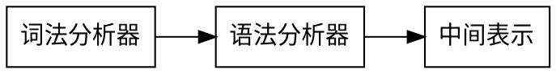

<style>
body {font-family: Georgia}
h1 {font-family: Georgia;color:#f8dcac}
p, h1, h2, h3, h4, h5, h6,code,li,ol {font-family: Times, TimesNR, 'New Century Schoolbook',
     Georgia, 'New York', serif;}
</style>

# LLVM

LLVM（Low Level Virtual Machine）是构架编译器(compiler)的框架系统，以C++编写而成，用于优化以任意程序语言编写的程序的编译时间(compile-time)、链接时间(link-time)、运行时间(run-time)以及空闲时间(idle-time)，对开发者保持开放，并兼容已有脚本。

LLVM的主要作用是它可以作为多种语言的后端，它可以提供可编程语言无关的优化和针对很多种CPU的代码生成功能。此外llvm目前已经不仅仅是个编程框架，它目前还包含了很多的子项目，比如最具盛名的clang.

LLVM项目包含多个组件。该项目的核心本身称为“LLVM”。它包含处理中间表示并将其转换为目标文件所需的所有工具，库和头文件。工具包括汇编程序，反汇编程序，位代码分析器和位代码优化器。它还包含基本的回归测试。

类似C的语言使用Clang前端。该组件将C，C ++，Objective C和Objective C ++代码编译为LLVM位代码，并使用LLVM从那里编译为目标文件。

## LLVM 入门

* **SRC_ROOT**-这是LLVM源树的顶级目录。
* **OBJ_ROOT**-这是LLVM对象树的顶层目录（即，将放置目标文件和编译的程序的树。它可以与SRC_ROOT相同）。

LLVM可以使用SVN，Git完成版本控制，以及make，cmake等自动构建。

### LLVM 目录布局

* `llvm/examples`-使用LLVM IR和JIT的简单示例。
* `llvm/include`-从LLVM库导出的公共头文件。三个主要子目录：

1. llvm/include/llvm 所有特定LLVM的头文件和子目录LLVM的不同部分：Analysis，CodeGen，Target，Transforms，等...
2. llvm/include/llvm/Support LLVM附带的通用支持库，但不一定特定于LLVM。例如，某些C ++ STL实用程序和命令行选项处理库在此处存储头文件。
3. llvm/include/llvm/Config 由配置的头文件cmake。它们包装“标准” UNIX和C头文件。源代码可以包括这些头文件，这些头文件会自动处理cmake 生成的条件#include 。
   
* `llvm/lib`-大多数源文件在这里。通过将代码放入库中，LLVM使得在工具之间共享代码变得容易。

1. llvm/lib/IR/ 实现诸如Instruction和BasicBlock之类的核心类的核心LLVM源文件。
2. llvm/lib/AsmParser/ LLVM汇编语言解析器库的源代码。
3. llvm/lib/Bitcode/ 用于读取和写入位码的代码。
4. llvm/lib/Analysis/ 各种程序分析，例如调用图，归纳变量，自然循环标识等。
5. llvm/lib/Transforms/ IR到IR程序的转换，例如积极的死代码消除，稀疏的条件常数传播，内联，循环不变代码运动，死全局消除等。
6. llvm/lib/Target/ 描述用于代码生成的目标体系结构的文件。例如， llvm/lib/Target/X86保存X86机器描述。
7. llvm/lib/CodeGen/ 代码生成器的主要部分：指令选择器，指令调度和寄存器分配。
8. llvm/lib/MC/ （FIXME：待定）....？
9. llvm/lib/ExecutionEngine/ 在解释的和JIT编译的场景中，用于在运行时直接执行位代码的库。
10. llvm/lib/Support/ 源代码，对应于头文件中llvm/include/ADT/ 和llvm/include/Support/。
* `llvm/projects`-项目并非严格属于LLVM，而是与LLVM一起提供。这也是用于创建自己的基于LLVM的项目的目录，该项目利用LLVM构建系统。
* `llvm/test`-LLVM基础架构上的功能和回归测试以及其他完整性检查。它们旨在快速运行并覆盖很多领域，而并非详尽无遗。
* `test-suite`-LLVM的全面正确性，性能和基准测试套件。这是一个，因为它在各种许可下都包含大量的第三方代码。
* `llvm/tools`-在上述库的基础上构建的可执行文件，它们构成用户界面的主要部分。始终可以通过键入来获得有关工具的帮助。
* `llvm/utils`-用于处理LLVM源代码的实用程序；有些是构建过程的一部分，因为它们是基础结构各部分的代码生成器。

## 使用LLVM完成一个语言的前端

<div align=center>



</div>

### 词法分析器

比如对于简单的BASIC语言：

```basic
# Compute the x'th fibonacci number.
def fib(x)
  if x < 3 then
    1
  else
    fib(x-1)+fib(x-2)

# This expression will compute the 40th number.
fib(40)
```

在实现语言方面，首先需要的是处理文本文件并识别其内容的能力。传统方法是使用“词法分析器”（又称“扫描器”）将输入分解为“token”。词法分析器返回的每个记号都包含记号代码和潜在的一些元数据（例如数字的数值）。

```ocaml
(* The lexer returns these 'Kwd' if it is an unknown character, otherwise one of
 * these others for known things. *)
type token =
  (* commands *)
  | Def | Extern

  (* primary *)
  | Ident of string | Number of float

  (* unknown *)
  | Kwd of char
```

词法分析器返回的每个词法符号都是词法变量值之一。诸如'+'之类的未知字符将作为返回 。如果当前记号是标识符，则值为字符串。如果当前标记是数字文字（如1.0），则值为Token.Kwd '+' Token.Ident sToken.Number 1.0

词法分析器的实际实现是由名为的函数驱动的函数的集合Lexer.lex。Lexer.lex调用该函数以从标准输入返回下一个标记

```ocaml
(*===----------------------------------------------------------------------===
 * Lexer
 *===----------------------------------------------------------------------===*)

let rec lex = parser
  (* Skip any whitespace. *)
  | [< ' (' ' | '\n' | '\r' | '\t'); stream >] -> lex stream
```

Lexer.lex通过递归从标准输入读取字符来工作。它会在识别出它们后存储在一个变量中。它要做的第一件事是忽略词法符号之间的空格。这是通过上面的`char Stream.tToken.token`递归调用完成的。

接下来Lexer.lex要做的是识别标识符和特定的关键字，例如“def”

```ocaml
  (* identifier: [a-zA-Z][a-zA-Z0-9] *)
  | [< ' ('A' .. 'Z' | 'a' .. 'z' as c); stream >] ->
      let buffer = Buffer.create 1 in
      Buffer.add_char buffer c;
      lex_ident buffer stream

...

and lex_ident buffer = parser
  | [< ' ('A' .. 'Z' | 'a' .. 'z' | '0' .. '9' as c); stream >] ->
      Buffer.add_char buffer c;
      lex_ident buffer stream
  | [< stream=lex >] ->
      match Buffer.contents buffer with
      | "def" -> [< 'Token.Def; stream >]
      | "extern" -> [< 'Token.Extern; stream >]
      | id -> [< 'Token.Ident id; stream >]
```

识别数字:

```ocaml
  (* number: [0-9.]+ *)
  | [< ' ('0' .. '9' as c); stream >] ->
      let buffer = Buffer.create 1 in
      Buffer.add_char buffer c;
      lex_number buffer stream

...

and lex_number buffer = parser
  | [< ' ('0' .. '9' | '.' as c); stream >] ->
      Buffer.add_char buffer c;
      lex_number buffer stream
  | [< stream=lex >] ->
      [< 'Token.Number (float_of_string (Buffer.contents buffer)); stream >]
```

这是用于处理输入的非常简单的代码。从输入读取数值时，使用ocaml float_of_string 函数将其转换为存储在中的数值 Token.Number。请注意，这没有进行足够的错误检查：Failure如果字符串“1.23.45.67” ，它将引发错误。随意扩展它:)。接下来处理注释：

```ocaml
  (* Comment until end of line. *)
  | [< ' ('#'); stream >] ->
      lex_comment stream

...

and lex_comment = parser
  | [< ' ('\n'); stream=lex >] -> stream
  | [< 'c; e=lex_comment >] -> e
  | [< >] -> [< >]
```

通过跳到行尾来处理注释，然后返回下一个标记。最后，如果输入与以上情况之一不匹配，则该输入可能是运算符，例如“+”，或者是文件结尾。这些使用以下代码处理：

```ocaml
(* Otherwise, just return the character as its ascii value. *)
| [< 'c; stream >] ->
    [< 'Token.Kwd c; lex stream >]

(* end of stream. *)
| [< >] -> [< >]
```

### 语法解析器

#### 抽象语法树AST

构建的解析器使用**递归下降解析**和**运算符优先解析**的组合来解析语言（后者用于二进制表达式，前者用于其他所有内容）。解析器的输出是**抽象语法树AST**。

程序的AST捕获其行为的方式使得编译器的后续阶段（例如代码生成）易于解释。基本上希望为该语言的每个构造提供一个对象，而AST应该紧密地对该语言建模。在语言中，有表达式，原型和函数对象。将从表达式开始：

```ocaml
(* expr - Base type for all expression nodes. *)
type expr =
  (* variant for numeric literals like "1.0". *)
  | Number of float
```

上面的代码显示了ExprAST基类的定义和一个用于数字文字的子类的定义。

以语言的基本形式使用的其他表达AST节点定义：

```ocaml
(* variant for referencing a variable, like "a". *)
| Variable of string

(* variant for a binary operator. *)
| Binary of char * expr * expr

(* variant for function calls. *)
| Call of string * expr array
```

`Variable`变量捕获变量名，`Binary`二进制运算符捕获其操作码（例如'+'），`Call`调用捕获函数名以及任何参数表达式的列表。

对于基本语言，这些都是定义的所有表达节点。因为它没有条件控制流，所以它不是图灵完备的。

```ocaml
(* proto - This type represents the "prototype" for a function, which captures
 * its name, and its argument names (thus implicitly the number of arguments the
 * function takes). *)
type proto = Prototype of string * string array

(* func - This type represents a function definition itself. *)
type func = Function of proto * expr
```

函数仅以其参数数量来输入。由于所有值都是双精度浮点数，因此每个参数的类型都不需要存储在任何地方。用一种更具攻击性和现实性的语言，“expr”变体可能会有一个类型字段。

#### 分析器基础

需要定义解析器代码来构建AST。比如想要将类似“x + y”（由词法分析器作为三个标记返回）的内容解析为可以通过如下调用生成的AST：

```ocaml
let x = Variable "x" in
let y = Variable "y" in
let result = Binary ('+', x, y) in
...
```

错误处理例程利用了内置函数，当解析器无法在模式的第一个位置中找到任何匹配的记号时，将引发错误处理例程Stream.Failure。 当第一个记号匹配时引发，其余的不匹配。

#### 基本的表达式分析

对于语法中的每个产生式，将定义一个解析该产生式的函数，并将此类表达式称为“主要”表达式。比如，对于数字表达式：

```ocaml
(* primary
 *   ::= identifier
 *   ::= numberexpr
 *   ::= parenexpr *)
parse_primary = parser
  (* numberexpr ::= number *)
  | [< 'Token.Number n >] -> Ast.Number n
```

以上例程期望在当前记号是`Token.Number`记号时被调用。它采用当前数字值，创建一个`Ast.Number`节点，将词法分析器移至下一个标记，最后返回。

括号运算符的定义如下：

```ocaml
(* parenexpr ::= '(' expression ')' *)
| [< 'Token.Kwd '('; e=parse_expr; 'Token.Kwd ')' ?? "expected ')'" >] -> e
```

下一个简单的生产式是用于处理变量引用和函数调用：

```ocaml
(* identifierexpr
 *   ::= identifier
 *   ::= identifier '(' argumentexpr ')' *)
| [< 'Token.Ident id; stream >] ->
    let rec parse_args accumulator = parser
      | [< e=parse_expr; stream >] ->
          begin parser
            | [< 'Token.Kwd ','; e=parse_args (e :: accumulator) >] -> e
            | [< >] -> e :: accumulator
          end stream
      | [< >] -> accumulator
    in
    let rec parse_ident id = parser
      (* Call. *)
      | [< 'Token.Kwd '(';
           args=parse_args [];
           'Token.Kwd ')' ?? "expected ')'">] ->
          Ast.Call (id, Array.of_list (List.rev args))

      (* Simple variable ref. *)
      | [< >] -> Ast.Variable id
    in
    parse_ident id stream
```

如果接收到了没想到的记号，则会引发异常：

```ocaml
| [< >] -> raise (Stream.Error "unknown token when expecting an expression.")
```

#### 二进制表达式解析

例如，当给定字符串“x + y * z”时，解析器可以选择将其解析为“(x + y) * z”或“x + (y * z)”。使用数学上的通用定义，因为“*”（乘法）的优先级高于“+”（加法）的优先级。

有很多方法可以解决此问题，但是一种优雅而有效的方法是使用Operator-Precedence Parsing。此解析技术使用二进制运算符的优先级来指导递归。首先，需要一个优先级表：

```ocaml
(* binop_precedence - This holds the precedence for each binary operator that is
 * defined *)
let binop_precedence:(char, int) Hashtbl.t = Hashtbl.create 10

(* precedence - Get the precedence of the pending binary operator token. *)
let precedence c = try Hashtbl.find binop_precedence c with Not_found -> -1

...

let main () =
  (* Install standard binary operators.
   * 1 is the lowest precedence. *)
  Hashtbl.add Parser.binop_precedence '<' 10;
  Hashtbl.add Parser.binop_precedence '+' 20;
  Hashtbl.add Parser.binop_precedence '-' 20;
  Hashtbl.add Parser.binop_precedence '*' 40;    (* highest. *)
  ...
```

对于语言的基本形式，运算符优先级解析的基本思想是将具有潜在歧义的二进制运算符的表达式分解为多个部分

```ocaml
(* expression
 *   ::= primary binoprhs *)
and parse_expr = parser
  | [< lhs=parse_primary; stream >] -> parse_bin_rhs 0 lhs stream
```

```ocaml
(* binoprhs
 *   ::= ('+' primary)* *)
and parse_bin_rhs expr_prec lhs stream =
  match Stream.peek stream with
  (* If this is a binop, find its precedence. *)
  | Some (Token.Kwd c) when Hashtbl.mem binop_precedence c ->
      let token_prec = precedence c in

      (* If this is a binop that binds at least as tightly as the current binop,
       * consume it, otherwise we are done. *)
      if token_prec < expr_prec then lhs else begin
```

此代码获取当前记号的优先级，并检查是否太低。因为将无效记号定义为优先级为-1，所以此检查隐式知道当记号流用尽二进制运算符时，对流结束。如果此检查成功，知道记号是二进制运算符，它将包含在此表达式中：

```ocaml
(* Eat the binop. *)
Stream.junk stream;

(* Parse the primary expression after the binary operator *)
let rhs = parse_primary stream in

(* Okay, we know this is a binop. *)
let rhs =
  match Stream.peek stream with
  | Some (Token.Kwd c2) ->
```

#### 解析函数原型

```ocaml
(* prototype
 *   ::= id '(' id* ')' *)
let parse_prototype =
  let rec parse_args accumulator = parser
    | [< 'Token.Ident id; e=parse_args (id::accumulator) >] -> e
    | [< >] -> accumulator
  in

  parser
  | [< 'Token.Ident id;
       'Token.Kwd '(' ?? "expected '(' in prototype";
       args=parse_args [];
       'Token.Kwd ')' ?? "expected ')' in prototype" >] ->
      (* success. *)
      Ast.Prototype (id, Array.of_list (List.rev args))

  | [< >] ->
      raise (Stream.Error "expected function name in prototype")
```

```ocaml
(* definition ::= 'def' prototype expression *)
let parse_definition = parser
  | [< 'Token.Def; p=parse_prototype; e=parse_expr >] ->
      Ast.Function (p, e)
```

另外，支持'extern'来声明诸如'sin'和'cos'之类的函数，并支持用户函数的正向声明。这些“外部”只是没有主体的原型：

```ocaml
(*  external ::= 'extern' prototype *)
let parse_extern = parser
  | [< 'Token.Extern; e=parse_prototype >] -> e
```

最后，还将让用户键入任意顶级表达式，并即时对其求值。将通过为它们定义匿名空值（零参数）函数来处理此问题：

```ocaml
(* toplevelexpr ::= expression *)
let parse_toplevel = parser
  | [< e=parse_expr >] ->
      (* Make an anonymous proto. *)
      Ast.Function (Ast.Prototype ("", [||]), e)
```

#### 解析器驱动程序

该驱动程序仅通过顶级调度循环调用所有解析块。

```ocaml
(* top ::= definition | external | expression | ';' *)
let rec main_loop stream =
  match Stream.peek stream with
  | None -> ()

  (* ignore top-level semicolons. *)
  | Some (Token.Kwd ';') ->
      Stream.junk stream;
      main_loop stream

  | Some token ->
      begin
        try match token with
        | Token.Def ->
            ignore(Parser.parse_definition stream);
            print_endline "parsed a function definition.";
        | Token.Extern ->
            ignore(Parser.parse_extern stream);
            print_endline "parsed an extern.";
        | _ ->
            (* Evaluate a top-level expression into an anonymous function. *)
            ignore(Parser.parse_toplevel stream);
            print_endline "parsed a top-level expr";
        with Stream.Error s ->
          (* Skip token for error recovery. *)
          Stream.junk stream;
          print_endline s;
      end;
      print_string "ready> "; flush stdout;
      main_loop stream
```

#### 完整代码

`token.ml`

```ocaml
(*===----------------------------------------------------------------------===
 * Lexer Tokens
 *===----------------------------------------------------------------------===*)

(* The lexer returns these 'Kwd' if it is an unknown character, otherwise one of
 * these others for known things. *)
type token =
  (* commands *)
  | Def | Extern

  (* primary *)
  | Ident of string | Number of float

  (* unknown *)
  | Kwd of char
lexer.ml：
(*===----------------------------------------------------------------------===
 * Lexer
 *===----------------------------------------------------------------------===*)

let rec lex = parser
  (* Skip any whitespace. *)
  | [< ' (' ' | '\n' | '\r' | '\t'); stream >] -> lex stream

  (* identifier: [a-zA-Z][a-zA-Z0-9] *)
  | [< ' ('A' .. 'Z' | 'a' .. 'z' as c); stream >] ->
      let buffer = Buffer.create 1 in
      Buffer.add_char buffer c;
      lex_ident buffer stream

  (* number: [0-9.]+ *)
  | [< ' ('0' .. '9' as c); stream >] ->
      let buffer = Buffer.create 1 in
      Buffer.add_char buffer c;
      lex_number buffer stream

  (* Comment until end of line. *)
  | [< ' ('#'); stream >] ->
      lex_comment stream

  (* Otherwise, just return the character as its ascii value. *)
  | [< 'c; stream >] ->
      [< 'Token.Kwd c; lex stream >]

  (* end of stream. *)
  | [< >] -> [< >]

and lex_number buffer = parser
  | [< ' ('0' .. '9' | '.' as c); stream >] ->
      Buffer.add_char buffer c;
      lex_number buffer stream
  | [< stream=lex >] ->
      [< 'Token.Number (float_of_string (Buffer.contents buffer)); stream >]

and lex_ident buffer = parser
  | [< ' ('A' .. 'Z' | 'a' .. 'z' | '0' .. '9' as c); stream >] ->
      Buffer.add_char buffer c;
      lex_ident buffer stream
  | [< stream=lex >] ->
      match Buffer.contents buffer with
      | "def" -> [< 'Token.Def; stream >]
      | "extern" -> [< 'Token.Extern; stream >]
      | id -> [< 'Token.Ident id; stream >]

and lex_comment = parser
  | [< ' ('\n'); stream=lex >] -> stream
  | [< 'c; e=lex_comment >] -> e
  | [< >] -> [< >]
```

`ast.ml`

```ocaml
(*===----------------------------------------------------------------------===
 * Abstract Syntax Tree (aka Parse Tree)
 *===----------------------------------------------------------------------===*)

(* expr - Base type for all expression nodes. *)
type expr =
  (* variant for numeric literals like "1.0". *)
  | Number of float

  (* variant for referencing a variable, like "a". *)
  | Variable of string

  (* variant for a binary operator. *)
  | Binary of char * expr * expr

  (* variant for function calls. *)
  | Call of string * expr array

(* proto - This type represents the "prototype" for a function, which captures
 * its name, and its argument names (thus implicitly the number of arguments the
 * function takes). *)
type proto = Prototype of string * string array

(* func - This type represents a function definition itself. *)
type func = Function of proto * expr
parser.ml：
(*===---------------------------------------------------------------------===
 * Parser
 *===---------------------------------------------------------------------===*)

(* binop_precedence - This holds the precedence for each binary operator that is
 * defined *)
let binop_precedence:(char, int) Hashtbl.t = Hashtbl.create 10

(* precedence - Get the precedence of the pending binary operator token. *)
let precedence c = try Hashtbl.find binop_precedence c with Not_found -> -1

(* primary
 *   ::= identifier
 *   ::= numberexpr
 *   ::= parenexpr *)
let rec parse_primary = parser
  (* numberexpr ::= number *)
  | [< 'Token.Number n >] -> Ast.Number n

  (* parenexpr ::= '(' expression ')' *)
  | [< 'Token.Kwd '('; e=parse_expr; 'Token.Kwd ')' ?? "expected ')'" >] -> e

  (* identifierexpr
   *   ::= identifier
   *   ::= identifier '(' argumentexpr ')' *)
  | [< 'Token.Ident id; stream >] ->
      let rec parse_args accumulator = parser
        | [< e=parse_expr; stream >] ->
            begin parser
              | [< 'Token.Kwd ','; e=parse_args (e :: accumulator) >] -> e
              | [< >] -> e :: accumulator
            end stream
        | [< >] -> accumulator
      in
      let rec parse_ident id = parser
        (* Call. *)
        | [< 'Token.Kwd '(';
             args=parse_args [];
             'Token.Kwd ')' ?? "expected ')'">] ->
            Ast.Call (id, Array.of_list (List.rev args))

        (* Simple variable ref. *)
        | [< >] -> Ast.Variable id
      in
      parse_ident id stream

  | [< >] -> raise (Stream.Error "unknown token when expecting an expression.")

(* binoprhs
 *   ::= ('+' primary)* *)
and parse_bin_rhs expr_prec lhs stream =
  match Stream.peek stream with
  (* If this is a binop, find its precedence. *)
  | Some (Token.Kwd c) when Hashtbl.mem binop_precedence c ->
      let token_prec = precedence c in

      (* If this is a binop that binds at least as tightly as the current binop,
       * consume it, otherwise we are done. *)
      if token_prec < expr_prec then lhs else begin
        (* Eat the binop. *)
        Stream.junk stream;

        (* Parse the primary expression after the binary operator. *)
        let rhs = parse_primary stream in

        (* Okay, we know this is a binop. *)
        let rhs =
          match Stream.peek stream with
          | Some (Token.Kwd c2) ->
              (* If BinOp binds less tightly with rhs than the operator after
               * rhs, let the pending operator take rhs as its lhs. *)
              let next_prec = precedence c2 in
              if token_prec < next_prec
              then parse_bin_rhs (token_prec + 1) rhs stream
              else rhs
          | _ -> rhs
        in

        (* Merge lhs/rhs. *)
        let lhs = Ast.Binary (c, lhs, rhs) in
        parse_bin_rhs expr_prec lhs stream
      end
  | _ -> lhs

(* expression
 *   ::= primary binoprhs *)
and parse_expr = parser
  | [< lhs=parse_primary; stream >] -> parse_bin_rhs 0 lhs stream

(* prototype
 *   ::= id '(' id* ')' *)
let parse_prototype =
  let rec parse_args accumulator = parser
    | [< 'Token.Ident id; e=parse_args (id::accumulator) >] -> e
    | [< >] -> accumulator
  in

  parser
  | [< 'Token.Ident id;
       'Token.Kwd '(' ?? "expected '(' in prototype";
       args=parse_args [];
       'Token.Kwd ')' ?? "expected ')' in prototype" >] ->
      (* success. *)
      Ast.Prototype (id, Array.of_list (List.rev args))

  | [< >] ->
      raise (Stream.Error "expected function name in prototype")

(* definition ::= 'def' prototype expression *)
let parse_definition = parser
  | [< 'Token.Def; p=parse_prototype; e=parse_expr >] ->
      Ast.Function (p, e)

(* toplevelexpr ::= expression *)
let parse_toplevel = parser
  | [< e=parse_expr >] ->
      (* Make an anonymous proto. *)
      Ast.Function (Ast.Prototype ("", [||]), e)

(*  external ::= 'extern' prototype *)
let parse_extern = parser
  | [< 'Token.Extern; e=parse_prototype >] -> e
toplevel.ml：
(*===----------------------------------------------------------------------===
 * Top-Level parsing and JIT Driver
 *===----------------------------------------------------------------------===*)

(* top ::= definition | external | expression | ';' *)
let rec main_loop stream =
  match Stream.peek stream with
  | None -> ()

  (* ignore top-level semicolons. *)
  | Some (Token.Kwd ';') ->
      Stream.junk stream;
      main_loop stream

  | Some token ->
      begin
        try match token with
        | Token.Def ->
            ignore(Parser.parse_definition stream);
            print_endline "parsed a function definition.";
        | Token.Extern ->
            ignore(Parser.parse_extern stream);
            print_endline "parsed an extern.";
        | _ ->
            (* Evaluate a top-level expression into an anonymous function. *)
            ignore(Parser.parse_toplevel stream);
            print_endline "parsed a top-level expr";
        with Stream.Error s ->
          (* Skip token for error recovery. *)
          Stream.junk stream;
          print_endline s;
      end;
      print_string "ready> "; flush stdout;
      main_loop stream
```

`toy.ml`

```ocaml
(*===----------------------------------------------------------------------===
 * Main driver code.
 *===----------------------------------------------------------------------===*)

let main () =
  (* Install standard binary operators.
   * 1 is the lowest precedence. *)
  Hashtbl.add Parser.binop_precedence '<' 10;
  Hashtbl.add Parser.binop_precedence '+' 20;
  Hashtbl.add Parser.binop_precedence '-' 20;
  Hashtbl.add Parser.binop_precedence '*' 40;    (* highest. *)

  (* Prime the first token. *)
  print_string "ready> "; flush stdout;
  let stream = Lexer.lex (Stream.of_channel stdin) in

  (* Run the main "interpreter loop" now. *)
  Toplevel.main_loop stream;
;;

main ()
```

### LLVM IR的代码生成

为了生成LLVM IR开始一些简单的设置。首先，在每个AST类中定义虚拟代码生成（codegen）方法：

```ocaml
let rec codegen_expr = function
  | Ast.Number n -> ...
  | Ast.Variable name -> ...
```

该Codegen.codegen_expr函数说要为该AST节点发出IR及其依赖的所有事物，并且它们都返回LLVM Value对象。“值”是用于表示 LLVM中的“静态单一分配（SSA）寄存器”或“SSA值”的类。SSA值最明显的方面是，它们的值是在相关指令执行时计算的，并且直到（如果有）指令重新执行，它都不会获得新值。换句话说，没有办法“更改” SSA值。

第二件事是像解析器一样使用的“错误”异常，该异常将用于报告在代码生成过程中发现的错误（例如，使用未声明的参数）：

```ocaml
exception Error of string

let context = global_context ()
let the_module = create_module context "my cool jit"
let builder = builder context
let named_values:(string, llvalue) Hashtbl.t = Hashtbl.create 10
let double_type = double_type context
```

静态变量将在代码生成期间使用。 Codegen.the_module是LLVM构造，在一块代码中包含所有函数和全局变量。在许多方面，它是LLVM IR用来包含代码的顶层结构。

Codegen.builder对象是一个帮助程序对象，可轻松生成LLVM指令。IRBuilder 类的实例 跟踪要插入指令的当前位置，并具有创建新指令的方法。

Codegen.named_values映射跟踪当前范围中定义了哪些值，以及它们的LLVM表示形式是什么。（换句话说，它是代码的符号表）。唯一可以引用的是函数参数。这样，在为函数主体生成代码时，函数参数将位于此映射中。

#### 表达式代码生成

为表达式节点生成LLVM代码非常简单。对于数字表达式：

```ocaml
| Ast.Number n -> const_float double_type n
```

在LLVM IR中，数字常量由ConstantFP类表示，该类将数字值保存在APFloat 内部（APFloat具有保存任意精度的浮点常量的功能）。

这段代码基本上只是创建并返回一个ConstantFP。请注意，在LLVM IR中，所有常量都唯一并共享。因此，API使用“foo :: get（..）”惯用语代替“new foo（..）”或“foo :: Create（..）”。

```ocaml
| Ast.Variable name ->
    (try Hashtbl.find named_values name with
      | Not_found -> raise (Error "unknown variable name"))
```

使用LLVM，对变量的引用也非常简单。在语言的简单版本中，假定变量已经在某个位置发出并且其值可用。实际上，Codegen.named_values映射中唯一可以包含的值是函数参数。此代码只是检查以查看指定的名称是否在映射中（如果不在映射中，则引用一个未知变量）并返回其值。还可以在符号表中添加对循环归纳变量和局部变量的支持。

```ocaml
| Ast.Binary (op, lhs, rhs) ->
    let lhs_val = codegen_expr lhs in
    let rhs_val = codegen_expr rhs in
    begin
      match op with
      | '+' -> build_fadd lhs_val rhs_val "addtmp" builder
      | '-' -> build_fsub lhs_val rhs_val "subtmp" builder
      | '*' -> build_fmul lhs_val rhs_val "multmp" builder
      | '<' ->
          (* Convert bool 0/1 to double 0.0 or 1.0 *)
          let i = build_fcmp Fcmp.Ult lhs_val rhs_val "cmptmp" builder in
          build_uitofp i double_type "booltmp" builder
      | _ -> raise (Error "invalid binary operator")
    end
```

二元运算符解析的基本思想是递归地为表达式的左侧解析代码，然后再为右侧发出代码，然后计算二进制表达式的结果。在此代码中，对操作码进行了简单的切换以创建正确的LLVM指令。

在上面的示例中，LLVM构建器类开始显示其值。IRBuilder知道在何处插入新创建的指令，所要做的就是指定要创建的指令（例如，使用 Llvm.create_add），要使用的操作数（lhs以及rhs此处），并可以选择为生成的指令提供名称。

LLVM的一个好处是名称只是一个提示。例如，如果上面的代码发出多个“addtmp”变量，则LLVM将自动为每个变量提供一个递增的唯一数字后缀。指令的本地值名称纯粹是可选的，但是它使读取IR转储更加容易。

LLVM指令受到严格的规则约束：例如，一条add指令的Left和Right运算符必须具有相同的类型，并且add的结果类型必须与操作数类型匹配。

另一方面，LLVM指定fcmp指令始终返回“i1”值（一位整数）。问题在于语言希望该值为0.0或1.0。为了获得这些语义，将fcmp指令与uitofp指令结合在一起。该指令通过将输入视为无符号值，将其输入整数转换为浮点值。相反，如果使用sitofp指令，则语言'<'运算符将根据输入值返回0.0和-1.0。

```ocaml
| Ast.Call (callee, args) ->
    (* Look up the name in the module table. *)
    let callee =
      match lookup_function callee the_module with
      | Some callee -> callee
      | None -> raise (Error "unknown function referenced")
    in
    let params = params callee in

    (* If argument mismatch error. *)
    if Array.length params == Array.length args then () else
      raise (Error "incorrect # arguments passed");
    let args = Array.map codegen_expr args in
    build_call callee args "calltmp" builder
```

#### 函数代码生成

原型和函数的代码生成必须处理许多细节，这使得它们的代码不如表达式代码生成漂亮.

```ocaml
let codegen_proto = function
  | Ast.Prototype (name, args) ->
      (* Make the function type: double(double,double) etc. *)
      let doubles = Array.make (Array.length args) double_type in
      let ft = function_type double_type doubles in
      let f =
        match lookup_function name the_module with
```

此代码将大量功能打包成几行。首先请注意，此函数返回“Function *”而不是“Value *”（尽管目前它们都llvalue在ocaml 中建模）。因为“原型”实际上是在谈论函数的外部接口（而不是表达式计算的值），所以有意义的是，它返回代码生成时对应的LLVM函数。

调用Llvm.function_typecreate Llvm.llvalue应该用于给定的原型。由于语言中的所有函数参数均为double类型，因此第一行将创建一个“N”个LLVM double类型的向量。然后，它使用该Llvm.function_type方法来创建一个函数类型，该函数类型以“N”个double作为参数，并返回一个double作为结果，而不是vararg（使用function Llvm.var_arg_function_type）。请注意，LLVM中的类型就像的一样是唯一Constant的，因此不必“新建”一个类型，而是“获取”它。

上面的最后一行检查函数是否已在中定义 Codegen.the_module。如果没有，将创建它。

```ocaml
| None -> declare_function name ft the_module
```

这表明要使用的类型和名称，以及要插入的模块。默认情况下，假设一个函数具有 Llvm.Linkage.ExternalLinkage。“外部链接 ”是指该功能可以在当前模块外部定义和/或可以由模块外部的函数调用。name传入的“”是用户指定的名称：此名称已注册在“Codegen.the_module”符号表中，上面的函数调用代码使用该符号表。

在语言中，选择在两种情况下允许对函数进行重新定义：首先，希望允许多次对函数进行“外部”赋值，只要外部函数的原型匹配（由于所有参数都具有相同的类型，只是必须检查参数数量是否匹配）。其次，要允许“外部化”一个函数，然后为其定义一个主体。在定义相互递归函数时，这很有用。

```ocaml
  (* If 'f' conflicted, there was already something named 'name'. If it
   * has a body, don't allow redefinition or reextern. *)
  | Some f ->
      (* If 'f' already has a body, reject this. *)
      if Array.length (basic_blocks f) == 0 then () else
        raise (Error "redefinition of function");

      (* If 'f' took a different number of arguments, reject. *)
      if Array.length (params f) == Array.length args then () else
        raise (Error "redefinition of function with different # args");
      f
in
```

为了验证上述逻辑，首先检查现有功能是否为“空”。在这种情况下，empty表示其中没有基本块，这意味着它没有主体。如果没有主体，则为前向声明。由于在函数的完整定义后不允许任何操作，因此代码拒绝这种情况。如果先前对函数的引用是“外部”，只需验证该定义的自变量数量与该定义是否匹配即可。如果没有，将发出错误消息。

```ocaml
(* Set names for all arguments. *)
Array.iteri (fun i a ->
  let n = args.(i) in
  set_value_name n a;
  Hashtbl.add named_values n a;
) (params f);
f
```

原型的最后一部分代码遍历了函数中的所有参数，将LLVM Argument对象的名称设置为匹配，并在Codegen.named_values映射中注册了参数以供Ast.Variable变体将来使用。设置完成后，它将Function对象返回给调用方。请注意，此处不检查是否存在冲突的参数名称（例如“extern foo（aba）”）。这样做对于上面已经使用的机制非常简单。

```ocaml
let codegen_func = function
  | Ast.Function (proto, body) ->
      Hashtbl.clear named_values;
      let the_function = codegen_proto proto in
```

函数定义的代码生成开始就非常简单：只需对原型（Proto）进行代码生成，并验证它是可以的。然后，清除Codegen.named_values地图以确保上次编译的函数中没有任何内容。原型的代码生成可确保有一个可供使用的LLVM Function对象。

```ocaml
(* Create a new basic block to start insertion into. *)
let bb = append_block context "entry" the_function in
position_at_end bb builder;

try
  let ret_val = codegen_expr body in
```

现在，开始进行Codegen.builder设置。第一行创建一个新的基本块（名为“entry”），将其插入the_function。然后第二行告诉构建者，新指令应插入到新基本块的末尾。LLVM中的基本块是定义控制流图的功能的重要组成部分。由于没有任何控制流，因此的函数此时仅包含一个块。将在第5章中解决此问题：)。

```ocaml
let ret_val = codegen_expr body in

(* Finish off the function. *)
let _ = build_ret ret_val builder in

(* Validate the generated code, checking for consistency. *)
Llvm_analysis.assert_valid_function the_function;

the_function
```

设置插入点后，Codegen.codegen_func 将为函数的根表达式调用方法。如果没有错误发生，它将发出代码以将表达式计算到输入块中，并返回计算出的值。假设没有错误，然后创建LLVM ret指令，以完成该功能。构建函数后，将调用 Llvm_analysis.assert_valid_functionLLVM提供的。该函数对生成的代码进行各种一致性检查，以确定的编译器是否在正确执行所有操作。使用它很重要：它可以捕获很多错误。函数完成并验证后，将其返回。

```ocaml
with e ->
  delete_function the_function;
  raise e
```

这里剩下的唯一内容是错误情况的处理。为简单起见，仅通过删除使用该Llvm.delete_function方法生成的函数来处理此问题 。这使用户可以重新定义以前错误输入的函数：如果不删除它，该函数将与主体一起存在于符号表中，以防止将来重新定义。

这段代码确实有一个错误。由于Codegen.codegen_proto 可以返回先前定义的前向声明，因此的代码实际上可以删除前向声明。有多种方法可以修复此错误，请看能想到些什么！这是一个测试用例：

```ocaml
extern foo(a b);     # ok, defines foo.
def foo(a b) c;      # error, 'c' is invalid.
def bar() foo(1, 2); # error, unknown function "foo"
```

#### 驱动程序

就目前而言，LLVM的代码生成并不能真正为带来很多好处，只是可以查看漂亮的IR调用。该示例代码将对Codegen的调用插入“Toplevel.main_loop”中，然后转储LLVM IR。这为查看LLVM IR的简单函数提供了一种好方法。例如：

```ocaml
ready> 4+5;
Read top-level expression:
define double @""() {
entry:
        %addtmp = fadd double 4.000000e+00, 5.000000e+00
        ret double %addtmp
}
```

请注意解析器如何将顶级表达式转换为的匿名函数。在下一章中添加JIT支持时，这将非常方便。还要注意，该代码是按字面意思转录的，没有执行任何优化。

```ocaml
ready> def foo(a b) a*a + 2*a*b + b*b;
Read function definition:
define double @foo(double %a, double %b) {
entry:
        %multmp = fmul double %a, %a
        %multmp1 = fmul double 2.000000e+00, %a
        %multmp2 = fmul double %multmp1, %b
        %addtmp = fadd double %multmp, %multmp2
        %multmp3 = fmul double %b, %b
        %addtmp4 = fadd double %addtmp, %multmp3
        ret double %addtmp4
}
```

这显示了一些简单的算法。请注意，它与用来创建指令的LLVM构建器调用非常相似。

```ocaml
ready> def bar(a) foo(a, 4.0) + bar(31337);
Read function definition:
define double @bar(double %a) {
entry:
        %calltmp = call double @foo(double %a, double 4.000000e+00)
        %calltmp1 = call double @bar(double 3.133700e+04)
        %addtmp = fadd double %calltmp, %calltmp1
        ret double %addtmp
}
```

这显示了一些函数调用。请注意，如果调用此函数，将花费很长时间执行。将来，将添加条件控制流，以使递归真正有用。

```ocaml
ready> extern cos(x);
Read extern:
declare double @cos(double)

ready> cos(1.234);
Read top-level expression:
define double @""() {
entry:
        %calltmp = call double @cos(double 1.234000e+00)
        ret double %calltmp
}
```

这显示了libm“cos”函数的外部，以及对其的调用。

```ocaml
ready> ^D
; ModuleID = 'my cool jit'

define double @""() {
entry:
        %addtmp = fadd double 4.000000e+00, 5.000000e+00
        ret double %addtmp
}

define double @foo(double %a, double %b) {
entry:
        %multmp = fmul double %a, %a
        %multmp1 = fmul double 2.000000e+00, %a
        %multmp2 = fmul double %multmp1, %b
        %addtmp = fadd double %multmp, %multmp2
        %multmp3 = fmul double %b, %b
        %addtmp4 = fadd double %addtmp, %multmp3
        ret double %addtmp4
}

define double @bar(double %a) {
entry:
        %calltmp = call double @foo(double %a, double 4.000000e+00)
        %calltmp1 = call double @bar(double 3.133700e+04)
        %addtmp = fadd double %calltmp, %calltmp1
        ret double %addtmp
}

declare double @cos(double)

define double @""() {
entry:
        %calltmp = call double @cos(double 1.234000e+00)
        ret double %calltmp
}
```

#### 完整代码清单

```
# Compile
ocamlbuild toy.byte
# Run
./toy.byte
```

`myocamlbuild.ml`

```ocaml
open Ocamlbuild_plugin;;

ocaml_lib ~extern:true "llvm";;
ocaml_lib ~extern:true "llvm_analysis";;

flag ["link"; "ocaml"; "g++"] (S[A"-cc"; A"g++"]);;
```

`token.ml`

```ocaml
(*===----------------------------------------------------------------------===
 * Lexer Tokens
 *===----------------------------------------------------------------------===*)

(* The lexer returns these 'Kwd' if it is an unknown character, otherwise one of
 * these others for known things. *)
type token =
  (* commands *)
  | Def | Extern

  (* primary *)
  | Ident of string | Number of float

  (* unknown *)
  | Kwd of char
```

`lexer.ml`

```ocaml
(*===----------------------------------------------------------------------===
 * Lexer
 *===----------------------------------------------------------------------===*)

let rec lex = parser
  (* Skip any whitespace. *)
  | [< ' (' ' | '\n' | '\r' | '\t'); stream >] -> lex stream

  (* identifier: [a-zA-Z][a-zA-Z0-9] *)
  | [< ' ('A' .. 'Z' | 'a' .. 'z' as c); stream >] ->
      let buffer = Buffer.create 1 in
      Buffer.add_char buffer c;
      lex_ident buffer stream

  (* number: [0-9.]+ *)
  | [< ' ('0' .. '9' as c); stream >] ->
      let buffer = Buffer.create 1 in
      Buffer.add_char buffer c;
      lex_number buffer stream

  (* Comment until end of line. *)
  | [< ' ('#'); stream >] ->
      lex_comment stream

  (* Otherwise, just return the character as its ascii value. *)
  | [< 'c; stream >] ->
      [< 'Token.Kwd c; lex stream >]

  (* end of stream. *)
  | [< >] -> [< >]

and lex_number buffer = parser
  | [< ' ('0' .. '9' | '.' as c); stream >] ->
      Buffer.add_char buffer c;
      lex_number buffer stream
  | [< stream=lex >] ->
      [< 'Token.Number (float_of_string (Buffer.contents buffer)); stream >]

and lex_ident buffer = parser
  | [< ' ('A' .. 'Z' | 'a' .. 'z' | '0' .. '9' as c); stream >] ->
      Buffer.add_char buffer c;
      lex_ident buffer stream
  | [< stream=lex >] ->
      match Buffer.contents buffer with
      | "def" -> [< 'Token.Def; stream >]
      | "extern" -> [< 'Token.Extern; stream >]
      | id -> [< 'Token.Ident id; stream >]

and lex_comment = parser
  | [< ' ('\n'); stream=lex >] -> stream
  | [< 'c; e=lex_comment >] -> e
  | [< >] -> [< >]
```

`ast.ml`

```ocaml
(*===----------------------------------------------------------------------===
 * Abstract Syntax Tree (aka Parse Tree)
 *===----------------------------------------------------------------------===*)

(* expr - Base type for all expression nodes. *)
type expr =
  (* variant for numeric literals like "1.0". *)
  | Number of float

  (* variant for referencing a variable, like "a". *)
  | Variable of string

  (* variant for a binary operator. *)
  | Binary of char * expr * expr

  (* variant for function calls. *)
  | Call of string * expr array

(* proto - This type represents the "prototype" for a function, which captures
 * its name, and its argument names (thus implicitly the number of arguments the
 * function takes). *)
type proto = Prototype of string * string array

(* func - This type represents a function definition itself. *)
type func = Function of proto * expr
```

`parser.ml`

```ocaml
(*===---------------------------------------------------------------------===
 * Parser
 *===---------------------------------------------------------------------===*)

(* binop_precedence - This holds the precedence for each binary operator that is
 * defined *)
let binop_precedence:(char, int) Hashtbl.t = Hashtbl.create 10

(* precedence - Get the precedence of the pending binary operator token. *)
let precedence c = try Hashtbl.find binop_precedence c with Not_found -> -1

(* primary
 *   ::= identifier
 *   ::= numberexpr
 *   ::= parenexpr *)
let rec parse_primary = parser
  (* numberexpr ::= number *)
  | [< 'Token.Number n >] -> Ast.Number n

  (* parenexpr ::= '(' expression ')' *)
  | [< 'Token.Kwd '('; e=parse_expr; 'Token.Kwd ')' ?? "expected ')'" >] -> e

  (* identifierexpr
   *   ::= identifier
   *   ::= identifier '(' argumentexpr ')' *)
  | [< 'Token.Ident id; stream >] ->
      let rec parse_args accumulator = parser
        | [< e=parse_expr; stream >] ->
            begin parser
              | [< 'Token.Kwd ','; e=parse_args (e :: accumulator) >] -> e
              | [< >] -> e :: accumulator
            end stream
        | [< >] -> accumulator
      in
      let rec parse_ident id = parser
        (* Call. *)
        | [< 'Token.Kwd '(';
             args=parse_args [];
             'Token.Kwd ')' ?? "expected ')'">] ->
            Ast.Call (id, Array.of_list (List.rev args))

        (* Simple variable ref. *)
        | [< >] -> Ast.Variable id
      in
      parse_ident id stream

  | [< >] -> raise (Stream.Error "unknown token when expecting an expression.")

(* binoprhs
 *   ::= ('+' primary)* *)
and parse_bin_rhs expr_prec lhs stream =
  match Stream.peek stream with
  (* If this is a binop, find its precedence. *)
  | Some (Token.Kwd c) when Hashtbl.mem binop_precedence c ->
      let token_prec = precedence c in

      (* If this is a binop that binds at least as tightly as the current binop,
       * consume it, otherwise we are done. *)
      if token_prec < expr_prec then lhs else begin
        (* Eat the binop. *)
        Stream.junk stream;

        (* Parse the primary expression after the binary operator. *)
        let rhs = parse_primary stream in

        (* Okay, we know this is a binop. *)
        let rhs =
          match Stream.peek stream with
          | Some (Token.Kwd c2) ->
              (* If BinOp binds less tightly with rhs than the operator after
               * rhs, let the pending operator take rhs as its lhs. *)
              let next_prec = precedence c2 in
              if token_prec < next_prec
              then parse_bin_rhs (token_prec + 1) rhs stream
              else rhs
          | _ -> rhs
        in

        (* Merge lhs/rhs. *)
        let lhs = Ast.Binary (c, lhs, rhs) in
        parse_bin_rhs expr_prec lhs stream
      end
  | _ -> lhs

(* expression
 *   ::= primary binoprhs *)
and parse_expr = parser
  | [< lhs=parse_primary; stream >] -> parse_bin_rhs 0 lhs stream

(* prototype
 *   ::= id '(' id* ')' *)
let parse_prototype =
  let rec parse_args accumulator = parser
    | [< 'Token.Ident id; e=parse_args (id::accumulator) >] -> e
    | [< >] -> accumulator
  in

  parser
  | [< 'Token.Ident id;
       'Token.Kwd '(' ?? "expected '(' in prototype";
       args=parse_args [];
       'Token.Kwd ')' ?? "expected ')' in prototype" >] ->
      (* success. *)
      Ast.Prototype (id, Array.of_list (List.rev args))

  | [< >] ->
      raise (Stream.Error "expected function name in prototype")

(* definition ::= 'def' prototype expression *)
let parse_definition = parser
  | [< 'Token.Def; p=parse_prototype; e=parse_expr >] ->
      Ast.Function (p, e)

(* toplevelexpr ::= expression *)
let parse_toplevel = parser
  | [< e=parse_expr >] ->
      (* Make an anonymous proto. *)
      Ast.Function (Ast.Prototype ("", [||]), e)

(*  external ::= 'extern' prototype *)
let parse_extern = parser
  | [< 'Token.Extern; e=parse_prototype >] -> e
```

`codegen.ml`

```ocaml
(*===----------------------------------------------------------------------===
 * Code Generation
 *===----------------------------------------------------------------------===*)

open Llvm

exception Error of string

let context = global_context ()
let the_module = create_module context "my cool jit"
let builder = builder context
let named_values:(string, llvalue) Hashtbl.t = Hashtbl.create 10
let double_type = double_type context

let rec codegen_expr = function
  | Ast.Number n -> const_float double_type n
  | Ast.Variable name ->
      (try Hashtbl.find named_values name with
        | Not_found -> raise (Error "unknown variable name"))
  | Ast.Binary (op, lhs, rhs) ->
      let lhs_val = codegen_expr lhs in
      let rhs_val = codegen_expr rhs in
      begin
        match op with
        | '+' -> build_add lhs_val rhs_val "addtmp" builder
        | '-' -> build_sub lhs_val rhs_val "subtmp" builder
        | '*' -> build_mul lhs_val rhs_val "multmp" builder
        | '<' ->
            (* Convert bool 0/1 to double 0.0 or 1.0 *)
            let i = build_fcmp Fcmp.Ult lhs_val rhs_val "cmptmp" builder in
            build_uitofp i double_type "booltmp" builder
        | _ -> raise (Error "invalid binary operator")
      end
  | Ast.Call (callee, args) ->
      (* Look up the name in the module table. *)
      let callee =
        match lookup_function callee the_module with
        | Some callee -> callee
        | None -> raise (Error "unknown function referenced")
      in
      let params = params callee in

      (* If argument mismatch error. *)
      if Array.length params == Array.length args then () else
        raise (Error "incorrect # arguments passed");
      let args = Array.map codegen_expr args in
      build_call callee args "calltmp" builder

let codegen_proto = function
  | Ast.Prototype (name, args) ->
      (* Make the function type: double(double,double) etc. *)
      let doubles = Array.make (Array.length args) double_type in
      let ft = function_type double_type doubles in
      let f =
        match lookup_function name the_module with
        | None -> declare_function name ft the_module

        (* If 'f' conflicted, there was already something named 'name'. If it
         * has a body, don't allow redefinition or reextern. *)
        | Some f ->
            (* If 'f' already has a body, reject this. *)
            if block_begin f <> At_end f then
              raise (Error "redefinition of function");

            (* If 'f' took a different number of arguments, reject. *)
            if element_type (type_of f) <> ft then
              raise (Error "redefinition of function with different # args");
            f
      in

      (* Set names for all arguments. *)
      Array.iteri (fun i a ->
        let n = args.(i) in
        set_value_name n a;
        Hashtbl.add named_values n a;
      ) (params f);
      f

let codegen_func = function
  | Ast.Function (proto, body) ->
      Hashtbl.clear named_values;
      let the_function = codegen_proto proto in

      (* Create a new basic block to start insertion into. *)
      let bb = append_block context "entry" the_function in
      position_at_end bb builder;

      try
        let ret_val = codegen_expr body in

        (* Finish off the function. *)
        let _ = build_ret ret_val builder in

        (* Validate the generated code, checking for consistency. *)
        Llvm_analysis.assert_valid_function the_function;

        the_function
      with e ->
        delete_function the_function;
        raise e
```

`toplevel.ml`

```ocaml
(*===----------------------------------------------------------------------===
 * Top-Level parsing and JIT Driver
 *===----------------------------------------------------------------------===*)

open Llvm

(* top ::= definition | external | expression | ';' *)
let rec main_loop stream =
  match Stream.peek stream with
  | None -> ()

  (* ignore top-level semicolons. *)
  | Some (Token.Kwd ';') ->
      Stream.junk stream;
      main_loop stream

  | Some token ->
      begin
        try match token with
        | Token.Def ->
            let e = Parser.parse_definition stream in
            print_endline "parsed a function definition.";
            dump_value (Codegen.codegen_func e);
        | Token.Extern ->
            let e = Parser.parse_extern stream in
            print_endline "parsed an extern.";
            dump_value (Codegen.codegen_proto e);
        | _ ->
            (* Evaluate a top-level expression into an anonymous function. *)
            let e = Parser.parse_toplevel stream in
            print_endline "parsed a top-level expr";
            dump_value (Codegen.codegen_func e);
        with Stream.Error s | Codegen.Error s ->
          (* Skip token for error recovery. *)
          Stream.junk stream;
          print_endline s;
      end;
      print_string "ready> "; flush stdout;
      main_loop stream
```

`toy.ml`

```ocaml
(*===----------------------------------------------------------------------===
 * Main driver code.
 *===----------------------------------------------------------------------===*)

open Llvm

let main () =
  (* Install standard binary operators.
   * 1 is the lowest precedence. *)
  Hashtbl.add Parser.binop_precedence '<' 10;
  Hashtbl.add Parser.binop_precedence '+' 20;
  Hashtbl.add Parser.binop_precedence '-' 20;
  Hashtbl.add Parser.binop_precedence '*' 40;    (* highest. *)

  (* Prime the first token. *)
  print_string "ready> "; flush stdout;
  let stream = Lexer.lex (Stream.of_channel stdin) in

  (* Run the main "interpreter loop" now. *)
  Toplevel.main_loop stream;

  (* Print out all the generated code. *)
  dump_module Codegen.the_module
;;

main ()
```

### 添加JIT和优化器支持

#### 一般的常量折叠优化

```ocaml
ready> def test(x) 1+2+x;
Read function definition:
define double @test(double %x) {
entry:
        %addtmp = fadd double 1.000000e+00, 2.000000e+00
        %addtmp1 = fadd double %addtmp, %x
        ret double %addtmp1
}
```

此代码是通过解析输入构建的AST的非常非常文字的形式。因此，此转录缺少诸如恒定折叠（在上面的示例中希望获得“3”）之类的优化以及其他更重要的优化。特别是，常量折叠是非常常见且非常重要的优化：如此之多，以至于许多语言实现者在其AST表示中实现了常量折叠支持。add x, 3.0

使用LLVM，在AST中不需要此支持。由于构建LLVM IR的所有调用都是通过LLVM构建器进行的，因此如果构建器本身在调用时检查是否有持续的折叠机会，那就太好了。如果是这样，它可以只执行常量折叠并返回常量，而不用创建指令。这正是LLVMFoldingBuilder该类所做的。

所做的就是从切换LLVMBuilder到LLVMFoldingBuilder。尽管没有更改任何其他代码，但是现在所有的指令都隐式不变地折叠了，而无需进行任何处理。例如，上面的输入现在编译为：

```ocaml
ready> def test(x) 1+2+x;
Read function definition:
define double @test(double %x) {
entry:
        %addtmp = fadd double 3.000000e+00, %x
        ret double %addtmp
}
```

建议LLVMFoldingBuilder在生成此类代码时始终使用 。它没有使用“语法上的开销”（不必在任何地方都使用常量检查来使编译器丑陋），并且在某些情况下（特别是对于具有宏预处理程序或使用很多常量）。

另一方面，LLVMFoldingBuilder它受以下事实的限制：它在生成代码时会与代码内联地进行所有分析。如果使用一个稍微复杂一点的示例：

```ocaml
ready> def test(x) (1+2+x)*(x+(1+2));
ready> Read function definition:
define double @test(double %x) {
entry:
        %addtmp = fadd double 3.000000e+00, %x
        %addtmp1 = fadd double %x, 3.000000e+00
        %multmp = fmul double %addtmp, %addtmp1
        ret double %multmp
}
```

在这种情况下，乘法的LHS和RHS是相同的值，很希望看到它生成两次，而不是两次计算一次。`tmp = x+3; result = tmp*tmp;x*3`

不幸的是，没有任何本地分析方法能够检测和纠正此问题。这需要两种转换：表达式的重新关联（以使添加在词法上相同）和通用子表达式消除（CSE）以删除冗余添加指令。

#### LLVM 优化过程

LLVM提供了许多优化过程，这些过程可以完成许多不同的事情并具有不同的权衡。与其他系统不同，LLVM不会错误地认为一组优化适用于所有语言和所有情况。LLVM允许编译器实施者对要使用的优化，以何种顺序以及在哪种情况下做出完整的决策。

LLVM支持两个“整个模块”遍历，它们遍历了尽可能多的代码体（通常是整个文件，但是如果在链接时运行，则这可能是整个程序的重要部分） 。它还支持并包括“按函数”遍历，这些遍历仅一次在一项函数上运行，而无需查看其他函数。

```ocaml
(* Create the JIT. *)
let the_execution_engine = ExecutionEngine.create Codegen.the_module in
let the_fpm = PassManager.create_function Codegen.the_module in

(* Set up the optimizer pipeline.  Start with registering info about how the
 * target lays out data structures. *)
DataLayout.add (ExecutionEngine.target_data the_execution_engine) the_fpm;

(* Do simple "peephole" optimizations and bit-twiddling optzn. *)
add_instruction_combining the_fpm;

(* reassociate expressions. *)
add_reassociation the_fpm;

(* Eliminate Common SubExpressions. *)
add_gvn the_fpm;

(* Simplify the control flow graph (deleting unreachable blocks, etc). *)
add_cfg_simplification the_fpm;

ignore (PassManager.initialize the_fpm);

(* Run the main "interpreter loop" now. *)
Toplevel.main_loop the_fpm the_execution_engine stream;
```

实质是“the_fpm” 的定义。它需要指向的指针the_module来构造自身。设置完成后，将使用一系列“添加”调用来添加一系列LLVM通道。第一遍基本上是样板，它增加了一遍，以便以后的优化知道程序中数据结构的布局。“the_execution_engine”变量与JIT有关，将在下一部分中进行介绍。

在这种情况下，选择添加4个优化遍。在此处选择的过程是一组相当标准的“清理”优化，可用于各种代码。

一旦Llvm.PassManager.设置好后，需要利用它。通过在构造新创建的函数之后（在中Codegen.codegen_func）但在将其返回给客户端之前运行它来执行此操作：

```ocaml
let codegen_func the_fpm = function
      ...
      try
        let ret_val = codegen_expr body in

        (* Finish off the function. *)
        let _ = build_ret ret_val builder in

        (* Validate the generated code, checking for consistency. *)
        Llvm_analysis.assert_valid_function the_function;

        (* Optimize the function. *)
        let _ = PassManager.run_function the_function the_fpm in

        the_function
```

代码测试:

```ocaml
ready> def test(x) (1+2+x)*(x+(1+2));
ready> Read function definition:
define double @test(double %x) {
entry:
        %addtmp = fadd double %x, 3.000000e+00
        %multmp = fmul double %addtmp, %addtmp
        ret double %multmp
}
```

#### 添加一个JIT编译器

LLVM IR中可用的代码可以应用多种工具。例如可以对其进行优化（如上所述），可以文本或二进制形式转储，可以将代码编译为某个目标的汇编文件（.s），也可以JIT对其进行编译。LLVM IR表示的好处在于，它是编译器许多不同部分之间的“通用货币”。

将为解释器添加JIT编译器支持。希望语言的基本思想是让用户像现在一样输入函数体，但是立即求值他们键入的顶级表达式。例如，如果他们输入“1 + 2;”，应该求值并打印出3.如果他们定义了一个函数，他们应该能够从命令行中调用它。

```ocaml
...
let main () =
  ...
  (* Create the JIT. *)
  let the_execution_engine = ExecutionEngine.create Codegen.the_module in
  ...
```

这将创建一个抽象的“执行引擎”，该引擎可以是JIT编译器或LLVM解释器。如果“的平台可用，LLVM会自动为“选择一个JIT编译器，否则它将退回到解释器。

一旦Llvm_executionengine.ExecutionEngine.t被创建时，JIT是随时可以使用。有许多有用的API，但最简单的是“ Llvm_executionengine.ExecutionEngine.run_function”功能。该方法JIT编译指定的LLVM Function并返回指向生成的机器代码的函数指针。在下个例子中，这意味着可以将解析顶级表达式的代码更改为如下所示：

```ocaml
(* Evaluate a top-level expression into an anonymous function. *)
let e = Parser.parse_toplevel stream in
print_endline "parsed a top-level expr";
let the_function = Codegen.codegen_func the_fpm e in
dump_value the_function;

(* JIT the function, returning a function pointer. *)
let result = ExecutionEngine.run_function the_function [||]
  the_execution_engine in

print_string "Evaluated to ";
print_float (GenericValue.as_float Codegen.double_type result);
print_newline ();
```

将顶级表达式编译成一个自包含的LLVM函数，该函数不带任何参数并返回计算出的double。因为LLVM JIT编译器与本机平台ABI相匹配，所以这意味着您可以将结果指针转换为该类型的函数指针并直接调用它。这意味着，JIT编译代码和静态链接到您的应用程序的本机代码之间没有区别。

```ocaml
ready> 4+5;
define double @""() {
entry:
        ret double 9.000000e+00
}

Evaluated to 9.000000
```

```ocaml
ready> def testfunc(x y) x + y*2;
Read function definition:
define double @testfunc(double %x, double %y) {
entry:
        %multmp = fmul double %y, 2.000000e+00
        %addtmp = fadd double %multmp, %x
        ret double %addtmp
}

ready> testfunc(4, 10);
define double @""() {
entry:
        %calltmp = call double @testfunc(double 4.000000e+00, double 1.000000e+01)
        ret double %calltmp
}

Evaluated to 24.000000
```

JIT提供了许多其他更高级的接口，用于诸如释放分配的机器代码，重新设置功能以更新它们等之类的东西。

```ocaml
ready> extern sin(x);
Read extern:
declare double @sin(double)

ready> extern cos(x);
Read extern:
declare double @cos(double)

ready> sin(1.0);
Evaluated to 0.841471

ready> def foo(x) sin(x)*sin(x) + cos(x)*cos(x);
Read function definition:
define double @foo(double %x) {
entry:
        %calltmp = call double @sin(double %x)
        %multmp = fmul double %calltmp, %calltmp
        %calltmp2 = call double @cos(double %x)
        %multmp4 = fmul double %calltmp2, %calltmp2
        %addtmp = fadd double %multmp, %multmp4
        ret double %addtmp
}

ready> foo(4.0);
Evaluated to 1.000000
```

LLVM JIT提供了许多接口（在llvm_executionengine.mli文件中查找 ），用于控制如何解析未知函数。它允许您在IR对象和地址之间建立显式映射（例如，对于要映射到静态表的LLVM全局变量很有用），可以基于函数名称动态地动态确定，甚至可以第一次调用时，懒惰地拥有JIT编译功能。

```ocaml
/* putchard - putchar that takes a double and returns 0. */
extern "C"
double putchard(double X) {
  putchar((char)X);
  return 0;
}
```

可以使用“ ”之类的东西向控制台产生简单的输出，在控制台上打印一个小写的“ x”（120是“ x”的ASCII代码）。类似的代码可用于实现文件I / O，控制台输入和语言中的许多其他功能。extern putchard(x); putchard(120);

#### 完整的代码清单

下面是正在运行的示例的完整代码清单，并通过LLVM JIT和优化器进行了增强。要构建此示例，请使用：

```ocaml
# Compile
ocamlbuild toy.byte
# Run
./toy.byte
```

`myocamlbuild.ml`

```ocaml
open Ocamlbuild_plugin;;

ocaml_lib ~extern:true "llvm";;
ocaml_lib ~extern:true "llvm_analysis";;
ocaml_lib ~extern:true "llvm_executionengine";;
ocaml_lib ~extern:true "llvm_target";;
ocaml_lib ~extern:true "llvm_scalar_opts";;

flag ["link"; "ocaml"; "g++"] (S[A"-cc"; A"g++"]);;
dep ["link"; "ocaml"; "use_bindings"] ["bindings.o"];;
```

`token.ml`

```ocaml
(*===----------------------------------------------------------------------===
 * Lexer Tokens
 *===----------------------------------------------------------------------===*)

(* The lexer returns these 'Kwd' if it is an unknown character, otherwise one of
 * these others for known things. *)
type token =
  (* commands *)
  | Def | Extern

  (* primary *)
  | Ident of string | Number of float

  (* unknown *)
  | Kwd of char
```

`lexer.ml`

```ocaml
(*===----------------------------------------------------------------------===
 * Lexer
 *===----------------------------------------------------------------------===*)

let rec lex = parser
  (* Skip any whitespace. *)
  | [< ' (' ' | '\n' | '\r' | '\t'); stream >] -> lex stream

  (* identifier: [a-zA-Z][a-zA-Z0-9] *)
  | [< ' ('A' .. 'Z' | 'a' .. 'z' as c); stream >] ->
      let buffer = Buffer.create 1 in
      Buffer.add_char buffer c;
      lex_ident buffer stream

  (* number: [0-9.]+ *)
  | [< ' ('0' .. '9' as c); stream >] ->
      let buffer = Buffer.create 1 in
      Buffer.add_char buffer c;
      lex_number buffer stream

  (* Comment until end of line. *)
  | [< ' ('#'); stream >] ->
      lex_comment stream

  (* Otherwise, just return the character as its ascii value. *)
  | [< 'c; stream >] ->
      [< 'Token.Kwd c; lex stream >]

  (* end of stream. *)
  | [< >] -> [< >]

and lex_number buffer = parser
  | [< ' ('0' .. '9' | '.' as c); stream >] ->
      Buffer.add_char buffer c;
      lex_number buffer stream
  | [< stream=lex >] ->
      [< 'Token.Number (float_of_string (Buffer.contents buffer)); stream >]

and lex_ident buffer = parser
  | [< ' ('A' .. 'Z' | 'a' .. 'z' | '0' .. '9' as c); stream >] ->
      Buffer.add_char buffer c;
      lex_ident buffer stream
  | [< stream=lex >] ->
      match Buffer.contents buffer with
      | "def" -> [< 'Token.Def; stream >]
      | "extern" -> [< 'Token.Extern; stream >]
      | id -> [< 'Token.Ident id; stream >]

and lex_comment = parser
  | [< ' ('\n'); stream=lex >] -> stream
  | [< 'c; e=lex_comment >] -> e
  | [< >] -> [< >]
```

`ast.ml`

```ocaml
(*===----------------------------------------------------------------------===
 * Abstract Syntax Tree (aka Parse Tree)
 *===----------------------------------------------------------------------===*)

(* expr - Base type for all expression nodes. *)
type expr =
  (* variant for numeric literals like "1.0". *)
  | Number of float

  (* variant for referencing a variable, like "a". *)
  | Variable of string

  (* variant for a binary operator. *)
  | Binary of char * expr * expr

  (* variant for function calls. *)
  | Call of string * expr array

(* proto - This type represents the "prototype" for a function, which captures
 * its name, and its argument names (thus implicitly the number of arguments the
 * function takes). *)
type proto = Prototype of string * string array

(* func - This type represents a function definition itself. *)
type func = Function of proto * expr
```

`parser.ml`

```ocaml
(*===---------------------------------------------------------------------===
 * Parser
 *===---------------------------------------------------------------------===*)

(* binop_precedence - This holds the precedence for each binary operator that is
 * defined *)
let binop_precedence:(char, int) Hashtbl.t = Hashtbl.create 10

(* precedence - Get the precedence of the pending binary operator token. *)
let precedence c = try Hashtbl.find binop_precedence c with Not_found -> -1

(* primary
 *   ::= identifier
 *   ::= numberexpr
 *   ::= parenexpr *)
let rec parse_primary = parser
  (* numberexpr ::= number *)
  | [< 'Token.Number n >] -> Ast.Number n

  (* parenexpr ::= '(' expression ')' *)
  | [< 'Token.Kwd '('; e=parse_expr; 'Token.Kwd ')' ?? "expected ')'" >] -> e

  (* identifierexpr
   *   ::= identifier
   *   ::= identifier '(' argumentexpr ')' *)
  | [< 'Token.Ident id; stream >] ->
      let rec parse_args accumulator = parser
        | [< e=parse_expr; stream >] ->
            begin parser
              | [< 'Token.Kwd ','; e=parse_args (e :: accumulator) >] -> e
              | [< >] -> e :: accumulator
            end stream
        | [< >] -> accumulator
      in
      let rec parse_ident id = parser
        (* Call. *)
        | [< 'Token.Kwd '(';
             args=parse_args [];
             'Token.Kwd ')' ?? "expected ')'">] ->
            Ast.Call (id, Array.of_list (List.rev args))

        (* Simple variable ref. *)
        | [< >] -> Ast.Variable id
      in
      parse_ident id stream

  | [< >] -> raise (Stream.Error "unknown token when expecting an expression.")

(* binoprhs
 *   ::= ('+' primary)* *)
and parse_bin_rhs expr_prec lhs stream =
  match Stream.peek stream with
  (* If this is a binop, find its precedence. *)
  | Some (Token.Kwd c) when Hashtbl.mem binop_precedence c ->
      let token_prec = precedence c in

      (* If this is a binop that binds at least as tightly as the current binop,
       * consume it, otherwise we are done. *)
      if token_prec < expr_prec then lhs else begin
        (* Eat the binop. *)
        Stream.junk stream;

        (* Parse the primary expression after the binary operator. *)
        let rhs = parse_primary stream in

        (* Okay, we know this is a binop. *)
        let rhs =
          match Stream.peek stream with
          | Some (Token.Kwd c2) ->
              (* If BinOp binds less tightly with rhs than the operator after
               * rhs, let the pending operator take rhs as its lhs. *)
              let next_prec = precedence c2 in
              if token_prec < next_prec
              then parse_bin_rhs (token_prec + 1) rhs stream
              else rhs
          | _ -> rhs
        in

        (* Merge lhs/rhs. *)
        let lhs = Ast.Binary (c, lhs, rhs) in
        parse_bin_rhs expr_prec lhs stream
      end
  | _ -> lhs

(* expression
 *   ::= primary binoprhs *)
and parse_expr = parser
  | [< lhs=parse_primary; stream >] -> parse_bin_rhs 0 lhs stream

(* prototype
 *   ::= id '(' id* ')' *)
let parse_prototype =
  let rec parse_args accumulator = parser
    | [< 'Token.Ident id; e=parse_args (id::accumulator) >] -> e
    | [< >] -> accumulator
  in

  parser
  | [< 'Token.Ident id;
       'Token.Kwd '(' ?? "expected '(' in prototype";
       args=parse_args [];
       'Token.Kwd ')' ?? "expected ')' in prototype" >] ->
      (* success. *)
      Ast.Prototype (id, Array.of_list (List.rev args))

  | [< >] ->
      raise (Stream.Error "expected function name in prototype")

(* definition ::= 'def' prototype expression *)
let parse_definition = parser
  | [< 'Token.Def; p=parse_prototype; e=parse_expr >] ->
      Ast.Function (p, e)

(* toplevelexpr ::= expression *)
let parse_toplevel = parser
  | [< e=parse_expr >] ->
      (* Make an anonymous proto. *)
      Ast.Function (Ast.Prototype ("", [||]), e)

(*  external ::= 'extern' prototype *)
let parse_extern = parser
  | [< 'Token.Extern; e=parse_prototype >] -> e
```

`codegen.ml`

```ocaml
(*===----------------------------------------------------------------------===
 * Code Generation
 *===----------------------------------------------------------------------===*)

open Llvm

exception Error of string

let context = global_context ()
let the_module = create_module context "my cool jit"
let builder = builder context
let named_values:(string, llvalue) Hashtbl.t = Hashtbl.create 10
let double_type = double_type context

let rec codegen_expr = function
  | Ast.Number n -> const_float double_type n
  | Ast.Variable name ->
      (try Hashtbl.find named_values name with
        | Not_found -> raise (Error "unknown variable name"))
  | Ast.Binary (op, lhs, rhs) ->
      let lhs_val = codegen_expr lhs in
      let rhs_val = codegen_expr rhs in
      begin
        match op with
        | '+' -> build_add lhs_val rhs_val "addtmp" builder
        | '-' -> build_sub lhs_val rhs_val "subtmp" builder
        | '*' -> build_mul lhs_val rhs_val "multmp" builder
        | '<' ->
            (* Convert bool 0/1 to double 0.0 or 1.0 *)
            let i = build_fcmp Fcmp.Ult lhs_val rhs_val "cmptmp" builder in
            build_uitofp i double_type "booltmp" builder
        | _ -> raise (Error "invalid binary operator")
      end
  | Ast.Call (callee, args) ->
      (* Look up the name in the module table. *)
      let callee =
        match lookup_function callee the_module with
        | Some callee -> callee
        | None -> raise (Error "unknown function referenced")
      in
      let params = params callee in

      (* If argument mismatch error. *)
      if Array.length params == Array.length args then () else
        raise (Error "incorrect # arguments passed");
      let args = Array.map codegen_expr args in
      build_call callee args "calltmp" builder

let codegen_proto = function
  | Ast.Prototype (name, args) ->
      (* Make the function type: double(double,double) etc. *)
      let doubles = Array.make (Array.length args) double_type in
      let ft = function_type double_type doubles in
      let f =
        match lookup_function name the_module with
        | None -> declare_function name ft the_module

        (* If 'f' conflicted, there was already something named 'name'. If it
         * has a body, don't allow redefinition or reextern. *)
        | Some f ->
            (* If 'f' already has a body, reject this. *)
            if block_begin f <> At_end f then
              raise (Error "redefinition of function");

            (* If 'f' took a different number of arguments, reject. *)
            if element_type (type_of f) <> ft then
              raise (Error "redefinition of function with different # args");
            f
      in

      (* Set names for all arguments. *)
      Array.iteri (fun i a ->
        let n = args.(i) in
        set_value_name n a;
        Hashtbl.add named_values n a;
      ) (params f);
      f

let codegen_func the_fpm = function
  | Ast.Function (proto, body) ->
      Hashtbl.clear named_values;
      let the_function = codegen_proto proto in

      (* Create a new basic block to start insertion into. *)
      let bb = append_block context "entry" the_function in
      position_at_end bb builder;

      try
        let ret_val = codegen_expr body in

        (* Finish off the function. *)
        let _ = build_ret ret_val builder in

        (* Validate the generated code, checking for consistency. *)
        Llvm_analysis.assert_valid_function the_function;

        (* Optimize the function. *)
        let _ = PassManager.run_function the_function the_fpm in

        the_function
      with e ->
        delete_function the_function;
        raise e
```

`toplevel.ml`

```ocaml
(*===----------------------------------------------------------------------===
 * Top-Level parsing and JIT Driver
 *===----------------------------------------------------------------------===*)

open Llvm
open Llvm_executionengine

(* top ::= definition | external | expression | ';' *)
let rec main_loop the_fpm the_execution_engine stream =
  match Stream.peek stream with
  | None -> ()

  (* ignore top-level semicolons. *)
  | Some (Token.Kwd ';') ->
      Stream.junk stream;
      main_loop the_fpm the_execution_engine stream

  | Some token ->
      begin
        try match token with
        | Token.Def ->
            let e = Parser.parse_definition stream in
            print_endline "parsed a function definition.";
            dump_value (Codegen.codegen_func the_fpm e);
        | Token.Extern ->
            let e = Parser.parse_extern stream in
            print_endline "parsed an extern.";
            dump_value (Codegen.codegen_proto e);
        | _ ->
            (* Evaluate a top-level expression into an anonymous function. *)
            let e = Parser.parse_toplevel stream in
            print_endline "parsed a top-level expr";
            let the_function = Codegen.codegen_func the_fpm e in
            dump_value the_function;

            (* JIT the function, returning a function pointer. *)
            let result = ExecutionEngine.run_function the_function [||]
              the_execution_engine in

            print_string "Evaluated to ";
            print_float (GenericValue.as_float Codegen.double_type result);
            print_newline ();
        with Stream.Error s | Codegen.Error s ->
          (* Skip token for error recovery. *)
          Stream.junk stream;
          print_endline s;
      end;
      print_string "ready> "; flush stdout;
      main_loop the_fpm the_execution_engine stream
```

`toy.ml`

```ocaml
(*===----------------------------------------------------------------------===
 * Main driver code.
 *===----------------------------------------------------------------------===*)

open Llvm
open Llvm_executionengine
open Llvm_target
open Llvm_scalar_opts

let main () =
  ignore (initialize_native_target ());

  (* Install standard binary operators.
   * 1 is the lowest precedence. *)
  Hashtbl.add Parser.binop_precedence '<' 10;
  Hashtbl.add Parser.binop_precedence '+' 20;
  Hashtbl.add Parser.binop_precedence '-' 20;
  Hashtbl.add Parser.binop_precedence '*' 40;    (* highest. *)

  (* Prime the first token. *)
  print_string "ready> "; flush stdout;
  let stream = Lexer.lex (Stream.of_channel stdin) in

  (* Create the JIT. *)
  let the_execution_engine = ExecutionEngine.create Codegen.the_module in
  let the_fpm = PassManager.create_function Codegen.the_module in

  (* Set up the optimizer pipeline.  Start with registering info about how the
   * target lays out data structures. *)
  DataLayout.add (ExecutionEngine.target_data the_execution_engine) the_fpm;

  (* Do simple "peephole" optimizations and bit-twiddling optzn. *)
  add_instruction_combination the_fpm;

  (* reassociate expressions. *)
  add_reassociation the_fpm;

  (* Eliminate Common SubExpressions. *)
  add_gvn the_fpm;

  (* Simplify the control flow graph (deleting unreachable blocks, etc). *)
  add_cfg_simplification the_fpm;

  ignore (PassManager.initialize the_fpm);

  (* Run the main "interpreter loop" now. *)
  Toplevel.main_loop the_fpm the_execution_engine stream;

  (* Print out all the generated code. *)
  dump_module Codegen.the_module
;;

main ()
```

### 扩展语言：控制流解析

```vb
def fib(x)
  if x < 3 then
    1
  else
    fib(x-1)+fib(x-2);
```

#### 用于If/Then/Else的Lexer扩展

```ocaml
...
match Buffer.contents buffer with
| "def" -> [< 'Token.Def; stream >]
| "extern" -> [< 'Token.Extern; stream >]
| "if" -> [< 'Token.If; stream >]
| "then" -> [< 'Token.Then; stream >]
| "else" -> [< 'Token.Else; stream >]
| "for" -> [< 'Token.For; stream >]
| "in" -> [< 'Token.In; stream >]
| id -> [< 'Token.Ident id; stream >]
```

#### 用于扩展If/Then的AST扩展

```ocaml
type expr =
  ...
  (* variant for if/then/else. *)
  | If of expr * expr * expr
```

#### If/Then/Else的解析器扩展

```ocaml
let rec parse_primary = parser
  ...
  (* ifexpr ::= 'if' expr 'then' expr 'else' expr *)
  | [< 'Token.If; c=parse_expr;
       'Token.Then ?? "expected 'then'"; t=parse_expr;
       'Token.Else ?? "expected 'else'"; e=parse_expr >] ->
      Ast.If (c, t, e)
```

#### LLVM IR for If/Then/Else 

```ocaml
extern foo();
extern bar();
def baz(x) if x then foo() else bar();
```

如果禁用优化

```ocaml
declare double @foo()

declare double @bar()

define double @baz(double %x) {
entry:
  %ifcond = fcmp one double %x, 0.000000e+00
  br i1 %ifcond, label %then, label %else

then:    ; preds = %entry
  %calltmp = call double @foo()
  br label %ifcont

else:    ; preds = %entry
  %calltmp1 = call double @bar()
  br label %ifcont

ifcont:    ; preds = %else, %then
  %iftmp = phi double [ %calltmp, %then ], [ %calltmp1, %else ]
  ret double %iftmp
}
```

```ocaml
(* Emit 'then' value. *)
position_at_end then_bb builder;
let then_val = codegen_expr then_ in

(* Codegen of 'then' can change the current block, update then_bb for the
 * phi. We create a new name because one is used for the phi node, and the
 * other is used for the conditional branch. *)
let new_then_bb = insertion_block builder in
```

```ocaml
(* Emit 'else' value. *)
let else_bb = append_block context "else" the_function in
position_at_end else_bb builder;
let else_val = codegen_expr else_ in

(* Codegen of 'else' can change the current block, update else_bb for the
 * phi. *)
let new_else_bb = insertion_block builder in
```

```ocaml
(* Return to the start block to add the conditional branch. *)
position_at_end start_bb builder;
ignore (build_cond_br cond_val then_bb else_bb builder);
```

```ocaml
(* Set a unconditional branch at the end of the 'then' block and the
 * 'else' block to the 'merge' block. *)
position_at_end new_then_bb builder; ignore (build_br merge_bb builder);
position_at_end new_else_bb builder; ignore (build_br merge_bb builder);

(* Finally, set the builder to the end of the merge block. *)
position_at_end merge_bb builder;

phi
```

#### 'for'循环表达式

```vb
extern putchard(char);
def printstar(n)
  for i = 1, i < n, 1.0 in
    putchard(42);  # ascii 42 = '*'

# print 100 '*' characters
printstar(100);
```

#### 用于“for”循环的Lexer扩展

```ocaml
... in Token.token ...
(* control *)
| If | Then | Else
| For | In

... in Lexer.lex_ident...
    match Buffer.contents buffer with
    | "def" -> [< 'Token.Def; stream >]
    | "extern" -> [< 'Token.Extern; stream >]
    | "if" -> [< 'Token.If; stream >]
    | "then" -> [< 'Token.Then; stream >]
    | "else" -> [< 'Token.Else; stream >]
    | "for" -> [< 'Token.For; stream >]
    | "in" -> [< 'Token.In; stream >]
    | id -> [< 'Token.Ident id; stream >]
```

#### for循环的AST扩​​展

解析器代码也是相当标准的。唯一有趣的是处理可选的步长值。解析器代码通过检查是否存在第二个逗号来处理它。如果不是，它将在AST节点中将step值设置为null：

```ocaml
let rec parse_primary = parser
  ...
  (* forexpr
        ::= 'for' identifier '=' expr ',' expr (',' expr)? 'in' expression *)
  | [< 'Token.For;
       'Token.Ident id ?? "expected identifier after for";
       'Token.Kwd '=' ?? "expected '=' after for";
       stream >] ->
      begin parser
        | [<
             start=parse_expr;
             'Token.Kwd ',' ?? "expected ',' after for";
             end_=parse_expr;
             stream >] ->
            let step =
              begin parser
              | [< 'Token.Kwd ','; step=parse_expr >] -> Some step
              | [< >] -> None
              end stream
            in
            begin parser
            | [< 'Token.In; body=parse_expr >] ->
                Ast.For (id, start, end_, step, body)
            | [< >] ->
                raise (Stream.Error "expected 'in' after for")
            end stream
        | [< >] ->
            raise (Stream.Error "expected '=' after for")
      end stream
```

#### 用于“for”循环的LLVM

```ocaml
declare double @putchard(double)

define double @printstar(double %n) {
entry:
        ; initial value = 1.0 (inlined into phi)
  br label %loop

loop:    ; preds = %loop, %entry
  %i = phi double [ 1.000000e+00, %entry ], [ %nextvar, %loop ]
        ; body
  %calltmp = call double @putchard(double 4.200000e+01)
        ; increment
  %nextvar = fadd double %i, 1.000000e+00

        ; termination test
  %cmptmp = fcmp ult double %i, %n
  %booltmp = uitofp i1 %cmptmp to double
  %loopcond = fcmp one double %booltmp, 0.000000e+00
  br i1 %loopcond, label %loop, label %afterloop

afterloop:    ; preds = %loop
        ; loop always returns 0.0
  ret double 0.000000e+00
}
```

该循环包含之前看到的所有相同构造：一个phi节点，几个表达式和一些基本块。让看看它们如何结合在一起。

#### for循环的代码生成

代码生成的第一部分非常简单：只输出循环值的起始表达式：

```ocaml
let rec codegen_expr = function
  ...
  | Ast.For (var_name, start, end_, step, body) ->
      (* Emit the start code first, without 'variable' in scope. *)
      let start_val = codegen_expr start in
```

下一步就是为循环体的开始设置LLVM基本块。在上述情况下，整个循环主体是一个块，但是请记住主体代码本身可以包含多个块（例如，如果其中包含if/ then/else或for/in表达式）。

```ocaml
(* Make the new basic block for the loop header, inserting after current
 * block. *)
let preheader_bb = insertion_block builder in
let the_function = block_parent preheader_bb in
let loop_bb = append_block context "loop" the_function in

(* Insert an explicit fall through from the current block to the
 * loop_bb. *)
ignore (build_br loop_bb builder);
```

此代码类似于在if / then / else中看到的代码。因为将需要它来创建Phi节点，所以记住掉入循环的块。一旦有了这些，就可以创建一个实际的块来启动循环，并为两个块之间的穿透创建一个无条件分支。

```ocaml
(* Start insertion in loop_bb. *)
position_at_end loop_bb builder;

(* Start the PHI node with an entry for start. *)
let variable = build_phi [(start_val, preheader_bb)] var_name builder in
```

```ocaml
(* Within the loop, the variable is defined equal to the PHI node. If it
 * shadows an existing variable, we have to restore it, so save it
 * now. *)
let old_val =
  try Some (Hashtbl.find named_values var_name) with Not_found -> None
in
Hashtbl.add named_values var_name variable;

(* Emit the body of the loop.  This, like any other expr, can change the
 * current BB.  Note that we ignore the value computed by the body, but
 * don't allow an error *)
ignore (codegen_expr body);
```

一旦将循环变量设置到符号表中，代码就会递归代码生成器的主体。这允许主体使用循环变量：对它的任何引用都会自然地在符号表中找到它。

```ocaml
(* Emit the step value. *)
let step_val =
  match step with
  | Some step -> codegen_expr step
  (* If not specified, use 1.0. *)
  | None -> const_float double_type 1.0
in

let next_var = build_add variable step_val "nextvar" builder in
```

```ocaml
(* Compute the end condition. *)
let end_cond = codegen_expr end_ in

(* Convert condition to a bool by comparing equal to 0.0. *)
let zero = const_float double_type 0.0 in
let end_cond = build_fcmp Fcmp.One end_cond zero "loopcond" builder in
```

```ocaml
(* Create the "after loop" block and insert it. *)
let loop_end_bb = insertion_block builder in
let after_bb = append_block context "afterloop" the_function in

(* Insert the conditional branch into the end of loop_end_bb. *)
ignore (build_cond_br end_cond loop_bb after_bb builder);

(* Any new code will be inserted in after_bb. *)
position_at_end after_bb builder;
```

完成循环主体的代码后，只需要完成其控制流程即可。此代码记住结束块（用于phi节点），然后为循环出口（“afterloop”）创建块。基于退出条件的值，它创建一个条件分支，该分支在再次执行循环和退出循环之间进行选择。任何将来的代码都会在“ afterloop”块中发出，因此它将为其设置插入位置。

```ocaml
(* Add a new entry to the PHI node for the backedge. *)
add_incoming (next_var, loop_end_bb) variable;

(* Restore the unshadowed variable. *)
begin match old_val with
| Some old_val -> Hashtbl.add named_values var_name old_val
| None -> ()
end;

(* for expr always returns 0.0. *)
const_null double_type
```

最终代码处理各种清除：现在有了“next_var”值，可以将输入值添加到循环PHI节点。之后，从符号表中删除循环变量，以使它不在for循环之后。最后，for循环的代码生成始终返回0.0，这就是从返回的内容 Codegen.codegen_expr。

这样，结束了本教程的“向万花筒添加控制流”一章。在本章中，添加了两个控制流构造，并使用它们来激发LLVM IR的两个方面，这对于前端实现者来说很重要。在的传奇的下一章中，将变得更加疯狂，并将用户定义的运算符添加到可怜的无辜语言中。

#### 完整代码清单

`myocamlbuild.ml`

```ocaml
open Ocamlbuild_plugin;;

ocaml_lib ~extern:true "llvm";;
ocaml_lib ~extern:true "llvm_analysis";;
ocaml_lib ~extern:true "llvm_executionengine";;
ocaml_lib ~extern:true "llvm_target";;
ocaml_lib ~extern:true "llvm_scalar_opts";;

flag ["link"; "ocaml"; "g++"] (S[A"-cc"; A"g++"]);;
dep ["link"; "ocaml"; "use_bindings"] ["bindings.o"];;
```

`token.ml`

```ocaml
(*===----------------------------------------------------------------------===
 * Lexer Tokens
 *===----------------------------------------------------------------------===*)

(* The lexer returns these 'Kwd' if it is an unknown character, otherwise one of
 * these others for known things. *)
type token =
  (* commands *)
  | Def | Extern

  (* primary *)
  | Ident of string | Number of float

  (* unknown *)
  | Kwd of char

  (* control *)
  | If | Then | Else
  | For | In
```

`lexer.ml`

```ocaml
(*===----------------------------------------------------------------------===
 * Lexer
 *===----------------------------------------------------------------------===*)

let rec lex = parser
  (* Skip any whitespace. *)
  | [< ' (' ' | '\n' | '\r' | '\t'); stream >] -> lex stream

  (* identifier: [a-zA-Z][a-zA-Z0-9] *)
  | [< ' ('A' .. 'Z' | 'a' .. 'z' as c); stream >] ->
      let buffer = Buffer.create 1 in
      Buffer.add_char buffer c;
      lex_ident buffer stream

  (* number: [0-9.]+ *)
  | [< ' ('0' .. '9' as c); stream >] ->
      let buffer = Buffer.create 1 in
      Buffer.add_char buffer c;
      lex_number buffer stream

  (* Comment until end of line. *)
  | [< ' ('#'); stream >] ->
      lex_comment stream

  (* Otherwise, just return the character as its ascii value. *)
  | [< 'c; stream >] ->
      [< 'Token.Kwd c; lex stream >]

  (* end of stream. *)
  | [< >] -> [< >]

and lex_number buffer = parser
  | [< ' ('0' .. '9' | '.' as c); stream >] ->
      Buffer.add_char buffer c;
      lex_number buffer stream
  | [< stream=lex >] ->
      [< 'Token.Number (float_of_string (Buffer.contents buffer)); stream >]

and lex_ident buffer = parser
  | [< ' ('A' .. 'Z' | 'a' .. 'z' | '0' .. '9' as c); stream >] ->
      Buffer.add_char buffer c;
      lex_ident buffer stream
  | [< stream=lex >] ->
      match Buffer.contents buffer with
      | "def" -> [< 'Token.Def; stream >]
      | "extern" -> [< 'Token.Extern; stream >]
      | "if" -> [< 'Token.If; stream >]
      | "then" -> [< 'Token.Then; stream >]
      | "else" -> [< 'Token.Else; stream >]
      | "for" -> [< 'Token.For; stream >]
      | "in" -> [< 'Token.In; stream >]
      | id -> [< 'Token.Ident id; stream >]

and lex_comment = parser
  | [< ' ('\n'); stream=lex >] -> stream
  | [< 'c; e=lex_comment >] -> e
  | [< >] -> [< >]
```

`ast.ml`

```ocaml
(*===----------------------------------------------------------------------===
 * Abstract Syntax Tree (aka Parse Tree)
 *===----------------------------------------------------------------------===*)

(* expr - Base type for all expression nodes. *)
type expr =
  (* variant for numeric literals like "1.0". *)
  | Number of float

  (* variant for referencing a variable, like "a". *)
  | Variable of string

  (* variant for a binary operator. *)
  | Binary of char * expr * expr

  (* variant for function calls. *)
  | Call of string * expr array

  (* variant for if/then/else. *)
  | If of expr * expr * expr

  (* variant for for/in. *)
  | For of string * expr * expr * expr option * expr

(* proto - This type represents the "prototype" for a function, which captures
 * its name, and its argument names (thus implicitly the number of arguments the
 * function takes). *)
type proto = Prototype of string * string array

(* func - This type represents a function definition itself. *)
type func = Function of proto * expr
```

`parser.ml`

```ocaml
(*===---------------------------------------------------------------------===
 * Parser
 *===---------------------------------------------------------------------===*)

(* binop_precedence - This holds the precedence for each binary operator that is
 * defined *)
let binop_precedence:(char, int) Hashtbl.t = Hashtbl.create 10

(* precedence - Get the precedence of the pending binary operator token. *)
let precedence c = try Hashtbl.find binop_precedence c with Not_found -> -1

(* primary
 *   ::= identifier
 *   ::= numberexpr
 *   ::= parenexpr
 *   ::= ifexpr
 *   ::= forexpr *)
let rec parse_primary = parser
  (* numberexpr ::= number *)
  | [< 'Token.Number n >] -> Ast.Number n

  (* parenexpr ::= '(' expression ')' *)
  | [< 'Token.Kwd '('; e=parse_expr; 'Token.Kwd ')' ?? "expected ')'" >] -> e

  (* identifierexpr
   *   ::= identifier
   *   ::= identifier '(' argumentexpr ')' *)
  | [< 'Token.Ident id; stream >] ->
      let rec parse_args accumulator = parser
        | [< e=parse_expr; stream >] ->
            begin parser
              | [< 'Token.Kwd ','; e=parse_args (e :: accumulator) >] -> e
              | [< >] -> e :: accumulator
            end stream
        | [< >] -> accumulator
      in
      let rec parse_ident id = parser
        (* Call. *)
        | [< 'Token.Kwd '(';
             args=parse_args [];
             'Token.Kwd ')' ?? "expected ')'">] ->
            Ast.Call (id, Array.of_list (List.rev args))

        (* Simple variable ref. *)
        | [< >] -> Ast.Variable id
      in
      parse_ident id stream

  (* ifexpr ::= 'if' expr 'then' expr 'else' expr *)
  | [< 'Token.If; c=parse_expr;
       'Token.Then ?? "expected 'then'"; t=parse_expr;
       'Token.Else ?? "expected 'else'"; e=parse_expr >] ->
      Ast.If (c, t, e)

  (* forexpr
        ::= 'for' identifier '=' expr ',' expr (',' expr)? 'in' expression *)
  | [< 'Token.For;
       'Token.Ident id ?? "expected identifier after for";
       'Token.Kwd '=' ?? "expected '=' after for";
       stream >] ->
      begin parser
        | [<
             start=parse_expr;
             'Token.Kwd ',' ?? "expected ',' after for";
             end_=parse_expr;
             stream >] ->
            let step =
              begin parser
              | [< 'Token.Kwd ','; step=parse_expr >] -> Some step
              | [< >] -> None
              end stream
            in
            begin parser
            | [< 'Token.In; body=parse_expr >] ->
                Ast.For (id, start, end_, step, body)
            | [< >] ->
                raise (Stream.Error "expected 'in' after for")
            end stream
        | [< >] ->
            raise (Stream.Error "expected '=' after for")
      end stream

  | [< >] -> raise (Stream.Error "unknown token when expecting an expression.")

(* binoprhs
 *   ::= ('+' primary)* *)
and parse_bin_rhs expr_prec lhs stream =
  match Stream.peek stream with
  (* If this is a binop, find its precedence. *)
  | Some (Token.Kwd c) when Hashtbl.mem binop_precedence c ->
      let token_prec = precedence c in

      (* If this is a binop that binds at least as tightly as the current binop,
       * consume it, otherwise we are done. *)
      if token_prec < expr_prec then lhs else begin
        (* Eat the binop. *)
        Stream.junk stream;

        (* Parse the primary expression after the binary operator. *)
        let rhs = parse_primary stream in

        (* Okay, we know this is a binop. *)
        let rhs =
          match Stream.peek stream with
          | Some (Token.Kwd c2) ->
              (* If BinOp binds less tightly with rhs than the operator after
               * rhs, let the pending operator take rhs as its lhs. *)
              let next_prec = precedence c2 in
              if token_prec < next_prec
              then parse_bin_rhs (token_prec + 1) rhs stream
              else rhs
          | _ -> rhs
        in

        (* Merge lhs/rhs. *)
        let lhs = Ast.Binary (c, lhs, rhs) in
        parse_bin_rhs expr_prec lhs stream
      end
  | _ -> lhs

(* expression
 *   ::= primary binoprhs *)
and parse_expr = parser
  | [< lhs=parse_primary; stream >] -> parse_bin_rhs 0 lhs stream

(* prototype
 *   ::= id '(' id* ')' *)
let parse_prototype =
  let rec parse_args accumulator = parser
    | [< 'Token.Ident id; e=parse_args (id::accumulator) >] -> e
    | [< >] -> accumulator
  in

  parser
  | [< 'Token.Ident id;
       'Token.Kwd '(' ?? "expected '(' in prototype";
       args=parse_args [];
       'Token.Kwd ')' ?? "expected ')' in prototype" >] ->
      (* success. *)
      Ast.Prototype (id, Array.of_list (List.rev args))

  | [< >] ->
      raise (Stream.Error "expected function name in prototype")

(* definition ::= 'def' prototype expression *)
let parse_definition = parser
  | [< 'Token.Def; p=parse_prototype; e=parse_expr >] ->
      Ast.Function (p, e)

(* toplevelexpr ::= expression *)
let parse_toplevel = parser
  | [< e=parse_expr >] ->
      (* Make an anonymous proto. *)
      Ast.Function (Ast.Prototype ("", [||]), e)

(*  external ::= 'extern' prototype *)
let parse_extern = parser
  | [< 'Token.Extern; e=parse_prototype >] -> e
```

`codegen.ml`

```ocaml
(*===----------------------------------------------------------------------===
 * Code Generation
 *===----------------------------------------------------------------------===*)

open Llvm

exception Error of string

let context = global_context ()
let the_module = create_module context "my cool jit"
let builder = builder context
let named_values:(string, llvalue) Hashtbl.t = Hashtbl.create 10
let double_type = double_type context

let rec codegen_expr = function
  | Ast.Number n -> const_float double_type n
  | Ast.Variable name ->
      (try Hashtbl.find named_values name with
        | Not_found -> raise (Error "unknown variable name"))
  | Ast.Binary (op, lhs, rhs) ->
      let lhs_val = codegen_expr lhs in
      let rhs_val = codegen_expr rhs in
      begin
        match op with
        | '+' -> build_add lhs_val rhs_val "addtmp" builder
        | '-' -> build_sub lhs_val rhs_val "subtmp" builder
        | '*' -> build_mul lhs_val rhs_val "multmp" builder
        | '<' ->
            (* Convert bool 0/1 to double 0.0 or 1.0 *)
            let i = build_fcmp Fcmp.Ult lhs_val rhs_val "cmptmp" builder in
            build_uitofp i double_type "booltmp" builder
        | _ -> raise (Error "invalid binary operator")
      end
  | Ast.Call (callee, args) ->
      (* Look up the name in the module table. *)
      let callee =
        match lookup_function callee the_module with
        | Some callee -> callee
        | None -> raise (Error "unknown function referenced")
      in
      let params = params callee in

      (* If argument mismatch error. *)
      if Array.length params == Array.length args then () else
        raise (Error "incorrect # arguments passed");
      let args = Array.map codegen_expr args in
      build_call callee args "calltmp" builder
  | Ast.If (cond, then_, else_) ->
      let cond = codegen_expr cond in

      (* Convert condition to a bool by comparing equal to 0.0 *)
      let zero = const_float double_type 0.0 in
      let cond_val = build_fcmp Fcmp.One cond zero "ifcond" builder in

      (* Grab the first block so that we might later add the conditional branch
       * to it at the end of the function. *)
      let start_bb = insertion_block builder in
      let the_function = block_parent start_bb in

      let then_bb = append_block context "then" the_function in

      (* Emit 'then' value. *)
      position_at_end then_bb builder;
      let then_val = codegen_expr then_ in

      (* Codegen of 'then' can change the current block, update then_bb for the
       * phi. We create a new name because one is used for the phi node, and the
       * other is used for the conditional branch. *)
      let new_then_bb = insertion_block builder in

      (* Emit 'else' value. *)
      let else_bb = append_block context "else" the_function in
      position_at_end else_bb builder;
      let else_val = codegen_expr else_ in

      (* Codegen of 'else' can change the current block, update else_bb for the
       * phi. *)
      let new_else_bb = insertion_block builder in

      (* Emit merge block. *)
      let merge_bb = append_block context "ifcont" the_function in
      position_at_end merge_bb builder;
      let incoming = [(then_val, new_then_bb); (else_val, new_else_bb)] in
      let phi = build_phi incoming "iftmp" builder in

      (* Return to the start block to add the conditional branch. *)
      position_at_end start_bb builder;
      ignore (build_cond_br cond_val then_bb else_bb builder);

      (* Set a unconditional branch at the end of the 'then' block and the
       * 'else' block to the 'merge' block. *)
      position_at_end new_then_bb builder; ignore (build_br merge_bb builder);
      position_at_end new_else_bb builder; ignore (build_br merge_bb builder);

      (* Finally, set the builder to the end of the merge block. *)
      position_at_end merge_bb builder;

      phi
  | Ast.For (var_name, start, end_, step, body) ->
      (* Emit the start code first, without 'variable' in scope. *)
      let start_val = codegen_expr start in

      (* Make the new basic block for the loop header, inserting after current
       * block. *)
      let preheader_bb = insertion_block builder in
      let the_function = block_parent preheader_bb in
      let loop_bb = append_block context "loop" the_function in

      (* Insert an explicit fall through from the current block to the
       * loop_bb. *)
      ignore (build_br loop_bb builder);

      (* Start insertion in loop_bb. *)
      position_at_end loop_bb builder;

      (* Start the PHI node with an entry for start. *)
      let variable = build_phi [(start_val, preheader_bb)] var_name builder in

      (* Within the loop, the variable is defined equal to the PHI node. If it
       * shadows an existing variable, we have to restore it, so save it
       * now. *)
      let old_val =
        try Some (Hashtbl.find named_values var_name) with Not_found -> None
      in
      Hashtbl.add named_values var_name variable;

      (* Emit the body of the loop.  This, like any other expr, can change the
       * current BB.  Note that we ignore the value computed by the body, but
       * don't allow an error *)
      ignore (codegen_expr body);

      (* Emit the step value. *)
      let step_val =
        match step with
        | Some step -> codegen_expr step
        (* If not specified, use 1.0. *)
        | None -> const_float double_type 1.0
      in

      let next_var = build_add variable step_val "nextvar" builder in

      (* Compute the end condition. *)
      let end_cond = codegen_expr end_ in

      (* Convert condition to a bool by comparing equal to 0.0. *)
      let zero = const_float double_type 0.0 in
      let end_cond = build_fcmp Fcmp.One end_cond zero "loopcond" builder in

      (* Create the "after loop" block and insert it. *)
      let loop_end_bb = insertion_block builder in
      let after_bb = append_block context "afterloop" the_function in

      (* Insert the conditional branch into the end of loop_end_bb. *)
      ignore (build_cond_br end_cond loop_bb after_bb builder);

      (* Any new code will be inserted in after_bb. *)
      position_at_end after_bb builder;

      (* Add a new entry to the PHI node for the backedge. *)
      add_incoming (next_var, loop_end_bb) variable;

      (* Restore the unshadowed variable. *)
      begin match old_val with
      | Some old_val -> Hashtbl.add named_values var_name old_val
      | None -> ()
      end;

      (* for expr always returns 0.0. *)
      const_null double_type

let codegen_proto = function
  | Ast.Prototype (name, args) ->
      (* Make the function type: double(double,double) etc. *)
      let doubles = Array.make (Array.length args) double_type in
      let ft = function_type double_type doubles in
      let f =
        match lookup_function name the_module with
        | None -> declare_function name ft the_module

        (* If 'f' conflicted, there was already something named 'name'. If it
         * has a body, don't allow redefinition or reextern. *)
        | Some f ->
            (* If 'f' already has a body, reject this. *)
            if block_begin f <> At_end f then
              raise (Error "redefinition of function");

            (* If 'f' took a different number of arguments, reject. *)
            if element_type (type_of f) <> ft then
              raise (Error "redefinition of function with different # args");
            f
      in

      (* Set names for all arguments. *)
      Array.iteri (fun i a ->
        let n = args.(i) in
        set_value_name n a;
        Hashtbl.add named_values n a;
      ) (params f);
      f

let codegen_func the_fpm = function
  | Ast.Function (proto, body) ->
      Hashtbl.clear named_values;
      let the_function = codegen_proto proto in

      (* Create a new basic block to start insertion into. *)
      let bb = append_block context "entry" the_function in
      position_at_end bb builder;

      try
        let ret_val = codegen_expr body in

        (* Finish off the function. *)
        let _ = build_ret ret_val builder in

        (* Validate the generated code, checking for consistency. *)
        Llvm_analysis.assert_valid_function the_function;

        (* Optimize the function. *)
        let _ = PassManager.run_function the_function the_fpm in

        the_function
      with e ->
        delete_function the_function;
        raise e
```

`toplevel.ml`

```ocaml
(*===----------------------------------------------------------------------===
 * Top-Level parsing and JIT Driver
 *===----------------------------------------------------------------------===*)

open Llvm
open Llvm_executionengine

(* top ::= definition | external | expression | ';' *)
let rec main_loop the_fpm the_execution_engine stream =
  match Stream.peek stream with
  | None -> ()

  (* ignore top-level semicolons. *)
  | Some (Token.Kwd ';') ->
      Stream.junk stream;
      main_loop the_fpm the_execution_engine stream

  | Some token ->
      begin
        try match token with
        | Token.Def ->
            let e = Parser.parse_definition stream in
            print_endline "parsed a function definition.";
            dump_value (Codegen.codegen_func the_fpm e);
        | Token.Extern ->
            let e = Parser.parse_extern stream in
            print_endline "parsed an extern.";
            dump_value (Codegen.codegen_proto e);
        | _ ->
            (* Evaluate a top-level expression into an anonymous function. *)
            let e = Parser.parse_toplevel stream in
            print_endline "parsed a top-level expr";
            let the_function = Codegen.codegen_func the_fpm e in
            dump_value the_function;

            (* JIT the function, returning a function pointer. *)
            let result = ExecutionEngine.run_function the_function [||]
              the_execution_engine in

            print_string "Evaluated to ";
            print_float (GenericValue.as_float Codegen.double_type result);
            print_newline ();
        with Stream.Error s | Codegen.Error s ->
          (* Skip token for error recovery. *)
          Stream.junk stream;
          print_endline s;
      end;
      print_string "ready> "; flush stdout;
      main_loop the_fpm the_execution_engine stream
```

`toy.ml`

```ocaml
(*===----------------------------------------------------------------------===
 * Main driver code.
 *===----------------------------------------------------------------------===*)

open Llvm
open Llvm_executionengine
open Llvm_target
open Llvm_scalar_opts

let main () =
  ignore (initialize_native_target ());

  (* Install standard binary operators.
   * 1 is the lowest precedence. *)
  Hashtbl.add Parser.binop_precedence '<' 10;
  Hashtbl.add Parser.binop_precedence '+' 20;
  Hashtbl.add Parser.binop_precedence '-' 20;
  Hashtbl.add Parser.binop_precedence '*' 40;    (* highest. *)

  (* Prime the first token. *)
  print_string "ready> "; flush stdout;
  let stream = Lexer.lex (Stream.of_channel stdin) in

  (* Create the JIT. *)
  let the_execution_engine = ExecutionEngine.create Codegen.the_module in
  let the_fpm = PassManager.create_function Codegen.the_module in

  (* Set up the optimizer pipeline.  Start with registering info about how the
   * target lays out data structures. *)
  DataLayout.add (ExecutionEngine.target_data the_execution_engine) the_fpm;

  (* Do simple "peephole" optimizations and bit-twiddling optzn. *)
  add_instruction_combination the_fpm;

  (* reassociate expressions. *)
  add_reassociation the_fpm;

  (* Eliminate Common SubExpressions. *)
  add_gvn the_fpm;

  (* Simplify the control flow graph (deleting unreachable blocks, etc). *)
  add_cfg_simplification the_fpm;

  ignore (PassManager.initialize the_fpm);

  (* Run the main "interpreter loop" now. *)
  Toplevel.main_loop the_fpm the_execution_engine stream;

  (* Print out all the generated code. *)
  dump_module Codegen.the_module
;;
```

`main ()`

```cpp
#include <stdio.h>

/* putchard - putchar that takes a double and returns 0. */
extern double putchard(double X) {
  putchar((char)X);
  return 0;
}
```

### 扩展语言：用户定义的运算符

将添加的两个特定功能是可编程的一元运算符以及二进制运算符。例如：

```vb
# Logical unary not.
def unary!(v)
  if v then
    0
  else
    1;

# Define > with the same precedence as <.
def binary> 10 (LHS RHS)
  RHS < LHS;

# Binary "logical or", (note that it does not "short circuit")
def binary| 5 (LHS RHS)
  if LHS then
    1
  else if RHS then
    1
  else
    0;

# Define = with slightly lower precedence than relationals.
def binary= 9 (LHS RHS)
  !(LHS < RHS | LHS > RHS);
```

#### 用户定义的二元运算符

在当前的框架中，添加对用户定义的二进制运算符的支持非常简单。将首先添加对一元/二元关键字的支持：

```ocaml
type token =
  ...
  (* operators *)
  | Binary | Unary

...

and lex_ident buffer = parser
  ...
      | "for" -> [< 'Token.For; stream >]
      | "in" -> [< 'Token.In; stream >]
      | "binary" -> [< 'Token.Binary; stream >]
      | "unary" -> [< 'Token.Unary; stream >]
```

```ocaml
(* proto - This type represents the "prototype" for a function, which captures
 * its name, and its argument names (thus implicitly the number of arguments the
 * function takes). *)
type proto =
  | Prototype of string * string array
  | BinOpPrototype of string * string array * int
```

基本上，除了知道原型的名称之外，现在还要跟踪它是否是运算符，以及是否是运算符，以及该运算符的优先级。优先级仅用于二进制运算符（如下所示，它不适用于一元运算符）。现在，已经有了一种表示用户定义的运算符原型的方法，需要对其进行解析：

```ocaml
(* prototype
 *   ::= id '(' id* ')'
 *   ::= binary LETTER number? (id, id)
 *   ::= unary LETTER number? (id) *)
let parse_prototype =
  let rec parse_args accumulator = parser
    | [< 'Token.Ident id; e=parse_args (id::accumulator) >] -> e
    | [< >] -> accumulator
  in
  let parse_operator = parser
    | [< 'Token.Unary >] -> "unary", 1
    | [< 'Token.Binary >] -> "binary", 2
  in
  let parse_binary_precedence = parser
    | [< 'Token.Number n >] -> int_of_float n
    | [< >] -> 30
  in
  parser
  | [< 'Token.Ident id;
       'Token.Kwd '(' ?? "expected '(' in prototype";
       args=parse_args [];
       'Token.Kwd ')' ?? "expected ')' in prototype" >] ->
      (* success. *)
      Ast.Prototype (id, Array.of_list (List.rev args))
  | [< (prefix, kind)=parse_operator;
       'Token.Kwd op ?? "expected an operator";
       (* Read the precedence if present. *)
       binary_precedence=parse_binary_precedence;
       'Token.Kwd '(' ?? "expected '(' in prototype";
        args=parse_args [];
       'Token.Kwd ')' ?? "expected ')' in prototype" >] ->
      let name = prefix ^ (String.make 1 op) in
      let args = Array.of_list (List.rev args) in

      (* Verify right number of arguments for operator. *)
      if Array.length args != kind
      then raise (Stream.Error "invalid number of operands for operator")
      else
        if kind == 1 then
          Ast.Prototype (name, args)
        else
          Ast.BinOpPrototype (name, args, binary_precedence)
  | [< >] ->
      raise (Stream.Error "expected function name in prototype")
```

对这些二进制运算符的代码生成支持:

```ocaml
let codegen_expr = function
  ...
  | Ast.Binary (op, lhs, rhs) ->
      let lhs_val = codegen_expr lhs in
      let rhs_val = codegen_expr rhs in
      begin
        match op with
        | '+' -> build_add lhs_val rhs_val "addtmp" builder
        | '-' -> build_sub lhs_val rhs_val "subtmp" builder
        | '*' -> build_mul lhs_val rhs_val "multmp" builder
        | '<' ->
            (* Convert bool 0/1 to double 0.0 or 1.0 *)
            let i = build_fcmp Fcmp.Ult lhs_val rhs_val "cmptmp" builder in
            build_uitofp i double_type "booltmp" builder
        | _ ->
            (* If it wasn't a builtin binary operator, it must be a user defined
             * one. Emit a call to it. *)
            let callee = "binary" ^ (String.make 1 op) in
            let callee =
              match lookup_function callee the_module with
              | Some callee -> callee
              | None -> raise (Error "binary operator not found!")
            in
            build_call callee [|lhs_val; rhs_val|] "binop" builder
      end
```

```ocaml
let codegen_func the_fpm = function
  | Ast.Function (proto, body) ->
      Hashtbl.clear named_values;
      let the_function = codegen_proto proto in

      (* If this is an operator, install it. *)
      begin match proto with
      | Ast.BinOpPrototype (name, args, prec) ->
          let op = name.[String.length name - 1] in
          Hashtbl.add Parser.binop_precedence op prec;
      | _ -> ()
      end;

      (* Create a new basic block to start insertion into. *)
      let bb = append_block context "entry" the_function in
      position_at_end bb builder;
      ...
```

#### 用户定义的一元运算符

```ocaml
type expr =
  ...
  (* variant for a unary operator. *)
  | Unary of char * expr
  ...
```

解析一元运算符非常简单：

```ocaml
(* unary
 *   ::= primary
 *   ::= '!' unary *)
and parse_unary = parser
  (* If this is a unary operator, read it. *)
  | [< 'Token.Kwd op when op != '(' && op != ')'; operand=parse_expr >] ->
      Ast.Unary (op, operand)

  (* If the current token is not an operator, it must be a primary expr. *)
  | [< stream >] -> parse_primary stream
```

请注意，一元运算符不能像二元运算符那样具有模棱两可的解析，因此不需要优先级信息。这个函数的问题是，需要从某个地方调用ParseUnary。为此，将以前的ParsePrimary调用者parse_unary改为：

```ocaml
(* binoprhs
 *   ::= ('+' primary)* *)
and parse_bin_rhs expr_prec lhs stream =
        ...
        (* Parse the unary expression after the binary operator. *)
        let rhs = parse_unary stream in
        ...

...

(* expression
 *   ::= primary binoprhs *)
and parse_expr = parser
  | [< lhs=parse_unary; stream >] -> parse_bin_rhs 0 lhs stream
```

通过这两个简单的更改，现在可以解析一元运算符并为其构建AST。接下来，需要为原型添加解析器支持，以解析一元运算符原型。将上面的二进制运算符代码扩展为：

```ocaml
(* prototype
 *   ::= id '(' id* ')'
 *   ::= binary LETTER number? (id, id)
 *   ::= unary LETTER number? (id) *)
let parse_prototype =
  let rec parse_args accumulator = parser
    | [< 'Token.Ident id; e=parse_args (id::accumulator) >] -> e
    | [< >] -> accumulator
  in
  let parse_operator = parser
    | [< 'Token.Unary >] -> "unary", 1
    | [< 'Token.Binary >] -> "binary", 2
  in
  let parse_binary_precedence = parser
    | [< 'Token.Number n >] -> int_of_float n
    | [< >] -> 30
  in
  parser
  | [< 'Token.Ident id;
       'Token.Kwd '(' ?? "expected '(' in prototype";
       args=parse_args [];
       'Token.Kwd ')' ?? "expected ')' in prototype" >] ->
      (* success. *)
      Ast.Prototype (id, Array.of_list (List.rev args))
  | [< (prefix, kind)=parse_operator;
       'Token.Kwd op ?? "expected an operator";
       (* Read the precedence if present. *)
       binary_precedence=parse_binary_precedence;
       'Token.Kwd '(' ?? "expected '(' in prototype";
        args=parse_args [];
       'Token.Kwd ')' ?? "expected ')' in prototype" >] ->
      let name = prefix ^ (String.make 1 op) in
      let args = Array.of_list (List.rev args) in

      (* Verify right number of arguments for operator. *)
      if Array.length args != kind
      then raise (Stream.Error "invalid number of operands for operator")
      else
        if kind == 1 then
          Ast.Prototype (name, args)
        else
          Ast.BinOpPrototype (name, args, binary_precedence)
  | [< >] ->
      raise (Stream.Error "expected function name in prototype")
```

与二元运算符一样，用包含运算符的名称来命名一元运算符。这在代码生成时为提供了帮助。说到最后，需要添加的内容是对一元运算符的代码生成支持。看起来像这样：

```ocaml
let rec codegen_expr = function
  ...
  | Ast.Unary (op, operand) ->
      let operand = codegen_expr operand in
      let callee = "unary" ^ (String.make 1 op) in
      let callee =
        match lookup_function callee the_module with
        | Some callee -> callee
        | None -> raise (Error "unknown unary operator")
      in
      build_call callee [|operand|] "unop" builder
```

该代码类似于但比二进制运算符的代码简单。它之所以简单，主要是因为它不需要处理任何预定义的运算符。

#### 完整代码清单

这是运行的示例的完整代码清单，并通过if/then/else和expression进行了增强。要构建此示例，请使用：

`token.ml`

```ocaml
(*===----------------------------------------------------------------------===
 * Lexer Tokens
 *===----------------------------------------------------------------------===*)

(* The lexer returns these 'Kwd' if it is an unknown character, otherwise one of
 * these others for known things. *)
type token =
  (* commands *)
  | Def | Extern

  (* primary *)
  | Ident of string | Number of float

  (* unknown *)
  | Kwd of char

  (* control *)
  | If | Then | Else
  | For | In

  (* operators *)
  | Binary | Unary
```

`lexer.ml`

```ocaml
(*===----------------------------------------------------------------------===
 * Lexer
 *===----------------------------------------------------------------------===*)

let rec lex = parser
  (* Skip any whitespace. *)
  | [< ' (' ' | '\n' | '\r' | '\t'); stream >] -> lex stream

  (* identifier: [a-zA-Z][a-zA-Z0-9] *)
  | [< ' ('A' .. 'Z' | 'a' .. 'z' as c); stream >] ->
      let buffer = Buffer.create 1 in
      Buffer.add_char buffer c;
      lex_ident buffer stream

  (* number: [0-9.]+ *)
  | [< ' ('0' .. '9' as c); stream >] ->
      let buffer = Buffer.create 1 in
      Buffer.add_char buffer c;
      lex_number buffer stream

  (* Comment until end of line. *)
  | [< ' ('#'); stream >] ->
      lex_comment stream

  (* Otherwise, just return the character as its ascii value. *)
  | [< 'c; stream >] ->
      [< 'Token.Kwd c; lex stream >]

  (* end of stream. *)
  | [< >] -> [< >]

and lex_number buffer = parser
  | [< ' ('0' .. '9' | '.' as c); stream >] ->
      Buffer.add_char buffer c;
      lex_number buffer stream
  | [< stream=lex >] ->
      [< 'Token.Number (float_of_string (Buffer.contents buffer)); stream >]

and lex_ident buffer = parser
  | [< ' ('A' .. 'Z' | 'a' .. 'z' | '0' .. '9' as c); stream >] ->
      Buffer.add_char buffer c;
      lex_ident buffer stream
  | [< stream=lex >] ->
      match Buffer.contents buffer with
      | "def" -> [< 'Token.Def; stream >]
      | "extern" -> [< 'Token.Extern; stream >]
      | "if" -> [< 'Token.If; stream >]
      | "then" -> [< 'Token.Then; stream >]
      | "else" -> [< 'Token.Else; stream >]
      | "for" -> [< 'Token.For; stream >]
      | "in" -> [< 'Token.In; stream >]
      | "binary" -> [< 'Token.Binary; stream >]
      | "unary" -> [< 'Token.Unary; stream >]
      | id -> [< 'Token.Ident id; stream >]

and lex_comment = parser
  | [< ' ('\n'); stream=lex >] -> stream
  | [< 'c; e=lex_comment >] -> e
  | [< >] -> [< >]
```

`ast.ml`

```ocaml
(*===----------------------------------------------------------------------===
 * Abstract Syntax Tree (aka Parse Tree)
 *===----------------------------------------------------------------------===*)

(* expr - Base type for all expression nodes. *)
type expr =
  (* variant for numeric literals like "1.0". *)
  | Number of float

  (* variant for referencing a variable, like "a". *)
  | Variable of string

  (* variant for a unary operator. *)
  | Unary of char * expr

  (* variant for a binary operator. *)
  | Binary of char * expr * expr

  (* variant for function calls. *)
  | Call of string * expr array

  (* variant for if/then/else. *)
  | If of expr * expr * expr

  (* variant for for/in. *)
  | For of string * expr * expr * expr option * expr

(* proto - This type represents the "prototype" for a function, which captures
 * its name, and its argument names (thus implicitly the number of arguments the
 * function takes). *)
type proto =
  | Prototype of string * string array
  | BinOpPrototype of string * string array * int

(* func - This type represents a function definition itself. *)
type func = Function of proto * expr
```

`parser.ml`

```ocaml
(*===---------------------------------------------------------------------===
 * Parser
 *===---------------------------------------------------------------------===*)

(* binop_precedence - This holds the precedence for each binary operator that is
 * defined *)
let binop_precedence:(char, int) Hashtbl.t = Hashtbl.create 10

(* precedence - Get the precedence of the pending binary operator token. *)
let precedence c = try Hashtbl.find binop_precedence c with Not_found -> -1

(* primary
 *   ::= identifier
 *   ::= numberexpr
 *   ::= parenexpr
 *   ::= ifexpr
 *   ::= forexpr *)
let rec parse_primary = parser
  (* numberexpr ::= number *)
  | [< 'Token.Number n >] -> Ast.Number n

  (* parenexpr ::= '(' expression ')' *)
  | [< 'Token.Kwd '('; e=parse_expr; 'Token.Kwd ')' ?? "expected ')'" >] -> e

  (* identifierexpr
   *   ::= identifier
   *   ::= identifier '(' argumentexpr ')' *)
  | [< 'Token.Ident id; stream >] ->
      let rec parse_args accumulator = parser
        | [< e=parse_expr; stream >] ->
            begin parser
              | [< 'Token.Kwd ','; e=parse_args (e :: accumulator) >] -> e
              | [< >] -> e :: accumulator
            end stream
        | [< >] -> accumulator
      in
      let rec parse_ident id = parser
        (* Call. *)
        | [< 'Token.Kwd '(';
             args=parse_args [];
             'Token.Kwd ')' ?? "expected ')'">] ->
            Ast.Call (id, Array.of_list (List.rev args))

        (* Simple variable ref. *)
        | [< >] -> Ast.Variable id
      in
      parse_ident id stream

  (* ifexpr ::= 'if' expr 'then' expr 'else' expr *)
  | [< 'Token.If; c=parse_expr;
       'Token.Then ?? "expected 'then'"; t=parse_expr;
       'Token.Else ?? "expected 'else'"; e=parse_expr >] ->
      Ast.If (c, t, e)

  (* forexpr
        ::= 'for' identifier '=' expr ',' expr (',' expr)? 'in' expression *)
  | [< 'Token.For;
       'Token.Ident id ?? "expected identifier after for";
       'Token.Kwd '=' ?? "expected '=' after for";
       stream >] ->
      begin parser
        | [<
             start=parse_expr;
             'Token.Kwd ',' ?? "expected ',' after for";
             end_=parse_expr;
             stream >] ->
            let step =
              begin parser
              | [< 'Token.Kwd ','; step=parse_expr >] -> Some step
              | [< >] -> None
              end stream
            in
            begin parser
            | [< 'Token.In; body=parse_expr >] ->
                Ast.For (id, start, end_, step, body)
            | [< >] ->
                raise (Stream.Error "expected 'in' after for")
            end stream
        | [< >] ->
            raise (Stream.Error "expected '=' after for")
      end stream

  | [< >] -> raise (Stream.Error "unknown token when expecting an expression.")

(* unary
 *   ::= primary
 *   ::= '!' unary *)
and parse_unary = parser
  (* If this is a unary operator, read it. *)
  | [< 'Token.Kwd op when op != '(' && op != ')'; operand=parse_expr >] ->
      Ast.Unary (op, operand)

  (* If the current token is not an operator, it must be a primary expr. *)
  | [< stream >] -> parse_primary stream

(* binoprhs
 *   ::= ('+' primary)* *)
and parse_bin_rhs expr_prec lhs stream =
  match Stream.peek stream with
  (* If this is a binop, find its precedence. *)
  | Some (Token.Kwd c) when Hashtbl.mem binop_precedence c ->
      let token_prec = precedence c in

      (* If this is a binop that binds at least as tightly as the current binop,
       * consume it, otherwise we are done. *)
      if token_prec < expr_prec then lhs else begin
        (* Eat the binop. *)
        Stream.junk stream;

        (* Parse the unary expression after the binary operator. *)
        let rhs = parse_unary stream in

        (* Okay, we know this is a binop. *)
        let rhs =
          match Stream.peek stream with
          | Some (Token.Kwd c2) ->
              (* If BinOp binds less tightly with rhs than the operator after
               * rhs, let the pending operator take rhs as its lhs. *)
              let next_prec = precedence c2 in
              if token_prec < next_prec
              then parse_bin_rhs (token_prec + 1) rhs stream
              else rhs
          | _ -> rhs
        in

        (* Merge lhs/rhs. *)
        let lhs = Ast.Binary (c, lhs, rhs) in
        parse_bin_rhs expr_prec lhs stream
      end
  | _ -> lhs

(* expression
 *   ::= primary binoprhs *)
and parse_expr = parser
  | [< lhs=parse_unary; stream >] -> parse_bin_rhs 0 lhs stream

(* prototype
 *   ::= id '(' id* ')'
 *   ::= binary LETTER number? (id, id)
 *   ::= unary LETTER number? (id) *)
let parse_prototype =
  let rec parse_args accumulator = parser
    | [< 'Token.Ident id; e=parse_args (id::accumulator) >] -> e
    | [< >] -> accumulator
  in
  let parse_operator = parser
    | [< 'Token.Unary >] -> "unary", 1
    | [< 'Token.Binary >] -> "binary", 2
  in
  let parse_binary_precedence = parser
    | [< 'Token.Number n >] -> int_of_float n
    | [< >] -> 30
  in
  parser
  | [< 'Token.Ident id;
       'Token.Kwd '(' ?? "expected '(' in prototype";
       args=parse_args [];
       'Token.Kwd ')' ?? "expected ')' in prototype" >] ->
      (* success. *)
      Ast.Prototype (id, Array.of_list (List.rev args))
  | [< (prefix, kind)=parse_operator;
       'Token.Kwd op ?? "expected an operator";
       (* Read the precedence if present. *)
       binary_precedence=parse_binary_precedence;
       'Token.Kwd '(' ?? "expected '(' in prototype";
        args=parse_args [];
       'Token.Kwd ')' ?? "expected ')' in prototype" >] ->
      let name = prefix ^ (String.make 1 op) in
      let args = Array.of_list (List.rev args) in

      (* Verify right number of arguments for operator. *)
      if Array.length args != kind
      then raise (Stream.Error "invalid number of operands for operator")
      else
        if kind == 1 then
          Ast.Prototype (name, args)
        else
          Ast.BinOpPrototype (name, args, binary_precedence)
  | [< >] ->
      raise (Stream.Error "expected function name in prototype")

(* definition ::= 'def' prototype expression *)
let parse_definition = parser
  | [< 'Token.Def; p=parse_prototype; e=parse_expr >] ->
      Ast.Function (p, e)

(* toplevelexpr ::= expression *)
let parse_toplevel = parser
  | [< e=parse_expr >] ->
      (* Make an anonymous proto. *)
      Ast.Function (Ast.Prototype ("", [||]), e)

(*  external ::= 'extern' prototype *)
let parse_extern = parser
  | [< 'Token.Extern; e=parse_prototype >] -> e
```

`codegen.ml`

```ocaml
(*===----------------------------------------------------------------------===
 * Code Generation
 *===----------------------------------------------------------------------===*)

open Llvm

exception Error of string

let context = global_context ()
let the_module = create_module context "my cool jit"
let builder = builder context
let named_values:(string, llvalue) Hashtbl.t = Hashtbl.create 10
let double_type = double_type context

let rec codegen_expr = function
  | Ast.Number n -> const_float double_type n
  | Ast.Variable name ->
      (try Hashtbl.find named_values name with
        | Not_found -> raise (Error "unknown variable name"))
  | Ast.Unary (op, operand) ->
      let operand = codegen_expr operand in
      let callee = "unary" ^ (String.make 1 op) in
      let callee =
        match lookup_function callee the_module with
        | Some callee -> callee
        | None -> raise (Error "unknown unary operator")
      in
      build_call callee [|operand|] "unop" builder
  | Ast.Binary (op, lhs, rhs) ->
      let lhs_val = codegen_expr lhs in
      let rhs_val = codegen_expr rhs in
      begin
        match op with
        | '+' -> build_add lhs_val rhs_val "addtmp" builder
        | '-' -> build_sub lhs_val rhs_val "subtmp" builder
        | '*' -> build_mul lhs_val rhs_val "multmp" builder
        | '<' ->
            (* Convert bool 0/1 to double 0.0 or 1.0 *)
            let i = build_fcmp Fcmp.Ult lhs_val rhs_val "cmptmp" builder in
            build_uitofp i double_type "booltmp" builder
        | _ ->
            (* If it wasn't a builtin binary operator, it must be a user defined
             * one. Emit a call to it. *)
            let callee = "binary" ^ (String.make 1 op) in
            let callee =
              match lookup_function callee the_module with
              | Some callee -> callee
              | None -> raise (Error "binary operator not found!")
            in
            build_call callee [|lhs_val; rhs_val|] "binop" builder
      end
  | Ast.Call (callee, args) ->
      (* Look up the name in the module table. *)
      let callee =
        match lookup_function callee the_module with
        | Some callee -> callee
        | None -> raise (Error "unknown function referenced")
      in
      let params = params callee in

      (* If argument mismatch error. *)
      if Array.length params == Array.length args then () else
        raise (Error "incorrect # arguments passed");
      let args = Array.map codegen_expr args in
      build_call callee args "calltmp" builder
  | Ast.If (cond, then_, else_) ->
      let cond = codegen_expr cond in

      (* Convert condition to a bool by comparing equal to 0.0 *)
      let zero = const_float double_type 0.0 in
      let cond_val = build_fcmp Fcmp.One cond zero "ifcond" builder in

      (* Grab the first block so that we might later add the conditional branch
       * to it at the end of the function. *)
      let start_bb = insertion_block builder in
      let the_function = block_parent start_bb in

      let then_bb = append_block context "then" the_function in

      (* Emit 'then' value. *)
      position_at_end then_bb builder;
      let then_val = codegen_expr then_ in

      (* Codegen of 'then' can change the current block, update then_bb for the
       * phi. We create a new name because one is used for the phi node, and the
       * other is used for the conditional branch. *)
      let new_then_bb = insertion_block builder in

      (* Emit 'else' value. *)
      let else_bb = append_block context "else" the_function in
      position_at_end else_bb builder;
      let else_val = codegen_expr else_ in

      (* Codegen of 'else' can change the current block, update else_bb for the
       * phi. *)
      let new_else_bb = insertion_block builder in

      (* Emit merge block. *)
      let merge_bb = append_block context "ifcont" the_function in
      position_at_end merge_bb builder;
      let incoming = [(then_val, new_then_bb); (else_val, new_else_bb)] in
      let phi = build_phi incoming "iftmp" builder in

      (* Return to the start block to add the conditional branch. *)
      position_at_end start_bb builder;
      ignore (build_cond_br cond_val then_bb else_bb builder);

      (* Set a unconditional branch at the end of the 'then' block and the
       * 'else' block to the 'merge' block. *)
      position_at_end new_then_bb builder; ignore (build_br merge_bb builder);
      position_at_end new_else_bb builder; ignore (build_br merge_bb builder);

      (* Finally, set the builder to the end of the merge block. *)
      position_at_end merge_bb builder;

      phi
  | Ast.For (var_name, start, end_, step, body) ->
      (* Emit the start code first, without 'variable' in scope. *)
      let start_val = codegen_expr start in

      (* Make the new basic block for the loop header, inserting after current
       * block. *)
      let preheader_bb = insertion_block builder in
      let the_function = block_parent preheader_bb in
      let loop_bb = append_block context "loop" the_function in

      (* Insert an explicit fall through from the current block to the
       * loop_bb. *)
      ignore (build_br loop_bb builder);

      (* Start insertion in loop_bb. *)
      position_at_end loop_bb builder;

      (* Start the PHI node with an entry for start. *)
      let variable = build_phi [(start_val, preheader_bb)] var_name builder in

      (* Within the loop, the variable is defined equal to the PHI node. If it
       * shadows an existing variable, we have to restore it, so save it
       * now. *)
      let old_val =
        try Some (Hashtbl.find named_values var_name) with Not_found -> None
      in
      Hashtbl.add named_values var_name variable;

      (* Emit the body of the loop.  This, like any other expr, can change the
       * current BB.  Note that we ignore the value computed by the body, but
       * don't allow an error *)
      ignore (codegen_expr body);

      (* Emit the step value. *)
      let step_val =
        match step with
        | Some step -> codegen_expr step
        (* If not specified, use 1.0. *)
        | None -> const_float double_type 1.0
      in

      let next_var = build_add variable step_val "nextvar" builder in

      (* Compute the end condition. *)
      let end_cond = codegen_expr end_ in

      (* Convert condition to a bool by comparing equal to 0.0. *)
      let zero = const_float double_type 0.0 in
      let end_cond = build_fcmp Fcmp.One end_cond zero "loopcond" builder in

      (* Create the "after loop" block and insert it. *)
      let loop_end_bb = insertion_block builder in
      let after_bb = append_block context "afterloop" the_function in

      (* Insert the conditional branch into the end of loop_end_bb. *)
      ignore (build_cond_br end_cond loop_bb after_bb builder);

      (* Any new code will be inserted in after_bb. *)
      position_at_end after_bb builder;

      (* Add a new entry to the PHI node for the backedge. *)
      add_incoming (next_var, loop_end_bb) variable;

      (* Restore the unshadowed variable. *)
      begin match old_val with
      | Some old_val -> Hashtbl.add named_values var_name old_val
      | None -> ()
      end;

      (* for expr always returns 0.0. *)
      const_null double_type

let codegen_proto = function
  | Ast.Prototype (name, args) | Ast.BinOpPrototype (name, args, _) ->
      (* Make the function type: double(double,double) etc. *)
      let doubles = Array.make (Array.length args) double_type in
      let ft = function_type double_type doubles in
      let f =
        match lookup_function name the_module with
        | None -> declare_function name ft the_module

        (* If 'f' conflicted, there was already something named 'name'. If it
         * has a body, don't allow redefinition or reextern. *)
        | Some f ->
            (* If 'f' already has a body, reject this. *)
            if block_begin f <> At_end f then
              raise (Error "redefinition of function");

            (* If 'f' took a different number of arguments, reject. *)
            if element_type (type_of f) <> ft then
              raise (Error "redefinition of function with different # args");
            f
      in

      (* Set names for all arguments. *)
      Array.iteri (fun i a ->
        let n = args.(i) in
        set_value_name n a;
        Hashtbl.add named_values n a;
      ) (params f);
      f

let codegen_func the_fpm = function
  | Ast.Function (proto, body) ->
      Hashtbl.clear named_values;
      let the_function = codegen_proto proto in

      (* If this is an operator, install it. *)
      begin match proto with
      | Ast.BinOpPrototype (name, args, prec) ->
          let op = name.[String.length name - 1] in
          Hashtbl.add Parser.binop_precedence op prec;
      | _ -> ()
      end;

      (* Create a new basic block to start insertion into. *)
      let bb = append_block context "entry" the_function in
      position_at_end bb builder;

      try
        let ret_val = codegen_expr body in

        (* Finish off the function. *)
        let _ = build_ret ret_val builder in

        (* Validate the generated code, checking for consistency. *)
        Llvm_analysis.assert_valid_function the_function;

        (* Optimize the function. *)
        let _ = PassManager.run_function the_function the_fpm in

        the_function
      with e ->
        delete_function the_function;
        raise e
```

`toplevel.ml`

```ocaml
(*===----------------------------------------------------------------------===
 * Top-Level parsing and JIT Driver
 *===----------------------------------------------------------------------===*)

open Llvm
open Llvm_executionengine

(* top ::= definition | external | expression | ';' *)
let rec main_loop the_fpm the_execution_engine stream =
  match Stream.peek stream with
  | None -> ()

  (* ignore top-level semicolons. *)
  | Some (Token.Kwd ';') ->
      Stream.junk stream;
      main_loop the_fpm the_execution_engine stream

  | Some token ->
      begin
        try match token with
        | Token.Def ->
            let e = Parser.parse_definition stream in
            print_endline "parsed a function definition.";
            dump_value (Codegen.codegen_func the_fpm e);
        | Token.Extern ->
            let e = Parser.parse_extern stream in
            print_endline "parsed an extern.";
            dump_value (Codegen.codegen_proto e);
        | _ ->
            (* Evaluate a top-level expression into an anonymous function. *)
            let e = Parser.parse_toplevel stream in
            print_endline "parsed a top-level expr";
            let the_function = Codegen.codegen_func the_fpm e in
            dump_value the_function;

            (* JIT the function, returning a function pointer. *)
            let result = ExecutionEngine.run_function the_function [||]
              the_execution_engine in

            print_string "Evaluated to ";
            print_float (GenericValue.as_float Codegen.double_type result);
            print_newline ();
        with Stream.Error s | Codegen.Error s ->
          (* Skip token for error recovery. *)
          Stream.junk stream;
          print_endline s;
      end;
      print_string "ready> "; flush stdout;
      main_loop the_fpm the_execution_engine stream
```

`toy.ml`

```ocaml
(*===----------------------------------------------------------------------===
 * Main driver code.
 *===----------------------------------------------------------------------===*)

open Llvm
open Llvm_executionengine
open Llvm_target
open Llvm_scalar_opts

let main () =
  ignore (initialize_native_target ());

  (* Install standard binary operators.
   * 1 is the lowest precedence. *)
  Hashtbl.add Parser.binop_precedence '<' 10;
  Hashtbl.add Parser.binop_precedence '+' 20;
  Hashtbl.add Parser.binop_precedence '-' 20;
  Hashtbl.add Parser.binop_precedence '*' 40;    (* highest. *)

  (* Prime the first token. *)
  print_string "ready> "; flush stdout;
  let stream = Lexer.lex (Stream.of_channel stdin) in

  (* Create the JIT. *)
  let the_execution_engine = ExecutionEngine.create Codegen.the_module in
  let the_fpm = PassManager.create_function Codegen.the_module in

  (* Set up the optimizer pipeline.  Start with registering info about how the
   * target lays out data structures. *)
  DataLayout.add (ExecutionEngine.target_data the_execution_engine) the_fpm;

  (* Do simple "peephole" optimizations and bit-twiddling optzn. *)
  add_instruction_combination the_fpm;

  (* reassociate expressions. *)
  add_reassociation the_fpm;

  (* Eliminate Common SubExpressions. *)
  add_gvn the_fpm;

  (* Simplify the control flow graph (deleting unreachable blocks, etc). *)
  add_cfg_simplification the_fpm;

  ignore (PassManager.initialize the_fpm);

  (* Run the main "interpreter loop" now. *)
  Toplevel.main_loop the_fpm the_execution_engine stream;

  (* Print out all the generated code. *)
  dump_module Codegen.the_module
;;
```

```cpp
#include <stdio.h>

/* putchard - putchar that takes a double and returns 0. */
extern double putchard(double X) {
  putchar((char)X);
  return 0;
}

/* printd - printf that takes a double prints it as "%f\n", returning 0. */
extern double printd(double X) {
  printf("%f\n", X);
  return 0;
}
```
