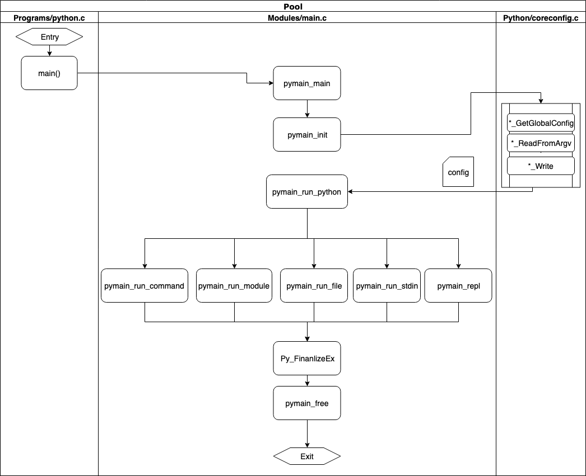
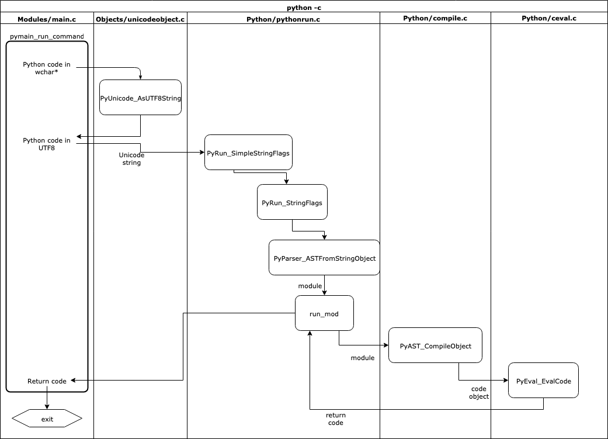

<div align=center>
<h1>《You Guide to the CPython Source Code》笔记</h1>
</div>

## 第0部分 导言

### CPython 核心部分

* 基本对象
1. dict
2. long/int
3. unicode/str
4. list(timsort)
5. tuple
6. bytes
7. bytearray(buffer protocol)
8. float
9. func(user-defined method)
10. method(builtin method)
11. iter
12. gen(generator/coroutine/async generator)
13. class(bound method/classmethod/staticmethod)
14. complex
15. enum
16. type(mro/metaclass/类/实例的创建过程)
* 模块
1. io
* 库
1. re
* 解释器 (interpreter)
1. gil(全局解释器锁)
2. gc(垃圾回收机制)
3. memory management(内存管理机制)
4. descr(访问(类/实例)属性时发生了什么/__get__/__getattribute__/__getattr__)
5. exception(异常处理机制)
6. module(import实现机制)
7. frame
8. code
9. slots/__slots__(属性在类/实例创建时是如何初始化的)
10. thread(线程)
11. PyObject(基础篇/概述)
* 扩展
* 语法
1. token
2. paser
3. sym table
4. ast

CPython本身无法支持JIT编译(just-in-time compilation)使得纯python的执行速度不如Java和Javascript等语言。

### CPython 工程布局

* **Doc**-一些RST文档，RST与Python类似Javadoc与Java，如果下载了Python源码，里面有rst文件夹，可以转为html后用浏览器打开，具体为：安装python的sphinx模块：pip install sphinx
* **Grammer**-定义了语法Grammer和记号token的文件
* **Include**-所有c语言文件的头文件以及API接口
* **Lib**-Python所有的官方库
* **Mac**-Python on macOS
* **Misc**-Python 杂项
* **Modules**-Python的库和组件
* **Objects**-Python内部对象的实现
* **PC**-用于PC发行版的子目录
* **PCbuild**-用于PC Windows平台和MSVC的构建和编译
* **Parser**-解析器
* **Programs**-二进制可执行文件的源文件
* **Python**-主Python共享库的其他源文件
* **Tools**-用于构建Python的一些工具

### CPython 源代码布局

对于Python模块，典型的布局为：

* `Lib/<module>.py`
* `Modules/_<module>.c` （如果还有C加速器模块）
* `Lib/test/test_<module>.py`
* `Doc/library/<module>.rst`

对于仅扩展模块，典型布局为：

* `Modules/<module>module.c`
* `Lib/test/test_<module>.py`
* `Doc/library/<module>.rst`

对于内置类型，典型的布局为：

* `Objects/<builtin>object.c`
* `Lib/test/test_<builtin>.py`
* `Doc/library/stdtypes.rst`

对于内置函数，典型布局为：

* `Python/bltinmodule.c`
* `Lib/test/test_builtin.py`
* `Doc/library/functions.rst`

一些例外的类型：

* 内置类型`int`位于`Objects/longobject.c`
* 内置类型`str`位于`Objects/unicodeobject.c`
* 内置模块`sys`位于`Python/sysmodule.c`
* 内置模块`marshal`位于`Python/marshal.c`
* 仅Windows模块`winreg`位于`PC/winreg.c`

## 第1部分：CPython简介

python在控制台上键入或从python.org安装Python发行版时，就正在运行`CPython`。`CPython`是由不同开发人员团队维护和编写的众多Python运行时之一。还有一些其他运行时，例如`PyPy`，`Cython`和`Jython`。

CPython的独特之处在于它既包含一个运行时，又包含所有Python运行时使用的共享语言规范。CPython是Python的“官方”或参考实现。

Python语言规范是对Python语言的描述的文档。例如

* assert是一个保留关键字
* []用于索引，切片和创建空列表。
* def关键字用于定义一个函数

Python发行版中包含的内容：

* 在命令行中输入python时(后不带任何*.py参数)，将显示一个交互式提示窗口，在窗口中可以键入python代码并立即显示代码运行结果(类似Matlab的命令行窗口)
* 包含了许许多多丰富的标准库，比如可以从标准库中导入内置模块json
* 可以使用从Internet安装软件包pip
* 可以使用内置unittest库来测试应用程序

### CPython源代码的组成

CPython源代码分发附带了一系列工具，库和组件。笔记专注于编译器部分。

要下载CPython源代码的副本，可以使用如下git指令。

```sh
$ git clone https://github.com/python/cpython
$ cd cpython
$ git checkout v3.8.0b4
```

新下载的cpython目录中，将找到以下子目录：

```
cpython/
│
├── Doc      ← Source for the documentation
├── Grammar  ← The computer-readable language definition
├── Include  ← The C header files
├── Lib      ← Standard library modules written in Python
├── Mac      ← macOS support files
├── Misc     ← Miscellaneous files
├── Modules  ← Standard Library Modules written in C
├── Objects  ← Core types and the object model
├── Parser   ← The Python parser source code
├── PC       ← Windows build support files
├── PCbuild  ← Windows build support files for older Windows versions
├── Programs ← Source code for the python executable and other binaries
├── Python   ← The CPython interpreter source code
└── Tools    ← Standalone tools useful for building or extending Python
```

### 编译CPython（macOS）

在macOS上编译CPython很简单。传递首先需要基本的C编译器工具包。命令行开发工具是一个应用程序，传递可以在macOS中通过App Store更新。传递需要在终端上执行初始安装。

要在macOS中打开终端，请转到启动板，然后单击“ 其他”，然后选择“ 终端”应用。传递将需要将此应用程序保存到Dock中，因此，右键单击Icon并选择Keep in Dock。

现在，在终端中，通过运行以下命令安装C编译器和工具包：

```sh
$ xcode-select --install
```

还需要OpenSSL的工作副本，以用于从PyPi.org网站获取软件包。如果以后计划使用此版本安装其他软件包，则需要SSL验证。

在macOS上安装OpenSSL的最简单方法是使用HomeBrew。如果已经安装了HomeBrew，则可以使用以下brew install命令安装CPython的依赖项：

```sh
$ brew install openssl xz zlib
```

构建将花费几分钟并生成一个名为的二进制文件python.exe。每次更改源代码时，都需要make使用相同的标志重新运行。该python.exe二进制文件是CPython的调试二进制文件。

### 编译CPython（Linux）

[参考](https://github.com/python/cpython)

### 编译CPython（Windows）

[参考](https://github.com/python/cpython)

### 编译器概述

编译器的目的是将一种语言转换为另一种语言。将编译器视为翻译器。

一些编译器将编译为低级机器代码，可以直接在系统上执行。其他编译器将编译为中间语言，由虚拟机执行。

编译器有两种类型：

* 自托管的编译器是用其编译语言编写的编译器，例如Go编译器。
* 源到源编译器是用另一种语言编写的已经具有编译器的编译器。

选择编译器时要做出的一个重要决定是系统可移植性要求。Java和.NET CLR将被编译成一种中间语言，从而使编译后的代码可跨多个系统体系结构移植。C，Go，C ++和Pascal将编译为一个低级可执行文件，该可执行文件仅在与其编译的系统相似的系统上工作。

因为Python应用程序通常作为源代码分发，所以Python运行时的作用是转换Python源代码并一步执行它。在内部，CPython运行时会编译传递的代码。一个普遍的误解是Python是一种解释语言。它实际上是编译的。

Python代码未编译为机器代码。它被编译成一种特殊的低级中间语言，称为字节码，只有CPython才能理解。此代码存储在.pyc隐藏目录中的文件中，并缓存以执行。如果传递在不更改源代码的情况下两次运行相同的Python应用程序，那么第二次运行总是会更快。这是因为它会加载已编译的字节码并直接执行。

CPython中的C是对C编程语言的引用，这意味着此Python发行版是用C语言编写的。CPython中的编译器是用纯C编写的。但是，许多标准库模块是用纯Python编写的，或者是C和Python的组合。

如果要从头开始编写新的编程语言，则需要一个可执行的应用程序来编译传递的编译器！传递需要一个编译器来执行任何事情，因此，在开发新语言时，通常首先会使用较老的，更成熟的语言编写它们。

一个很好的例子是Go编程语言。第一个Go编译器是用C编写的，然后可以对Go进行编译，然后用Go重写了该编译器。

CPython保留了C的传统：许多标准库模块（例如ssl模块或sockets模块）都是用C编写的，用于访问底层操作系统API。Windows和Linux内核中用于创建网络套接字，使用文件系统或与显示交互的API 都是用C编写的。Python的可扩展性层专注于C语言是有意义的。

有一个用Python编写的Python编译器叫做PyPy。PyPy的徽标是Ouroboros，代表了编译器的自托管性质。

Python交叉编译器的另一个示例是Jython。Jython用Java编写，并从Python源代码编译为Java字节码。与CPython可以轻松导入C库并从Python使用它们一样，Jython可以轻松导入和引用Java模块和类。

### Python语言规范

CPython源代码中包含Python语言的定义。这是所有Python解释器使用的参考规范。

该规范具有人类可读和机器可读的格式。文档中详细介绍了Python语言，允许的内容以及每个语句的行为方式。

位于里面Doc/reference的目录是reStructuredText的每一个用Python语言特征的解释。这形成了docs.python.org上的Python官方参考指南。

```
cpython/Doc/reference
|
├── compound_stmts.rst
├── datamodel.rst
├── executionmodel.rst
├── expressions.rst
├── grammar.rst
├── import.rst
├── index.rst
├── introduction.rst
├── lexical_analysis.rst
├── simple_stmts.rst
└── toplevel_components.rst
```

在compound_stmts.rst复合语句的文档内部，可以看到定义`with`语句的简单示例。

该with语句可以在Python中以多种方式使用，最简单的方法是实例化上下文管理器和嵌套的代码块：

```py
with x():
   ...
```

可以使用as关键字将结果分配给变量：

```py
with x() as y:
   ...
```

还可以使用逗号将上下文管理器链接在一起：

```py
with x() as y, z() as jk:
   ...
```

### Python 语法

该文档包含该语言的人类可读规范，并且机器可读规范包含在一个文件中Grammar/Grammar。

语法文件以称为**Backus-Naur Form（BNF）**的上下文标记编写。
BNF并非特定于Python，在许多其他语言中通常用作语法的表示法。

Python的语法文件使用具有正则表达式语法的**Extended-BNF（EBNF）规范**。因此，可以在语法文件中使用：

* `*` 重复
* `+` 至少一次重复
* `[]` 用于可选
* `|` 替代
* `()` 用于分组

比如with语句的定义：

```
with_stmt: 'with' with_item (',' with_item)*  ':' suite
with_item: test ['as' expr]
```

引号中的任何内容都是字符串文字，这是定义关键字的方式。因此with_stmt指定为：

* 以单词开头 with
* 后跟一个with_item，它是test和（可选），单词as和一个表达式
* 跟随一个或多个项目，每个项目之间用逗号分隔
* 以a结尾 :
* 其次是 suite

在这两行中引用了一些其他定义：

* **suite** 指的是具有一个或多个语句的代码块
* **test** 指被评估的简单陈述
* **expr** 指一个简单的表达

如果要详细研究这些内容，则整个Python语法都在此文件中定义。

#### Python记号

```bnf
ENDMARKER
NAME
NUMBER
STRING
NEWLINE
INDENT
DEDENT

LPAR                    '('
RPAR                    ')'
LSQB                    '['
RSQB                    ']'
COLON                   ':'
COMMA                   ','
SEMI                    ';'
PLUS                    '+'
MINUS                   '-'
STAR                    '*'
SLASH                   '/'
VBAR                    '|'
AMPER                   '&'
LESS                    '<'
GREATER                 '>'
EQUAL                   '='
DOT                     '.'
PERCENT                 '%'
LBRACE                  '{'
RBRACE                  '}'
EQEQUAL                 '=='
NOTEQUAL                '!='
LESSEQUAL               '<='
GREATEREQUAL            '>='
TILDE                   '~'
CIRCUMFLEX              '^'
LEFTSHIFT               '<<'
RIGHTSHIFT              '>>'
DOUBLESTAR              '**'
PLUSEQUAL               '+='
MINEQUAL                '-='
STAREQUAL               '*='
SLASHEQUAL              '/='
PERCENTEQUAL            '%='
AMPEREQUAL              '&='
VBAREQUAL               '|='
CIRCUMFLEXEQUAL         '^='
LEFTSHIFTEQUAL          '<<='
RIGHTSHIFTEQUAL         '>>='
DOUBLESTAREQUAL         '**='
DOUBLESLASH             '//'
DOUBLESLASHEQUAL        '//='
AT                      '@'
ATEQUAL                 '@='
RARROW                  '->'
ELLIPSIS                '...'
COLONEQUAL              ':='

OP
AWAIT
ASYNC
TYPE_IGNORE
TYPE_COMMENT
ERRORTOKEN

# These aren't used by the C tokenizer but are needed for tokenize.py
COMMENT
NL
ENCODING
```

#### Python文法

```bnf
# Grammar for Python

# NOTE WELL: You should also follow all the steps listed at
# https://devguide.python.org/grammar/

# Start symbols for the grammar:
#       single_input is a single interactive statement;
#       file_input is a module or sequence of commands read from an input file;
#       eval_input is the input for the eval() functions.
#       func_type_input is a PEP 484 Python 2 function type comment
# NB: compound_stmt in single_input is followed by extra NEWLINE!
# NB: due to the way TYPE_COMMENT is tokenized it will always be followed by a NEWLINE
single_input: NEWLINE | simple_stmt | compound_stmt NEWLINE
file_input: (NEWLINE | stmt)* ENDMARKER
eval_input: testlist NEWLINE* ENDMARKER

decorator: '@' namedexpr_test NEWLINE
decorators: decorator+
decorated: decorators (classdef | funcdef | async_funcdef)

async_funcdef: ASYNC funcdef
funcdef: 'def' NAME parameters ['->' test] ':' [TYPE_COMMENT] func_body_suite

parameters: '(' [typedargslist] ')'

# The following definition for typedarglist is equivalent to this set of rules:
#
#     arguments = argument (',' [TYPE_COMMENT] argument)*
#     argument = tfpdef ['=' test]
#     kwargs = '**' tfpdef [','] [TYPE_COMMENT]
#     args = '*' [tfpdef]
#     kwonly_kwargs = (',' [TYPE_COMMENT] argument)* (TYPE_COMMENT | [',' [TYPE_COMMENT] [kwargs]])
#     args_kwonly_kwargs = args kwonly_kwargs | kwargs
#     poskeyword_args_kwonly_kwargs = arguments ( TYPE_COMMENT | [',' [TYPE_COMMENT] [args_kwonly_kwargs]])
#     typedargslist_no_posonly  = poskeyword_args_kwonly_kwargs | args_kwonly_kwargs
#     typedarglist = (arguments ',' [TYPE_COMMENT] '/' [',' [[TYPE_COMMENT] typedargslist_no_posonly]])|(typedargslist_no_posonly)"
#
# It needs to be fully expanded to allow our LL(1) parser to work on it.

typedargslist: (
  (tfpdef ['=' test] (',' [TYPE_COMMENT] tfpdef ['=' test])* ',' [TYPE_COMMENT] '/' [',' [ [TYPE_COMMENT] tfpdef ['=' test] (
        ',' [TYPE_COMMENT] tfpdef ['=' test])* (TYPE_COMMENT | [',' [TYPE_COMMENT] [
        '*' [tfpdef] (',' [TYPE_COMMENT] tfpdef ['=' test])* (TYPE_COMMENT | [',' [TYPE_COMMENT] ['**' tfpdef [','] [TYPE_COMMENT]]])
      | '**' tfpdef [','] [TYPE_COMMENT]]])
  | '*' [tfpdef] (',' [TYPE_COMMENT] tfpdef ['=' test])* (TYPE_COMMENT | [',' [TYPE_COMMENT] ['**' tfpdef [','] [TYPE_COMMENT]]])
  | '**' tfpdef [','] [TYPE_COMMENT]]] )
|  (tfpdef ['=' test] (',' [TYPE_COMMENT] tfpdef ['=' test])* (TYPE_COMMENT | [',' [TYPE_COMMENT] [
   '*' [tfpdef] (',' [TYPE_COMMENT] tfpdef ['=' test])* (TYPE_COMMENT | [',' [TYPE_COMMENT] ['**' tfpdef [','] [TYPE_COMMENT]]])
  | '**' tfpdef [','] [TYPE_COMMENT]]])
  | '*' [tfpdef] (',' [TYPE_COMMENT] tfpdef ['=' test])* (TYPE_COMMENT | [',' [TYPE_COMMENT] ['**' tfpdef [','] [TYPE_COMMENT]]])
  | '**' tfpdef [','] [TYPE_COMMENT])
)
tfpdef: NAME [':' test]

# The following definition for varargslist is equivalent to this set of rules:
#
#     arguments = argument (',' argument )*
#     argument = vfpdef ['=' test]
#     kwargs = '**' vfpdef [',']
#     args = '*' [vfpdef]
#     kwonly_kwargs = (',' argument )* [',' [kwargs]]
#     args_kwonly_kwargs = args kwonly_kwargs | kwargs
#     poskeyword_args_kwonly_kwargs = arguments [',' [args_kwonly_kwargs]]
#     vararglist_no_posonly = poskeyword_args_kwonly_kwargs | args_kwonly_kwargs
#     varargslist = arguments ',' '/' [','[(vararglist_no_posonly)]] | (vararglist_no_posonly)
#
# It needs to be fully expanded to allow our LL(1) parser to work on it.

varargslist: vfpdef ['=' test ](',' vfpdef ['=' test])* ',' '/' [',' [ (vfpdef ['=' test] (',' vfpdef ['=' test])* [',' [
        '*' [vfpdef] (',' vfpdef ['=' test])* [',' ['**' vfpdef [',']]]
      | '**' vfpdef [',']]]
  | '*' [vfpdef] (',' vfpdef ['=' test])* [',' ['**' vfpdef [',']]]
  | '**' vfpdef [',']) ]] | (vfpdef ['=' test] (',' vfpdef ['=' test])* [',' [
        '*' [vfpdef] (',' vfpdef ['=' test])* [',' ['**' vfpdef [',']]]
      | '**' vfpdef [',']]]
  | '*' [vfpdef] (',' vfpdef ['=' test])* [',' ['**' vfpdef [',']]]
  | '**' vfpdef [',']
)
vfpdef: NAME

stmt: simple_stmt | compound_stmt
simple_stmt: small_stmt (';' small_stmt)* [';'] NEWLINE
small_stmt: (expr_stmt | del_stmt | pass_stmt | flow_stmt |
             import_stmt | global_stmt | nonlocal_stmt | assert_stmt)
expr_stmt: testlist_star_expr (annassign | augassign (yield_expr|testlist) |
                     [('=' (yield_expr|testlist_star_expr))+ [TYPE_COMMENT]] )
annassign: ':' test ['=' (yield_expr|testlist_star_expr)]
testlist_star_expr: (test|star_expr) (',' (test|star_expr))* [',']
augassign: ('+=' | '-=' | '*=' | '@=' | '/=' | '%=' | '&=' | '|=' | '^=' |
            '<<=' | '>>=' | '**=' | '//=')
# For normal and annotated assignments, additional restrictions enforced by the interpreter
del_stmt: 'del' exprlist
pass_stmt: 'pass'
flow_stmt: break_stmt | continue_stmt | return_stmt | raise_stmt | yield_stmt
break_stmt: 'break'
continue_stmt: 'continue'
return_stmt: 'return' [testlist_star_expr]
yield_stmt: yield_expr
raise_stmt: 'raise' [test ['from' test]]
import_stmt: import_name | import_from
import_name: 'import' dotted_as_names
# note below: the ('.' | '...') is necessary because '...' is tokenized as ELLIPSIS
import_from: ('from' (('.' | '...')* dotted_name | ('.' | '...')+)
              'import' ('*' | '(' import_as_names ')' | import_as_names))
import_as_name: NAME ['as' NAME]
dotted_as_name: dotted_name ['as' NAME]
import_as_names: import_as_name (',' import_as_name)* [',']
dotted_as_names: dotted_as_name (',' dotted_as_name)*
dotted_name: NAME ('.' NAME)*
global_stmt: 'global' NAME (',' NAME)*
nonlocal_stmt: 'nonlocal' NAME (',' NAME)*
assert_stmt: 'assert' test [',' test]

compound_stmt: if_stmt | while_stmt | for_stmt | try_stmt | with_stmt | funcdef | classdef | decorated | async_stmt
async_stmt: ASYNC (funcdef | with_stmt | for_stmt)
if_stmt: 'if' namedexpr_test ':' suite ('elif' namedexpr_test ':' suite)* ['else' ':' suite]
while_stmt: 'while' namedexpr_test ':' suite ['else' ':' suite]
for_stmt: 'for' exprlist 'in' testlist ':' [TYPE_COMMENT] suite ['else' ':' suite]
try_stmt: ('try' ':' suite
           ((except_clause ':' suite)+
            ['else' ':' suite]
            ['finally' ':' suite] |
           'finally' ':' suite))
with_stmt: 'with' with_item (',' with_item)*  ':' [TYPE_COMMENT] suite
with_item: test ['as' expr]
# NB compile.c makes sure that the default except clause is last
except_clause: 'except' [test ['as' NAME]]
suite: simple_stmt | NEWLINE INDENT stmt+ DEDENT

namedexpr_test: test [':=' test]
test: or_test ['if' or_test 'else' test] | lambdef
test_nocond: or_test | lambdef_nocond
lambdef: 'lambda' [varargslist] ':' test
lambdef_nocond: 'lambda' [varargslist] ':' test_nocond
or_test: and_test ('or' and_test)*
and_test: not_test ('and' not_test)*
not_test: 'not' not_test | comparison
comparison: expr (comp_op expr)*
# <> isn't actually a valid comparison operator in Python. It's here for the
# sake of a __future__ import described in PEP 401 (which really works :-)
comp_op: '<'|'>'|'=='|'>='|'<='|'<>'|'!='|'in'|'not' 'in'|'is'|'is' 'not'
star_expr: '*' expr
expr: xor_expr ('|' xor_expr)*
xor_expr: and_expr ('^' and_expr)*
and_expr: shift_expr ('&' shift_expr)*
shift_expr: arith_expr (('<<'|'>>') arith_expr)*
arith_expr: term (('+'|'-') term)*
term: factor (('*'|'@'|'/'|'%'|'//') factor)*
factor: ('+'|'-'|'~') factor | power
power: atom_expr ['**' factor]
atom_expr: [AWAIT] atom trailer*
atom: ('(' [yield_expr|testlist_comp] ')' |
       '[' [testlist_comp] ']' |
       '{' [dictorsetmaker] '}' |
       NAME | NUMBER | STRING+ | '...' | 'None' | 'True' | 'False')
testlist_comp: (namedexpr_test|star_expr) ( comp_for | (',' (namedexpr_test|star_expr))* [','] )
trailer: '(' [arglist] ')' | '[' subscriptlist ']' | '.' NAME
subscriptlist: subscript (',' subscript)* [',']
subscript: test | [test] ':' [test] [sliceop]
sliceop: ':' [test]
exprlist: (expr|star_expr) (',' (expr|star_expr))* [',']
testlist: test (',' test)* [',']
dictorsetmaker: ( ((test ':' test | '**' expr)
                   (comp_for | (',' (test ':' test | '**' expr))* [','])) |
                  ((test | star_expr)
                   (comp_for | (',' (test | star_expr))* [','])) )

classdef: 'class' NAME ['(' [arglist] ')'] ':' suite

arglist: argument (',' argument)*  [',']

# The reason that keywords are test nodes instead of NAME is that using NAME
# results in an ambiguity. ast.c makes sure it's a NAME.
# "test '=' test" is really "keyword '=' test", but we have no such token.
# These need to be in a single rule to avoid grammar that is ambiguous
# to our LL(1) parser. Even though 'test' includes '*expr' in star_expr,
# we explicitly match '*' here, too, to give it proper precedence.
# Illegal combinations and orderings are blocked in ast.c:
# multiple (test comp_for) arguments are blocked; keyword unpackings
# that precede iterable unpackings are blocked; etc.
argument: ( test [comp_for] |
            test ':=' test |
            test '=' test |
            '**' test |
            '*' test )

comp_iter: comp_for | comp_if
sync_comp_for: 'for' exprlist 'in' or_test [comp_iter]
comp_for: [ASYNC] sync_comp_for
comp_if: 'if' test_nocond [comp_iter]

# not used in grammar, but may appear in "node" passed from Parser to Compiler
encoding_decl: NAME

yield_expr: 'yield' [yield_arg]
yield_arg: 'from' test | testlist_star_expr

# the TYPE_COMMENT in suites is only parsed for funcdefs,
# but can't go elsewhere due to ambiguity
func_body_suite: simple_stmt | NEWLINE [TYPE_COMMENT NEWLINE] INDENT stmt+ DEDENT

func_type_input: func_type NEWLINE* ENDMARKER
func_type: '(' [typelist] ')' '->' test
# typelist is a modified typedargslist (see above)
typelist: (test (',' test)* [','
       ['*' [test] (',' test)* [',' '**' test] | '**' test]]
     |  '*' [test] (',' test)* [',' '**' test] | '**' test)
```

#### 使用 pgen

语法文件本身从未被Python编译器使用。而是pgen使用由工具创建的解析器表。pgen读取语法文件并将其转换为解析器表。如果更改了语法文件，则必须重新生成解析器表并重新编译Python。

*注意：该pgen应用程序已在Python 3.8中从C重写为纯Python。*

要查看pgen实际效果，可以更改Python语法的一部分。在第51行附近，将看到一个pass语句的定义：

```
pass_stmt: 'pass'
```

更改该行以接受关键字'pass'或'proceed'作为关键字：

```
pass_stmt: 'pass' | 'proceed'
```

现在需要重建语法文件。在macOS和Linux上，运行make regen-grammar以运行pgen更改后的语法文件。

应该看到类似于以下的输出，显示新文件Include/graminit.h和Python/graminit.c文件已生成：

```
# using Tools/scripts/generate_token.py
...
python3 ./Tools/scripts/update_file.py ./Include/graminit.h ./Include/graminit.h.new
python3 ./Tools/scripts/update_file.py ./Python/graminit.c ./Python/graminit.c.new
```

*注意： pgen通过将EBNF语句转换为非确定性有限自动机（NFA）进行工作，然后将其转换为确定性有限自动机（DFA）。解析器将DFA用作CPython特有的特殊方式来解析表。*

使用重新生成的解析器表，需要重新编译CPython才能查看新语法。

如果代码编译成功，则可以执行新的CPython二进制文件并启动REPL。

在REPL中，现在可以尝试定义一个函数，而不是使用该pass语句，而应使用proceed编译成Python语法的关键字Alternative：

```sh
Python 3.8.0b4 (tags/v3.8.0b4:d93605de72, Aug 30 2019, 10:00:03) 
[Clang 10.0.1 (clang-1001.0.46.4)] on darwin
Type "help", "copyright", "credits" or "license" for more information.
>>> def example():
...    proceed
... 
>>> example()
```

#### Python Tokens 词素

文件Grammar夹中的语法文件旁边是一个Tokens文件，其中包含在解析树中作为叶节点发现的每个唯一类型。

*注意：该Tokens文件是Python 3.8的新功能。*

部分Tokens如下

```
LPAR                    '('
RPAR                    ')'
LSQB                    '['
RSQB                    ']'
COLON                   ':'
COMMA                   ','
SEMI                    ';'
```

与Grammar文件一样，如果更改Tokens文件，则需要pgen再次运行。

将按行和字符查看词素列表。使用该-e标志输出确切的词素名称：

```sh
$ ./python.exe -m tokenize -e test_tokens.py

0,0-0,0:            ENCODING       'utf-8'        
1,0-1,14:           COMMENT        '# Hello world!'
1,14-1,15:          NL             '\n'           
2,0-2,3:            NAME           'def'          
2,4-2,15:           NAME           'my_function'  
2,15-2,16:          LPAR           '('            
2,16-2,17:          RPAR           ')'            
2,17-2,18:          COLON          ':'            
2,18-2,19:          NEWLINE        '\n'           
3,0-3,3:            INDENT         '   '          
3,3-3,7:            NAME           'proceed'         
3,7-3,8:            NEWLINE        '\n'           
4,0-4,0:            DEDENT         ''             
4,0-4,0:            ENDMARKER      ''    
```

在输出中，tokenize模块隐含了一些不在文件中的词法。的ENCODING词法utf-8，末尾为空行，DEDENT用于关闭函数声明，并提供ENDMARKER来结束文件。最佳做法是在Python源文件的末尾添加一个空行。

该tokenize模块是用纯Python编写的，位于Lib/tokenize.pyCPython源代码中。

CPython源代码中有两个标记器：一个是用Python编写的，在此进行了演示，另一个是用C编写的。用Python编写的标记器是一个实用程序，一个用C编写的标记器供Python编译器使用。它们具有相同的输出和行为。用C语言编写的版本旨在提高性能，而使用Python编写的模块则用于调试。

要查看C标记器的详细读数，可以使用带-d标志的Python运行。使用test_tokens.py先前创建的脚本，使用以下命令运行它：

```sh
$ ./python.exe -d test_tokens.py

Token NAME/'def' ... It's a keyword
 DFA 'file_input', state 0: Push 'stmt'
 DFA 'stmt', state 0: Push 'compound_stmt'
 DFA 'compound_stmt', state 0: Push 'funcdef'
 DFA 'funcdef', state 0: Shift.
Token NAME/'my_function' ... It's a token we know
 DFA 'funcdef', state 1: Shift.
Token LPAR/'(' ... It's a token we know
 DFA 'funcdef', state 2: Push 'parameters'
 DFA 'parameters', state 0: Shift.
Token RPAR/')' ... It's a token we know
 DFA 'parameters', state 1: Shift.
  DFA 'parameters', state 2: Direct pop.
Token COLON/':' ... It's a token we know
 DFA 'funcdef', state 3: Shift.
Token NEWLINE/'' ... It's a token we know
 DFA 'funcdef', state 5: [switch func_body_suite to suite] Push 'suite'
 DFA 'suite', state 0: Shift.
Token INDENT/'' ... It's a token we know
 DFA 'suite', state 1: Shift.
Token NAME/'proceed' ... It's a keyword
 DFA 'suite', state 3: Push 'stmt'
...
  ACCEPT.
```

在输出中，传递可以看到它突出显示proceed为关键字。在下一章中，将看到如何执行Python二进制代码到达词素生成器，以及从那里执行代码的过程。

### CPython中的内存管理

对一个**PyArena对象**的引用。是CPython的内存管理结构之一。该代码在其中，Python/pyarena.c并包含C语言的内存分配和释放函数的包装。

在传统编写的C程序中，开发人员应在写入数据之前为数据结构分配内存。此分配将内存标记为属于操作系统进程。

当不再使用已分配的内存时，还应由开发人员决定释放或“释放”已分配的内存，并将其返回到操作系统的可用内存块表中。如果某个进程在某个函数或循环中为某个变量分配内存，则当该函数完成时，该内存不会自动以C的形式分配给操作系统。因此，如果尚未在C代码中明确分配该内存，它会导致内存泄漏。每次该函数运行时，该过程将继续占用更多内存，直到最终，系统内存不足并崩溃！

Python使用两种算法管理内存：**引用计数器**和**垃圾收集器**。

每当实例化解释器时，都会创建一个PyArena，并将其附加到解释器中的字段之一。在CPython解释器的生命周期中，可以分配许多领域。它们与链表相连。将指向Python对象的指针列表存储为PyListObject。每当创建新的Python对象时，都会使用添加指向它的指针PyArena_AddPyObject()。此函数调用将指针存储在列表中a_objects。

*即使Python没有指针，也有一些有趣的技术可以模拟指针的行为。*

`PyArena`具有第二个功能，即分配和引用原始存储块列表。例如，`PyList`如果添加了数千个其他值，则将需要额外的内存。`PyList`对象的C代码不直接分配内存。对象可以通过`PyArena_Malloc()`从调用`PyObject`所需的内存大小来从中获取原始内存块。此任务由中的另一个抽象完成`Objects/obmalloc.c`。在对象分配模块中，可以为Python对象分配，释放和重新分配内存。

分配的块的链接列表存储在内部，因此当解释器停止运行时，可以使用一次性释放分配所有托管的存储块`PyArena_Free()`。

以`PyListObject`举例。如果要将`.append()`对象放在Python列表的末尾，则无需事先重新分配现有列表中使用的内存。该`.append()`方法调用`list_resize()`处理列表的内存分配。每个列表对象都保留分配的内存量的列表。如果要追加的项适合现有的可用内存，则只需添加即可。如果列表需要更多的内存空间，则会对其进行扩展。列表的长度扩展为0、4、8、16、25、35、46、58、72、88。

`PyMem_Realloc()`调用以扩展列表中分配的内存。`PyMem_Realloc()`是的API包装器`pymalloc_realloc()`。

Python还为C调用提供了一个特殊的包装器，该包装器malloc()设置了内存分配的最大大小，以帮助防止缓冲区溢出错误`PyMem_RawMalloc()`。

综上所述：

* 原始内存块的分配是通过进行的`PyMem_RawAlloc()`。
* 指向Python对象的指针存储在中`PyArena`。
* `PyArena` 还存储分配的内存块的链接列表。

#### 引用计数

要在Python中创建变量，必须将值分配给唯一命名的变量：

```py
my_variable = 180392
```

每当在Python中为变量分配值时，都会在`locals`和`globals`范围内检查变量的名称，以查看其是否已存在。

由于或词典中my_variable尚未包含该对象，因此将创建此新对象，并将该值分配为数字常量。`locals()globals()180392`

现在有个的引用my_variable，因此的引用计数器my_variable增加1。

在CPython的整个C源代码中，调用`Py_INCREF()`以及`Py_DECREF()`函数增加或减少对该对象的引用计数。

当变量超出声明范围时，对对象的引用将减少。Python中的作用域可以指代函数或方法，括号域或lambda函数。这些是一些更实际的作用域，但是还有许多其他隐式作用域，例如将变量传递给函数调用。

基于该语言的递增和递减引用的处理内置于CPython编译器和核心执行循环中`ceval.c`。每当调用`Py_DECREF()`函数且计数器变为0时，都会调用`PyObject_Free()`函数。对于该对象的`PyArena_Free()`，释放其分配所有内存。

#### 垃圾回收

完成处理后，将其丢弃并扔进垃圾桶。但是，这些垃圾不会立即被收集。需要等待垃圾车来回收。

CPython使用垃圾收集算法具有相同的原理。默认情况下，CPython的垃圾收集器是启用的，它在后台运行，并且可以重新分配用于不再使用的对象的内存。因为垃圾回收算法比引用计数器复杂得多，所以它不会一直运行，否则会消耗大量CPU资源。经过一定次数的操作后，它才会定期运行。

CPython的标准库带有一个Python模块

```py
>>> import gc
>>> gc.set_debug(gc.DEBUG_STATS)
```

每当运行垃圾收集器时，将会打印统计信息。可以通过调用`get_threshold()`获取运行垃圾收集器的阈值：

```py
>>> gc.get_threshold()
(700, 10, 10)
```

还可以获取当前的阈值计数：

```py
>>> gc.get_count()
(688, 1, 1)
```

最后，还可以手动运行收集算法。`collect()`实现在Modules/gcmodule.c包含垃圾回收器算法的文件内部调用。

```py
>>> gc.collect()
24
```

### 第1部分 小结

在第1部分中，介绍了源代码存储库的结构，如何从源代码进行编译以及Python语言规范。当传递入研究Python解释器过程时，这些核心概念对于第二部分至关重要。

## 第2部分：Python解释程序

python可以通过五种方式调用二进制文件：

* 与-c和python命令一起运行单个命令
* 使用-m和模块名称启动模块
* 使用文件名运行文件
* stdin使用外壳管道运行输入
* 要启动REPL并一次执行一个命令

需要检查以查看此过程的三个源文件：

* Programs/python.c 是一个简单的入口点。
* Modules/main.c 包含用于汇总整个过程，加载配置，执行代码和清理内存的代码。
* Python/initconfig.c 从系统环境中加载配置，并将其与任何命令行标志合并。

下图显示了这些函数中的每一个的调用方式：

<div align=center>

</div>

CPython源代码样式：

* 对于公共功能，请使用前缀Py，对于静态功能，请不要使用前缀。该Py_前缀保留给诸如之类的全局服务例程使用Py_FatalError。特定的例程组（例如特定的对象类型API）使用更长的前缀，例如PyString_用于字符串函数。
* 公共函数和变量使用混合词用下划线，如：PyObject_GetAttr，Py_BuildValue，PyExc_TypeError。
* 有时，加载程序必须看到“内部”功能。为此使用前缀`_Py`，例如_PyObject_Dump。
* 宏应该有一个混合词的前缀，然后用大写，例如PyString_AS_STRING，Py_PRINT_RAW。

### CPython 建立运行时配置

可以看到在执行任何Python代码之前，运行时首先会建立配置。运行时的配置是在Include/cpython/initconfig.hnamed中定义的数据结构PyConfig。配置数据结构包括以下内容：

* 各种模式的运行时标志，例如调试和优化模式
* 提供了执行模式，例如是否传递文件名stdin或模块名称
* 扩展选项，由 `-X <option>`
* 运行时设置的环境变量

配置数据主要由CPython运行时用来启用和禁用各种功能。

Python还带有几个命令行界面选项。在Python中，可以启用带有`-v`标志的详细模式。在详细模式下，Python将在模块加载时将消息打印到屏幕上：

```sh
$ ./python.exe -v -c "print('hello world')"
# installing zipimport hook
import zipimport # builtin
# installed zipimport hook
...
```

可以在`Include/cpython/initconfig.h`中看到配置`PyConfig`的定义：

```cpp
/* --- PyConfig ---------------------------------------------- */

typedef struct {
    int _config_version;  /* Internal configuration version,
                             used for ABI compatibility */
    int _config_init;     /* _PyConfigInitEnum value */

    ...

    /* If greater than 0, enable the verbose mode: print a message each time a
       module is initialized, showing the place (filename or built-in module)
       from which it is loaded.

       If greater or equal to 2, print a message for each file that is checked
       for when searching for a module. Also provides information on module
       cleanup at exit.

       Incremented by the -v option. Set by the PYTHONVERBOSE environment
       variable. If set to -1 (default), inherit Py_VerboseFlag value. */
    int verbose;
```

在`Python/initconfig.c`中，建立了从环境变量和运行时命令行标志读取设置的逻辑。

在`config_read_env_vars`函数中，读取环境变量并将其用于分配配置设置的值：

```cpp
static PyStatus
config_read_env_vars(PyConfig *config)
{
    PyStatus status;
    int use_env = config->use_environment;

    /* Get environment variables */
    _Py_get_env_flag(use_env, &config->parser_debug, "PYTHONDEBUG");
    _Py_get_env_flag(use_env, &config->verbose, "PYTHONVERBOSE");
    _Py_get_env_flag(use_env, &config->optimization_level, "PYTHONOPTIMIZE");
    _Py_get_env_flag(use_env, &config->inspect, "PYTHONINSPECT");
```

对于详细设置，可以看到使用的值PYTHONVERBOSE来设置的值（&config->verbose如果PYTHONVERBOSE找到）。如果环境变量不存在，-1则将保留默认值。

然后在`config_parse_cmdline`内再次调用`initconfig.c`，命令行标志用于设置的值，如果提供的话：

```cpp
config_parse_cmdline(PyConfig *config, PyWideStringList *warnoptions,
                     Py_ssize_t *opt_index)
{
...

        switch (c) {
...

        case 'v':
            config->verbose++;
            break;
...
        /* This space reserved for other options */

        default:
            /* unknown argument: parsing failed */
            config_usage(1, program);
            return _PyStatus_EXIT(2);
        }
    } while (1);
```

`Py_VerboseFlag`值随后会通过`_Py_GetGlobalVariablesAsDict`函数复制到全局变量。

在Python会话中，可以使用`sys.flags`命名的元组访问运行时标志，例如**详细模式**，**安静模式**。这些`-X`标志在`sys._xoptions`字典中都可用：

```py
$ ./python.exe -X dev -q       

>>> import sys
>>> sys.flags
sys.flags(debug=0, inspect=0, interactive=0, optimize=0, dont_write_bytecode=0, 
 no_user_site=0, no_site=0, ignore_environment=0, verbose=0, bytes_warning=0, 
 quiet=1, hash_randomization=1, isolated=0, dev_mode=True, utf8_mode=0)

>>> sys._xoptions
{'dev': True}
```

除了中的运行时配置`initconfig.h`外，还有构建配置，该配置位于`pyconfig.h`根文件夹的内部。该文件是`configure`在构建过程中的步骤中动态创建的，或者是由Visual Studio for Windows系统创建的。

可以通过运行以下命令查看构建配置:

```sh
$ ./python.exe -m sysconfig
```

#### 读取文件/输入

一旦CPython具有运行时配置和命令行参数，它就可以确定需要执行的内容。

此任务由`pymain_main`内部的函数处理`Modules/main.c`。根据新创建的config实例，CPython现在将执行通过多个选项提供的代码。

* 通过输入 `-c`。最简单的方法是为CPython提供带-c选项的命令和引号内的Python程序。

<div align=center>

</div>

首先，该`pymain_run_command()`函数在内部使用C类型的`Modules/main.c`传入-c参数作为参数来执行`wchar_t*`。该`wchar_t*`类型通常用作跨CPython的Unicode数据的低级存储类型，因为该类型的大小可以存储UTF8字符。

将转换`wchar_t*`为Python字符串时，该`Objects/unicodeobject.c`文件具有一个辅助函数`PyUnicode_FromWideChar()`，该函数返回PyObject类型为的str。然后，通过`PyUnicode_AsUTF8String()`在`Python str`对象上完成对UTF8的编码，将其转换为`Python bytes`对象。

完成此操作后，`pymain_run_command()`将Python字节对象传递`PyRun_SimpleStringFlags()`给执行，但首先将再次转换bytes为str类型：

```cpp
static int
pymain_run_command(wchar_t *command, PyCompilerFlags *cf)
{
    PyObject *unicode, *bytes;
    int ret;

    unicode = PyUnicode_FromWideChar(command, -1);
    if (unicode == NULL) {
        goto error;
    }

    if (PySys_Audit("cpython.run_command", "O", unicode) < 0) {
        return pymain_exit_err_print();
    }

    bytes = PyUnicode_AsUTF8String(unicode);
    Py_DECREF(unicode);
    if (bytes == NULL) {
        goto error;
    }

    ret = PyRun_SimpleStringFlags(PyBytes_AsString(bytes), cf);
    Py_DECREF(bytes);
    return (ret != 0);

error:
    PySys_WriteStderr("Unable to decode the command from the command line:\n");
    return pymain_exit_err_print();
}
```

wchar_t*到Unicode，字节和字符串的转换大致等效于以下内容：

```py
unicode = str(command)
bytes_ = bytes(unicode.encode('utf8'))
# call PyRun_SimpleStringFlags with bytes_
```

该`PyRun_SimpleStringFlags()`函数是`Python/pythonrun.c`的一部分。目的是将这个简单的命令转换成Python模块，然后将其传递执行。由于需要将Python模块__main__作为独立模块执行，因此它会自动创建该模块：

```cpp
int
PyRun_SimpleStringFlags(const char *command, PyCompilerFlags *flags)
{
    PyObject *m, *d, *v;
    m = PyImport_AddModule("__main__");
    if (m == NULL)
        return -1;
    d = PyModule_GetDict(m);
    v = PyRun_StringFlags(command, Py_file_input, d, d, flags);
    if (v == NULL) {
        PyErr_Print();
        return -1;
    }
    Py_DECREF(v);
    return 0;
}
```

一旦`PyRun_SimpleStringFlags()`创建了一个模块和一个字典，它调用`PyRun_StringFlags()`，它创建了一个假的文件名，然后调用Python的解析器创建字符串的**抽象语法树AST**，并返回一个模块，mod：

```cpp
PyObject *
PyRun_StringFlags(const char *str, int start, PyObject *globals,
                  PyObject *locals, PyCompilerFlags *flags)
{
...
    mod = PyParser_ASTFromStringObject(str, filename, start, flags, arena);
    if (mod != NULL)
        ret = run_mod(mod, filename, globals, locals, flags, arena);
    PyArena_Free(arena);
    return ret;
```

#### 通过输入 -m

执行Python命令的另一种方法是使用-m带有模块名称的选项。一个典型的示例是`python -m unittest`在标准库中运行`unittest`模块。

最初在PEP 338中提出了能够以脚本的形式执行模块，然后在PEP366中定义了显式相对导入的标准。

使用该`-m`标志意味着在模块包中，想执行`inside`内的任何内容`__main__`。这也意味着要搜索`sys.path`命名模块。

这种搜索机制就是无需记住`unittest`模块在文件系统上存储位置的原因。

在`Modules/main.c`命令行中使用`-m`标志运行命令行时，内部会调用一个函数。模块的名称作为modname参数传递。

然后，CPython将导入一个标准库模块，并使用`runpy`来执行`PyObject_Call()`。导入是使用文件中`Python/import.c`的C API函数`PyImport_ImportModule()`完成的：

```cpp
static int
pymain_run_module(const wchar_t *modname, int set_argv0)
{
    PyObject *module, *runpy, *runmodule, *runargs, *result;
    runpy = PyImport_ImportModule("runpy");
 ...
    runmodule = PyObject_GetAttrString(runpy, "_run_module_as_main");
 ...
    module = PyUnicode_FromWideChar(modname, wcslen(modname));
 ...
    runargs = Py_BuildValue("(Oi)", module, set_argv0);
 ...
    result = PyObject_Call(runmodule, runargs, NULL);
 ...
    if (result == NULL) {
        return pymain_exit_err_print();
    }
    Py_DECREF(result);
    return 0;
}
```

在此函数中，还将看到其他2个C API函数：`PyObject_Call()`和`PyObject_GetAttrString()`。由于`PyImport_ImportModule()`返回的是核心对象类型`PyObject*`，因此需要调用特殊函数以获取属性并对其进行调用。

在Python中，如果传递有一个对象并想要获取属性，则可以调用getattr()。在C API中，此调用为`PyObject_GetAttrString()`，可在中找到`Objects/object.c`。如果要运行可调用对象，可以给它加上括号，也可以使用`__call__()`在任何Python对象上运行该属性。该`__call__()`方法在内部实现`Objects/object.c`：

```py
hi = "hi!"
hi.upper() == hi.upper.__call__()  # this is the same
```

该runpy模块使用纯Python编写，位于中Lib/runpy.py。

执行`python -m <module>`等同于运行`python -m runpy <module>`。所述`runpy模块`的建立是为了抽象定位和操作系统上执行的模块的过程。

runpy 做一些事情来运行目标模块：

* 调用__import__()提供的模块名称
* 将__name__（模块名称）设置为一个名为__main__
* 执行__main__名称空间中的模块

该runpy模块还支持执行目录和zip文件。

#### 通过文件名输入

如果的第一个参数python是文件名，例如`python test.py`，则CPython将打开一个文件句柄，类似于Python中的用法`open()`，并将该句柄传递给文件`Python/pythonrun.c`中的`PyRun_SimpleFileExFlags()`函数。

* 如果文件路径是`.pyc`文件，它将调用`run_pyc_file()`。
* 如果文件路径是脚本文件`（.py）`，它将运行`PyRun_FileExFlags()`。
* 如果文件路径是stdin由于用户运行而来，command | python则将其stdin视为文件句柄并运行PyRun_FileExFlags()。

```cpp
PyRun_SimpleFileExFlags(FILE *fp, const char *filename, int closeit,
                        PyCompilerFlags *flags)
{
 ...
    m = PyImport_AddModule("__main__");
 ...
    if (maybe_pyc_file(fp, filename, ext, closeit)) {
 ...
        v = run_pyc_file(pyc_fp, filename, d, d, flags);
    } else {
        /* When running from stdin, leave __main__.__loader__ alone */
        if (strcmp(filename, "<stdin>") != 0 &&
            set_main_loader(d, filename, "SourceFileLoader") < 0) {
            fprintf(stderr, "python: failed to set __main__.__loader__\n");
            ret = -1;
            goto done;
        }
        v = PyRun_FileExFlags(fp, filename, Py_file_input, d, d,
                              closeit, flags);
    }
 ...
    return ret;
}
```

#### 通过文件输入 `PyRun_FileExFlags()`

对于stdin和基本脚本文件，CPython会将文件句柄传递给位于`pythonrun.c`文件中的`PyRun_FileExFlags()`函数。

函数`PyRun_FileExFlags()`的目是类似于`PyRun_SimpleStringFlags()`用于`-c`输入。CPython会将文件句柄加载到`PyParser_ASTFromFileObject()`中。在下一部分中，将介绍解析器和AST模块。因为这是一个完整的脚本，所以不需要`PyImport_AddModule("__main__")`;使用`-c`如以下步骤：

```cpp
PyObject *
PyRun_FileExFlags(FILE *fp, const char *filename_str, int start, PyObject *globals,
                  PyObject *locals, int closeit, PyCompilerFlags *flags)
{
 ...
    mod = PyParser_ASTFromFileObject(fp, filename, NULL, start, 0, 0,
                                     flags, NULL, arena);
 ...
    ret = run_mod(mod, filename, globals, locals, flags, arena);
}
```

与函数`PyRun_SimpleStringFlags()`相同，一旦函数`PyRun_FileExFlags()`从文件创建了Python模块，它就会将其传递`run_mod()`执行。

文件`Python/pythonrun.c`中的`run_mod()`将模块传递到AST，以编译为代码对象。代码对象是一种用于存储字节码操作的格式以及`.pyc`文件中保留的格式：

```cpp
static PyObject *
run_mod(mod_ty mod, PyObject *filename, PyObject *globals, PyObject *locals,
            PyCompilerFlags *flags, PyArena *arena)
{
    PyCodeObject *co;
    PyObject *v;
    co = PyAST_CompileObject(mod, filename, flags, -1, arena);
    if (co == NULL)
        return NULL;

    if (PySys_Audit("exec", "O", co) < 0) {
        Py_DECREF(co);
        return NULL;
    }

    v = run_eval_code_obj(co, globals, locals);
    Py_DECREF(co);
    return v;
}
```

#### `通过编译后的字节码输入 run_pyc_file()`

在其中，`PyRun_SimpleFileExFlags()`有一个子句供用户提供文件的文件路径`.pyc`。如果文件路径以结尾`.pyc`，则将假定该`.pyc`文件包含写入磁盘的代码对象，而不是将文件作为纯文本文件加载并进行解析。

然后，内部函数`run_pyc_file()`使用文件句柄`Python/pythonrun.c`从`.pyc`文件中封送代码对象。**封送处理**是一个技术术语，用于将文件的内容复制到内存中并将其转换为特定的数据结构。磁盘上的代码对象数据结构是CPython编译器缓存已编译代码的方式，因此不需要在每次调用脚本时都对其进行解析：

```cpp
static PyObject *
run_pyc_file(FILE *fp, const char *filename, PyObject *globals,
             PyObject *locals, PyCompilerFlags *flags)
{
    PyCodeObject *co;
    PyObject *v;
  ...
    v = PyMarshal_ReadLastObjectFromFile(fp);
  ...
    if (v == NULL || !PyCode_Check(v)) {
        Py_XDECREF(v);
        PyErr_SetString(PyExc_RuntimeError,
                   "Bad code object in .pyc file");
        goto error;
    }
    fclose(fp);
    co = (PyCodeObject *)v;
    v = run_eval_code_obj(co, globals, locals);
    if (v && flags)
        flags->cf_flags |= (co->co_flags & PyCF_MASK);
    Py_DECREF(co);
    return v;
}
```

将代码对象编组到内存后，将其传递到`Python/ceval.c`中的函数`run_eval_code_obj()`以执行代码。

在阅读和执行Python文件的探索中，深入探讨了解析器(parser)和AST模块，并调用了`PyParser_ASTFromFileObject()`函数。`PyParser_ASTFromFileObject()`函数将采用文件句柄，编译器标志和`PyAren`a实例，然后使用`PyParser_ParseFileObject()`函数将文件对象转换为节点对象。

使用node对象，它将使用AST函数将其转换为模块`PyAST_FromNodeObject()`：

```cpp
mod_ty
PyParser_ASTFromFileObject(FILE *fp, PyObject *filename, const char* enc,
                           int start, const char *ps1,
                           const char *ps2, PyCompilerFlags *flags, int *errcode,
                           PyArena *arena)
{
    ...
    node *n = PyParser_ParseFileObject(fp, filename, enc,
                                       &_PyParser_Grammar,
                                       start, ps1, ps2, &err, &iflags);
    ...
    if (n) {
        flags->cf_flags |= iflags & PyCF_MASK;
        mod = PyAST_FromNodeObject(n, flags, filename, arena);
        PyNode_Free(n);
    ...
    return mod;
}
```

因为`PyParser_ParseFileObject`函数，接下来切换到`Parser/parsetok.c`中的parser-tokenizer阶段。此功能有两个重要任务：

* 使用`PyTokenizer_FromFile()`中的`Parser/tokenizer.c`实例化标记程序状态`tok_state`
* 具体的解析树的清单（node使用）使用`Parser/parsetok.c`中的`parsetok()`解析词素

```cpp
node *
PyParser_ParseFileObject(FILE *fp, PyObject *filename,
                         const char *enc, grammar *g, int start,
                         const char *ps1, const char *ps2,
                         perrdetail *err_ret, int *flags)
{
    struct tok_state *tok;
...
    if ((tok = PyTokenizer_FromFile(fp, enc, ps1, ps2)) == NULL) {
        err_ret->error = E_NOMEM;
        return NULL;
    }
...
    return parsetok(tok, g, start, err_ret, flags);
}
```

在`Parser/tokenizer.h`中定义的`tok_state`是用于存储词法生成器生成的所有临时数据的数据结构。作为`parsetok()`开发具体语法树所需的数据结构，它将返回词法器到解析器。

在函数`parsetok()`内部，使用`tok_state`结构并在循环中调用`tok_get()`，直到文件用尽且找不到更多`token`为止。

在`Parser/tokenizer.c`中定义的`tok_get()`行为类似于迭代器。它将持续返回解析树中的下一个标记。

`tok_get()`是整个CPython代码库中最复杂的函数之一。它有640种情况，包括数十年的传统，边沿案例，新的语言功能和语法。

一个简单的示例就是将换行符转换为`NEWLINE`词素的部分：

```cpp
static int
tok_get(struct tok_state *tok, char **p_start, char **p_end)
{
...
    /* Newline */
    if (c == '\n') {
        tok->atbol = 1;
        if (blankline || tok->level > 0) {
            goto nextline;
        }
        *p_start = tok->start;
        *p_end = tok->cur - 1; /* Leave '\n' out of the string */
        tok->cont_line = 0;
        if (tok->async_def) {
            /* We're somewhere inside an 'async def' function, and
               we've encountered a NEWLINE after its signature. */
            tok->async_def_nl = 1;
        }
        return NEWLINE;
    }
...
}
```

在这种情况下，`NEWLINE`是词素token，其值在文件`Include/token.h`中定义。所有标记都是常int量值，并且`Include/token.h`文件是运行`make regen-grammar`指令生成的。

函数`PyParser_ParseFileObject()`返回的`node`类型对于下一阶段至关重要，它将解析树（CST）转换为抽象语法树（AST）：

```cpp
typedef struct _node {
    short               n_type;
    char                *n_str;
    int                 n_lineno;
    int                 n_col_offset;
    int                 n_nchildren;
    struct _node        *n_child;
    int                 n_end_lineno;
    int                 n_end_col_offset;
} node;
```

由于CST是语法，词素ID和符号的树，因此编译器将很难基于Python语言做出快速决策。

这就是为什么下一步是将CST转换为AST（一种更高级别的结构）的原因。该任务由`Python/ast.c`具有C和Python API 的模块执行。
在跳到AST之前，有一种方法可以访问解析器阶段的输出。CPython具有一个标准的库模块parser，该模块使用Python API公开C函数。
该模块记录为CPython的实现细节，因此传递不会在其他Python解释器中看到它。同样，函数的输出也不是那么容易阅读。
输出将采用数字形式，使用make regen-grammar阶段生成的词素和符号，存储在`Include/token.h`：

```py
>>> from pprint import pprint
>>> import parser
>>> st = parser.expr('a + 1')
>>> pprint(parser.st2list(st))
[258,
 [332,
  [306,
   [310,
    [311,
     [312,
      [313,
       [316,
        [317,
         [318,
          [319,
           [320,
            [321, [322, [323, [324, [325, [1, 'a']]]]]],
            [14, '+'],
            [321, [322, [323, [324, [325, [2, '1']]]]]]]]]]]]]]]]],
 [4, ''],
 [0, '']]
```

为了更容易理解，可以将symbol和token模块中的所有数字放入字典中，然后parser.st2list()用名称递归替换输出中的值：

```py
import symbol
import token
import parser

def lex(expression):
    symbols = {v: k for k, v in symbol.__dict__.items() if isinstance(v, int)}
    tokens = {v: k for k, v in token.__dict__.items() if isinstance(v, int)}
    lexicon = {**symbols, **tokens}
    st = parser.expr(expression)
    st_list = parser.st2list(st)

    def replace(l: list):
        r = []
        for i in l:
            if isinstance(i, list):
                r.append(replace(i))
            else:
                if i in lexicon:
                    r.append(lexicon[i])
                else:
                    r.append(i)
        return r

    return replace(st_list)
```

可以lex()使用一个简单的表达式来运行，例如a + 1看它如何被表示为解析树：

```py
>>> from pprint import pprint
>>> pprint(lex('a + 1'))

['eval_input',
 ['testlist',
  ['test',
   ['or_test',
    ['and_test',
     ['not_test',
      ['comparison',
       ['expr',
        ['xor_expr',
         ['and_expr',
          ['shift_expr',
           ['arith_expr',
            ['term',
             ['factor', ['power', ['atom_expr', ['atom', ['NAME', 'a']]]]]],
            ['PLUS', '+'],
            ['term',
             ['factor',
              ['power', ['atom_expr', ['atom', ['NUMBER', '1']]]]]]]]]]]]]]]]],
 ['NEWLINE', ''],
 ['ENDMARKER', '']]
```

### 抽象语法树AST

CPython解释器的下一步是将解析器生成的**CST**转换为可以执行的更具逻辑性的东西。该结构是代码的高层表示，称为**抽象语法树（AST）**。AST是通过CPython解释器过程内联生成的，但是也可以使用Python的标准库ast模块以及通过C API 在Python中生成它们。

另外，通过instaviz库，可以在Web UI中显示AST和字节码指令。

```sh
$ pip install instaviz
```

通过python不带参数的命令行运行来打开REPL ：

```python
>>> import instaviz
>>> def example():
       a = 1
       b = a + 1
       return b

>>> instaviz.show(example)
```

会在命令行上看到一条通知，指出Web服务器已在port上启动8080。如果将该端口用于其他用途，则可以通过调用`instaviz.show(example, port=9090)`或其他端口号进行更改。

在网络浏览器中，可以看到instaviz功能的详细分类：左下图是在REPL中声明的函数，表示为抽象语法树。树中的每个节点都是AST类型。它们位于ast模块中，并且都继承自_ast.AST。与CST不同，某些节点具有将它们链接到子节点的属性，而CST具有通用的子节点属性。

"分配"节点具有两个属性：

* **targets**是要分配的名称的列表。这是一个列表，因为传递可以使用拆包使用单个表达式将其分配给多个变量
* **value**是要分配的值，在这种情况下为BinOp语句a + 1。

如果单击该BinOp语句，将显示相关属性：

* **left**：运算符左侧的节点
* **op**：运算符，在这种情况下，是要添加的Add节点（+）
* **right**：运算符右边的节点

用C语言编译AST并不是一件容易的事，因为`Python/ast.c`模块超过5000行代码。

有几个入口点，构成AST的公共API的一部分。在**词法分析器**和**语法分析器**的最后一部分中，到达时`PyAST_FromNodeObject()`的调用已停止。在这一阶段，Python解释器进程已经以`node *树`的形式创建了一个CST 。

然后转入`Python/ast.c`中的`PyAST_FromNodeObject()`内部，将会看到它收到`node *树`，`文件名`，`编译器标志`和`PyArena`。

此函数的返回类型`mod_ty`在`Include/Python-ast.h`中定义。`mod_ty`是Python 5种模块类型之一的容器结构：

* **Module**
* **Interactive**
* **Expression**
* **FunctionType**
* **Suite**

在`Include/Python-ast.h`中，可以看到`Expression`类型需要一个`field body`，它是一个`expr_ty`类型。`expr_ty`类型也定义在`Include/Python-ast.h`中：

```cpp
enum _mod_kind {Module_kind=1, Interactive_kind=2, Expression_kind=3,
                 FunctionType_kind=4, Suite_kind=5};
struct _mod {
    enum _mod_kind kind;
    union {
        struct {
            asdl_seq *body;
            asdl_seq *type_ignores;
        } Module;

        struct {
            asdl_seq *body;
        } Interactive;

        struct {
            expr_ty body;
        } Expression;

        struct {
            asdl_seq *argtypes;
            expr_ty returns;
        } FunctionType;

        struct {
            asdl_seq *body;
        } Suite;

    } v;
};
```

AST类型都在中`Parser/Python.asdl`列出，将看到所有列出的**模块类型**，**语句类型**，**表达式类型**，**运算符**和**理解**。本文档中的类型名称与AST生成的类以及ast标准模块库中命名的相同类有关。

`Include/Python-ast.h`中的参数和名称与在`Parser/Python.asdl`中指定的参数和名称直接相关：

```txt
-- ASDL's 5 builtin types are:
-- identifier, int, string, object, constant

module Python
{
    mod = Module(stmt* body, type_ignore *type_ignores)
        | Interactive(stmt* body)
        | Expression(expr body)
        | FunctionType(expr* argtypes, expr returns)
```

因此`Python/ast.c`程序可以使用指向相关数据的指针快速生成结构。

从`PyAST_FromNodeObject()`可以看到，它实质上是switch的结果的声明`TYPE(n)`。`TYPE()`是AST用来确定具体语法树中节点的类型的核心功能之一。`PyAST_FromNodeObject()`只是返回树中的第一个节点，所以它只能被定义为一下模块类型之一`Module`，`Interactive`，`Expression`，`FunctionType`。另外，`TYPE()`的结果将是`symbol`或`token`类型，

对于`file_input`，结果应该是`Module`。模块是一系列语句，其中有几种类型。遍历子n节点并创建语句节点的逻辑在内部`ast_for_stmt()`。如果模块中只有1个语句，则一次调用此函数；如果有多个语句，则在循环中调用此函数。所产生的`Module`然后用退回`PyArena`。

因为`eval_input`的结果应该是`Expression`。来自的结果（CHILD(n ,0)是的第一个子项n）传递给`ast_for_testlist()`，返回一个`expr_ty`类型。`expr_ty`与`PyArena`一起传递到`Expression()`创建表达式节点，然后作为结果传递回：

```cpp
mod_ty
PyAST_FromNodeObject(const node *n, PyCompilerFlags *flags,
                     PyObject *filename, PyArena *arena)
{
    ...
    switch (TYPE(n)) {
        case file_input:
            stmts = _Py_asdl_seq_new(num_stmts(n), arena);
            if (!stmts)
                goto out;
            for (i = 0; i < NCH(n) - 1; i++) {
                ch = CHILD(n, i);
                if (TYPE(ch) == NEWLINE)
                    continue;
                REQ(ch, stmt);
                num = num_stmts(ch);
                if (num == 1) {
                    s = ast_for_stmt(&c, ch);
                    if (!s)
                        goto out;
                    asdl_seq_SET(stmts, k++, s);
                }
                else {
                    ch = CHILD(ch, 0);
                    REQ(ch, simple_stmt);
                    for (j = 0; j < num; j++) {
                        s = ast_for_stmt(&c, CHILD(ch, j * 2));
                        if (!s)
                            goto out;
                        asdl_seq_SET(stmts, k++, s);
                    }
                }
            }

            /* Type ignores are stored under the ENDMARKER in file_input. */
            ...

            res = Module(stmts, type_ignores, arena);
            break;
        case eval_input: {
            expr_ty testlist_ast;

            /* XXX Why not comp_for here? */
            testlist_ast = ast_for_testlist(&c, CHILD(n, 0));
            if (!testlist_ast)
                goto out;
            res = Expression(testlist_ast, arena);
            break;
        }
        case single_input:
            ...
            break;
        case func_type_input:
            ...
        ...
    return res;
}
```

在`ast_for_stmt()`函数内部`switch`，每种可能的语句类型（`simple_stmt`，`compound_stmt`等等）还有另一条语句，以及确定节点类参数的代码。

一个简单的函数用于幂表达式，即`2**4`等于2的4次方。此函数首先获取`ast_for_atom_expr()`，`2`是示例中的数字，然后如果有一个子代，则返回原子表达式。如果它有多个孩子，它将获得右手（数字`4`）并返回一个BinOp（二进制运算），运算符为Pow（power），左手为e（2），右手为f（4） ：

```cpp
static expr_ty
ast_for_power(struct compiling *c, const node *n)
{
    /* power: atom trailer* ('**' factor)*
     */
    expr_ty e;
    REQ(n, power);
    e = ast_for_atom_expr(c, CHILD(n, 0));
    if (!e)
        return NULL;
    if (NCH(n) == 1)
        return e;
    if (TYPE(CHILD(n, NCH(n) - 1)) == factor) {
        expr_ty f = ast_for_expr(c, CHILD(n, NCH(n) - 1));
        if (!f)
            return NULL;
        e = BinOp(e, Pow, f, LINENO(n), n->n_col_offset,
                  n->n_end_lineno, n->n_end_col_offset, c->c_arena);
    }
    return e;
}
```

如果将简短函数传递给instaviz模块，则可以看到此结果：

```py
>>> def foo():
       2**4
>>> import instaviz
>>> instaviz.show(foo)
```

每种语句类型和表达式都有`ast_for_*()`创建它的相应功能。参数在标准库`Parser/Python.asdl`中的ast模块中定义并通过模块公开。如果表达式或语句具有优先级，则它将`ast_for_*`在深度优先遍历中调用相应的优先级函数。

### 第2部分 小结

CPython的多功能性和低级执行API使其成为嵌入式脚本引擎的理想选择。CPython运行之前可以加载很多配置，并能够通过5种方式解释程序，比如`*.py`和`*.pyc`等，并通过词法分析和语法分析构建CST和AST。

## 第3部分：CPython编译器和执行循环

在第2部分中，了解了CPython解释器如何获取输入（例如文件或字符串），并将其转换为逻辑抽象语法树AST。但是仍没有到执行此代码的阶段。接下来，必须更深入地将抽象语法树AST转换为CPU可以理解的一组顺序命令。

解释器具有一个AST，具有每个操作符，函数，类和名称空间所需的属性。将AST变成CPU可以理解的东西是编译器的工作。此编译任务分为两部分：

* 遍历树并创建一个**控制流图CFG**，它表示执行的逻辑顺序
* 将CFG中的节点转换为较小的可执行语句，称为字节码

之前研究了文件的执行方式以及`Python/pythonrun.c`中的`PyRun_FileExFlags()`函数。在此函数内部，将`FILE`句柄转换为`mod_ty`类型的`mod`。该任务由`PyParser_ASTFromFileObject()`依次调用`tokenizer`，`parser-tokenizer`然后调用`AST`：

```cpp
PyObject *
PyRun_FileExFlags(FILE *fp, const char *filename_str, int start, PyObject *globals,
                  PyObject *locals, int closeit, PyCompilerFlags *flags)
{
 ...
    mod = PyParser_ASTFromFileObject(fp, filename, NULL, start, 0, 0,
 ...
    ret = run_mod(mod, filename, globals, locals, flags, arena);
}
```

得到的结果模块将传递到仍然在`Python/pythonrun.c`中的`run_mod()`。这是一个小函数，其中的`PyCodeObject`从`PyAST_CompileObject()`获取并传递给`run_eval_code_obj()`函数。

```cpp
static PyObject *
run_mod(mod_ty mod, PyObject *filename, PyObject *globals, PyObject *locals,
            PyCompilerFlags *flags, PyArena *arena)
{
    PyCodeObject *co;
    PyObject *v;
    co = PyAST_CompileObject(mod, filename, flags, -1, arena);
    if (co == NULL)
        return NULL;

    if (PySys_Audit("exec", "O", co) < 0) {
        Py_DECREF(co);
        return NULL;
    }

    v = run_eval_code_obj(co, globals, locals);
    Py_DECREF(co);
    return v;
}
```

`PyAST_CompileObject()`函数是CPython编译器的主要入口点，它以Python模块作为主要参数，以及文件名，全局变量，局部变量以及`PyArena`在解释器过程中较早创建的所有变量。

在编译器启动之前，将创建一个全局编译器状态。此类型在`Python/compile.c`中的`compiler`中定义，并包含编译器用来记住编译器标志，堆栈和`PyArena`的属性。

```cpp
struct compiler {
    PyObject *c_filename;
    struct symtable *c_st;
    PyFutureFeatures *c_future; /* pointer to module's __future__ */
    PyCompilerFlags *c_flags;

    int c_optimize;              /* optimization level */
    int c_interactive;           /* true if in interactive mode */
    int c_nestlevel;
    int c_do_not_emit_bytecode;  /* The compiler won't emit any bytecode
                                    if this value is different from zero.
                                    This can be used to temporarily visit
                                    nodes without emitting bytecode to
                                    check only errors. */

    PyObject *c_const_cache;     /* Python dict holding all constants,
                                    including names tuple */
    struct compiler_unit *u; /* compiler state for current block */
    PyObject *c_stack;           /* Python list holding compiler_unit ptrs */
    PyArena *c_arena;            /* pointer to memory allocation arena */
};
```

在`PyAST_CompileObject()`内部，发生了11个主要步骤：

1. 如果`__doc__`模块不存在，请为其创建一个空属性。
2. 如果`__annotations__`模块不存在，请为其创建一个空属性。
3. 将全局编译器状态的文件名设置为`filename`参数。
4. 将编译器的内存分配区域设置为解释器使用的区域。
5. 将`__future__`模块中的所有标志复制到编译器中的将来标志。
6. 合并命令行或环境变量提供的运行时标志。
7. 启用`__future__`编译器中的所有功能。
8. 将优化级别设置为提供的参数或默认值。
9. 从模块对象构建符号表。
10. 以编译器状态运行编译器并返回代码对象。
11. 由编译器释放所有分配的内存。

```cpp
    struct compiler c;
    PyCodeObject *co = NULL;
    PyCompilerFlags local_flags = _PyCompilerFlags_INIT;
    int merged;
    PyConfig *config = &_PyInterpreterState_GET_UNSAFE()->config;

    if (!__doc__) {
        __doc__ = PyUnicode_InternFromString("__doc__");
        if (!__doc__)
            return NULL;
    }
    if (!__annotations__) {
        __annotations__ = PyUnicode_InternFromString("__annotations__");
        if (!__annotations__)
            return NULL;
    }
    if (!compiler_init(&c))
        return NULL;
    Py_INCREF(filename);
    c.c_filename = filename;
    c.c_arena = arena;
    c.c_future = PyFuture_FromASTObject(mod, filename);
    if (c.c_future == NULL)
        goto finally;
    if (!flags) {
        flags = &local_flags;
    }
    merged = c.c_future->ff_features | flags->cf_flags;
    c.c_future->ff_features = merged;
    flags->cf_flags = merged;
    c.c_flags = flags;
    c.c_optimize = (optimize == -1) ? config->optimization_level : optimize;
    c.c_nestlevel = 0;
    c.c_do_not_emit_bytecode = 0;

    if (!_PyAST_Optimize(mod, arena, c.c_optimize)) {
        goto finally;
    }

    c.c_st = PySymtable_BuildObject(mod, filename, c.c_future);
    if (c.c_st == NULL) {
        if (!PyErr_Occurred())
            PyErr_SetString(PyExc_SystemError, "no symtable");
        goto finally;
    }

    co = compiler_mod(&c, mod);

 finally:
    compiler_free(&c);
    assert(co || PyErr_Occurred());
    return co;
}
```

### __future__标志和编译器标志

在编译器运行之前，有两种类型的标志可以切换编译器内部的功能。这些来自两个地方：

* 解释器状态（可能是命令行选项）在`pyconfig.h`环境变量中或通过环境变量设置
* 在`__future__`模块实际源代码中使用语句
为了区分两种类型的标志，请考虑`__future__`由于该特定模块中的语法或功能而需要标志。例如，Python 3.7通过`annotations`标志引入了对类型提示的延迟评估：

```py
from __future__ import annotations
```

该语句之后的代码可能使用未解析的类型提示，因此该`__future__`语句是必需的。否则，该模块将不会导入。手动请求导入模块的人启用此特定的编译器标志将是无法维护的。

其他编译器标志是特定于环境的，因此它们可能会更改代码的执行方式或编译器的运行方式，但它们不应以与`__future__`语句相同的方式链接到源。

编译器标志的一个示例是`-O`用于优化assert语句使用的标志。该标志禁用所有assert可能出于调试目的而放置在代码中的语句。也可以通过环境变量`PYTHONOPTIMIZE=1`设置启用它。

### 符号表

在`PyAST_CompileObject()`中有对a的引用`symtable`以及`PySymtable_BuildObject()`对要执行的模块的调用。

符号表的目的是提供一个名称空间，全局变量和局部变量的列表，供编译器用于引用和解析范围。

`Include/symtable.h`中的`symtable`结构有据可查，因此很清楚每个字段的用途。编译器应该有一个对称实例，因此命名空间必不可少。

如果创建resolve_names()在一个模块中调用的函数，并在另一个模块中声明具有相同名称的另一个函数，则需要确定调用了哪个函数。symtable用于此目的，并确保在狭窄范围内声明的变量不会自动成为全局变量（毕竟，这不是JavaScript）：

```cpp
struct symtable {
    PyObject *st_filename;          /* name of file being compiled,
                                       decoded from the filesystem encoding */
    struct _symtable_entry *st_cur; /* current symbol table entry */
    struct _symtable_entry *st_top; /* symbol table entry for module */
    PyObject *st_blocks;            /* dict: map AST node addresses
                                     *       to symbol table entries */
    PyObject *st_stack;             /* list: stack of namespace info */
    PyObject *st_global;            /* borrowed ref to st_top->ste_symbols */
    int st_nblocks;                 /* number of blocks used. kept for
                                       consistency with the corresponding
                                       compiler structure */
    PyObject *st_private;           /* name of current class or NULL */
    PyFutureFeatures *st_future;    /* module's future features that affect
                                       the symbol table */
    int recursion_depth;            /* current recursion depth */
    int recursion_limit;            /* recursion limit */
};
```

一些符号表API是通过标准库中的symtable模块公开的。可以提供一个表达式或一个模块来接收symtable.SymbolTable实例。

遍历表中的元素，可以看到一些公共字段和私有字段及其类型：

```py
>>> import symtable
>>> s = symtable.symtable('b + 1', filename='test.py', compile_type='eval')
>>> [symbol.__dict__ for symbol in s.get_symbols()]
[{'_Symbol__name': 'b', '_Symbol__flags': 6160, '_Symbol__scope': 3, '_Symbol__namespaces': ()}]
```

其背后的C代码都在`Python/symtable.c`中，主要接口是`PySymtable_BuildObject()`功能。

与之前介绍的顶级AST函数类似，`PySymtable_BuildObject()`函数在mod_ty可能的类型（模块，表达式，交互式，套件，函数类型）之间切换，并访问其中的每个语句。

*mod_ty是一个AST实例，因此现在将递归地浏览树的节点和分支并将条目添加到symtable中*

```cpp
struct symtable *
PySymtable_BuildObject(mod_ty mod, PyObject *filename, PyFutureFeatures *future)
{
    struct symtable *st = symtable_new();
    asdl_seq *seq;
    int i;
    PyThreadState *tstate;
    int recursion_limit = Py_GetRecursionLimit();
...
    st->st_top = st->st_cur;
    switch (mod->kind) {
    case Module_kind:
        seq = mod->v.Module.body;
        for (i = 0; i < asdl_seq_LEN(seq); i++)
            if (!symtable_visit_stmt(st,
                        (stmt_ty)asdl_seq_GET(seq, i)))
                goto error;
        break;
    case Expression_kind:
        ...
    case Interactive_kind:
        ...
    case Suite_kind:
        ...
    case FunctionType_kind:
        ...
    }
    ...
}
```

因此，对于一个模块，`PySymtable_BuildObject()`将遍历模块中的每个语句并调用`symtable_visit_stmt()`。`symtable_visit_stmt()`是一个巨大的switch具有用于每个语句类型（在所限定的case语句Parser/Python.asdl）。

对于每种语句类型，该语句类型都有特定的逻辑。例如，函数定义具有以下特定逻辑:

* 如果递归深度超出限制，则引发递归深度错误
* 要添加为局部变量的函数的名称
* 要解析的顺序参数的默认值
* 要解析的关键字参数的默认值
* 参数或返回类型的所有注释均已解析
* 任何函数装饰器都可以解析
* 带有功能内容的代码块在`symtable_enter_block()`位置访问 
* 参数被访问
* 访问该函数的主体

*注意：为什么Python的默认参数是可变的，原因在于此函数。可以看到它们是指向符号表中变量的指针。无需执行任何额外的工作即可将任何值复制到不可变类型。*

```cpp
static int
symtable_visit_stmt(struct symtable *st, stmt_ty s)
{
    if (++st->recursion_depth > st->recursion_limit) {                          // 1.
        PyErr_SetString(PyExc_RecursionError,
                        "maximum recursion depth exceeded during compilation");
        VISIT_QUIT(st, 0);
    }
    switch (s->kind) {
    case FunctionDef_kind:
        if (!symtable_add_def(st, s->v.FunctionDef.name, DEF_LOCAL))            // 2.
            VISIT_QUIT(st, 0);
        if (s->v.FunctionDef.args->defaults)                                    // 3.
            VISIT_SEQ(st, expr, s->v.FunctionDef.args->defaults);
        if (s->v.FunctionDef.args->kw_defaults)                                 // 4.
            VISIT_SEQ_WITH_NULL(st, expr, s->v.FunctionDef.args->kw_defaults);
        if (!symtable_visit_annotations(st, s, s->v.FunctionDef.args,           // 5.
                                        s->v.FunctionDef.returns))
            VISIT_QUIT(st, 0);
        if (s->v.FunctionDef.decorator_list)                                    // 6.
            VISIT_SEQ(st, expr, s->v.FunctionDef.decorator_list);
        if (!symtable_enter_block(st, s->v.FunctionDef.name,                    // 7.
                                  FunctionBlock, (void *)s, s->lineno,
                                  s->col_offset))
            VISIT_QUIT(st, 0);
        VISIT(st, arguments, s->v.FunctionDef.args);                            // 8.
        VISIT_SEQ(st, stmt, s->v.FunctionDef.body);                             // 9.
        if (!symtable_exit_block(st, s))
            VISIT_QUIT(st, 0);
        break;
    case ClassDef_kind: {
        ...
    }
    case Return_kind:
        ...
    case Delete_kind:
        ...
    case Assign_kind:
        ...
    case AnnAssign_kind:
        ...
```

创建结果符号表后，将其传递回以供编译器使用。

### 核心编译过程

`PyAST_CompileObject()`具有编译器状态，符号表和AST形式的模块，可以开始实际的编译了。

核心编译器的目的是：

* 将状态，符号表和AST转换为控制流图（CFG）
* 通过捕获任何逻辑和代码错误并在此处引发它们，保护执行阶段免受运行时异常的影响

可以通过调用内置函数，以Python代码调用CPython编译器`compile()`。它返回一个code object实例：

```py
>>> compile('b+1', 'test.py', mode='eval')
<code object <module> at 0x10f222780, file "test.py", line 1>
```

与`symtable()`函数相同，简单表达式的模式应为`'eval'`而模块，函数或类的模式应为`'exec'`。

可以在代码对象的`co_code`属性中找到已编译的代码：

```py
>>> co.co_code
b'e\x00d\x00\x17\x00S\x00'
```

dis标准库中还有一个模块，它可以分解字节码指令，并可以在屏幕上打印它们或为传递提供Instruction实例列表。

如果导入dis并为dis()函数提供代码对象的co_code属性，它将对其进行反汇编并在REPL上打印指令：

```py
>>> import dis
>>> dis.dis(co.co_code)
          0 LOAD_NAME                0 (0)
          2 LOAD_CONST               0 (0)
          4 BINARY_ADD
          6 RETURN_VALUE
```

`LOAD_NAME`，`LOAD_CONST`，`BINARY_ADD`，和`RETURN_VALUE`都是字节码指令。之所以称为字节码，是因为它们以二进制形式存在一个字节长。但是，由于Python 3.6的存储格式已更改为word，因此从技术上讲，它们现在是字码，而不是字节码。

字节码指令的完整列表可用于每个Python版本，并且确实在版本之间有所不同。例如，在Python 3.7中，引入了一些新的字节码指令以加快特定方法调用的执行速度。

在前面的部分中，探讨了`instaviz`程序包。这包括通过运行编译器来可视化代码对象类型。它还在代码对象内部显示Bytecode操作。

再次执行instaviz以查看REPL上定义的函数的代码对象和字节码：

```py
>>> import instaviz
>>> def example():
       a = 1
       b = a + 1
       return b
>>> instaviz.show(example)
```

如果现在进入`compiler_mod()`，则该函数用于根据模块类型切换到不同的编译器函数。假设`mod`是个`Module`。该模块被编译为编译器状态，然后运行`assemble()`以创建`PyCodeObject`。

新的代码对象将返回`PyAST_CompileObject()`并继续执行：

```cpp
static PyCodeObject *
compiler_mod(struct compiler *c, mod_ty mod)
{
    PyCodeObject *co;
    int addNone = 1;
    static PyObject *module;
    ...
    switch (mod->kind) {
    case Module_kind:
        if (!compiler_body(c, mod->v.Module.body)) {
            compiler_exit_scope(c);
            return 0;
        }
        break;
    case Interactive_kind:
        ...
    case Expression_kind:
        ...
    case Suite_kind:
        ...
    ...
    co = assemble(c, addNone);
    compiler_exit_scope(c);
    return co;
}
```

`compiler_body()`函数具有一些优化标志，然后循环访问模块中的每个语句并对其进行访问，类似于这些`symtable`函数的工作方式：

```cpp
static int
compiler_body(struct compiler *c, asdl_seq *stmts)
{
    int i = 0;
    stmt_ty st;
    PyObject *docstring;
    ...
    for (; i < asdl_seq_LEN(stmts); i++)
        VISIT(c, stmt, (stmt_ty)asdl_seq_GET(stmts, i));
    return 1;
}
```

语句类型是通过调用`asdl_seq_GET()`函数确定的，该函数查看AST节点的类型。

通过一些智能宏，为每种语句类型`VISIT`调用一个函数`Python/compile.c`

```cpp
#define VISIT(C, TYPE, V) {\
    if (!compiler_visit_ ## TYPE((C), (V))) \
        return 0; \
}
```

对于`stmt`（语句的类型），编译器将进入`compiler_visit_stmt()`并切换在`Parser/Python.asdl`以下位置找到的所有可能的语句类型：

```cpp
static int
compiler_visit_stmt(struct compiler *c, stmt_ty s)
{
    Py_ssize_t i, n;

    /* Always assign a lineno to the next instruction for a stmt. */
    c->u->u_lineno = s->lineno;
    c->u->u_col_offset = s->col_offset;
    c->u->u_lineno_set = 0;

    switch (s->kind) {
    case FunctionDef_kind:
        return compiler_function(c, s, 0);
    case ClassDef_kind:
        return compiler_class(c, s);
    ...
    case For_kind:
        return compiler_for(c, s);
    ...
    }

    return 1;
}
```

例如，集中讨论`For`语句，在Python中是：

```py
for i in iterable:
    # block
else:  # optional if iterable is False
    # block
```

如果该语句是`For`类型，则调用`compiler_for()`。`compiler_*()`所有语句和表达式类型都有一个等效函数。更直接的类型可以内联创建字节码指令，某些更复杂的语句类型可以调用其他函数。

许多语句可以具有子语句。一个`for`循环有一个域，但也可以在分配和迭代复杂的表达式。

编译器的`compiler_`语句将块传递到编译器状态。这些块包含指令，其中的指令数据结构`Python/compile.c`具有操作码，任何自变量和目标块（如果这是跳转指令），还包含行号。

对于跳转语句，它们可以是绝对跳转语句，也可以是相对跳转语句。跳转语句用于将一个操作“跳转”到另一个操作。绝对跳转语句在编译后的代码对象中指定确切的操作号，而相对跳转语句指定相对于另一个操作的跳转目标：

```cpp
struct instr {
    unsigned i_jabs : 1;
    unsigned i_jrel : 1;
    unsigned char i_opcode;
    int i_oparg;
    struct basicblock_ *i_target; /* target block (if jump instruction) */
    int i_lineno;
};
```

因此，（类型为basicblock）的框架块包含以下字段：

* 一个b_list指针，链接块列表编译器状态
* 指令列表b_instr，包括分配的列表大小b_ialloc和使用的数量b_iused
* 此块之后的下一个块 b_next
* 深度优先遍历时，汇编器是否已“看到”块
* 如果此块具有RETURN_VALUE操作码（b_return）
* 输入此块时的堆栈深度（b_startdepth）
* 汇编程序的指令偏移量

```cpp
typedef struct basicblock_ {
    /* Each basicblock in a compilation unit is linked via b_list in the
       reverse order that the block are allocated.  b_list points to the next
       block, not to be confused with b_next, which is next by control flow. */
    struct basicblock_ *b_list;
    /* number of instructions used */
    int b_iused;
    /* length of instruction array (b_instr) */
    int b_ialloc;
    /* pointer to an array of instructions, initially NULL */
    struct instr *b_instr;
    /* If b_next is non-NULL, it is a pointer to the next
       block reached by normal control flow. */
    struct basicblock_ *b_next;
    /* b_seen is used to perform a DFS of basicblocks. */
    unsigned b_seen : 1;
    /* b_return is true if a RETURN_VALUE opcode is inserted. */
    unsigned b_return : 1;
    /* depth of stack upon entry of block, computed by stackdepth() */
    int b_startdepth;
    /* instruction offset for block, computed by assemble_jump_offsets() */
    int b_offset;
} basicblock;
```

`For`语句在复杂性方面处于中等水平。`For`使用`for <target> in <iterator>:`语法编译语句需要15个步骤：

1. 创建一个名为的新代码块start，这将分配内存并创建一个basicblock指针
2. 创建一个名为的新代码块 cleanup
3. 创建一个名为的新代码块 end
4. 将类型的框架块作为入口块和出口块推FOR_LOOP入堆栈startend
5. 访问迭代器表达式，该表达式为迭代器添加任何操作
6. 将GET_ITER操作添加到编译器状态
7. 切换到start方块
8. 调用ADDOP_JREL哪个调用compiler_addop_j()以添加FOR_ITER带有cleanup块参数的操作
9. 前往target并在start区块中加入任何特殊的代码，例如元组解包
10. 访问for循环主体中的每个语句
11. 调用ADDOP_JABS，该调用compiler_addop_j()将添加JUMP_ABSOLUTE指示在执行主体之后执行的操作，并跳回到循环的开始
12. 移至cleanup街区
13. 将FOR_LOOP框架块弹出堆栈
14. 访问elsefor循环部分中的语句
15. 使用end块

回到basicblock结构。可以看到在for语句的编译中如何创建各种块并将其压入编译器的框架块和堆栈中：

```cpp
static int
compiler_for(struct compiler *c, stmt_ty s)
{
    basicblock *start, *cleanup, *end;

    start = compiler_new_block(c);                       // 1.
    cleanup = compiler_new_block(c);                     // 2.
    end = compiler_new_block(c);                         // 3.
    if (start == NULL || end == NULL || cleanup == NULL)
        return 0;

    if (!compiler_push_fblock(c, FOR_LOOP, start, end))  // 4.
        return 0;

    VISIT(c, expr, s->v.For.iter);                       // 5.
    ADDOP(c, GET_ITER);                                  // 6.
    compiler_use_next_block(c, start);                   // 7.
    ADDOP_JREL(c, FOR_ITER, cleanup);                    // 8.
    VISIT(c, expr, s->v.For.target);                     // 9.
    VISIT_SEQ(c, stmt, s->v.For.body);                   // 10.
    ADDOP_JABS(c, JUMP_ABSOLUTE, start);                 // 11.
    compiler_use_next_block(c, cleanup);                 // 12.

    compiler_pop_fblock(c, FOR_LOOP, start);             // 13.

    VISIT_SEQ(c, stmt, s->v.For.orelse);                 // 14.
    compiler_use_next_block(c, end);                     // 15.
    return 1;
}
```

`APPOP_JREL`和`ADDOP_JABS`宏，它们分别调用`compiler_addop_j(struct compiler *c, int opcode, basicblock *b, int absolute)`并将`absolute`参数设置为0和1。

还有其他一些宏，例如`ADDOP_I`调用`compiler_addop_i()`添加带有整数参数的操作，或`ADDOP_O`调用`compiler_addop_o()`添加带有`PyObject`参数的操作。完成这些阶段后，编译器将获得一个框架块列表，每个框架块均包含指令列表和指向下一个块的指针。

在**编译器**状态下，**汇编器**对块执行**深度优先搜索DFS**，并将指令合并为单个字节码序列。汇编器状态在`Python/compile.c`以下位置声明：

```cpp
struct assembler {
    PyObject *a_bytecode;  /* string containing bytecode */
    int a_offset;              /* offset into bytecode */
    int a_nblocks;             /* number of reachable blocks */
    basicblock **a_postorder; /* list of blocks in dfs postorder */
    PyObject *a_lnotab;    /* string containing lnotab */
    int a_lnotab_off;      /* offset into lnotab */
    int a_lineno;              /* last lineno of emitted instruction */
    int a_lineno_off;      /* bytecode offset of last lineno */
};
```

`assemble()`函数有一些任务：

* 计算内存分配的块数
* 确保每个结束的块都返回`None`，这就是每个函数都返回`None`的原因，无论是否存在语句`return`
* 解决所有标记为相对的跳转语句偏移量
* 调用`dfs()`以对块执行深度优先搜索
* 将所有指令传递给编译器
* `makecode()`以编译器状态调用以生成`PyCodeObject`

```cpp
static PyCodeObject *
assemble(struct compiler *c, int addNone)
{
    basicblock *b, *entryblock;
    struct assembler a;
    int i, j, nblocks;
    PyCodeObject *co = NULL;

    /* Make sure every block that falls off the end returns None.
       XXX NEXT_BLOCK() isn't quite right, because if the last
       block ends with a jump or return b_next shouldn't set.
     */
    if (!c->u->u_curblock->b_return) {
        NEXT_BLOCK(c);
        if (addNone)
            ADDOP_LOAD_CONST(c, Py_None);
        ADDOP(c, RETURN_VALUE);
    }
    ...
    dfs(c, entryblock, &a, nblocks);

    /* Can't modify the bytecode after computing jump offsets. */
    assemble_jump_offsets(&a, c);

    /* Emit code in reverse postorder from dfs. */
    for (i = a.a_nblocks - 1; i >= 0; i--) {
        b = a.a_postorder[i];
        for (j = 0; j < b->b_iused; j++)
            if (!assemble_emit(&a, &b->b_instr[j]))
                goto error;
    }
    ...

    co = makecode(c, &a);
 error:
    assemble_free(&a);
    return co;
}
```

深度优先搜索由中的dfs()函数执行，该函数`Python/compile.c`跟随`b_next`每个块中的指针，将其标记为通过切换可见`b_seen`，然后`**a_postorder`以相反的顺序将其添加到汇编器列表中。

该函数循环返回汇编器的后置列表，对于每个块，如果它具有跳转操作，则递归调用`dfs()`跳转：

```cpp
static void
dfs(struct compiler *c, basicblock *b, struct assembler *a, int end)
{
    int i, j;

    /* Get rid of recursion for normal control flow.
       Since the number of blocks is limited, unused space in a_postorder
       (from a_nblocks to end) can be used as a stack for still not ordered
       blocks. */
    for (j = end; b && !b->b_seen; b = b->b_next) {
        b->b_seen = 1;
        assert(a->a_nblocks < j);
        a->a_postorder[--j] = b;
    }
    while (j < end) {
        b = a->a_postorder[j++];
        for (i = 0; i < b->b_iused; i++) {
            struct instr *instr = &b->b_instr[i];
            if (instr->i_jrel || instr->i_jabs)
                dfs(c, instr->i_target, a, j);
        }
        assert(a->a_nblocks < j);
        a->a_postorder[a->a_nblocks++] = b;
    }
}
```

### 创建代码对象

`makecode()`的任务是遍历编译器状态，一些汇编程序的属性，并通过调用`PyCode_New()`将这些属性放入a中`PyCodeObject`：

```cpp
static PyCodeObject *
makecode(struct compiler *c, struct assembler *a)
{
...

    consts = consts_dict_keys_inorder(c->u->u_consts);
    names = dict_keys_inorder(c->u->u_names, 0);
    varnames = dict_keys_inorder(c->u->u_varnames, 0);
...
    cellvars = dict_keys_inorder(c->u->u_cellvars, 0);
...
    freevars = dict_keys_inorder(c->u->u_freevars, PyTuple_GET_SIZE(cellvars));
...
    flags = compute_code_flags(c);
    if (flags < 0)
        goto error;

    bytecode = PyCode_Optimize(a->a_bytecode, consts, names, a->a_lnotab);
...
    co = PyCode_NewWithPosOnlyArgs(posonlyargcount+posorkeywordargcount,
                                   posonlyargcount, kwonlyargcount, nlocals_int, 
                                   maxdepth, flags, bytecode, consts, names,
                                   varnames, freevars, cellvars, c->c_filename,
                                   c->u->u_name, c->u->u_firstlineno, a->a_lnotab);
...
    return co;
}
```

字节码在传递到`PyCode_Optimize()`之前先传递到`PyCode_NewWithPosOnlyArgs()`。此功能是`Python/peephole.c`中的字节码优化过程的一部分:

窥孔优化器会仔细检查字节码指令，并在某些情况下将其替换为其他指令。例如，有一个名为“常量展开”的优化程序，因此，如果在脚本中输入以下语句：

```py
a = 1 + 5
```

被优化为:

```py
a = 6
```

### 执行代码

在`Python/pythonrun.c`调用之前先了解`run_eval_code_obj()`。此调用采用从封送处理的`.pyc`文件中获取或通过AST和编译器阶段进行编译的代码对象。`run_eval_code_obj()`将传递全局变量，本地变量，`PyArena`并为`Python/ceval.c`中的`PyEval_EvalCode()`编译`PyCodeObject`。

此阶段构成`CPython`的执行组件。每个字节码操作都是使用基于“堆栈帧”的系统执行的。**堆栈框架**是许多运行时使用的数据类型，而不仅仅是Python，它允许调用函数并在函数之间返回变量。堆栈框架还包含参数，局部变量和其他状态信息。通常，每个函数调用都存在一个堆栈框架，并且它们按顺序堆叠。只要未处理异常，并且堆栈显示在屏幕上，传递就可以看到CPython的框架堆栈。

`PyEval_EvalCode()`是用于评估代码对象的公共API。评估逻辑`在_PyEval_EvalCodeWithName()`和`_PyEval_EvalFrameDefault()`之间分割，两者均在`ceval.c`中。

公共API `PyEval_EvalCode()`将通过调用从堆栈的顶部构造一个执行框架`_PyEval_EvalCodeWithName()`。

第一个执行框架的构建包含许多步骤：

1. 关键字和位置参数已解决。
2. 函数定义中`*args`和`**kwargs`的使用均已解决。
3. 参数作为局部变量添加到范围。
4. 将创建协例程和生成器，包括异步生成器。

#### 1.构造线程状态

在执行框架之前，需要从线程中引用它。CPython可以在一个解释器中随时运行多个线程。解释器状态包括这些线程的列表作为链接列表。线程结构被称为`PyThreadState`，并且整个过程中都有许多引用`ceval.c`。

#### 2.构建框架

作为输入`PyEval_EvalCode()`，因此`_PyEval_EvalCodeWithName()`具有以下参数：

* **_co**：一个PyCodeObject
* **globals**：一个PyDict变量名作为键和值
* **locals**：一个PyDict变量名作为键和值

其他参数是可选的，不用于基本API：

* **args**：一个PyTuple具有位置参数值顺序和argcount数量值的参数
* **kwnames**：关键字参数名称的列表
* **kwargs**：关键字参数值的列表，并kwcount包含数量
* **defs**：位置参数和defcount长度的默认值列表
* **kwdefs**：具有关键字参数默认值的字典
* **closure**：包含字符串的元组以合并到代码对象co_freevars字段中
* **name**：此评估声明的名称为字符串
* **qualname**：此评估声明的限定名称（字符串）

```cpp
PyObject *
_PyEval_EvalCodeWithName(PyObject *_co, PyObject *globals, PyObject *locals,
           PyObject *const *args, Py_ssize_t argcount,
           PyObject *const *kwnames, PyObject *const *kwargs,
           Py_ssize_t kwcount, int kwstep,
           PyObject *const *defs, Py_ssize_t defcount,
           PyObject *kwdefs, PyObject *closure,
           PyObject *name, PyObject *qualname)
{
    ...

    PyThreadState *tstate = _PyThreadState_GET();
    assert(tstate != NULL);

    if (globals == NULL) {
        _PyErr_SetString(tstate, PyExc_SystemError,
                         "PyEval_EvalCodeEx: NULL globals");
        return NULL;
    }

    /* Create the frame */
    f = _PyFrame_New_NoTrack(tstate, co, globals, locals);
    if (f == NULL) {
        return NULL;
    }
    fastlocals = f->f_localsplus;
    freevars = f->f_localsplus + co->co_nlocals;
```

#### 3.将关键字参数转换为字典

如果函数定义包含`**kwargs`关键字参数的样式，则将创建一个新的字典，并在其中复制值。`kwargs`然后将名称设置为变量，如以下示例所示：

```py
def example(arg, arg2=None, **kwargs):
    print(kwargs['extra'])  # this would resolve to a dictionary key
```

创建关键字参数字典的逻辑在`_PyEval_EvalCodeWithName()`的下一部分中：

```cpp
    /* Create a dictionary for keyword parameters (**kwargs) */
    if (co->co_flags & CO_VARKEYWORDS) {
        kwdict = PyDict_New();
        if (kwdict == NULL)
            goto fail;
        i = total_args;
        if (co->co_flags & CO_VARARGS) {
            i++;
        }
        SETLOCAL(i, kwdict);
    }
    else {
        kwdict = NULL;
    }
```

如果找到任何关键字参数，该kwdict变量将引用一个`PyDictObject`

#### 4.将位置参数转换为变量

接下来，将每个位置参数（如果提供）设置为局部变量：

```cpp
    /* Copy all positional arguments into local variables */
    if (argcount > co->co_argcount) {
        n = co->co_argcount;
    }
    else {
        n = argcount;
    }
    for (j = 0; j < n; j++) {
        x = args[j];
        Py_INCREF(x);
        SETLOCAL(j, x);
    }
```

在循环的最后，将看到`SETLOCAL()`使用值调用，因此，如果使用值定义了位置参数，则此范围内可用：

```py
def example(arg1, arg2):
    print(arg1, arg2)  # both args are already local variables.
```

同样，这些变量的引用计数器也会增加，因此垃圾收集器将不会删除它们，直到框架评估完毕。

#### 5.将位置参数打包 *args

与`**kwargs`相似，`*`可以将以a开头的函数参数设置为捕获所有剩余的位置参数。此参数是一个元组，`*args`名称设置为局部变量：

```cpp
    /* Pack other positional arguments into the *args argument */
    if (co->co_flags & CO_VARARGS) {
        u = _PyTuple_FromArray(args + n, argcount - n);
        if (u == NULL) {
            goto fail;
        }
        SETLOCAL(total_args, u);
    }
```

#### 6.加载关键字参数

如果使用关键字参数和值调用了该函数，则kwdict在第4步中创建的词典现在将由调用者传递的所有其余关键字参数填充，这些关键字参数无法解析为命名参数或位置参数。

例如，e参数既不是位置参数也不是命名参数，因此将其添加到**remaining：

```py
>>> def my_function(a, b, c=None, d=None, **remaining):
       print(a, b, c, d, remaining)

>>> my_function(a=1, b=2, c=3, d=4, e=5)
(1, 2, 3, 4, {'e': 5})
```

仅位置参数是Python 3.8的新功能。在PEP570中引入的仅位置参数是一种阻止API用户使用带有关键字语法的位置参数的方法。

例如，此简单函数将Farenheit转换为Celcius。注意，将/用作特殊参数会将仅位置参数与其他参数分开。

```py
def to_celcius(farenheit, /, options=None):
    return (farenheit-31)*5/9
```

左边的所有参数都`/`只能称为位置参数，右边的参数可以称为位置参数或关键字参数：

```py
>>> to_celcius(110)
```

使用关键字参数到仅位置参数的函数调用该函数将引发TypeError：

```py
>>> to_celcius(farenheit=110)
Traceback (most recent call last):
  File "<stdin>", line 1, in <module>
TypeError: to_celcius() got some positional-only arguments passed as keyword arguments: 'farenheit'
```

关键字参数字典值的解析是在解压缩所有其他参数之后得出的。通过在处启动keyword-argument循环来显示PEP570仅位置参数co_posonlyargcount。如果`/`符号是在第三个参数使用的值co_posonlyargcount会2。 `PyDict_SetItem()`会为每个剩余的参数调用，以将其添加到locals字典中，因此在执行时，每个关键字参数都是作用域局部变量：

```cpp
  for (i = 0; i < kwcount; i += kwstep) {
        PyObject **co_varnames;
        PyObject *keyword = kwnames[i];
        PyObject *value = kwargs[i];
        ...

        /* Speed hack: do raw pointer compares. As names are
           normally interned this should almost always hit. */
        co_varnames = ((PyTupleObject *)(co->co_varnames))->ob_item;
        for (j = co->co_posonlyargcount; j < total_args; j++) {
            PyObject *name = co_varnames[j];
            if (name == keyword) {
                goto kw_found;
            }
        }

        if (kwdict == NULL) {

            if (co->co_posonlyargcount
                && positional_only_passed_as_keyword(tstate, co,
                                                     kwcount, kwnames))
            {
                goto fail;
            }

            _PyErr_Format(tstate, PyExc_TypeError,
                          "%U() got an unexpected keyword argument '%S'",
                          co->co_name, keyword);
            goto fail;
        }

        if (PyDict_SetItem(kwdict, keyword, value) == -1) {
            goto fail;
        }
        continue;

      kw_found:
        ...
        Py_INCREF(value);
        SETLOCAL(j, value);
    }
    ...
```

在循环的最后，会看到一个调用`SETLOCAL()`的值。如果使用值定义了关键字参数，则在此范围内可用：

```py
def example(arg1, arg2, example_kwarg=None):
    print(example_kwarg)  # example_kwarg is already a local variable.
```

#### 7.添加缺少的位置参数

如果该元组`*args`不存在，则提供给函数调用的所有不在位置参数列表中的位置参数都将添加到该元组中，从而导致失败：

```cpp
  /* Add missing positional arguments (copy default values from defs) */
    if (argcount < co->co_argcount) {
        Py_ssize_t m = co->co_argcount - defcount;
        Py_ssize_t missing = 0;
        for (i = argcount; i < m; i++) {
            if (GETLOCAL(i) == NULL) {
                missing++;
            }
        }
        if (missing) {
            missing_arguments(co, missing, defcount, fastlocals);
            goto fail;
        }
        if (n > m)
            i = n - m;
        else
            i = 0;
        for (; i < defcount; i++) {
            if (GETLOCAL(m+i) == NULL) {
                PyObject *def = defs[i];
                Py_INCREF(def);
                SETLOCAL(m+i, def);
            }
        }
    }
```

#### 8.添加缺少的关键字参数

如果此字典`**kwargs`不存在，则提供给函数调用的，不在命名的关键字参数列表中的所有关键字参数都将添加到字典中，从而导致失败：

```cpp
    /* Add missing keyword arguments (copy default values from kwdefs) */
    if (co->co_kwonlyargcount > 0) {
        Py_ssize_t missing = 0;
        for (i = co->co_argcount; i < total_args; i++) {
            PyObject *name;
            if (GETLOCAL(i) != NULL)
                continue;
            name = PyTuple_GET_ITEM(co->co_varnames, i);
            if (kwdefs != NULL) {
                PyObject *def = PyDict_GetItemWithError(kwdefs, name);
                ...
            }
            missing++;
        }
        ...
    }
```

#### 9.倒闭的瓶盖

任何闭包名称都会添加到代码对象的可用变量名称列表中：

```cpp
    /* Copy closure variables to free variables */
    for (i = 0; i < PyTuple_GET_SIZE(co->co_freevars); ++i) {
        PyObject *o = PyTuple_GET_ITEM(closure, i);
        Py_INCREF(o);
        freevars[PyTuple_GET_SIZE(co->co_cellvars) + i] = o;
    }
```

#### 10.创建生成器，协程和异步生成器

如果所评估的代码对象具有标志，表明它是生成器，协程或异步生成器，则使用生成器，协程或异步库中的唯一方法之一创建新帧，并将当前帧作为属性添加。

然后返回新框架，并且不评估原始框架。仅当调用生成器/协程/异步方法执行其目标时，才评估框架：

```cpp
/* Handle generator/coroutine/asynchronous generator */
    if (co->co_flags & (CO_GENERATOR | CO_COROUTINE | CO_ASYNC_GENERATOR)) {
        ...

        /* Create a new generator that owns the ready to run frame
         * and return that as the value. */
        if (is_coro) {
            gen = PyCoro_New(f, name, qualname);
        } else if (co->co_flags & CO_ASYNC_GENERATOR) {
            gen = PyAsyncGen_New(f, name, qualname);
        } else {
            gen = PyGen_NewWithQualName(f, name, qualname);
        }
        ...

        return gen;
    }
```

最后，用新框架调用`PyEval_EvalFrameEx()`：

```cpp
    retval = PyEval_EvalFrameEx(f,0);
    ...
}
```

### 框架执行

如编译器和AST章节前面所述，代码对象包含要执行的字节码的二进制编码。它还包含变量列表和符号表。

局部和全局变量是在运行时根据函数，模块或块的调用方式确定的。该信息通过`_PyEval_EvalCodeWithName()`函数添加到框架。框架还有其他用法，例如协程装饰器，可以动态地将目标作为变量生成框架。

公共API `PyEval_EvalFrameEx()`在`eval_frame`属性中调用解释程序的已配置框架评估函数。框架评估已通过PEP 523在Python 3.7中加入。

`_PyEval_EvalFrameDefault()` 是默认函数，除此以外不使用任何其他函数。

框架在内部的主执行循环中执行`_PyEval_EvalFrameDefault()`。此函数是核心函数，可将所有内容组合在一起并使代码栩栩如生。它包含数十年的优化，因为即使是**一行代码也可能对整个CPython的性能产生重大影响**。

在CPython中执行的所有事情都通过此函数进行。

通过在当前线程上启用跟踪属性，可以逐步在Python 3.7及更高版本中执行帧执行。

此代码示例将全局跟踪函数设置为一个称为的函数，该函数`trace()`从当前帧获取堆栈，将反汇编的操作码打印到屏幕上，并提供一些其他调试信息：

```py
import sys
import dis
import traceback
import io

def trace(frame, event, args):
   frame.f_trace_opcodes = True
   stack = traceback.extract_stack(frame)
   pad = "   "*len(stack) + "|"
   if event == 'opcode':
      with io.StringIO() as out:
         dis.disco(frame.f_code, frame.f_lasti, file=out)
         lines = out.getvalue().split('\n')
         [print(f"{pad}{l}") for l in lines]
   elif event == 'call':
      print(f"{pad}Calling {frame.f_code}")
   elif event == 'return':
      print(f"{pad}Returning {args}")
   elif event == 'line':
      print(f"{pad}Changing line to {frame.f_lineno}")
   else:
      print(f"{pad}{frame} ({event} - {args})")
   print(f"{pad}----------------------------------")
   return trace
sys.settrace(trace)

# Run some code for a demo
eval('"-".join([letter for letter in "hello"])')
```

### 值栈

在核心评估循环中，将创建一个值堆栈。该堆栈是指向顺序PyObject实例的指针的列表。

想到值堆栈的一种方式就像是一个木制的钉子，可以在上面堆放油缸。一次只能添加或删除一项。这是使用`PUSH(a)`宏完成的，其中a是指向的指针PyObject。

例如，如果创建了一个PyLong值为10的a 并将其推入值堆栈：

```cpp
PyObject *a = PyLong_FromLong(10);
PUSH(a);
```

在下一个操作中，要获取该值，可以使用POP()宏从堆栈中获取最高值：

```cpp
PyObject *a = POP();  // a is PyLongObject with a value of 10
```

此操作将返回最高值并最终得到一个空值堆栈：

如果要向堆栈中添加2个值：

```cpp
PyObject *a = PyLong_FromLong(10);
PyObject *b = PyLong_FromLong(20);
PUSH(a);
PUSH(b);
```

如果需要在不弹出的情况下获取指向栈顶值的指针，则可以使用以下`PEEK(v)`操作v(0代表堆栈的顶部，1代表第二个位置：)：

```cpp
PyObject *first = PEEK(0);
```

要克隆堆栈顶部的值，可以使用宏`DUP_TWO()`，或通过使用`DUP_TWO`操作码：

```cpp
DUP_TOP();
```

有一个旋转宏`ROT_TWO`可以交换第一个和第二个值：

每个操作码都有一个预定义的“堆栈效果”，该堆栈效果由`Python/compile.c`内部的`stack_effect()`函数计算得出。此函数为每个操作码返回堆栈内部值数量的增量。

#### 示例：将项目添加到列表

在Python中，当创建列表时，该.append()方法在列表对象上可用：

```py
my_list = []
my_list.append(obj)
```

此操作涉及2个操作。`LOAD_FAST`，将对象obj从locals框架中的列表加载到值堆栈的顶部，并使用`LIST_APPEND`添加对象。

`LOAD_FAST`共有5个步骤：

1. `obj`的指针是从`GETLOCAL()`加载的，其中要加载的变量是操作参数。变量指针列表存储在中`fastlocals`，它是`PyFrame`属性的副本`f_localsplus`。`operation`参数是一个数字，指向`fastlocals`数组指针中的索引。这意味着本地加载只是指针的副本，而不必查找变量名。

2. 如果变量不再存在，则会引发未绑定的局部变量错误。

3. `value`（在示例中，obj）的引用计数器增加了1。

4. 指向`obj`的指针被推到值堆栈的顶部。

5. 调用`FAST_DISPATCH`宏，如果启用了跟踪，则循环再次遍历（包含所有跟踪），如果未启用跟踪，goto则调用a到`fast_next_opcode`，它跳回到循环顶部以执行下一条指令。

```cpp
 ... 
    case TARGET(LOAD_FAST): {
        PyObject *value = GETLOCAL(oparg);                 // 1.
        if (value == NULL) {
            format_exc_check_arg(
                PyExc_UnboundLocalError,
                UNBOUNDLOCAL_ERROR_MSG,
                PyTuple_GetItem(co->co_varnames, oparg));
            goto error;                                    // 2.
        }
        Py_INCREF(value);                                  // 3.
        PUSH(value);                                       // 4.
        FAST_DISPATCH();                                   // 5.
    }
 ...
```

现在，指向`obj`的指针位于值堆栈的顶部。下一条指令`LIST_APPEND`运行。

许多字节码操作都引用基本类型，例如`PyUnicode`，`PyNumber`。例如，`LIST_APPEND`将一个对象附加到列表的末尾。为此，它将指针从值堆栈中弹出，并将指针返回到堆栈中的最后一个对象。该宏是以下操作的快捷方式：

```cpp
PyObject *v = (*--stack_pointer);
```

现在，指向`obj`的指针存储为v。列表指针从加载`PEEK(oparg)`。

然后，用于Python列表的C API被称为list和v。用于此的代码在`Objects/listobject.c`内部。

调用`PREDICT`，它猜测下一个操作将是`JUMP_ABSOLUTE`。该`PREDICT`宏具有goto针对每个潜在操作的case语句的编译器生成的语句。这意味着CPU可以跳转到该指令，而不必再次经历循环：

```cpp
 ...
        case TARGET(LIST_APPEND): {
            PyObject *v = POP();
            PyObject *list = PEEK(oparg);
            int err;
            err = PyList_Append(list, v);
            Py_DECREF(v);
            if (err != 0)
                goto error;
            PREDICT(JUMP_ABSOLUTE);
            DISPATCH();
        }
 ...
```

某些操作（例如`CALL_FUNCTION`，`CALL_METHOD`）具有引用另一个已编译函数的操作参数。在这些情况下，将另一个框架推入线程中的框架堆栈，并对该函数运行评估循环，直到该函数完成。每次创建新框架并将其推入堆栈时，在f_back创建新框架之前，将框架的值设置为当前框架。

当看到堆栈跟踪时，这种框架嵌套很明显，请使用以下示例脚本：

```py
def function2():
  raise RuntimeError

def function1():
  function2()

if __name__ == '__main__':
  function1()
```

在命令行上调用它将会得到如下信息：

```sh
$ ./python.exe example_stack.py

Traceback (most recent call last):
  File "example_stack.py", line 8, in <module>
    function1()
  File "example_stack.py", line 5, in function1
    function2()
  File "example_stack.py", line 2, in function2
    raise RuntimeError
RuntimeError
```

在`traceback.py`中，`walk_stack()`用于打印回溯的功能：

```py
def walk_stack(f):
    """Walk a stack yielding the frame and line number for each frame.

    This will follow f.f_back from the given frame. If no frame is given, the
    current stack is used. Usually used with StackSummary.extract.
    """
    if f is None:
        f = sys._getframe().f_back.f_back
    while f is not None:
        yield f, f.f_lineno
        f = f.f_back
```

在这里，可以看到通过调用获取的当前帧，并且`sys._getframe()`将父级的父级设置为该帧，因为不希望看到对追溯的调用`walk_stack()`或`print_trace()`回溯，因此将跳过这些功能帧。

然后将`f_back`指针移到顶部。

`sys._getframe()`是获取frame当前线程属性的Python API 。

这是该框架堆栈的外观，每个框架有3个框架，每个框架都有其代码对象和一个指向当前框架的线程状态：

### 第3部分 小结

在本部分中，探索了CPython最复杂的元素：编译器。Python的原始作者Guido van Rossum声明CPython的编译器应该“笨拙”，以便人们可以理解。

通过将编译过程分解为逻辑上的细小步骤，它很容易理解。

## 第4部分：CPython中的对象

CPython附带了一些基本类型，例如**字符串**，**列表**，**元组**，**字典**和**对象**。

所有这些类型都是内置的，不需要从标准库中导入任何库。同样地，这些内置类型的实例化具有一些方便的快捷方式。

比如列表

```py
lst = list()
lst = []
```

可以使用双引号或单引号从字符串字面量实例化字符串。之前探讨了语法定义，这些定义使编译器将双引号解释为字符串文字。Python中的所有类型均继承自object内置基本类型。甚至字符串，元组和列表都从继承object。在C代码的遍历过程中，已经阅读了许多有关`PyObject*`C的API 引用object。

因为C不是像Python那样面向对象的，所以C中的对象不会彼此继承。PyObject是Python对象内存开始处的数据结构。

许多基本对象API函数都在`Objects/object.c`中声明，例如`PyObject_Repr`内置`repr()`函数，还可以找到`PyObject_Hash()`和其他API。

通过在Python对象上实现“dunder”方法，可以在自定义对象中覆盖所有这些功能：

```py
class MyObject(object): 
    def __init__(self, id, name):
        self.id = id
        self.name = name

    def __repr__(self):
        return "<{0} id={1}>".format(self.name, self.id)
```

`PyObject_Repr()`代码在`Objects/object.c`内部实现。目标对象的类型v将通过对`Py_TYPE()`的调用来推断，如果`tp_repr`设置了该字段，则将调用函数指针。如果`tp_repr`未设置该字段，即该对象未声明自定义`__repr__`方法，则将运行默认行为，该行为将返回`"<%s object at %p>"`类型名称和ID：

```cpp
PyObject *
PyObject_Repr(PyObject *v)
{
    PyObject *res;
    if (PyErr_CheckSignals())
        return NULL;
...
    if (v == NULL)
        return PyUnicode_FromString("<NULL>");
    if (Py_TYPE(v)->tp_repr == NULL)
        return PyUnicode_FromFormat("<%s object at %p>",
                                    v->ob_type->tp_name, v);

...
}
```

给定`PyObject*`的字段`ob_type`将指向在`Include/cpython/object.h`中定义的数据结构`PyTypeObject`。该数据结构列出了所有内置函数，作为字段和它们应接收的参数。以tp_repr为例：

```cpp
typedef struct _typeobject {
    PyObject_VAR_HEAD
    const char *tp_name; /* For printing, in format "<module>.<name>" */
    Py_ssize_t tp_basicsize, tp_itemsize; /* For allocation */

    /* Methods to implement standard operations */
...
    reprfunc tp_repr;
```

其中`reprfunc`是`typedef`用于`PyObject *(*reprfunc)(PyObject *)`;，即需要1个指向函数`PyObject（self）`。

一些dunder API是可选的，因为它们仅适用于某些类型，例如数字：

```cpp
/* Method suites for standard classes */
PyNumberMethods *tp_as_number;
PySequenceMethods *tp_as_sequence;
PyMappingMethods *tp_as_mapping;
```

像列表这样的序列将实现以下方法：

```cpp
typedef struct {
    lenfunc sq_length; // len(v)
    binaryfunc sq_concat; // v + x
    ssizeargfunc sq_repeat; // for x in v
    ssizeargfunc sq_item; // v[x]
    void *was_sq_slice; // v[x:y:z]
    ssizeobjargproc sq_ass_item; // v[x] = z
    void *was_sq_ass_slice; // v[x:y] = z
    objobjproc sq_contains; // x in v

    binaryfunc sq_inplace_concat;
    ssizeargfunc sq_inplace_repeat;
} PySequenceMethods;
```

所有这些内置函数都称为Python数据模型。Luciano Ramalho的“ Fluent Python”是Python数据模型的重要资源之一。

### 基础对象类型

在中`Objects/object.c`，`objecttype`的基本实现被编写为纯C代码。基本逻辑有一些具体的实现，例如浅比较。并非Python对象中的所有方法都属于数据模型，因此Python对象可以包含属性（类或实例属性）和方法。考虑Python对象的一种简单方法包括两件事：

* 核心数据模型，带有指向已编译函数的指针
* 具有任何自定义属性和方法的字典

核心数据模型在`PyTypeObject`中定义，而函数在中定义：

* `Objects/object.c` 用于内置方法
* `Objects/boolobject.c`用于`bool`类型
* `Objects/bytearrayobject.c`用于`byte[]`类型
* `Objects/bytesobjects.c`用于`bytes`类型
* `Objects/cellobject.c`用于`cell`类型
* `Objects/classobject.c`用于抽象`class`类型，用于元编程
* `Objects/codeobject.c`用于内置`code`对象类型
* `Objects/complexobject.c`用于复数数字类型
* `Objects/iterobject.c` 用于迭代器
* `Objects/listobject.c`用于`list`类型
* `Objects/longobject.c`用于`long`数字类型
* `Objects/memoryobject.c` 用于基本内存类型
* `Objects/methodobject.c` 用于类方法类型
* `Objects/moduleobject.c` 用于模块类型
* `Objects/namespaceobject.c` 用于名称空间类型
* `Objects/odictobject.c` 用于有序字典类型
* `Objects/rangeobject.c` 用于范围发生器
* `Objects/setobject.c`一set型
* `Objects/sliceobject.c` 用于切片参考类型
* `Objects/structseq.c`一`struct.Struct`类型
* `Objects/tupleobject.c`一`tuple`类型
* `Objects/typeobject.c`一`type`类型
* `Objects/unicodeobject.c`一`str`类型
* `Objects/weakrefobject.c`用于一个`weakref`对象

### 布尔和长整数类型

**bool类型**是最直接的实现内置类型。它继承自`long`并具有预定义的常量`Py_True`和`Py_False`。这些常量是不可变的实例，是在Python解释器的实例中创建的。

```cpp
PyObject *PyBool_FromLong(long ok)
{
    PyObject *result;

    if (ok)
        result = Py_True;
    else
        result = Py_False;
    Py_INCREF(result);
    return result;
}
```

此函数使用数字类型的C评估来分配结果`Py_True`或`Py_False`对结果进行计数，并使**引用计数器**递增。

对于布尔逻辑功能`and`，`xor`以及`or`实现的，但加法，减法和除法属于`long`类型，因为它根本没有任何意义分隔两个布尔值。

实施and了bool值检查a和b被布尔值，然后检查他们的引用Py_True，以及and运行操作上的两个数字：

```cpp
static PyObject *
bool_and(PyObject *a, PyObject *b)
{
    if (!PyBool_Check(a) || !PyBool_Check(b))
        return PyLong_Type.tp_as_number->nb_and(a, b);
    return PyBool_FromLong((a == Py_True) & (b == Py_True));
}
```

**long类型**稍微复杂一点，因为内存需求量很大。在从Python 2到3的过渡中，CPython放弃了对该int类型的支持，而是将long类型用作主要的整数类型。Python的long类型非常特别，因为它可以存储可变长度的数字。最大长度在编译的二进制文件中设置。

Python的数据结构long由PyObject公共头和数字列表组成。数字列表`ob_digit`最初设置为一个数字，但在初始化时后来扩展为更长的长度：

```cpp
Python的数据结构long由PyObject标题和数字列表组成。数字列表ob_digit最初设置为一个数字，但在初始化时后来扩展为更长的长度：
```

内存long通过分配给新的`_PyLong_New()`。此函数采用固定长度，并确保小于`MAX_LONG_DIGITS`。然后，它重新分配内存ob_digit以匹配长度。

要将C long类型转换为Python long类型，请将C 类型long转换为数字列表，long分配Python的内存，然后设置每个数字。因为long已经初始化ob_digit为长度为1，如果数字小于10，那么将在不分配内存的情况下设置该值：

```cpp
PyObject *
PyLong_FromLong(long ival)
{
    PyLongObject *v;
    unsigned long abs_ival;
    unsigned long t;  /* unsigned so >> doesn't propagate sign bit */
    int ndigits = 0;
    int sign;

    CHECK_SMALL_INT(ival);
...
    /* Fast path for single-digit ints */
    if (!(abs_ival >> PyLong_SHIFT)) {
        v = _PyLong_New(1);
        if (v) {
            Py_SIZE(v) = sign;
            v->ob_digit[0] = Py_SAFE_DOWNCAST(
                abs_ival, unsigned long, digit);
        }
        return (PyObject*)v;
    }
...
    /* Larger numbers: loop to determine number of digits */
    t = abs_ival;
    while (t) {
        ++ndigits;
        t >>= PyLong_SHIFT;
    }
    v = _PyLong_New(ndigits);
    if (v != NULL) {
        digit *p = v->ob_digit;
        Py_SIZE(v) = ndigits*sign;
        t = abs_ival;
        while (t) {
            *p++ = Py_SAFE_DOWNCAST(
                t & PyLong_MASK, unsigned long, digit);
            t >>= PyLong_SHIFT;
        }
    }
    return (PyObject *)v;
}
```

要将双精度浮点转换为Python long，请PyLong_FromDouble()执行以下数学操作：

```cpp
PyObject *
PyLong_FromDouble(double dval)
{
    PyLongObject *v;
    double frac;
    int i, ndig, expo, neg;
    neg = 0;
    if (Py_IS_INFINITY(dval)) {
        PyErr_SetString(PyExc_OverflowError,
                        "cannot convert float infinity to integer");
        return NULL;
    }
    if (Py_IS_NAN(dval)) {
        PyErr_SetString(PyExc_ValueError,
                        "cannot convert float NaN to integer");
        return NULL;
    }
    if (dval < 0.0) {
        neg = 1;
        dval = -dval;
    }
    frac = frexp(dval, &expo); /* dval = frac*2**expo; 0.0 <= frac < 1.0 */
    if (expo <= 0)
        return PyLong_FromLong(0L);
    ndig = (expo-1) / PyLong_SHIFT + 1; /* Number of 'digits' in result */
    v = _PyLong_New(ndig);
    if (v == NULL)
        return NULL;
    frac = ldexp(frac, (expo-1) % PyLong_SHIFT + 1);
    for (i = ndig; --i >= 0; ) {
        digit bits = (digit)frac;
        v->ob_digit[i] = bits;
        frac = frac - (double)bits;
        frac = ldexp(frac, PyLong_SHIFT);
    }
    if (neg)
        Py_SIZE(v) = -(Py_SIZE(v));
    return (PyObject *)v;
}
```

其余的实现函数在`longobject.c`中，例如使用将Unicode字符串转换为数字`PyLong_FromUnicodeObject()`。

### 迭代器和生成器类型

Python生成器是返回`yield`语句的函数，可以连续调用以生成更多值。yield使用时，生成器对象将代替值返回return。生成器对象是从yield语句创建的，并返回给调用方。

创建一个包含4个常量值列表的简单生成器：

```py
>>> def example():
...   lst = [1,2,3,4]
...   for i in lst:
...     yield i
... 
>>> gen = example()
>>> gen
<generator object example at 0x100bcc480>
```

如果浏览生成器对象的内容，则可以看到一些以`gi_`开头的字段：

```py
>>> dir(gen)
[ ...
 'close', 
 'gi_code', 
 'gi_frame', 
 'gi_running', 
 'gi_yieldfrom', 
 'send', 
 'throw']
```

`PyGenObject`类型在`Include/genobject.h`定义并且有3种类型：

* 生成器对象
* 协程对象
* 异步生成器对象

这三个共享生成器中使用相同字段子集，并且具有相似的行为。首先关注生成器，可以看到以下字段：

* gi_frame链接到PyFrameObject生成器的a，在执行章节的前面，探讨了在框架的值堆栈内使用locals和globals的方法。这是生成器记住局部变量的最后一个值的方式，因为帧在调用之间是持久的
* gi_running 如果生成器当前正在运行，则设置为0或1
* gi_code链接到PyCodeObject产生生成器的已编译函数，以便可以再次调用它
* gi_weakreflist 链接到生成器函数内部对象的弱引用列表
* gi_name 作为生成器的名称
* gi_qualname 作为生成器的合格名称
* gi_exc_state 如果生成器调用引发异常，则将其作为异常数据的元组

协程生成器和异步生成器具有相同的字段，但分别带有前缀`cr_`和`ag_`。

如果调用生成器对象的`__next__()`，则会产生下一个值，直到最终引发`StopIteration`为止：

```py
>>> gen.__next__()
1
>>> gen.__next__()
2
>>> gen.__next__()
3
>>> gen.__next__()
4
>>> gen.__next__()
Traceback (most recent call last):
  File "<stdin>", line 1, in <module>
StopIteration
```

每次调用`__next__()`时，生成器`gi_code`字段内的代码对象将作为新帧执行，并将返回值压入值堆栈。

还可以通过导入`dis`模块并反汇编其中的字节码来查看生成器函数的已编译代码对象：

```py
>>> gen = example()
>>> import dis
>>> dis.disco(gen.gi_code)
  2           0 LOAD_CONST               1 (1)
              2 LOAD_CONST               2 (2)
              4 LOAD_CONST               3 (3)
              6 LOAD_CONST               4 (4)
              8 BUILD_LIST               4
             10 STORE_FAST               0 (l)

  3          12 SETUP_LOOP              18 (to 32)
             14 LOAD_FAST                0 (l)
             16 GET_ITER
        >>   18 FOR_ITER                10 (to 30)
             20 STORE_FAST               1 (i)

  4          22 LOAD_FAST                1 (i)
             24 YIELD_VALUE
             26 POP_TOP
             28 JUMP_ABSOLUTE           18
        >>   30 POP_BLOCK
        >>   32 LOAD_CONST               0 (None)
             34 RETURN_VALUE
```

每当`__next__()`方法在生成器对象`gen_iternext()`上调用时，都会通过生成器实例进行调用，生成器实例立即调用在`Objects/genobject.c`中的`gen_send_ex()`。

`gen_send_ex()`是将生成器对象转换为下一个产生结果的函数。这与`Python/ceval.c`中从代码对象构造框架的方式有许多相似之处，因为这些函数具有相似的任务。

`gen_send_ex()`函数与生成器，协程和异步生成器共享，并具有以下步骤：

1. 获取当前线程状态

2. 从生成器对象中获取框架对象

3. 如果__next__()调用时生成器正在运行，抛出ValueError

4. 如果生成器内部的框架位于堆栈的顶部：

* 对于协程，如果协程尚未标记为关闭，则引发RuntimeError
* 如果这是一个异步生成器，抛出一个 StopAsyncIteration
* 对于标准生成器，StopIteration被抛出。

5. 如果帧（f->f_lasti）中的最后一条指令由于刚刚开始而仍为-1，并且它是协程或异步生成器，则不能将非无值作为参数传递，因此引发异常

6. 否则，这是第一次被调用，并且允许使用参数。参数的值被推入框架的值堆栈

7. f_back帧的字段是向其发送返回值的调用方，因此将其设置为线程中的当前帧。这意味着返回值被发送给调用者，而不是生成器的创建者

8. 生成器被标记为正在运行

9. 生成器的异常信息中的最后一个异常是从线程状态中的最后一个异常复制而来的

10. 线程状态异常信息设置为生成器的异常信息的地址。这意味着，如果调用者在生成器执行过程中输入一个断点，则堆栈跟踪将遍历生成器，并且有问题的代码将被清除

11. 生成器内部的帧在Python/ceval.c主执行循环中执行，并返回值

12. 线程状态最后一个异常重置为调用框架之前的值

13. 生成器被标记为未运行

14. 然后，以下情况将返回值与调用生成器引发的任何异常匹配。请记住，生成器StopIteration在耗尽时应手动或通过不产生值来提高a 。协程和异步生成器不应：

* 如果框架未返回任何结果，为生成器引发StopIteration；为异步生成器引发StopAsyncIteration
* 如果StopIteration被显式引发 ，但是这是协程或异步生成器，则抛出RuntimeError，因为不允许这样做
* 如果StopAsyncIteration被显式引发 ，并且这是异步生成器，则抛出RuntimeError，因为不允许这样做

15. 最后返回结果给调用者 `__next__()`

```cpp
static PyObject *
gen_send_ex(PyGenObject *gen, PyObject *arg, int exc, int closing)
{
    PyThreadState *tstate = _PyThreadState_GET();       // 1.
    PyFrameObject *f = gen->gi_frame;                   // 2.
    PyObject *result;

    if (gen->gi_running) {     // 3.
        const char *msg = "generator already executing";
        if (PyCoro_CheckExact(gen)) {
            msg = "coroutine already executing";
        }
        else if (PyAsyncGen_CheckExact(gen)) {
            msg = "async generator already executing";
        }
        PyErr_SetString(PyExc_ValueError, msg);
        return NULL;
    }
    if (f == NULL || f->f_stacktop == NULL) { // 4.
        if (PyCoro_CheckExact(gen) && !closing) {
            /* `gen` is an exhausted coroutine: raise an error,
               except when called from gen_close(), which should
               always be a silent method. */
            PyErr_SetString(
                PyExc_RuntimeError,
                "cannot reuse already awaited coroutine"); // 4a.
        }
        else if (arg && !exc) {
            /* `gen` is an exhausted generator:
               only set exception if called from send(). */
            if (PyAsyncGen_CheckExact(gen)) {
                PyErr_SetNone(PyExc_StopAsyncIteration); // 4b.
            }
            else {
                PyErr_SetNone(PyExc_StopIteration);      // 4c.
            }
        }
        return NULL;
    }

    if (f->f_lasti == -1) {
        if (arg && arg != Py_None) { // 5.
            const char *msg = "can't send non-None value to a "
                              "just-started generator";
            if (PyCoro_CheckExact(gen)) {
                msg = NON_INIT_CORO_MSG;
            }
            else if (PyAsyncGen_CheckExact(gen)) {
                msg = "can't send non-None value to a "
                      "just-started async generator";
            }
            PyErr_SetString(PyExc_TypeError, msg);
            return NULL;
        }
    } else { // 6.
        /* Push arg onto the frame's value stack */
        result = arg ? arg : Py_None;
        Py_INCREF(result);
        *(f->f_stacktop++) = result;
    }

    /* Generators always return to their most recent caller, not
     * necessarily their creator. */
    Py_XINCREF(tstate->frame);
    assert(f->f_back == NULL);
    f->f_back = tstate->frame;                          // 7.

    gen->gi_running = 1;                                // 8.
    gen->gi_exc_state.previous_item = tstate->exc_info; // 9.
    tstate->exc_info = &gen->gi_exc_state;              // 10.
    result = PyEval_EvalFrameEx(f, exc);                // 11.
    tstate->exc_info = gen->gi_exc_state.previous_item; // 12.
    gen->gi_exc_state.previous_item = NULL;             
    gen->gi_running = 0;                                // 13.

    /* Don't keep the reference to f_back any longer than necessary.  It
     * may keep a chain of frames alive or it could create a reference
     * cycle. */
    assert(f->f_back == tstate->frame);
    Py_CLEAR(f->f_back);

    /* If the generator just returned (as opposed to yielding), signal
     * that the generator is exhausted. */
    if (result && f->f_stacktop == NULL) {  // 14a.
        if (result == Py_None) {
            /* Delay exception instantiation if we can */
            if (PyAsyncGen_CheckExact(gen)) {
                PyErr_SetNone(PyExc_StopAsyncIteration);
            }
            else {
                PyErr_SetNone(PyExc_StopIteration);
            }
        }
        else {
            /* Async generators cannot return anything but None */
            assert(!PyAsyncGen_CheckExact(gen));
            _PyGen_SetStopIterationValue(result);
        }
        Py_CLEAR(result);
    }
    else if (!result && PyErr_ExceptionMatches(PyExc_StopIteration)) { // 14b.
        const char *msg = "generator raised StopIteration";
        if (PyCoro_CheckExact(gen)) {
            msg = "coroutine raised StopIteration";
        }
        else if PyAsyncGen_CheckExact(gen) {
            msg = "async generator raised StopIteration";
        }
        _PyErr_FormatFromCause(PyExc_RuntimeError, "%s", msg);

    }
    else if (!result && PyAsyncGen_CheckExact(gen) &&
             PyErr_ExceptionMatches(PyExc_StopAsyncIteration))  // 14c.
    {
        /* code in `gen` raised a StopAsyncIteration error:
           raise a RuntimeError.
        */
        const char *msg = "async generator raised StopAsyncIteration";
        _PyErr_FormatFromCause(PyExc_RuntimeError, "%s", msg);
    }
...

    return result; // 15.
}
```

回到对代码对象的评估（无论何时调用函数或模块），在其中中都有特殊的生成器，协程和异步生成器`_PyEval_EvalCodeWithName()`。此函数会检查`CO_GENERATOR`，`CO_COROUTINE`和`CO_ASYNC_GENERATOR`标志代码对象。

使用`PyCoro_New()`创建新的协程时，将使用`PyAsyncGen_New()`或使用`PyGen_NewWithQualName()`来创建新的异步生成器。这些对象较早返回，而不是返回评估的帧，这就是为什么在使用yield语句调用函数后获得生成器对象的原因：

```cpp
PyObject *
_PyEval_EvalCodeWithName(PyObject *_co, PyObject *globals, PyObject *locals, ...
...
    /* Handle generator/coroutine/asynchronous generator */
    if (co->co_flags & (CO_GENERATOR | CO_COROUTINE | CO_ASYNC_GENERATOR)) {
        PyObject *gen;
        PyObject *coro_wrapper = tstate->coroutine_wrapper;
        int is_coro = co->co_flags & CO_COROUTINE;
        ...
        /* Create a new generator that owns the ready to run frame
         * and return that as the value. */
        if (is_coro) {
            gen = PyCoro_New(f, name, qualname);
        } else if (co->co_flags & CO_ASYNC_GENERATOR) {
            gen = PyAsyncGen_New(f, name, qualname);
        } else {
            gen = PyGen_NewWithQualName(f, name, qualname);
        }
        ...
        return gen;
    }
...
```

遍历AST并看到`yieldor yield from`语句或看到`coroutine`装饰器后，编译器将代码对象中的标志注入。

`PyGen_NewWithQualName()`将`gen_new_with_qualname()`使用生成的框架进行调用，然后`PyGenObject`使用`NULL`值和已编译的代码对象创建：

```cpp
static PyObject *
gen_new_with_qualname(PyTypeObject *type, PyFrameObject *f,
                      PyObject *name, PyObject *qualname)
{
    PyGenObject *gen = PyObject_GC_New(PyGenObject, type);
    if (gen == NULL) {
        Py_DECREF(f);
        return NULL;
    }
    gen->gi_frame = f;
    f->f_gen = (PyObject *) gen;
    Py_INCREF(f->f_code);
    gen->gi_code = (PyObject *)(f->f_code);
    gen->gi_running = 0;
    gen->gi_weakreflist = NULL;
    gen->gi_exc_state.exc_type = NULL;
    gen->gi_exc_state.exc_value = NULL;
    gen->gi_exc_state.exc_traceback = NULL;
    gen->gi_exc_state.previous_item = NULL;
    if (name != NULL)
        gen->gi_name = name;
    else
        gen->gi_name = ((PyCodeObject *)gen->gi_code)->co_name;
    Py_INCREF(gen->gi_name);
    if (qualname != NULL)
        gen->gi_qualname = qualname;
    else
        gen->gi_qualname = gen->gi_name;
    Py_INCREF(gen->gi_qualname);
    _PyObject_GC_TRACK(gen);
    return (PyObject *)gen;
}
```

综上所述，可以看到**生成器表达式**是一种强大的语法，其中单个关键字，`yield`触发整个流程以创建唯一对象，将已编译的代码对象复制为属性，设置框架以及在其中存储变量列表当地范围。

对于生成器表达式的用户而言，这一切似乎都是神奇的，但是从本质上讲，它并不那么复杂。

### 第4部分小结

在探索Python类时，请务必记住存在用C编写的内置类型以及从这些类型继承的用Python或C编写的类。

一些库具有用C编写的类型，而不是继承自内置类型。一个示例是numpy，用于数字数组的库。该nparray类型用C编写，高效且高效。

在下一部分中将探讨标准库中定义的类和函数。

## 第5部分：CPython标准库

使用标准的CPython发行版，存在用于处理文件，线程，网络，网站，音乐，键盘，屏幕，文本以及各种实用程序的库。

CPython标准库中有两种类型的模块：

* 使用纯Python编写的实用程序
* 用C包装的Python包装器

### Python模块

用纯Python编写的模块都位于Lib/源代码的目录中。一些较大的模块（例如模块）在子文件夹中具有子email模块。

一个简单的模块是colorsys模块。仅有几百行Python代码。可能以前从未遇到过。该colorsys模块具有一些用于转换色阶的实用程序功能。

从源代码安装Python发行版时，标准库模块从该Lib文件夹复制到发行文件夹中。启动Python时，此文件夹始终是路径的一部分，因此可以import不必担心模块的位置。

例如：

```py
>>> import colorsys
>>> colorsys
<module 'colorsys' from '/usr/shared/lib/python3.7/colorsys.py'>

>>> colorsys.rgb_to_hls(255,0,0)
(0.0, 127.5, -1.007905138339921) 
```

可以看到`rgb_to_hls()`的源代码在`Lib/colorsys.py`：

```py
# HLS: Hue, Luminance, Saturation
# H: position in the spectrum
# L: color lightness
# S: color saturation

def rgb_to_hls(r, g, b):
    maxc = max(r, g, b)
    minc = min(r, g, b)
    # XXX Can optimize (maxc+minc) and (maxc-minc)
    l = (minc+maxc)/2.0
    if minc == maxc:
        return 0.0, l, 0.0
    if l <= 0.5:
        s = (maxc-minc) / (maxc+minc)
    else:
        s = (maxc-minc) / (2.0-maxc-minc)
    rc = (maxc-r) / (maxc-minc)
    gc = (maxc-g) / (maxc-minc)
    bc = (maxc-b) / (maxc-minc)
    if r == maxc:
        h = bc-gc
    elif g == maxc:
        h = 2.0+rc-bc
    else:
        h = 4.0+gc-rc
    h = (h/6.0) % 1.0
    return h, l, s
```

这个函数没有什么特别的，只是标准的Python。将在所有纯Python标准库模块中找到类似的内容。它们只是用普通的Python编写，布局合理且易于理解。甚至可以发现改进或错误，因此可以对其进行更改并将其贡献给Python发行版。

### Python和C模块

其余模块用C结合Python或纯C编写。这些模块的源代码Lib/包含在Python组件和Modules/C组件中。该规则有两个例外，即模块`sys`位于`Python/sysmodule.c`中，模块`__builtins__`模块和位于`Python/bltinmodule.c`中。

Python会`import * from __builtins__`当解释器被实例化，因此，所有的功能，如`print()`，`chr()`，`format()`在`Python/bltinmodule.c`中。

由于`sys`模块非常适用于解释器和CPython的内部，因此可以Python直接在内部找到。它也被标记为CPython的“实现细节”，在其他发行版中找不到。

内置`print()`函数可能是在Python中学习要做的第一件事。那么当调用`print("hello world!")`会发生什么呢？

1. 该参数已由编译"hello world"器从字符串常量转换为`PyUnicodeObject`
2. `builtin_print()` 用1个参数执行，并且为NULL kwnames
3. 该file变量被设置为`PyId_stdout`，系统的`stdout`句柄
4. 每个参数都传递到`file`
5. 换行，\n传递到`file`

```cpp
static PyObject *
builtin_print(PyObject *self, PyObject *const *args, Py_ssize_t nargs, PyObject *kwnames)
{
    ...
    if (file == NULL || file == Py_None) {
        file = _PySys_GetObjectId(&PyId_stdout);
        ...
    }
    ...
    for (i = 0; i < nargs; i++) {
        if (i > 0) {
            if (sep == NULL)
                err = PyFile_WriteString(" ", file);
            else
                err = PyFile_WriteObject(sep, file,
                                         Py_PRINT_RAW);
            if (err)
                return NULL;
        }
        err = PyFile_WriteObject(args[i], file, Py_PRINT_RAW);
        if (err)
            return NULL;
    }

    if (end == NULL)
        err = PyFile_WriteString("\n", file);
    else
        err = PyFile_WriteObject(end, file, Py_PRINT_RAW);
    ...
    Py_RETURN_NONE;
}
```

用C编写的某些模块的内容公开了操作系统函数。由于CPython源代码需要编译为macOS，Windows，Linux和其他基于* nix的操作系统，因此存在一些特殊情况。

该time模块是一个很好的例子。Windows在操作系统中保留和存储时间的方式与Linux和macOS根本不同。这是操作系统之间时钟功能的精度不同的原因之一。

在`Modules/timemodule.c`中，基于Unix的系统的操作系统时间函数从`<sys/times.h>`导入：

```cpp
#ifdef HAVE_SYS_TIMES_H
#include <sys/times.h>
#endif
...
#ifdef MS_WINDOWS
#define WIN32_LEAN_AND_MEAN
#include <windows.h>
#include "pythread.h"
#endif /* MS_WINDOWS */
...
```

在文件的后面，`time_process_time_ns()`被定义为以下内容的包装器`_PyTime_GetProcessTimeWithInfo()`：

```cpp
static PyObject *
time_process_time_ns(PyObject *self, PyObject *unused)
{
    _PyTime_t t;
    if (_PyTime_GetProcessTimeWithInfo(&t, NULL) < 0) {
        return NULL;
    }
    return _PyTime_AsNanosecondsObject(t);
}
```

`_PyTime_GetProcessTimeWithInfo()`可以在源代码中以多种不同方式实现，但是取决于操作系统，只有某些部分被编译为模块的二进制文件。Windows系统调用`GetProcessTimes()`而Unix系统调用`clock_gettime()`。

具有相同API的多个实现的其他模块是线程模块，文件系统模块和网络模块。由于操作系统的行为方式不同，因此CPython源代码将尽最大可能实现相同的行为，并使用一致的抽象API将其公开。

### CPython回归测试套件

CPython有一个强大而广泛的测试套件，涵盖了Windows和Linux / macOS的核心解释器，标准库，工具和发行版。

测试套件位于Lib/testPython 中，几乎完全用Python编写。

完整的测试套件是一个Python包，因此可以使用编译的Python解释器运行。将Lib目录更改为目录并运行python -m test -j2，其中j2表示要使用2个CPU。

在Windows上，使用rt.batPCBuild文件夹中的脚本，确保已预先从Visual Studio 构建了Release配置：

```sh
$ cd PCbuild
$ rt.bat -q

C:\repos\cpython\PCbuild>"C:\repos\cpython\PCbuild\win32\python.exe"  -u -Wd -E -bb -m test
== CPython 3.8.0b4
== Windows-10-10.0.17134-SP0 little-endian
== cwd: C:\repos\cpython\build\test_python_2784
== CPU count: 2
== encodings: locale=cp1252, FS=utf-8
Run tests sequentially
0:00:00 [  1/420] test_grammar
0:00:00 [  2/420] test_opcodes
0:00:00 [  3/420] test_dict
0:00:00 [  4/420] test_builtin
...
```

在Linux上：

```sh
$ cd Lib
$ ../python -m test -j2   
== CPython 3.8.0b4
== macOS-10.14.3-x86_64-i386-64bit little-endian
== cwd: /Users/anthonyshaw/cpython/build/test_python_23399
== CPU count: 4
== encodings: locale=UTF-8, FS=utf-8
Run tests in parallel using 2 child processes
0:00:00 load avg: 2.14 [  1/420] test_opcodes passed
0:00:00 load avg: 2.14 [  2/420] test_grammar passed
...
```

在macOS上：

```sh
$ cd Lib
$ ../python.exe -m test -j2   
== CPython 3.8.0b4
== macOS-10.14.3-x86_64-i386-64bit little-endian
== cwd: /Users/anthonyshaw/cpython/build/test_python_23399
== CPU count: 4
== encodings: locale=UTF-8, FS=utf-8
Run tests in parallel using 2 child processes
0:00:00 load avg: 2.14 [  1/420] test_opcodes passed
0:00:00 load avg: 2.14 [  2/420] test_grammar passed
...
```

有些测试需要某些标志。否则将被跳过。例如，许多IDLE测试都需要GUI。

要查看配置中的测试套件列表，请使用--list-tests标志：

```sh
$ ../python.exe -m test test_webbrowser

Run tests sequentially
0:00:00 load avg: 2.74 [1/1] test_webbrowser

== Tests result: SUCCESS ==

1 test OK.

Total duration: 117 ms
Tests result: SUCCESS
```

还可以使用-v参数查看对结果执行的测试的详细列表：

```sh
$ ../python.exe -m test test_webbrowser -v

== CPython 3.8.0b4 
== macOS-10.14.3-x86_64-i386-64bit little-endian
== cwd: /Users/anthonyshaw/cpython/build/test_python_24562
== CPU count: 4
== encodings: locale=UTF-8, FS=utf-8
Run tests sequentially
0:00:00 load avg: 2.36 [1/1] test_webbrowser
test_open (test.test_webbrowser.BackgroundBrowserCommandTest) ... ok
test_register (test.test_webbrowser.BrowserRegistrationTest) ... ok
test_register_default (test.test_webbrowser.BrowserRegistrationTest) ... ok
test_register_preferred (test.test_webbrowser.BrowserRegistrationTest) ... ok
test_open (test.test_webbrowser.ChromeCommandTest) ... ok
test_open_new (test.test_webbrowser.ChromeCommandTest) ... ok
...
test_open_with_autoraise_false (test.test_webbrowser.OperaCommandTest) ... ok

----------------------------------------------------------------------

Ran 34 tests in 0.056s

OK (skipped=2)

== Tests result: SUCCESS ==

1 test OK.

Total duration: 134 ms
Tests result: SUCCESS
```

如果希望对CPython进行更改，那么了解如何使用测试套件并检查已编译版本的状态非常重要。在开始进行更改之前，应该运行整个测试套件并确保一切都通过了。

### 安装自定义版本

在源存储库中，如果对更改感到满意并想在系统中使用它们，则可以将其安装为自定义版本。

对于macOS和Linux，可以使用以下altinstall命令，该命令不会为其创建符号链接python3并安装独立版本：

```sh
$ make altinstall
```

对于Windows，必须将构建配置从更改Debug为Release，然后将打包的二进制文件复制到计算机上系统路径下的目录中。


